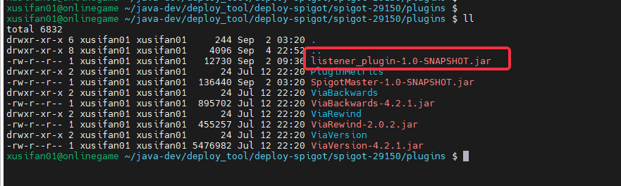

# Introduction to Spigot Server Mod

## Definition

- **SpigotMaster Plugin**
The official plugin for sending and receiving information on the Spigot server to implement custom event communication between the Spigot server and the client

- **Client Mod**
The custom module that only contains client logic and is implemented by the client through the **ModSdk** interface

- **Spigot Plugin**
The Spigot plugin implemented by the server owner based on the **SpigotMaster Plugin** and Spigot native plugin interface

[Spigot native plugin development document](https://www.spigotmc.org/wiki/spigot-plugin-development/)

- **Game Server Mod**
Refers to the gameplay mod implemented by the server owner, which generally includes **Client Mod** and **Spigot Plugin**

## Composition structure of game server Mod
Currently, Spigot's Mod mainly consists of two parts:

- Spigot plugin: The server owner implements the logic and modifies the Spigot configuration, loads the corresponding plugin, and implements the server-side logic

- Client Mod: Write client-related logic through the currently provided ModSdk client interface to implement client-related logic, mainly including:
- behavior_packs is used to control client behavior logic
- resource_packs stores client resources

## Example of client Mod directory structure

We take demoMod as an example to introduce the game server Mod directory structure:

demoMod
behavior_packs
behavior_pack_geyser_demo_mod
geyserDemoMod
geyserDemoModScript
modClient
modCommon
modMain.py
__init__.py
entities
pack_manifest.json
resource_packs
resource_pack_geyser_demo_mod
pack_manifest.json

| File/Folder | Explanation |
| ------------------------- | ------------------------------------------------------------ |
| demoMod | Game server mod root directory |
| behavior_packs | Store client behavior packs, can contain multiple behavior packs |
| behavior_pack_geyser_demo_mod | Behavior pack |
| geyserDemoMod | Root directory of python scripts. The scripts in this directory will be added to the python running environment. You can import script files from this path, such as from geyserDemoMod import modMain |
| modClient | Python client behavior logic, including GeyserDemoModClientSystem |
| modCommon | Common data, including Modname, custom events and other definitions |
| resource_packs | Store client resources, can contain multiple resource packs |
| resource_pack_geyser_demo_mod | Resource pack |
| pack_manifest.json | Mod resource version information |

For more module SDK content, see:
<a href="../../20-Gameplay Development/13-Module SDK Programming/2-Python Script Development/0-Script Development Introduction.html#What is modmain-py" target="_blank">mod Development Introduction</a>

### Spigot plugin directory structure example

listen_plugin
main
java\com\netease
command
ServerCommand.java
ToClientCommand.java
App.java
ClientListener.java
GlobalVar.java
ServerOriginalListen.java
resouces
plugin.yml

| File/Folder | Explanation |
| ------------------------- | ------------------------------------------------------------ |
| java\com\netease | Plugin logic code directory |
| command | Command processing class directory |
| App.java | Plugin entry |
| ClientListener.java | Client event listening processing function |
| GlobalVar | General data storage class |
| ServerOriginalListen | Spigot native event listener processing function |
| resouces | Plugin resource version information |
| plugin.yml | mod resource version information |

## Client Mod upload and loading process
- As shown in the figure
- mod directory structure

- studio configuration

- After Geyser reads the client Mod, there will be the following output

## Spigot plugin loading process
- As shown in the figure, put the xxx.jar compiled by mvn clean install into the Spigot Plugin folder

- After Spigot loads the plugin, there will be output, and the specific name is determined by plugin.yml

## DemoMod sample detailed analysis

- For the development and samples related to the game server Mod, please refer to the following example:

[Game Server Mod Detailed Explanation](./21-Spigot Server and Client Python Communication.md)

