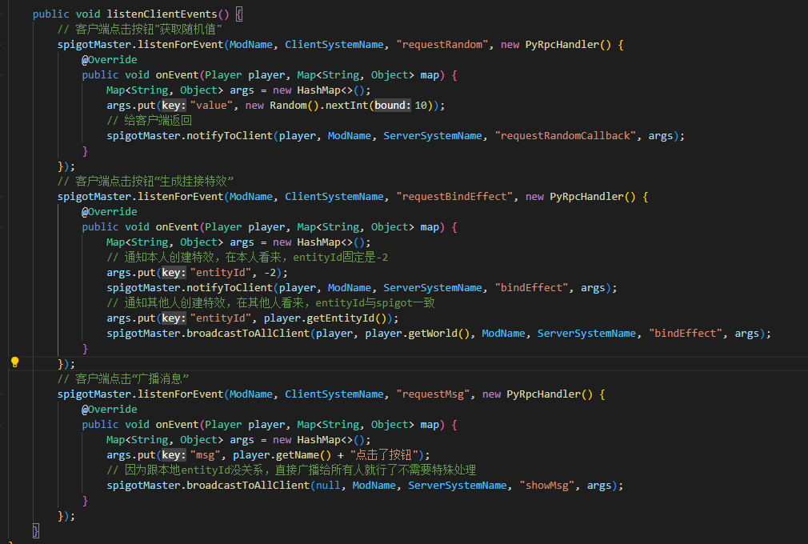

# Spigot server communicates with client python 

## Usage 

1. The spigot server needs to install the SpigotMaster plugin. For the plugin API documentation, see [SpigotMasterAPI documentation](./81-SpigotMasterAPI documentation.html) 

2. Client to spigot 

- Use spigotMaster.listenForEvent in spigot to listen to events. 

- Use <a href="../../../mcdocs/1-ModAPI/Interface/General/Event.html#notifytoserver" rel="noopenner">NotifyToServer</a> on the client to send events 

3. spigot to the client 

- Use <a href="../../../mcdocs/1-ModAPI/Interface/General/Event.html#listenforevent" rel="noopenner">ListenForEvent</a> on the client to listen for events 

- Use spigotMaster.notifyToClient or other multicast interfaces in spigot to send events 

Example: 

- spigot side 

```java 
public void onEnable() { 
SpigotMaster spigotMaster = (SpigotMaster) Bukkit.getPluginManager().getPlugin("SpigotMaster"); 
if (spigotMaster != null){ 
// Listen for events and send them back unchanged
          spigotMaster.listenForEvent("MyMod", "MySystemClient", "clientEvent", new PyRpcHandler() {
              @Override
              public void onEvent(Player player, Map<String, Object> map) {
                  spigotMaster.notifyToClient(player, "MyMod", "MySystemServer", "serverEvent", map);
              }
          });
      }
  }
  ```

- python side

  ```python
  # modMain.py
  @Mod.InitClient()
  def InitClient(self):
      clientApi.RegisterSystem("MyMod", "MySystemClient", client_system_class_path)
      
  # clientSystem
  class MySystemClient(ClientSystem):
      def __init__(self, namespace, systemName):
          ClientSystem.__init__(self, namespace, systemName)
          # Register events and print parameters in callback functions

self.ListenForEvent("MyMod", "MySystemServer", "serverEvent", self, self.onEvent) 
# Send an event to spigot 
self.NotifyToServer("clientEvent", {'a': 1}) 

def onEvent(self, data): 
# You can see onEvent in the client log {"a": 1} 
print 'onEvent', data 
``` 

## Event supported parameter types and mapping relationships 

### Send from Java to Python 

| Java type | Python type | 
| ------------------------ | ---------- | 
| null | None | 
| boolean | bool | 
| int | int | 
| long | long | 
| BigInteger(2^63 to 2^64-1) | long | 
| float | float | 
| double | float | 
| String | str | 
| List\<Object\> | list | 
| Map<String, Object> | dict | 

### Send from Python to Java 

| Python type | Java type | 
| ---------------------------------------- | ---------- | 
| None | null | 
| bool | Boolean | 
| int/long (-2^31 to 2^31-1) | Integer | 
| int/long (-2^63 to -2^31-1, 2^31 to 2^63-1) | Long | 
| int/long (2^63 to 2^64-1) | BigInteger | 
| float | Double | 
| str | String | 
| list | List\<Object\> | 
| dict (key must be str) | Map<String, Object> | 

## Notes on entityId 

- The entityId of the **non-player entity** on the client side is the same as the entity id obtained by org.bukkit.entity.Entity.getEntityId() on the spigot side 

- Please note that the entity id type obtained by spigot is **int**, while the entity id type required by the client modsdk interface is **str** 


- However, there will be some negative entity IDs on the client side, which will be virtual entities generated by geyser when doing protocol conversion, and there is no corresponding entity on the spigot side. 

- From the perspective of **each client**, the **entityId of the local player is always -2**, and the entityId of other players is the same as the getEntityId on the spigot side, that is: 

- The client always returns -2 when using GetLocalPlayerId. If it is sent to spigot, spigot cannot directly obtain the player based on this id, and some special processing is required 

```java 
spigotMaster.listenForEvent("MyMod", "MySystemClient", "clientEvent", new PyRpcHandler() { 
@Override 
public void onEvent(Player player, Map<String, Object> map) { 
Player eventPlayer; 
String entityId = (String) map.get("entityId"); 
if (entityId.equals("-2")) { 
eventPlayer = player; 
} 
else { 
// Convert entityId to int and then get the corresponding player 
} 
// Process eventPlayer logic 
} 
}); 
``` 

- If the return value of getEntityId is used on the spigot side to send to the player, the player client cannot obtain the local player based on this id, and some special processing is required 

```java 
int entityId; 
if (sendPlayer == player) { 
entityId = -2; 
} 
else { 
entityId = player.getEntityId() 
} 
map.put("entityId", entityId) 
spigotMaster.notifyToClient(sendPlayer, "MyMod", "MySystemServer", "serverEvent", map); 
``` 


## DEMO Detailed Explanation 

[Sample Demo](./99-下载内容.html#样demo) in the PyRpcDemo contains the client mod and spigot plug-in. 

After entering the game, 3 buttons will be displayed on the right 

* Click "Open Window" to pop up a UI, and then click "Get Random Number" to get a random number from 0-9 from spigot and display it on the UI. Click x to close 
* Click "Bind Special Effects" to notify all players in the current world, replace the model of the initiating player and attach a special effect 

* Click "Broadcast Message" to display a message in the chat bar of all players in spigot 


### Client part 

1. Register the UiInitFinished event when the client is initialized, and create three button UIs in the UiInitFinished event, and register the pop-up window UI to be used later 

Register two custom events: 

- bindEffect: Change the model and create special effects for the entity corresponding to the entityId parameter 

- showMsg: Display the chat bar message locally 

 

 

2. Register callback functions for three buttons 

When the "Open Window" button is lifted, a random number UI pops up 

When the "Bind Special Effects" and "Broadcast Message" buttons are lifted, a custom message is sent to spigot 

 

3. Listen for the callback event of getting random numbers when the random number ui is created, and display the value in the parameter on the label control 

Register button callback: When the "Get Random Number" button is lifted, a custom message is sent to spigot, and the interface pops up when the close button is lifted 

When the interface is destroyed, listen for the callback event of getting random numbers 

 

### spigot part 

- Register custom events during initialization, which are: 
- requestRandom: Return the random number acquisition callback to the player 
- requestBindEffect: Return the entityId of -2 to the player, and return the entityId of spigot to other people in the world 
- requestMsg: Return a message to everyone in spigot

