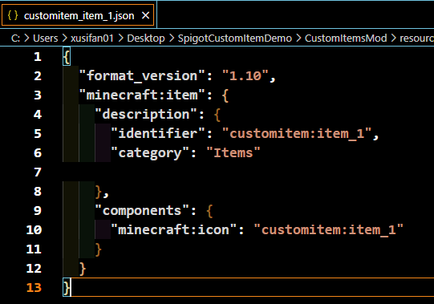

# Detailed explanation of Spigot custom item demo

## Background

[Introduction to Spigot server mod](./20-Introduction to Spigot server mod.md)

## Brief principle

- The client mod implementation process can refer to the following documents:
[Custom items](../../20-Gameplay development/15-Customized game content/1-Customized items/1-Customized basic items.md)
- The custom items in the current version are actually reskinned items of wooden swords on the Java server. The Bedrock client displays different texture icons through different namespaces of items

### Demo effect

The demo implements three different custom items:
- Explosive helmet
When the mouse right-clicks the block, an explosion with a radius of 1.5 grids occurs at the location of the block
- Amiibo sword
When you right-click a block, a thunderbolt effect will appear at the location of the block, and items will be randomly generated, and **Thunderbolt Sword** will definitely drop
- Thunderbolt Sword
When you right-click a block, a thunderbolt will be generated at the location of the block, and the effect is the same as the thunderbolt effect, causing damage to nearby creatures

### Development process

#### Client Mod Writing
##### Purpose
In order for Geyser to load the newly added custom items, we need to write a client Mod
##### Process

- Create a new **netease_item_beh** directory in the behavior folder, as shown in the figure below


- Add three item Jsons to the **netease_item_beh** directory, as shown below:


- Create new directories of **netease_item_res**, **texts**, and **textures** in the **resource** folder, as shown in the figure below

The functions of these three directories are as follows:
- **netease_item_res** is used to store the Json of the client texture representation of custom items
- **texts** is used to store the Chinese names of custom content
- **textures** is used to store the texture files of custom content

- Add three new item Jsons in the **netease_item_res** directory, as shown below:
In the example, we use the **minecraft:icon** component to set the texture for the item



- Add a **zh_CN.lang** file in the **texts** directory to set the name of the custom item. The example is as follows:


- Add a **item_texture.json** file in the **textures** directory to set the texture path corresponding to the item texture. The example is as follows:


- At this point, the custom items in the client mod are completed

#### Spigot plugin writing

##### Purpose
In order to make the custom items have different effects and functions, we also need to write Spigot plugins to implement different effect logics for different items
##### Process

- Install the plugin to local maven

Download **SpigotMaster** jar package, and then execute the following command, **path-to-jar** replaced with the jar path

```shell
mvn install:install-file -Dfile=path-to-jar
-DgroupId=com.neteasemc
-DartifactId=SpigotMaster
-Dversion=1.0-SNAPSHOT
-Dpackaging=jar
```

- Plugin Writing

1. Add dependencies in pom.xml

```xml
<dependency>
<groupId>com.neteasemc</groupId>
<artifactId>SpigotMaster</artifactId>
<version>1.0-SNAPSHOT</version>
<scope>provided</scope>
</dependency>
```

2. Add dependencies in plugin.yml

```yml
depend:
- SpigotMaster
```

3. As shown in App.java, the instance ServerOriginalListener listens to the Spigot native event

   
    Implemented through the following interface
```
getServer().getPluginManager().registerEvents(new ServerOriginalListener(), this);
```

4. Example **ServerOriginalListener** listens to Spigot native events. **ServerOriginalListener** listening method is shown in the figure:
In the example, **ServerOriginalListener** listens to two events in total, as follows:
- Player Join Event (PlayerJoinEvent), the effect is that when the player joins the game, two items are automatically issued to the player
- Player Interact Event (PlayerInteractEvent), the effect is that when the player and the block interact with the right button, different effects are triggered according to different custom items


5. Create items
- Create item ItemStack through the API provided by Spigot
```
@Param material item material (custom item material is obtained through the next step)
@Param amount item quantity
ItemStack customItem1 = new ItemStack(material, amount);
```
- When creating ItemStack, get the Material in the custom item through the following interface
```
@Param itemIdentifier Custom item Identifier, which needs to be consistent with the definition in the client Mod
@Return Material Custom item corresponding to the Material in Spigot
SpigotMaster.getCustomItemMaterial(itemIdentifier)
```
- At the same time, set the corresponding Identifier in Bedrock Edition for the item through the following interface
**PS: This step is a required step. If this step is missing, the client will not be able to generate custom items normally**
```
@Param itemStack ItemStack generated by Spigot interface
@Param itemIdentifier Custom item Identifier, which needs to be consistent with the definition in the client Mod
SpigotMaster.setCustomItemIdentifier(itemStack, itenIdentifier)
```
- Further modify other properties of ItemStack as needed, such as lore in the sample

6. Use items
- Get ItemStack through event parameters:
```
ItemStack item = event.getItem();
```
- Get the Material of the item through the interface:
```
@Param itemIdentifier Custom item identifier, which needs to be consistent with the definition in the client mod
@Return Material The Material corresponding to the custom item in Spigot
SpigotMaster.getCustomItemMaterial(itemIdentifier)
```
- When the Material of the event item is consistent with the Material of the custom item, it is determined to be a custom item. The specific item effect and logic need to be further distinguished

- Get the Identifier of the item through the interface:
```
@Param itemStack ItemStack generated by the Spigot interface

@Return String itemIdentifier, non-custom items return null
SpigotMaster.getCustomItemIdentifier(itemStack)
```
Implement different logics according to the obtained Identifier, as shown in the figure


7. Run mvn clean install, and the plugin .jar will be generated under the plugin target. Place the generated jar in the plugin folder of the Spigot server

8. The final effect is as follows:
- Players can get two custom items when entering the game


- Explosion occurs when using custom item 1
- There is a thunder effect when using custom item 2, and items are generated, among which custom item 3 must be dropped
- Lightning is generated when custom item 3 is used

### Q&A

- **SpigotMaster plugin** brief API documentation

[SpigotMaster plugin API documentation](./80-SpigotMaster brief API documentation.md)

### **Note**
- Current limitations:
- Since Mods are currently distributed and preloaded by Geyser, players connected through the same Geyser load the same Mods and the same custom items
- Since some of the **Components** in the configuration are double-ended logic, the logic of such **Components** needs to be implemented by the Spigot plugin. Direct configuration in Json will not work or will produce abnormal results. Currently known unavailable **Component** are as follows:
- Components used for fire resistance in Bedrock Edition custom items
```
Set whether the item is fire resistant
"netease:fire_resistant"{ "value" : true}
```
- Components used for whether the item can be used as fuel in Bedrock Edition custom items
```
Set whether the item can be used as fuel
"netease:fuel" { "value" : true}
```
- Use interval for items in Bedrock Edition custom items
```
Set the item use interval
"netease:cooldown" : { "duration" : 5}
```
- Components used for weapon properties in Bedrock Edition custom items
```
Set various properties of the item when it is used as an item
"netease:weapon" : { "type" : "pickaxe", "level" : 3}
```
- Since the current items are actually reskinned wooden swords in Spigot, the following components are fixed values
```
        **"minecraft:max_damage" : 59**

```
- When this component is used, the client can display the custom item durability bar
- When the value is **non-59**, the client item durability will be abnormal
- When the value is **59**, the client durability bar will change with the item durability set by the server
- When this component is not used, the client does not display the custom item durability bar