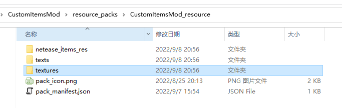
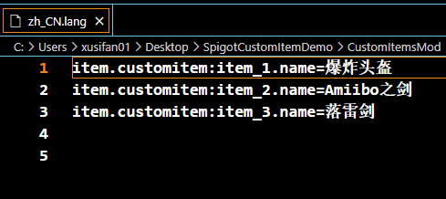
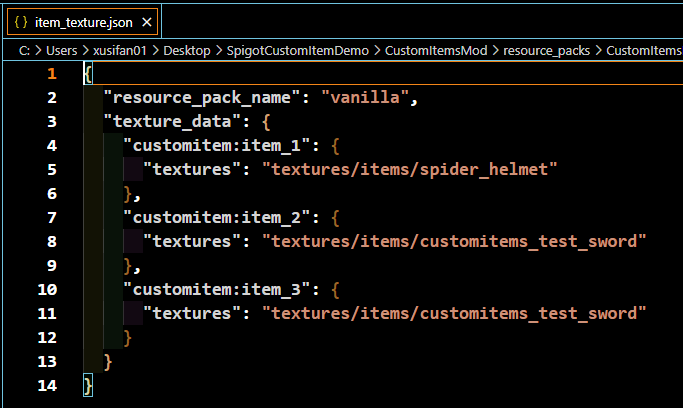
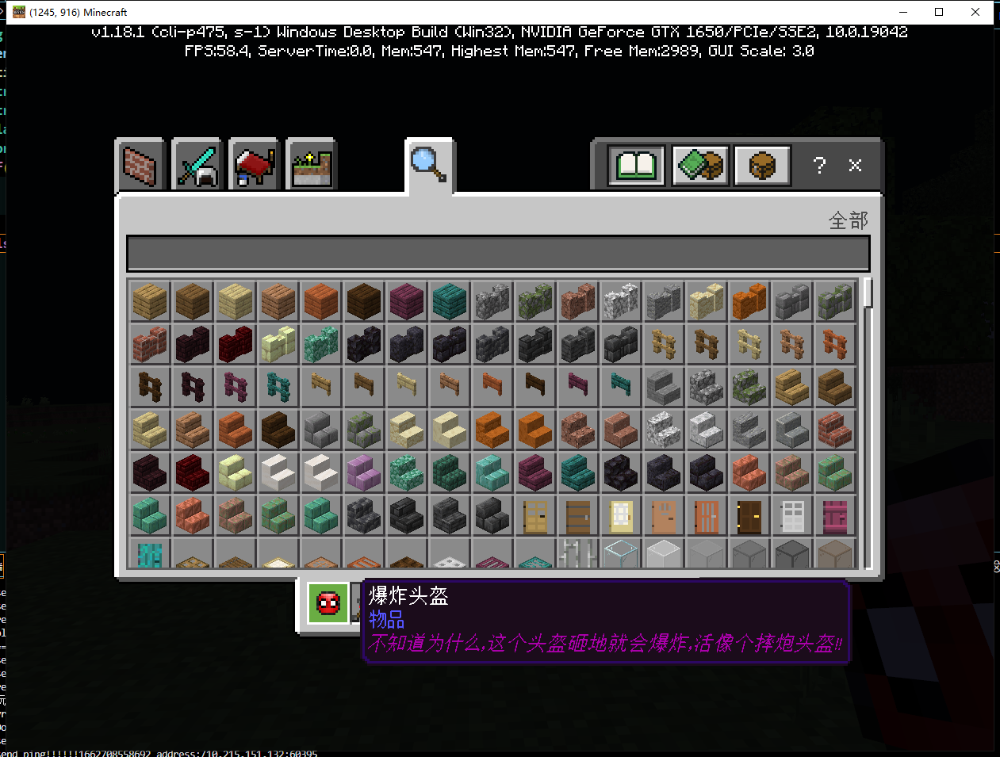

# Spigot Custom Items

## Usage

1. The SpigotMaster plugin needs to be installed on the spigot server. For the plugin API documentation, see [SpigotMasterAPI Documentation](./81-SpigotMasterAPI Documentation.html)

2. The client Mod writes json and python logic. For details, see [Custom Items](../../20-Gameplay Development/15-Custom Game Content/1-Custom Items/1-Custom Basic Items.html)

3. Spigot constructs items, distributes them to players, and writes specific usage logic for items

## Notes

- The custom items in the current version are actually reskinned items of wooden swords on the Java server. The Bedrock client displays different texture icons through different namespaces of items

- Current limitations:
- Since the Mod is currently distributed and preloaded by Geyser, the Mods loaded by players connected through the same Geyser are the same, and the custom items loaded are also the same
- Because some of the **Components** in the configuration are double-ended logic, the logic of such **Components** needs to be implemented by the Spigot plug-in. Direct configuration in Json will not take effect or produce abnormal results. Currently known <font color="red" size=4>unavailable</font> **Components** are as follows:
- Components used for fire resistance in Bedrock Edition custom items
```
Set whether the item is fire resistant
"netease:fire_resistant"{ "value" : true}
```
- Components used for whether the item can be used as fuel in Bedrock Edition custom items
```
Set whether the item can be used as fuel
"netease:fuel" { "value" : true}
```
- Use interval for items in Bedrock Edition custom items
```
Set the item use interval
"netease:cooldown" : { "duration" : 5}
```
- Components used for item weapon properties in Bedrock Edition custom items
- When the **type** value is sword, the client player model can achieve the effect of holding the item
- Other **type** types and fields are temporarily unavailable
```
Set various properties of items when used as items
"netease:weapon" : { "type" : "pickaxe", "level" : 3}
```
- Since the current item is actually a wooden sword reskin in Spigot, the following components are fixed values
```
**"minecraft:max_damage" : 59** 
```
- When using this component, the client can display custom item durability bars

- When the value is **not 59**, the client item durability will be abnormal
- When the value is **59**, the client durability bar will change with the item durability set by the server
- When this component is not used, the client does not display the custom item durability bar

## Demo Detailed Explanation

Demo implements three different custom items:
- Explosive Helmet
When the mouse right-clicks the block, an explosion with a radius of 1.5 grids occurs at the location of the block
- Amiibo Sword
When the mouse right-clicks the block, a thunder effect appears at the location of the block, and items are randomly generated, and **Thunder Sword** will definitely drop
- Thunder Sword
When the mouse right-clicks the block, a thunder is generated at the location of the block, and the effect is the same as the thunder effect, causing damage to nearby creatures

### Development Process

#### Client Mod Writing
##### Purpose
In order for Geyser to load the newly added custom items, we need to write a client Mod
##### Process

- Create a new **netease_item_beh** directory in the behavior folder, as shown in the figure below


- Add three item Jsons in the **netease_item_beh** directory, as shown below:


- Create new **netease_item_res**, **texts**, **texture** directories in the **resource** folder, as shown below
The functions of these three directories are as follows:
- **netease_item_res** is used to store custom item client texture performance Json
- **texts** is used to store Chinese names of custom content
- **textures** is used to store custom content texture files



- Add three item Jsons in the **netease_item_res** directory, as shown below:
In the example, we use the **minecraft:icon** component to set the texture for the item


- Add a **zh_CN.lang** file in the **texts** directory to set the name of the custom item. The example is as follows:



- Add a **item_texture.json** file in the **textures** directory to set the texture path corresponding to the item texture. The example is as follows:




- At this point, the custom items in the client mod are completed

#### Spigot plugin writing

##### Purpose
In order to make the custom items have different effects and functions, we also need to write Spigot plugins to implement different effect logics for different items
##### Process

- Plugin writing

1. Add dependencies in plugin.yml

```yml
depend:
- SpigotMaster
```

2. As shown in App.java, the instance ServerOriginalListener listens to the Spigot native event

Implemented through the following interface
```
getServer().getPluginManager().registerEvents(new ServerOriginalListener(), this);
```

3. The example **ServerOriginalListener** listens to Spigot's native events. The **ServerOriginalListener** listening method is shown in the figure:
In the example, **ServerOriginalListener** listens to two events in total, as follows:
- Player Join Event (PlayerJoinEvent), the effect is that when the player joins the game, two items are automatically issued to the player
- Player Interact Event (PlayerInteractEvent), the effect is that when the player interacts with the block with the right button, different effects are triggered according to different custom items


4. Create Items
- Create ItemStack through the API provided by Spigot
```
@Param material Item material (the material of the custom item is obtained through the next step)
@Param amount Item quantity
ItemStack customItem1 = new ItemStack(material, amount);
```
- When creating ItemStack, get the Material in the custom item through the following interface
```
@Param itemIdentifier Custom item identifier, needs to be consistent with the definition in the client mod
@Return Material Custom item corresponding to the Material in Spigot
SpigotMaster.getCustomItemMaterial(itemIdentifier)
```
- At the same time, through the following interface, set the corresponding identifier in the Bedrock Edition for the item
**PS: This step is a required step. If this step is missing, the client will not be able to generate custom items normally**
```
@Param itemStack ItemStack generated by the Spigot interface
@Param itemIdentifier Custom item identifier, needs to be consistent with the definition in the client mod

SpigotMaster.setCustomItemIdentifier(itemStack, itenIdentifier)
```
- Further modify other properties of ItemStack as needed, such as lore in the sample

5. Use items
- Get ItemStack through event parameters:
```
ItemStack item = event.getItem();
```
- Get the Material of the item through the interface:
```
@Param itemIdentifier Custom item Identifier, which needs to be consistent with the definition in the client Mod
@Return Material The Material corresponding to the custom item in Spigot
SpigotMaster.getCustomItemMaterial(itemIdentifier)
```
- When the Material of the event item is consistent with the Material of the custom item, it is determined to be a custom item. The specific item effect and logic need to be further distinguished

- Get the Identifier of the item through the interface:
```
@Param itemStack ItemStack generated by the Spigot interface
@Return String itemIdentifier, non-custom items return null
SpigotMaster.getCustomItemIdentifier(itemStack)
```
Implement different logics according to the obtained Identifier, as shown in the figure


6. Run mvn clean install, and the plugin .jar will be generated under the plugin target. Place the generated jar in the plugin folder of the Spigot server

7. The final effect is as follows:
- Players can get two custom items when entering the game


- Explosion occurs when using custom item 1
- There is a thunder effect when using custom item 2, and items are generated, among which custom item 3 must be dropped
- Lightning is generated when custom item 3 is used

