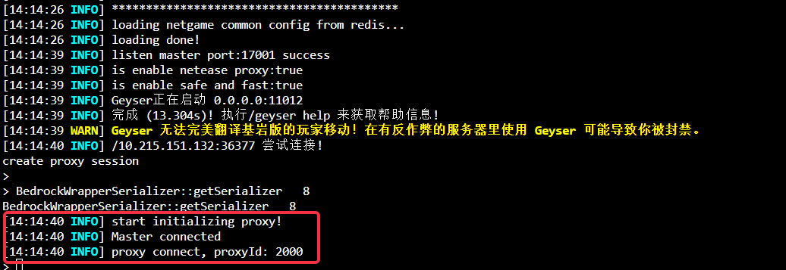

# FAQ Collection

- Currently, Mods are loaded and distributed through Geyser. Therefore, in the current version, players connected through the same Geyser have the same Mods loaded. If you need to achieve different Mod effects for different bc or spigot, you can configure different geysers to connect to different bcs.

- Since Geyser and Spigot use different Java versions, there are two versions of Java on the development machine. The corresponding commands are **java18** and **java8**. Therefore, when starting Spigot, please use the command **java8**

- When deploying, the following flags are enabled

> If the bc server and master are not successfully connected, the following prompt will appear when logging in

> When the corresponding flag is not turned on, the prompt is as follows:

> When the above prompt appears, please check the BC server log to check whether the BungeeMaster plug-in is loaded normally and whether the master server is connected normally. If the connection is normal, the following log will be printed:

- After logging in to the server using ssh, check the geyser directory under the corresponding network id to view the geyser log

> When geyser is connected to the proxy and master normally, the following log will be output

> When the player logs in to the proxy and geyser normally, the following log will be output

1. When there is no graphical output when the player logs in, please check the configuration and log of the master, proxy and geyser to check whether there is an error print
2. When the player logs in, there is an image output, but the player cannot enter the server normally. Please check the configuration and logs of geyser, bc, spigot, and check whether there is an error print

