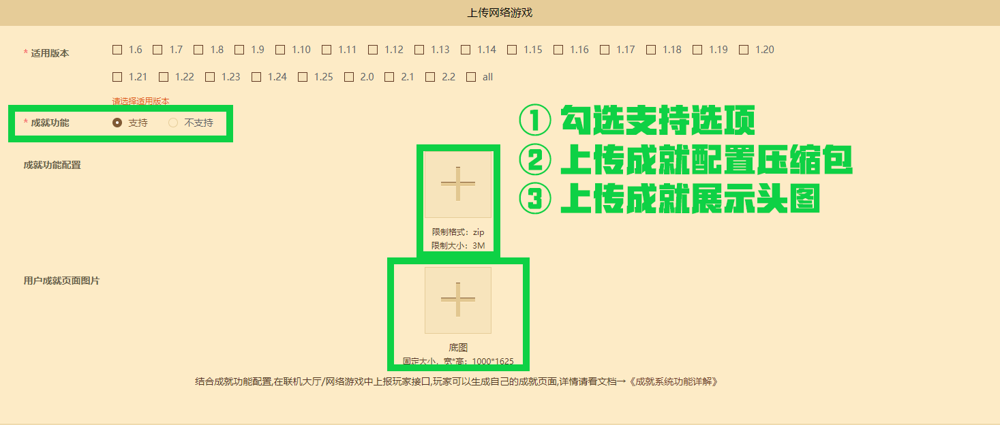

--- 
front: https://mc.163.com/dev/mcmanual/mc-dev/assets/img/achievement_1.bf9be14b.png 
hard: Advanced 
time: 15 minutes 
--- 

# Achievement system function configuration document 

As an important part of modern games, the achievement mechanism brings the theme of the game under the "spotlight". It not only ensures that players do not miss the game content that is easily overlooked, but also sublimates the fun experience obtained during the game. 

 

**"Minecraft" mobile version online lobby and online games** provide players with a place to gather and entertain. **"Minecraft" developer platform** also empowers the development of online function games. To use the achievement system configuration function, developers can select **[Online Lobby]** or **[Online Game]** in the **[Listing and Resource Management]** module. Content: Enable [Achievement Function Support], upload the achievement page header, the corresponding achievement icon, and the achievement configuration CSV file. Simply embed the corresponding achievement business logic in the game, upload the player data to the cloud achievement interface of the module SDK, and the player's launcher page will automatically capture the cloud achievement record and display it. 

 

Subsequently, the display entrance for players' achievements will be added to the resource center details page, personal homepage, and more places, and players can share the page to social platforms. For developers, this is an extraordinary means to improve the dissemination ability and player penetration rate of online works. 

**Note: We will continue to collect suggestions and feedback from developers on the configuration of the achievement system. You can contact us through [Developer FAQ] - [Feedback on other issues] on the upper left of the developer platform. ** 

## Online Lobby Achievement System Function Configuration 

**Note: The online lobby achievement system function will be launched on July 7. Developers are requested to allocate the development rhythm reasonably. ** 

Click **[Work Management]** - **[Shelf and Resource Management]** in sequence, then click **[Component]**, select **[Mobile Version]** platform, and then click **[Publish New Resource]**. 

 

**[Resource Category]** Select Online Lobby. Check **[Achievement Function]** - **[Support]** options. Upload the achievement configuration compressed package and the achievement page display header image separately. 

 

| Upload type | Size/size limit | 
| ------------------ | ------------------ | 
| Achievement configuration file compression package | Size limit: 3M | 
| Achievement page display header image | Width x height: 1000 * 1625 | 

For works that have been listed in **[Online Lobby]** and have not been listed in **[Resource Center-Map]** partition, and have not activated the achievement function, it is supported to turn on the achievement function again. As long as the achievement interface is adapted in the business logic, players can enjoy the experience of the achievement function. 

**Note: The achievement configuration function is not currently supported on the PC version of the online lobby game. The cloud achievement reporting interface will also not be able to be used normally on the PC platform. ** 


## Online Game Achievement System Function Configuration 

**Note: The online game achievement system function will be launched on July 7. Developers are requested to allocate the development rhythm reasonably. ** 

Click **[Work Management]** - **[Listing and Resource Management]** in sequence, then click **[Online Game]**, select **[Bedrock Edition Server Tool Game]** platform, and find the server information that has been settled in **[Listing Management]**. 

 

Check **[Achievement Function]** - **[Support]** options. Upload the achievement configuration compressed package and the achievement page display header image separately. After saving, review and put it on the shelf, and you can respond to the business logic to upload and display achievements for players. 

| Upload type | Size/size limit | 
| ------------------ | ------------------ | 
| Achievement configuration file compressed package | Size limit: 3M | 
| Achievement page display header image | Width x height: 1000 * 1625 | 

**Note: The achievement configuration function is not currently supported on the PC version of the Bedrock Edition online game server. The cloud achievement reporting interface will also not be able to be used normally on the PC platform. ** 

## Achievement configuration file analysis 

Achievement configuration file compressed package upload format, please compress and package the top directory. Place the achievement configuration file **NodeSetting.csv** in the top directory, the name and content are fixed and the format must be **.csv**. The following examples can be used as a reference for developers: 

 

```yaml 
Achievement: # Example: Compress the contents under the achievement folder. Please do not package the top folder into the compressed package. 
-textures # Place the achievement icon texture. 
-NodeSetting.csv # Configuration file entry, the format must be csv. 
``` 

CSV format files store information in plain text using comma-separated values. When opened with a table tool, it is also displayed as table data. Therefore, you can use a common table tool to export **csv** format files. The following are examples of display in plain text and in a table tool: 

``` 
NodeId,PrePic,FinPic,Title,Description,Total,Rank 
1,textures/03.jpg,textures/03.jpg,Achievement name 1,Top 3 in total score 1 time,1,1 
2,textures/04.jpg,textures/04.jpg,Achievement name 2,Top 3 in total score 10 times,10,2 
3,textures/05.jpg,textures/05.jpg,Achievement name 3,Top 3 in total score 100 times,100,3 
``` 

| NodeId | PrePic | FinPic | Title | Description | Total | Rank | 
| ------ | --------------- | --------------- | --------- | ----------------- | ----- | ---- | 
| 1 | textures/03.jpg | textures/03.jpg | Achievement Name 1 | Ranked in the top three in total score 1 time | 1 | 1 | 
| 2 | textures/03.jpg | textures/03.jpg | Achievement Name 2 | Ranked in the top three in total score 10 times | 10 | 2 | 
| 3 | textures/03.jpg | textures/03.jpg | Achievement Name 3 | Ranked in the top three in total score 100 times | 100 | 3 | 

If you use a table tool to open a CSV file, you must select **.csv** again when saving, and the encoding must be **GBK**, or use other text editing tools to perform **GBK** encoding conversion operations to support commonly used character text. 

Each field saves the data content required for the achievement display page, and the specific uses are as follows:


| Field Name | Field Purpose | 
| ----------- | ------------------------------------------------------------ | 
| NodeId | Unique achievement ID for a single component: must be unique and correspond to the interface ID parameter for reporting cloud achievement system. | 
| PrePic | Achievement image path: the state before unlocking, the image path starts from the current directory. | 
| FinPic | Achievement image path: the state after unlocking, the image path starts from the current directory. | 
| Title | Achievement title: used to display the achievement name. | 
| Description | Achievement introduction: used to introduce achievement information. | 
| Total | Achievement progress: the default value is 1, which can be regarded as the number of completed target progress. | 
| Rank | Achievement sorting: completed achievements are sorted in descending order according to the achievement completion time, unfinished achievements are sorted by rank, and if the ranks are the same, they are sorted according to the server logic. | 

**Note: the achievement image size must be fixed at 120*120, otherwise it will trigger a machine review error. ** 

## Summary of using the Cloud Achievements interface 

After configuring the required system configuration on the developer platform, click [Cloud Achievements Usage Document](./Cloud Achievements Usage Document.html) to learn about the general process of achievement development. 

