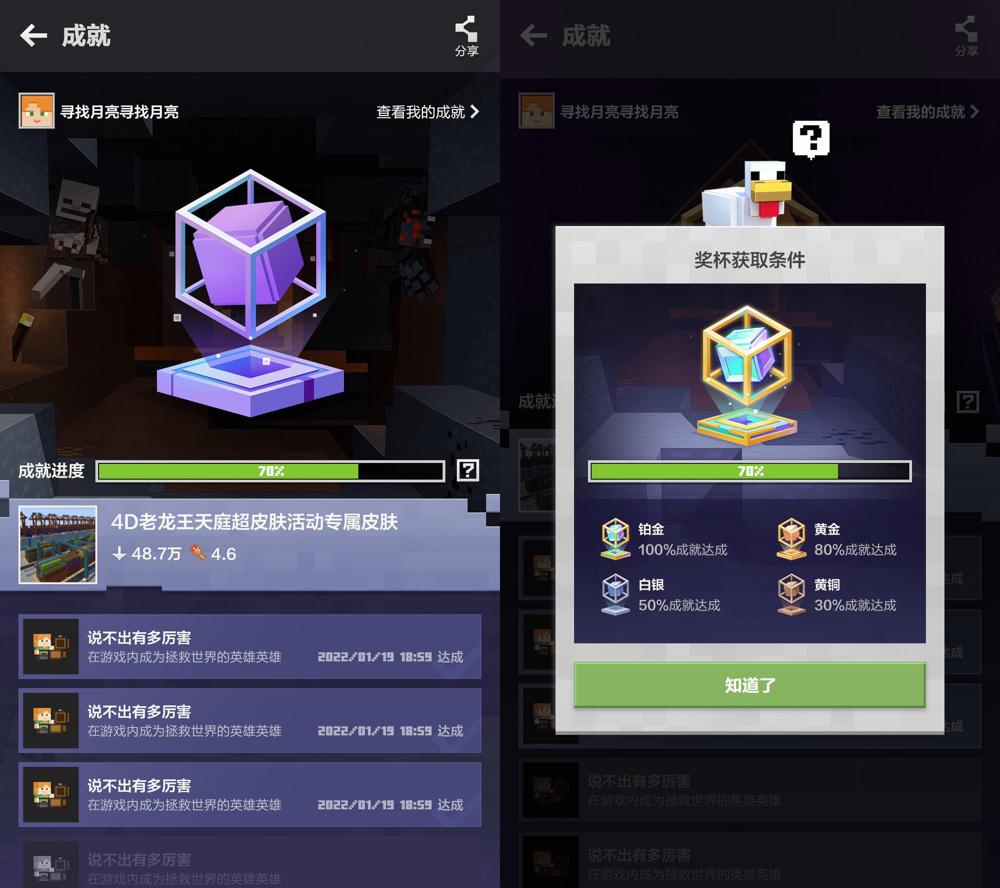
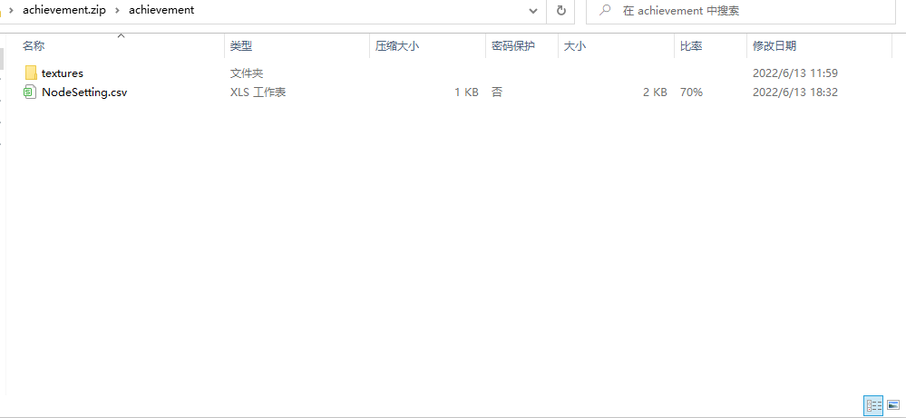
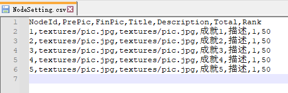

--- 
front: https://mc.163.com/dev/mcmanual/mc-dev/assets/img/achievement_0.4328865d.png 
hard: Advanced 
time: 30 minutes 
--- 

# Cloud Achievement Document 

## Description 

This document is used to introduce the cloud achievement function to dear developers. By studying this document, developers can understand the entire process of achievement creation, reporting and final display. We look forward to developers using their rich imagination to equip their world with an interesting achievement system. **The online lobby cloud achievement function will be opened on July 7, 2022, and the online game cloud achievement function will be opened on July 7, 2022. ** 

**This function will be released in version 2.2. ** 

## Operation process of the developer platform 
The display of the official achievement system function in the mobile client needs to rely on the configuration of the developer platform. Click [Achievement system function configuration document](./Achievement system function configuration document.html) to understand the operation process of the developer platform. 

 

## MODSDK API and events 

### API 

- <a href="../../mcdocs/1-ModAPI/接口/成果.html#lobbygetachievementstorage" rel="noopenner">LobbyGetAchievementStorage</a> 

Get achievement information 

- <a href="../../mcdocs/1-ModAPI/界面/成果.html#lobbysetachievementstorage" rel="noopenner">LobbySetAchievementStorage</a> 

Set achievement progress and extra information 

## Example mod 

[CloudAchievementMod](../20-Gameplay Development/13-Module SDK Programming/60-Demo Example.html#CloudAchievementMod) shows a basic gameplay: 

- A cloud achievement event for killing mixed-species creatures is designed in the gameplay 
- The gameplay monitors the entity death event "MobDieEvent". When the entity dies, if it is detected that it is a creature in the target list, it will call "LobbySetAchievementStorage" to report the achievement progress 
- The gameplay involves killing mixed-species creatures, so the extra field of "LobbySetAchievementStorage" is used to store the number of various creatures killed 
- When the player joins, the player will call "LobbyGetAchievementStorage" to obtain the data stored in the cloud. If the data does not exist in the cloud, the local data will be initialized. 
- The main process of the demo is as follows. For details, please read the code comments of the demo. 

 


## Q&A 

### Data Conflict 

1) Under what circumstances will data conflict occur? 

The conflict scenario of cloud achievements only exists when the extra field is stored when calling "LobbySetAchievementStorage" to report progress. If the extra field is not used, the conflict problem can be ignored. 

2) What is the cause of the data conflict? 

The root cause is that there may be multiple online lobby rooms modifying the data of the same player at the same time, and the set operation of other rooms may be inserted between the get and set operations of the same room. 

For example, conflicts may occur in the following situations (conflict handling is to avoid this situation): 

​ Assumptions: 

​ ① Rooms A and B will record achievement progress locally, and upload progress when the room is closed 

​ ② Achievements require extra information to determine whether an event can trigger progress increase. The following example uses killing mixed species of creatures 

The following situation may occur: 

​ ① The goal is to kill 3 cows and 3 sheep, with a total target value of 6 

​ ② The player enters room A and kills 1 cow in the room 

​ ③ The player exits room A, and room A does not upload progress and extra 

​ ④ The player joins room B and kills 3 cows 

​ ⑤ Room B is closed, and the achievement progress and extra are reported. At this time, A has not reported progress. The player information stored in the cloud is: "{progress: 3, extra{killed cows: 3, killed sheep: 0}}" 

​ ⑥ Room A is closed, and the achievement progress and extra are reported. The information reported by A will overwrite the original information in the cloud. The modified information stored in the cloud is "{progress: 4, extra{killed cows: 1, killed sheep: 0}}" 

​ ps: The progress is added in the add mode, and there will be no conflict. Only when the progress reaches the target progress, it is not allowed to add. 

In the above situation, room B has killed the target number of cows, but room A cannot perceive the conflict and continues to report the progress, resulting in a mismatch between extra and progress information. The correct situation should be that room A obtains the extra data from the cloud, and finds that enough cows have been killed, and judges that there is no need to report the progress. 

### How should the correctness of the data be guaranteed? 

In order to prevent the situation mentioned above, a "version number" will be attached each time the data is set. Each time the data is set, the version is the last version obtained plus one, so that the cloud can judge whether the data has been modified by other containers based on the version number, which is a conflict. This version number control has been controlled by the engine internally, and developers do not need to worry about it. You only need to handle the conflict according to the specifications in the API document. 

① When the callback that calls the "LobbySetAchievementStorage" interface receives data with code 5, it means that a conflict has occurred. 

② The callback receives the latest data before the cloud update. 

③ Use the latest data to update local data. When a conflict occurs (the code value of the data received by the callback is 5), it is necessary to determine whether to upload again. If the updated data needs to be uploaded, set the callback return value to True, otherwise False. The system will determine whether to report new data based on the return value.


④ Extra is a custom field. Developers need to decide how to handle conflicting data in the callback. Finally, encapsulate the getExtra function to get extra and pass it to the "LobbySetAchievementStorage" interface. The interface can obtain real-time extra data through the passed getExtra. 

### My gameplay is not calculated by rounds, and the data will be updated in real time. How should I reduce the frequency of set? 

1. Update data to the cloud at regular intervals (for example, 5 minutes) 
2. Update data to the cloud when the player exits 

The upper limit of the set interface frequency is 50 times/second. The interval of 5 minutes can ensure that 5\*60\*50=15000 players are online at the same time, and so on 

If you need to carry a higher number of players, you should abandon the scheduled upload and only upload when the player exits 

### My gameplay is not calculated by rounds, and the data will be updated in real time. How should I maintain the correctness of the data? 

For scheduled upload, you can refer to the writing method in Mod: 

```python 
def callback(data): 
if data: 
if data["code"] == 0: 
logger.info("%s node progress increased by 1", node) 
if self.mPlayerProgress[playerId][node] >= self.mNodeDetail[node]["goalNumber"]: 
comp = compFactory.CreateMsg(playerId) 
logger.info("This node has completed %s", node) 
comp.NotifyOneMessage(playerId, node + "： This achievement has been completed!") 
elif data["code"] == 5:# Detect conflict 
self.mPlayerProgress[playerId][node] = data["entity"]["progress"] # Update the progress of local storage 
self.mPlayerExtra[playerId][node] = data["entity"]["extra"] 
self.TransferLocalFromExtra(playerId) 
# Return a semaphore to return whether the updated extra data still meets the conditions for adding progress. If it does, return True, otherwise return False. Only when code = 5, that is, a conflict occurs and the value needs to be put back. 
if self.mPlayerProgress[playerId][node] >= self.mNodeDetail[node]["goalNumber"]\ 
or self.mLocalData[playerId][node][entity] >= self.mNodeDetail[node]["targetEntity"][entity]: 
return False 
else: 
# If a conflict occurs, the information of the above added progress will be overwritten. If the progress is allowed to be added, the local progress needs to be added again. LobbySetAchievementStorage will obtain the latest extra through the getter function for storage. 
self.mPlayerProgress[playerId][node] += 1 
self.mLocalData[playerId][node][entity] += 1 
self.TransferExtraFromLocal(playerId) 
return True 
else: 
# Request failed 
comp = compFactory.CreateMsg(playerId) 
comp.NotifyOneMessage(playerId, "Failed to add progress!") 
self.mPlayerProgress[playerId][node] -= 1 
self.mLocalData[playerId][node][entity] -= 1 
self.TransferExtraFromLocal(playerId) 
``` 

### I want to use [custom achievement system](../20-Gameplay Development/15-Custom Game Content/16-Custom Achievement System.md) to make cloud achievements. Is there any difference? 


1) If you use a custom achievement system, you need to configure the "is_cloud" field in json to true, and set "auto_sent_cloud" to choose the time to upload. For details, see [Custom Achievement System](../20-Gameplay Development/15-Custom Game Content/16-Custom Achievement System.md) 

2) If you use a custom achievement system, use <a href="../../mcdocs/1-ModAPI/Interface/Custom UI/Custom Achievement System.html#addnodeprogress" rel="noopenner">AddNodeProgress</a> or <a href="../../mcdocs/1-ModAPI/Interface/Custom UI/Custom Achievement System.html#setnodefinish" rel="noopenner">SetNodeFinish</a>. These two interfaces have restrictions. For details, see the interface description 

3) If you use a custom achievement system and "auto_sent_cloud" is configured as True in the node json file, you cannot use <a href="../../mcdocs/1-ModAPI/接口/成功.html#lobbysetachievementstorage" rel="noopenner">LobbySetAchievementStorage</a> to report progress, but use <a href="../../mcdocs/1-ModAPI/接口/自定义UI/自定义成果系统.html#addnodeprogress" rel="noopenner">AddNodeProgress</a> or <a href="../../mcdocs/1-ModAPI/界面/自定义UI/自定义成果系统.html#setnodefinish" rel="noopenner">SetNodeFinish</a> to set progress. These two interfaces will automatically synchronize progress to the cloud. Pay special attention that if it is a cloud achievement, remember to pass in the callback parameters in the two interfaces, otherwise the achievement cannot be reported. If "auto_sent_cloud" is False, the developer can choose the upload time. You can use the <a href="../../mcdocs/1-ModAPI/接口/自定义UI/自定义成果系统.html#addnodeprogress" rel="noopenner">AddNodeProgress</a> interface to update local data, and use a variable to store the Delta added each time, and use the cloud achievement reporting interface. 

4) If you use <a href="../../mcdocs/1-ModAPI/界面/自定义UI/自定义成果系统.html#addnodeprogress" rel="noopenner">AddNodeProgress</a> to report, when a conflict occurs, that is, the code in the data received by the callback is 5, remember to set the callback return value. When True, the system will automatically call the report again. When False, it will no longer report, that is, this report is unsuccessful. 

5) If you use a custom achievement system, the cloud achievement progress will be automatically obtained when the "ClientLoadAddonsFinishServerEvent" event occurs. If the developer wants to maintain an extra data, you can use <a href="../../mcdocs/1-ModAPI/接口/成果.html#lobbygetachievementstorage" rel="noopenner">LobbyGetAchievementStorage</a> to obtain it. 

## Achievement package packaging 

#### Achievement resources 

 

 

 

[Manual packaging]: When trying to manually package achievement resources, please place the image resources used by the achievement in the textures folder and nest the achievement resource folder in a new folder. Right-click the new folder to compress it into a zip document, and then upload the package to the developer platform. 

【Note】: PrePic and FinPic in the NodeSetting.csv file are configured as relative paths of image resources. Please note that the encoding format of the NodeSetting.csv file needs to be **GBK**, otherwise it may cause abnormal analysis of achievement configuration. 

