--- 
front: https://nie.res.netease.com/r/pic/20220408/b1b536bb-fc51-450d-99d9-648585f79bb9.png 
hard: Getting Started 
time: 10 minutes 
selection: true 
--- 
# LAN multiplayer testing with Mod PC Development Kit 

In this tutorial, you will learn how to launch the Mod PC Development Kit in Minecraft Development Workbench (MC Studio) to perform multiplayer online testing on the same LAN. 

## 1. Install Minecraft Development Workbench (MC Studio) 

Because multiplayer testing needs to be entered through the official editor, you need: 

- A developer account 
- Install Minecraft Development Workbench on your computer 

1. Visit [Minecraft Developer Official Website](https://mc.163.com/dev/index.html), scroll to the middle of the page until you can see the Minecraft Development Workbench (MC Studio) section: 

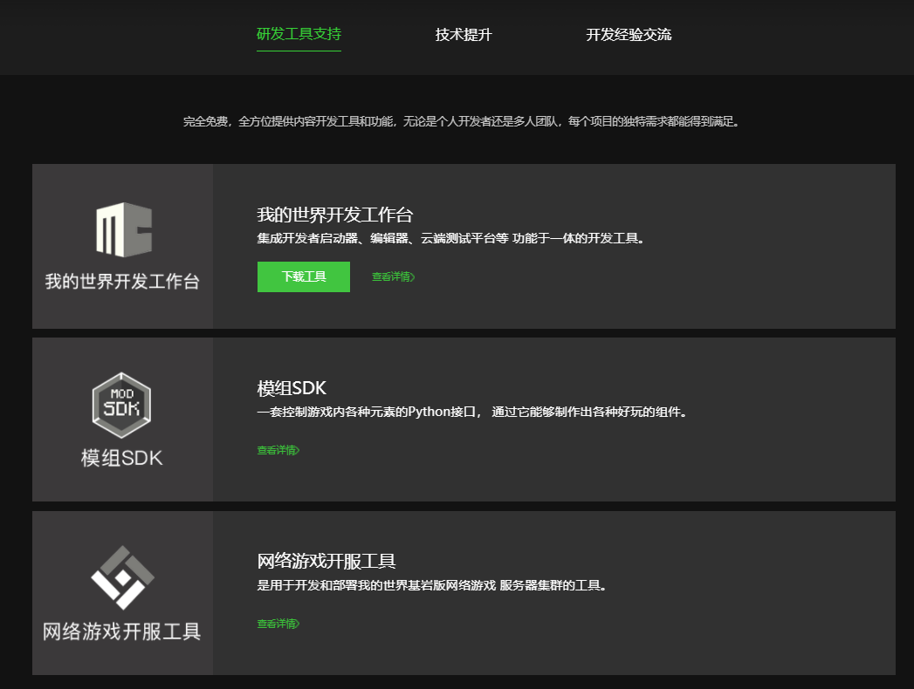 

2. Click [Download Tool], download and install the software, and after the installation is complete, you can proceed to the next step. 

## 2. Two situations and steps for LAN online testing: 
Note: "A" and "B" in the text are added only for ease of understanding. 
A. A single developer performs online testing on a single device 
1. Run the mod currently being developed by the editor, and a [Mod PC Development Package A] will be launched 
2. Start a new [Mod PC Development Package B] in the editor 
3. Find and join the [Mod PC Development Package A] started in step 1 in the [Friends Interface] of [Mod PC Development Package B] 
4. Perform multiplayer online testing 

B. Multiple developers and multiple devices perform multiplayer online testing 
1. Developer A runs the mod currently being developed by the editor, and a [Mod PC Development Package A] will be launched 
2. Developer B in the same LAN starts a new [Mod PC Development Package B] in the editor 
3. Developer B finds and joins the [Mod PC Development Package A] started by developer A in the [Friends Interface] of [Mod PC Development Package B] 
4. Developer A and developer B perform multiplayer online testing 

The essence of the above two steps is: 

1. Click Run in the editor to start [Mod PC Development Kit A] (same as stand-alone testing) 
2. Choose to start a new [Mod PC Development Kit B] on your own computer or another developer's computer according to different situations 
3. Perform multiplayer testing through the friend online function of the LAN 
## 3. Run the current Mod in the editor 
First, we click Run in the upper right corner of the editor to start Mod PC Development Kit A to test our Addon or gameplay map. This step is the same as the local stand-alone test. Just click Run and wait for the Mod PC Development Kit to start and automatically enter the game: 
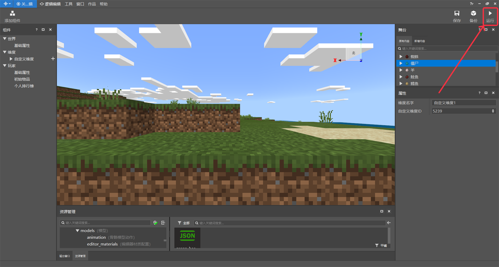 

## 4. Start a new Mod PC development kit 
Note: Depending on the different situations in step 2, choose to perform this step on your own computer or another developer's computer 
1. Open the [MC Studio main interface], enter the [Work Library], and you can see a [Toolbox] button in the upper right corner: 

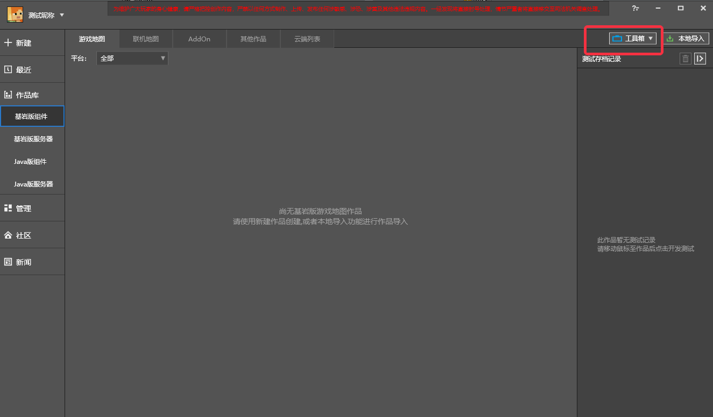 

2. Click [Toolbox], select [Mod PC Development Kit], and click to start the MC game: 

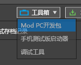 

3. At this time, a version selection window will pop up, just click the latest stable version: 

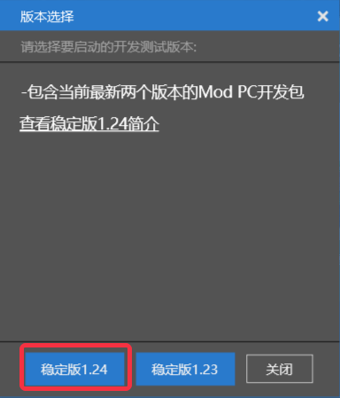 

After waiting for a while to load, you will eventually see the main interface of the game: 

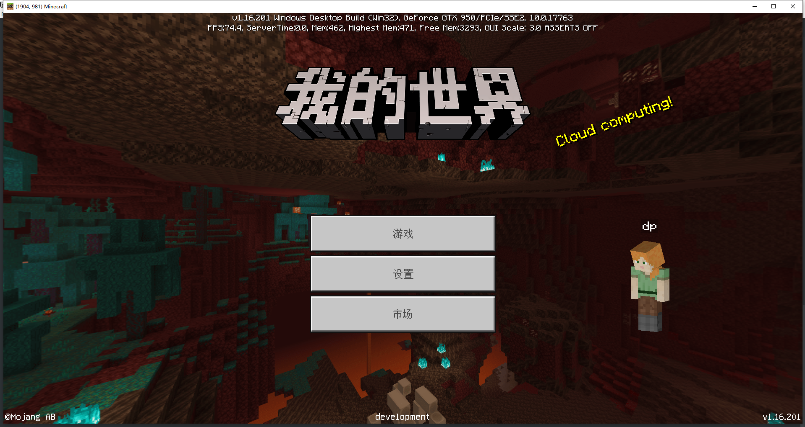 

## 5. Find and enter other people's LAN world 

1. On the main interface, click [Game]: 

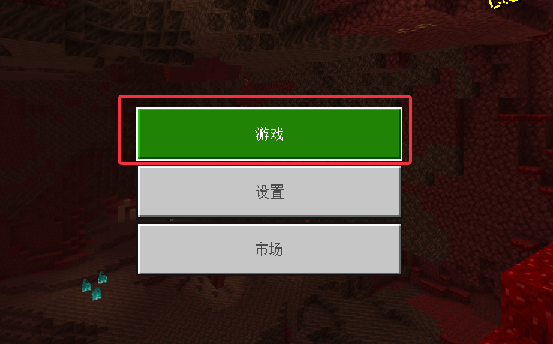 

2. In the top tab, find [Friends] and click to open: 

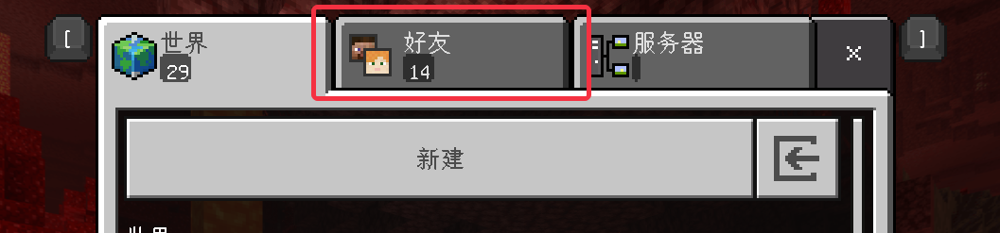 

3. In the friend interface, you can see other people's games in the same LAN. Find the name of the map you want to test and click to enter the game: 

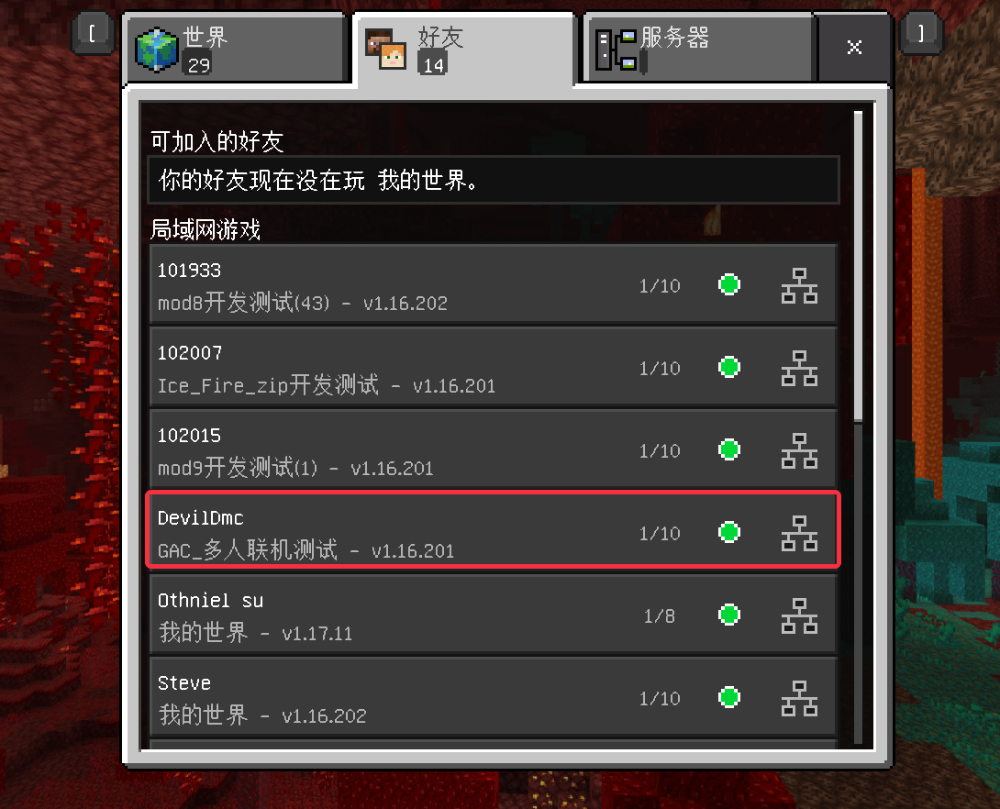 

4. If a pop-up window asks whether to download behavior packs and resource packs, it is because the game where the host is located has loaded additional resources. Click [Download and Join] 

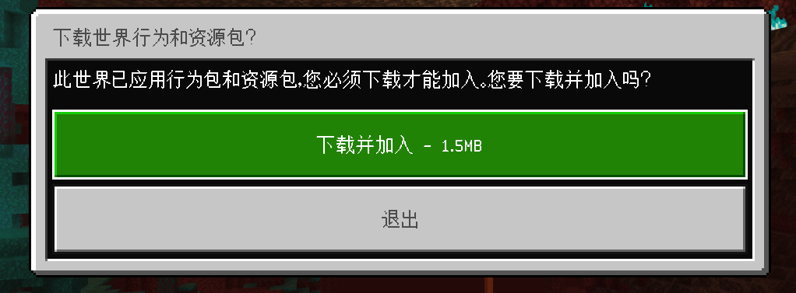 

5. After loading for a while and entering the game, press Esc In the opened menu, you should be able to see yourself and other players in the game, and you can now start multiplayer online testing. 

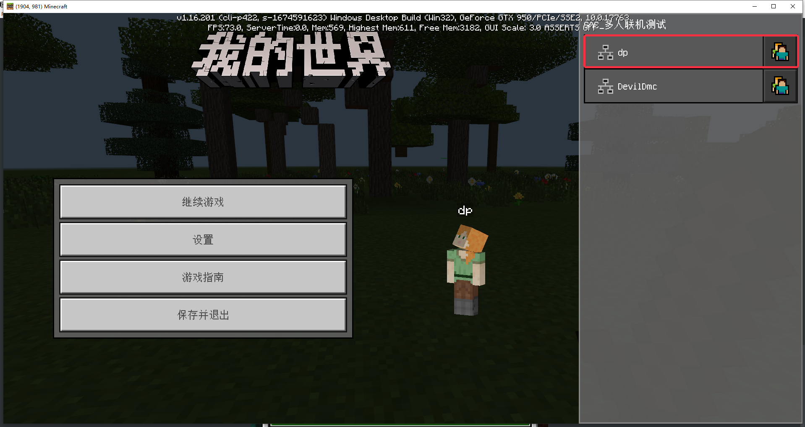 

## VI. Modify test options 
In the launcher settings, you can modify some of the options for the ModPC development kit test, as shown below 

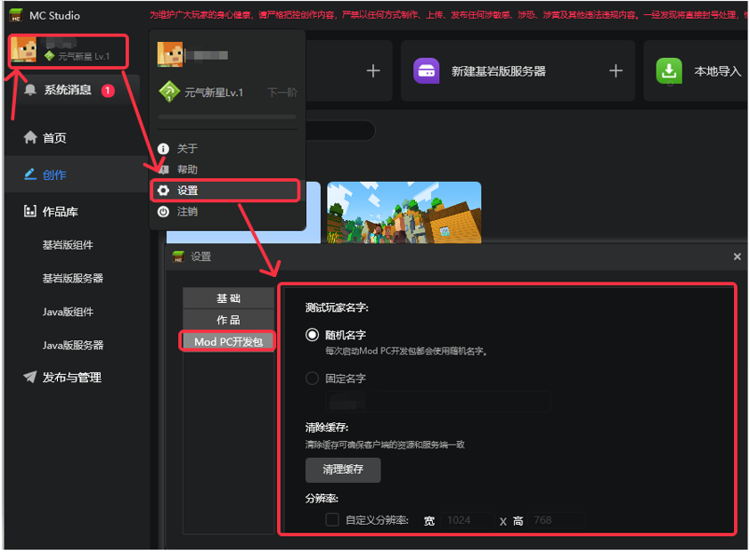 

1. Test player name: that is, modify the name of the player during the development kit test, as shown in the figure 

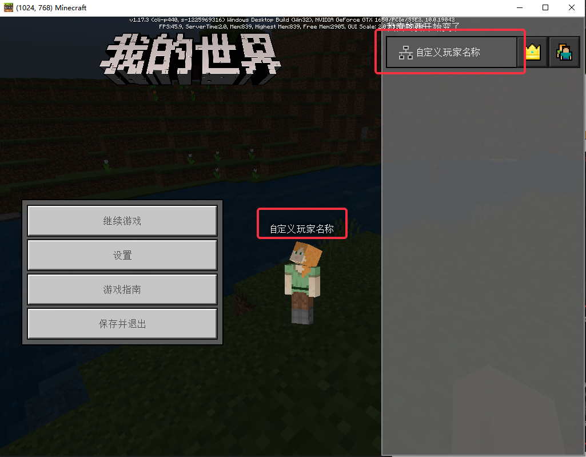 

> The settings here are only effective for the ModPC development kit opened through the toolbox, and are not effective for development tests and running tests in the editor.

2. Clear cache: clear the cache of the development kit to make the development kit client consistent with the server

3. Custom resolution: modify the resolution when the development kit is started. When adapting to multiple resolutions, you can set a fixed resolution here for testing, as shown in the figure

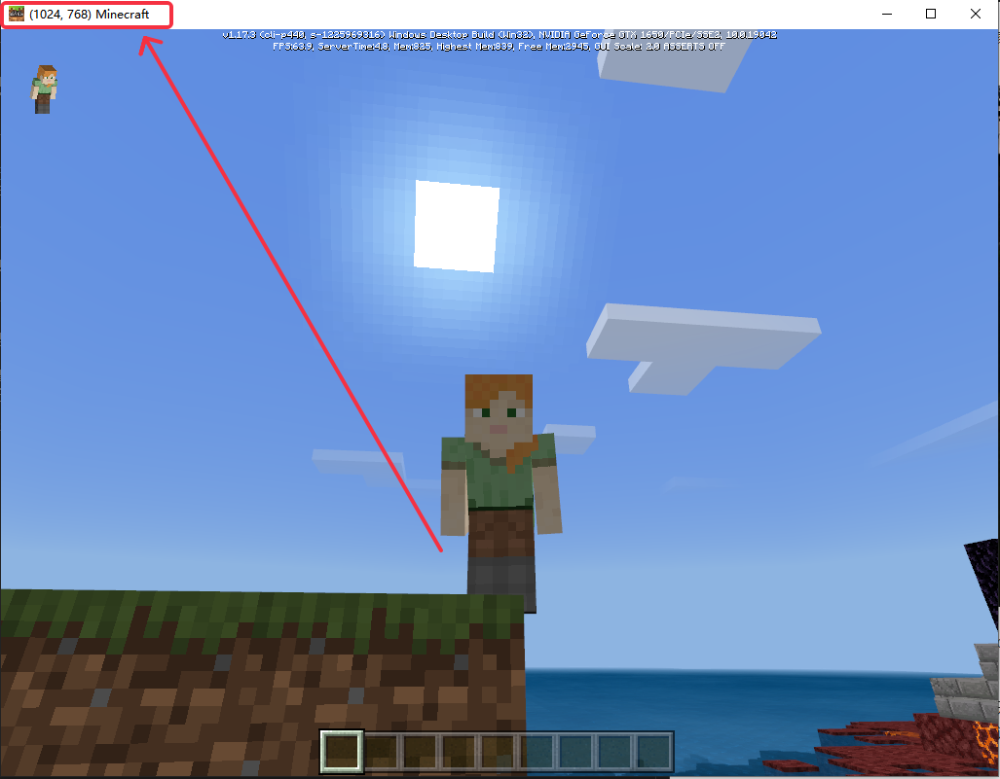