# Introduction to Mod PC Development Kit 
The ModPC Development Kit is a very important and commonly used function for developers to use the Minecraft Workbench (MCStudio) for module development and testing. The following is a brief introduction to it. 
## 1. What is the Mod PC Development Kit 
The Mod PC Development Kit is essentially a special type of MC game client, and the MC game client is mainly responsible for loading MC game archives and building a game world exclusive to this archive based on the archives. The ordinary version of the MC game client is the window for players to enter the game, and the main users of the Mod PC Development Kit are the developers of the module. 

We all know that developing a module is actually modifying the game archive and script logic. When we finish writing a gameplay or function, we need to run the module archive with the game client and enter the game world to verify whether our function is effective. The Mod PC Development Kit is the application responsible for loading the developer's module archive. For example, when we click Run in the editor for testing, we are actually using the ModPC Development Kit to open our currently edited module archive, as shown in the figure below. 
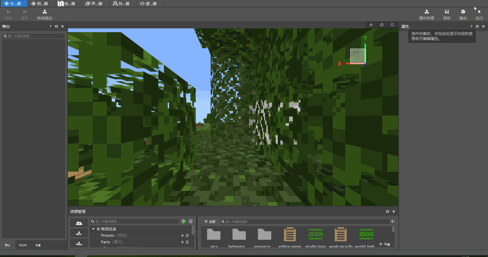 

## 2. Developer menu 
There is a developer menu in the upper right corner of ModPC. This menu has built-in one-click hot change, reload archive, create a new archive test, call out the debug log window and other most commonly used functions for developers to help developers improve testing efficiency, as shown in the figure below. 

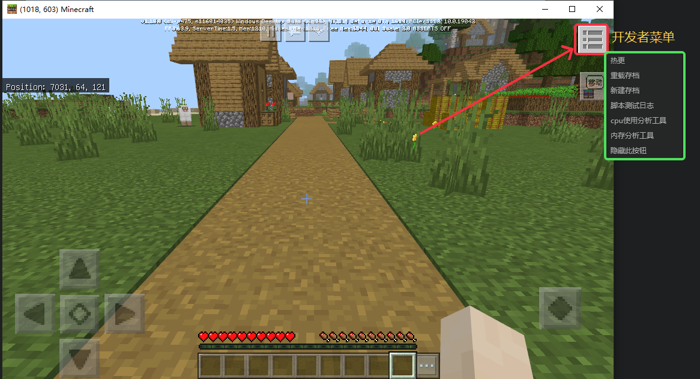 

1. **Hot Update**: After modifying the part code and saving it, the ModPC development kit will automatically reload the part code. This hot update function is used when the automatic hot update does not work. The sign of a successful hot update can refer to the reload log in the debug log window, as shown in the figure below: 

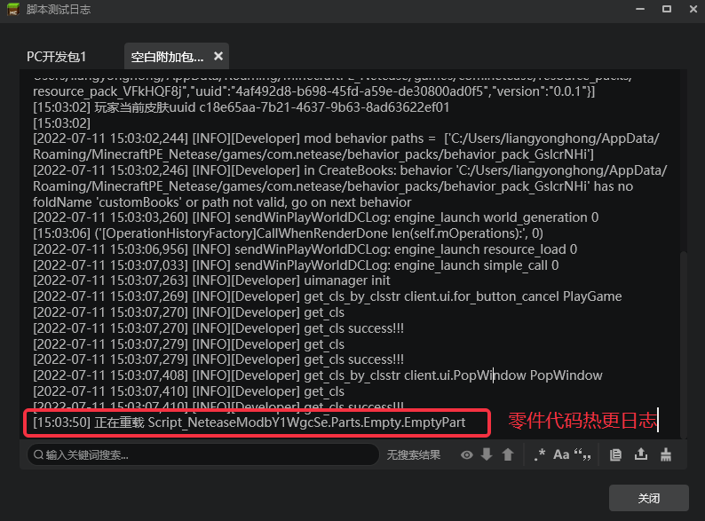 

2. **Reload**: Close the archive and reload. This is used when you need to test the same archive multiple times. This operation is equivalent to the following operation in the ModPC development kit: esc to call up the menu → click Exit → click OK → wait for exit → click the game → select the archive just closed → wait for loading, enter the archive for testing. 

3. **New Archive**: Close the current archive and create another archive for testing. This operation is equivalent to closing the ModPC development kit, creating a new archive in the background and checking to import the currently edited components. The ModPC development kit loads the archive for testing. 

4. **Script log test, CPU usage analysis tool and memory analysis tool**: used to open the corresponding function window, which is equivalent to the function of the same name in the toolbox in the Minecraft development workbench, as shown in the figure below 

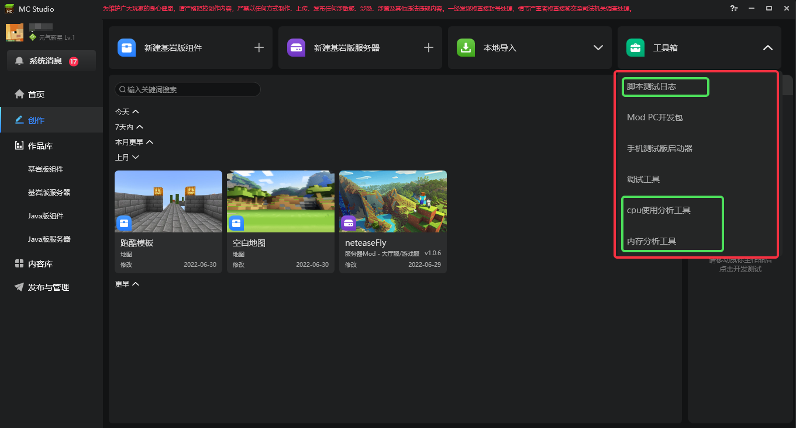 

5. **Hide this button**: Close the developer menu button. If you need to open it again, you need to open it in the settings menu of the Minecraft development workbench, as shown in the figure below 

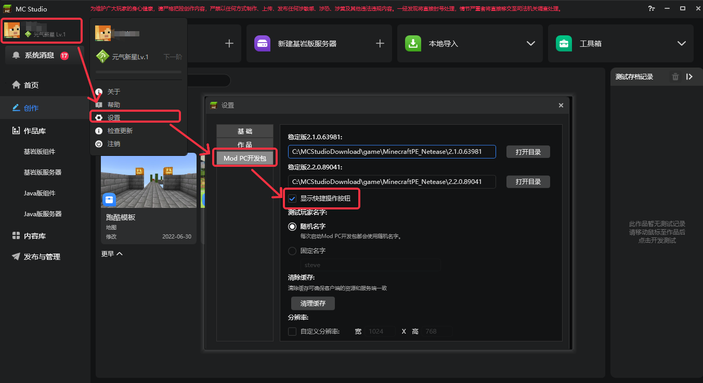 

## 3. Other special features of Mod PC development kit 

In order to improve the efficiency of developers in module development and testing, ModPC development kit has built-in many debugging-related functions 

As shown in the figure below, when the settings menu of ModPC development kit is opened, we can find that two new options "debug" and "flight debugging" have been added (as shown in the figure below 1). In these two menus, there are rich debugging-related options built in. The following focuses on three parts that are more related to debugging: 

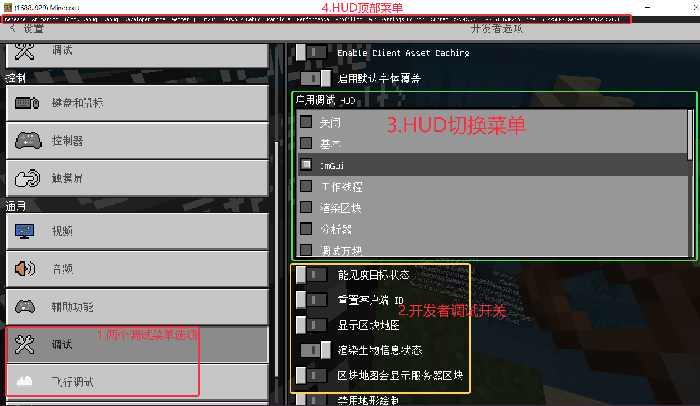 

### 1. Developer options 

As shown in Figure 2 above, there are dozens of debugging-related developer options in the debug menu. Using these options can help players understand the game running information more intuitively, so as to better debug the functions they develop. As shown in the figure below, we turn on the options of displaying block maps, boundaries and opening biological information, and we can see the corresponding information in the game to help us judge the corresponding game status. 

 

### 2. Debug HUD 

Debug HUD refers to displaying some debugging-related information directly on the top layer of the ModPC development kit, allowing developers to intuitively understand the real-time running information of the game. According to the display content, the debug HUD is divided into multiple interfaces, and there are two ways to switch and switch it 

a. In the HUD switching menu in the developer options, switch to different HUDs through the drop-down menu to view the corresponding game information. As shown in the figure below, select the rendering block menu, and the HUD will display information related to the rendering block. 

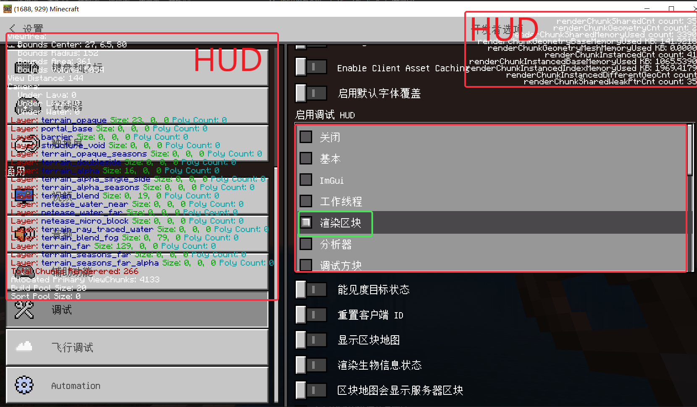

b. Use the F3 and F4 buttons in the ModPC development kit to switch the HUD, the effect is the same as a. 
### 3. Top menu bar 
Through the two switching methods in the previous step, switch to the top menu bar, which integrates a variety of in-game resource/information viewing and adjustment functions, such as the post-processing effects of the NetEase version, animation blending tree, block information viewing, etc. Next, briefly introduce several functions that are highly related to development and debugging. 
> Note: The function of the top menu bar is to allow developers to understand the information behind the operation of the game world and debug some game functions. Improper modification operations may cause archive damage. Developers need to be cautious in modification operations and make backups of archives as appropriate. 

1. PostProcess: Open the postprocessing function as shown in the figure below. Here you can debug several postprocessing effects. Currently, there are 5 effects that support API calls (in the green box in the figure). Please refer to <a href="../../mcdocs/1-ModAPI/接口/后处理/指数.html" rel="noopenner"> Postprocessing Interface </a> 

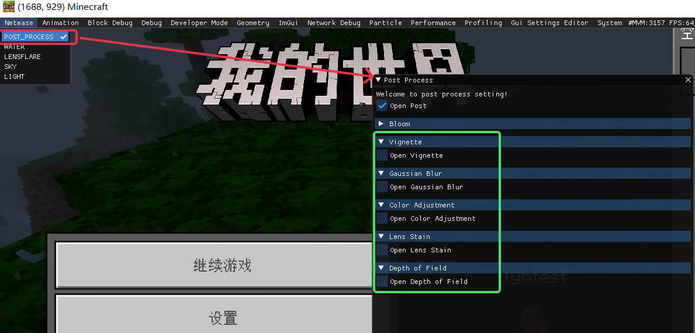 

2. Animation: Open the animation editor as shown in the figure below. Here you can view and modify the player's animation blend tree (modifications will take effect and save, please modify the original animation with caution) 

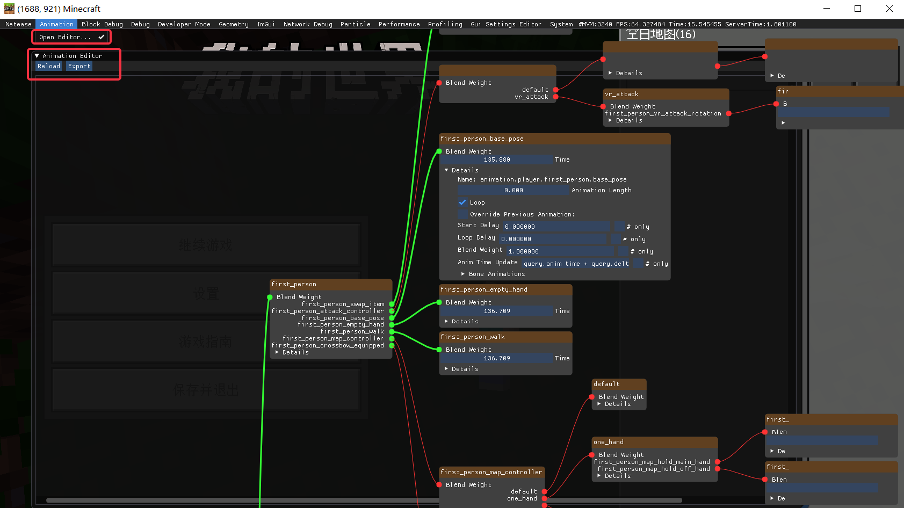 

3. Block Debug: Open the block debugging function as shown in the figure below. Here you can display the information of the block that the current player's crosshairs are aimed at, which is convenient for developers to understand the status of the block. 

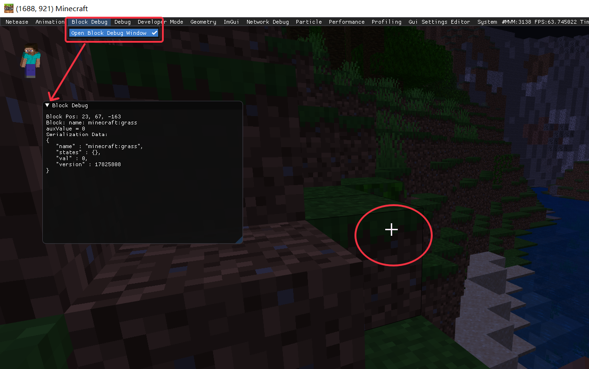 

4. Debug Control: Open the debug control window as shown below. Here you can customize some commands and create them as button triggers, which allows developers to quickly execute common commands multiple times, such as creating a fence for testing, teleporting players to fixed points, etc. 

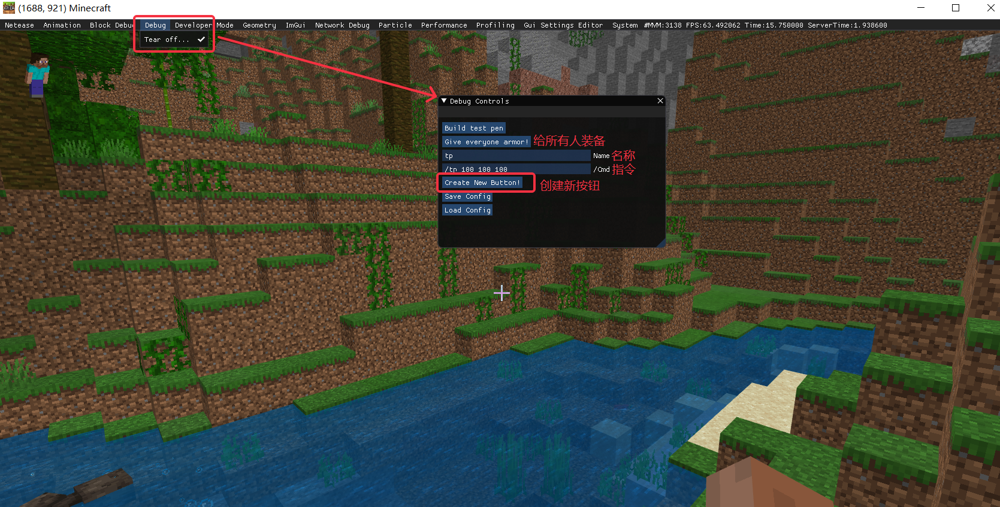 

5. Level Debug: Open the world debug window as shown below. Here you can view some information about the current world and blocks, and you can also click the reload world button to reload the save file. 

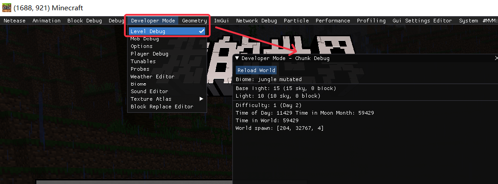 

6. Mob Debug: Opens the mob debug window as shown below, where you can use `Ctrl` plus `right mouse button` to select a mob and view its information 

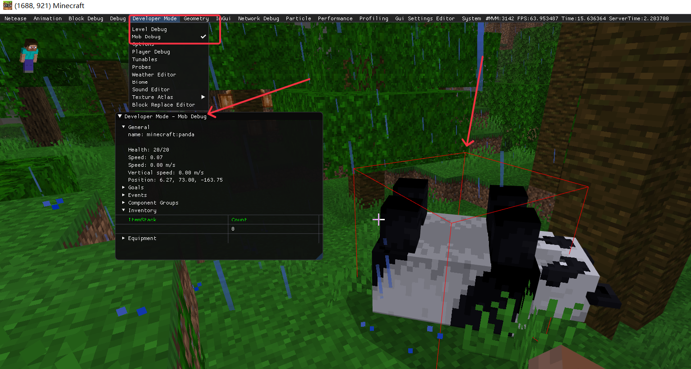 

7. Options: Opens the options window as shown below, where you can view and edit all the game options 

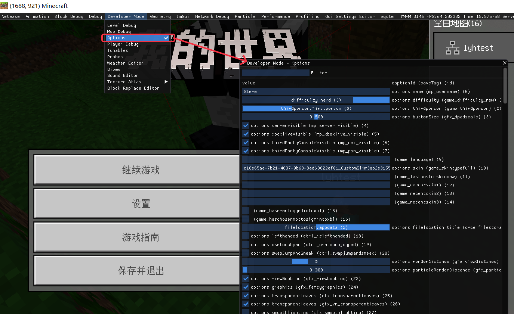 

8. Player Debug: Opens the player debug window as shown below, where you can view player-related information 

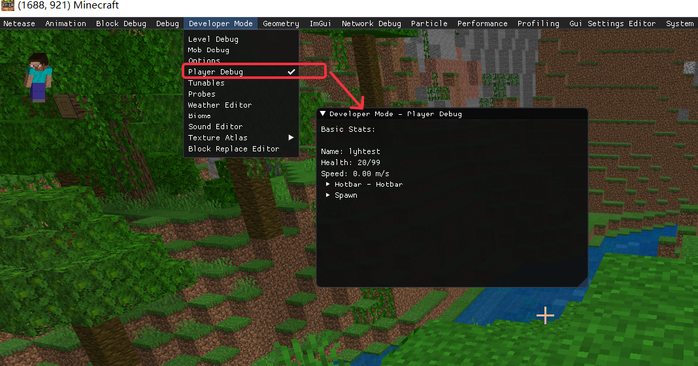 

9. Weather Editor: Opens the weather editor effect as shown below, where you can view and edit weather-related properties 

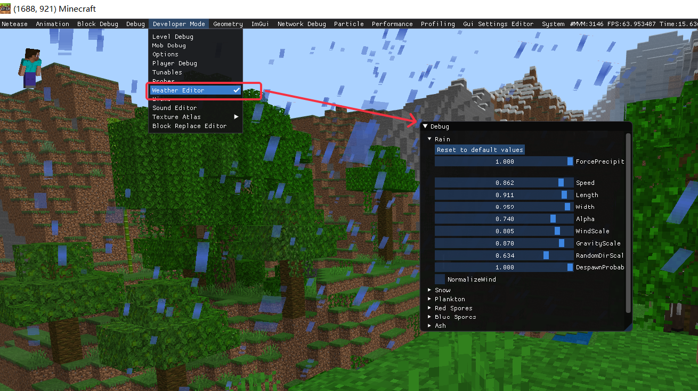 

10. Sound Editor: Open the sound editor as shown below, where you can view and audition the sound effects in the game

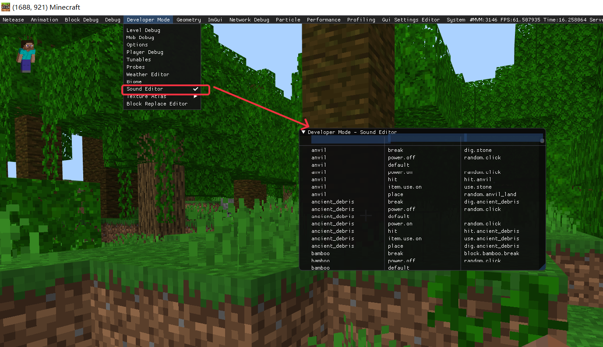 

11. Geometry Editor: Open the grid editor as shown below, where you can view and edit the grid information of all models in the game (modifications will be saved, so be careful) 

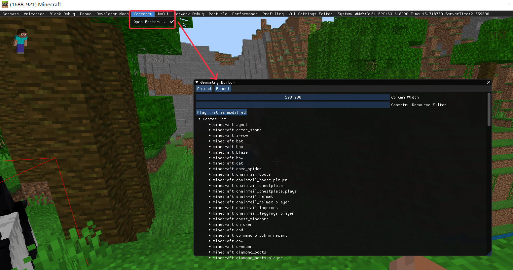 

12. Track (Performance Tracking): Open the performance tracking window as shown below. Here you can view the memory usage and various thread triggering conditions when the game is running. 

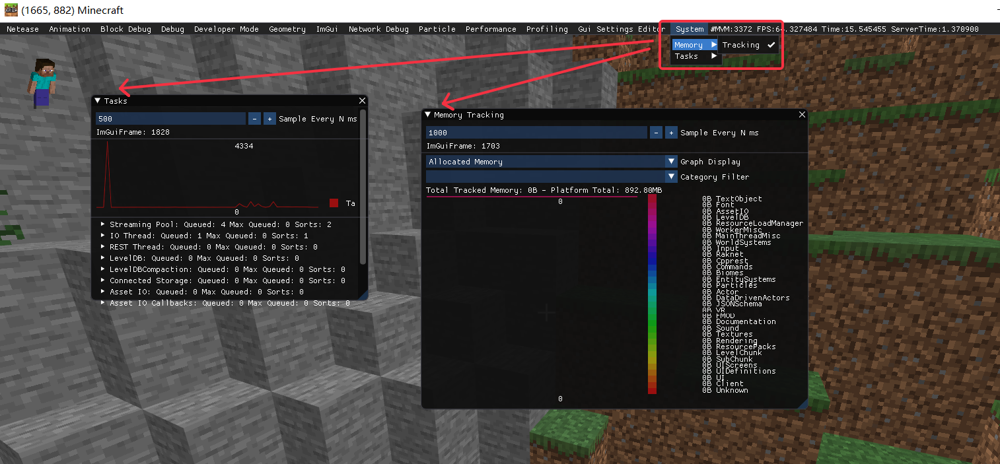 

>Note: Developers can experience other unmentioned content by themselves, and some content will be adjusted later. 
## 4. When do you need to use the Mod PC Development Kit? 
Now that you know the features of the Mod PC Development Kit, when will you use it? Here are several major usage scenarios for the Mod PC Development Kit. 

### 1. Embedded Editor 
When we open a save file with the editor, a built-in Mod PC Development Kit will be started in the background to support us in the editor for terrain editing, resource placement and other functions. 
>Note: The Mod PC Development Kit of the embedded editor only enables some functions, such as loading and unloading of game terrain blocks. The terrain we operate in the terrain editor depends on this function. 

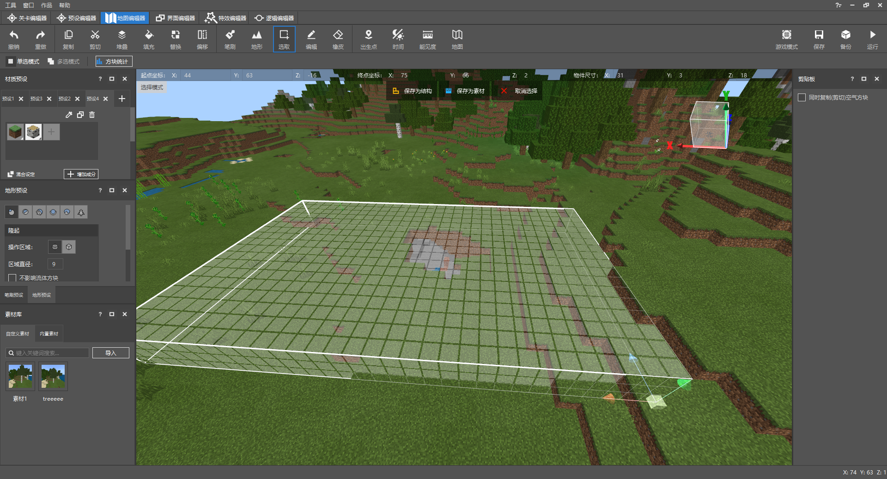 

### 2. Run the test in the editor 
When we click Run in the upper right corner of the editor, it actually opens a new ModPC development package to load the module archive (different from the ModPC development package built into the editor) for developers to test, as shown in the figure below. 

 

### 3. Development test in the launcher 
In the launcher interface, when we hover the mouse over a module, a button called `Development Test` will appear. Clicking Development Test actually opens the module archive with the ModPC development kit, but Development Test can adjust some game settings before loading, as shown in the figure below 

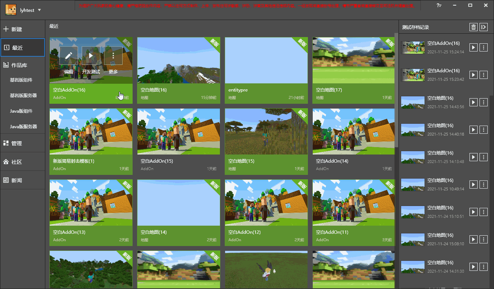 

### 4. Open the Mod PC development kit in the toolbox (multiplayer online test) 
As mentioned in the tutorial [ModPC development kit multiplayer test](./0-ModPC development kit multiplayer test.md), when we need to open multiple ModPC development kits on a computer, we can find the corresponding option in the toolbox to open the ModPC development kit without loading the archive separately 

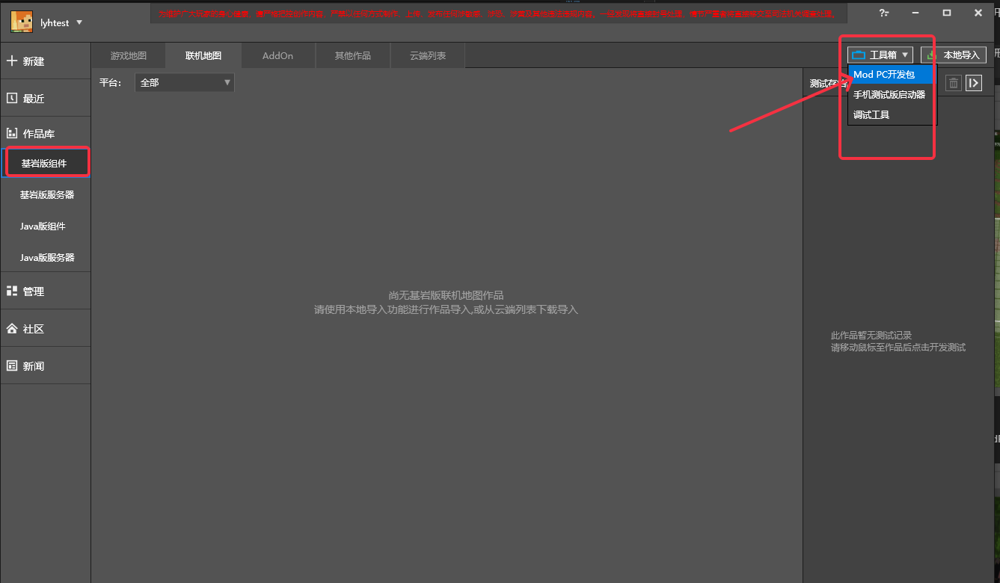 

## IV. Notes 
> When we download the works in the cloud list to the local computer, there is a function of "online test" for the selected works. The "online test" here does not mean opening the archive with the ModPC package. On the contrary, in order to allow developers to test their works closer to the actual application scenario before going online, the online test function uses the official version of the client for simulation testing, so that developers can understand the operation of the module after it is actually online.