--- 
front: https://nie.res.netease.com/r/pic/20220926/9ef0cb38-6193-48b9-aa7e-d0aef0bda97c.png 
hard: Getting Started 
time: 10 minutes 
selection: true 
--- 
# Use the debugging tool for mobile and computer debugging 

## Introduction to the debugging tool 

The debugging tool is a powerful test auxiliary tool. After this upgrade, its main functions are: 

1. [Multi-terminal log viewing](#Multi-terminal log viewing): View the logs of game tests on the local computer and other devices on the computer, including the test logs of mobile test clients and other PC development kits. 
2. [Command debugging](#Command debugging): Directly use python code to debug the ongoing game test process, and provide code completion function. 
3. [Component Management and Synchronization](#Component Management and Synchronization): During the self-test phase, modify the component file on the PC side and synchronize it directly to the mobile test side, saving the long waiting time for machine review. 

 

## Startup method 

We can start the debugging tool from two places: 

The first is to go to the [Creation] page of the workbench, click the [Toolbox] button, and select [Debug Tool] to start. 

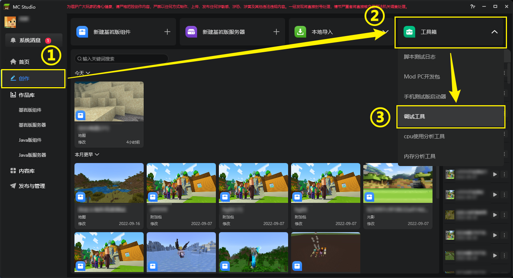 

The second is to go to the [Bedrock Edition Components] or [Bedrock Edition Server] tab in our [Library], click the [Toolbox] button, and select [Debug Tool] to start. 

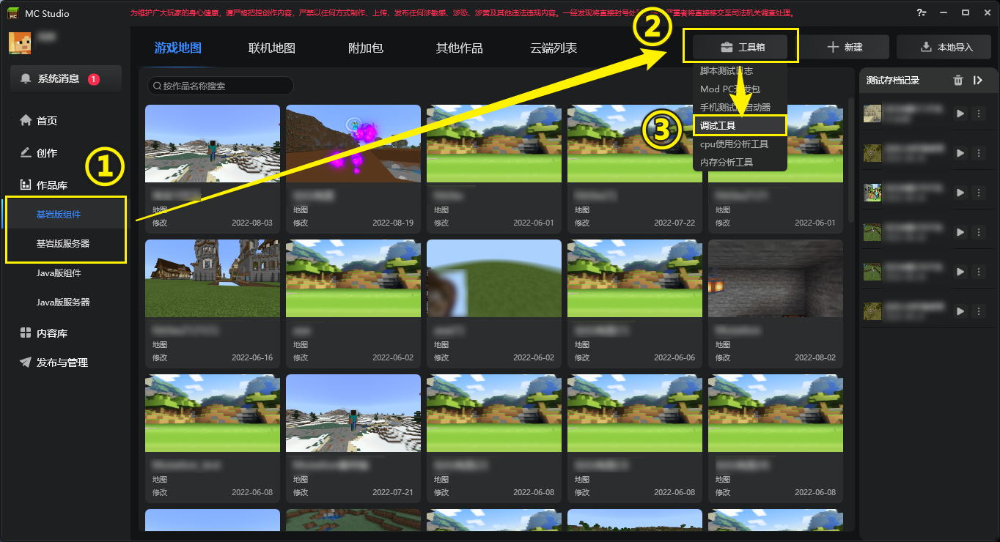 

## Interface introduction 

The interface of the debugging tool is divided into the following parts: 
1. **Connection options**: Connect the client to the debugging tool and manage the connected devices. 
2. **Log paging**: used to switch between different log pages. The test platform type icon and account will be displayed on the paging tab. 
3. **Log window**: view the process logs of the PC development kit and mobile test server, support search, filtering, etc.; 
4. **Debug window**: integrates multiple important debugging functions, mainly including: 
① Enter python debugging code to run on the client/server; 
② View the command history, and save the command as a shortcut command for subsequent reuse; 
③ Upload files/folders to the mobile test server component directory, or download files from the client; 
④ Synchronize the changes made to the component source file on the PC directly to the mobile test server. 

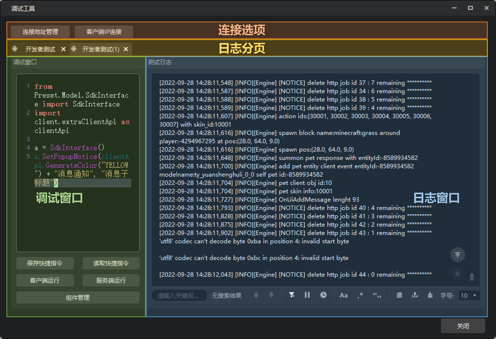 

## Connect to the client 

After opening the debugging tool for the first time, we will see the following interface. Since the test client has not yet been connected, we can only see two connection option buttons and the prompt message "Waiting for client connection".


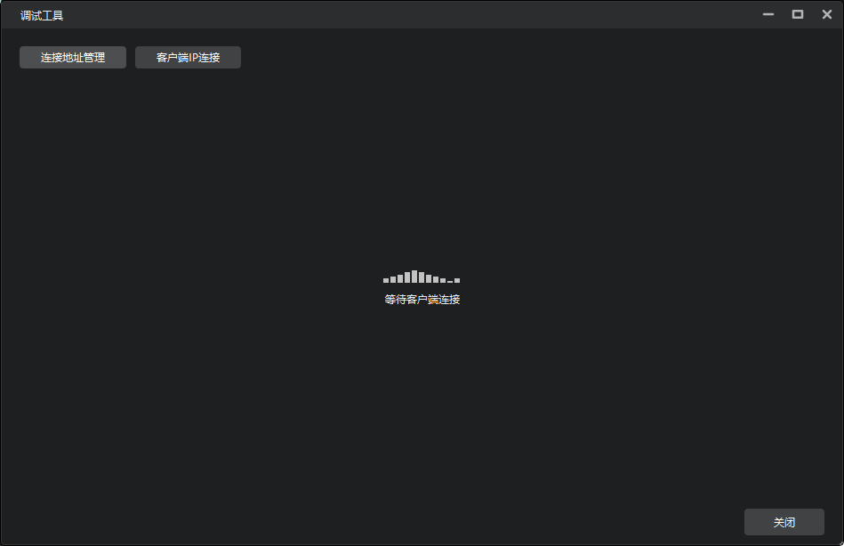 

Since we are opening the debugging tool for the first time, we need to **manually** connect the client. 

The types of clients supported by the debugging tool include: 
1. Android mobile phone test client 
2. ModPC development kit 

> Among them, the Android mobile phone test client can be downloaded from the top of the [Developer Platform](https://mcdev.webapp.163.com/#/square) homepage ① position, and you can perform component self-test on your phone after logging in to your developer account. 
> **The debugging tool does not support iOS test client yet, please connect to the Android end. ** 
>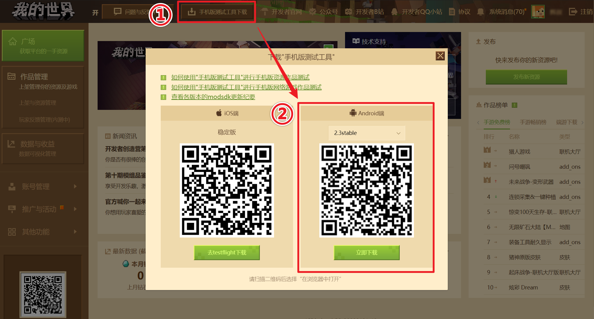 

We **first start the above client**, and then return to the debugging tool. We have two ways to connect the test client to the debugging tool on our computer. 

### 1. Add a client directly through the "Client IP Connection" button 

When we need to add a device quickly, we can click the [Client IP Connection] button, enter the IP address of the test client, and then click [OK], and you will find that the debugging tool is connected to the client and the log starts printing. 

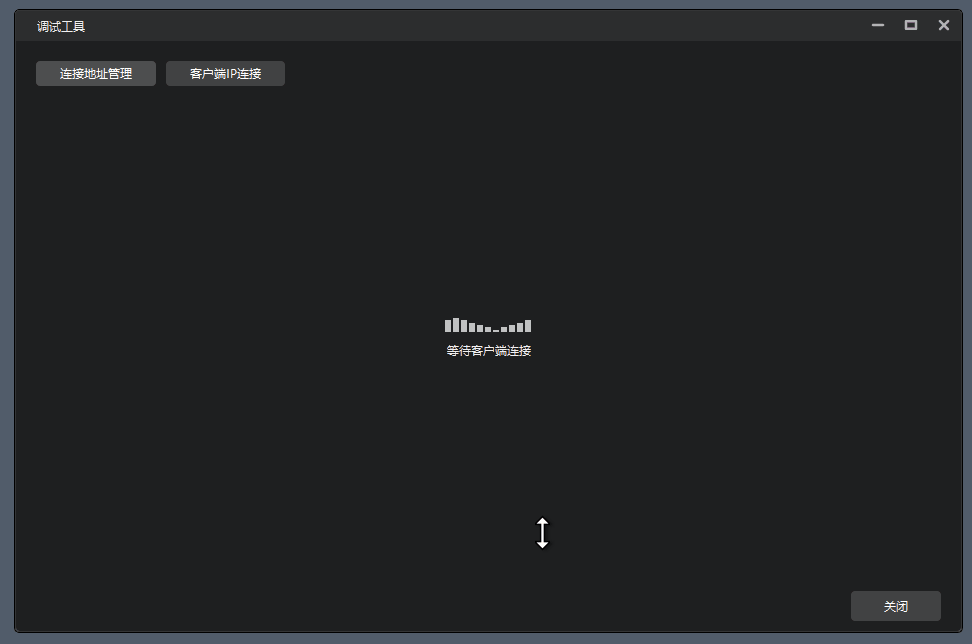 

### 2. Manage client connections through "Connection Address Management" 

[Connection Address Management] provides developers with the function of adding, browsing, and removing test clients that the current debugging tool allows to connect. 

When we need to add a new client, first click the [Connection Address Management] button, then click [+] to add a connection device, enter the IP address of the test client we want to connect, and finally click [OK]. 

Click the [Connection Address Management] button again and we can find that the device we just added appears in the list of accepted connection addresses. The list will show the IP address of the device we are connecting to, the nickname of the player logged in to the device, and the login platform of the device (Android, Windows, etc.). 

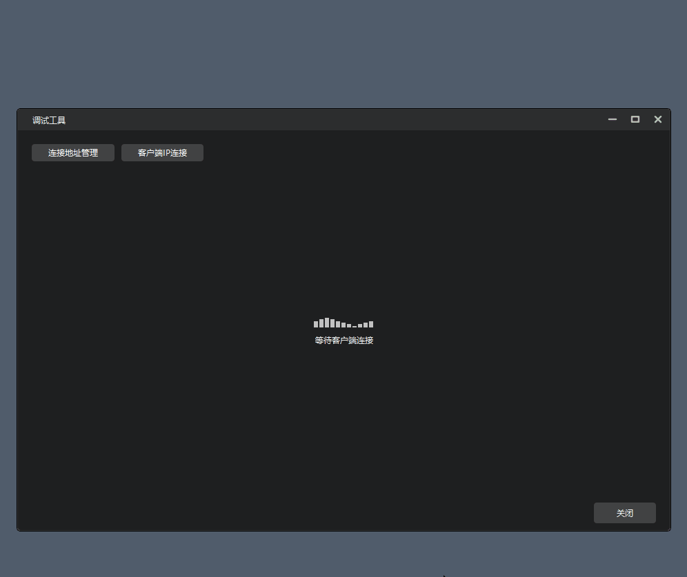 

In addition, in order to distinguish different connected clients, developers can add more descriptive information to the corresponding client in the [Custom Alias] column. If an alias is added here, the paging label will display this alias when the client connects to the debugging tool. 

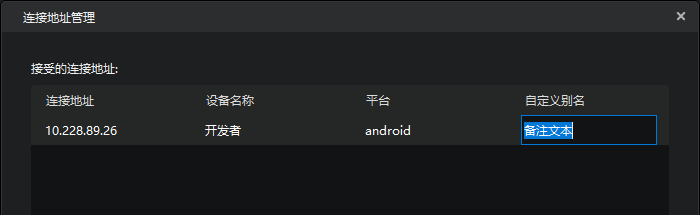 
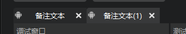 

> **Note: IP address query method** 
> - For Windows platform, you can open **Network and Internet Options**, select the current **Ethernet**, and you can see the IPv4 address in the properties. Or press win+R and enter `cmd` to open the command line, enter `ipconfig` to view the current IPv4 address 
> - For Android platform, click the wifi button to enter the details page of the current wifi to see the IP address of the current wifi 

**Client connection follows the following rules:** 

1. When the client has never connected to any debugging tool, the debugging tool needs to actively connect. The connection method is as above. 

2. When the client successfully connects to the debugging tool, it will automatically request a connection to the debugging tool that was connected last time. 

3. When the client is already connected to the debugging tool, other debugging tools can no longer actively connect to the client. It needs to disconnect from the existing debugging tool before it can continue to connect. 

## Multi-terminal log viewing


Log viewing is a basic function of debugging tools. In this update, we have enriched the functions of the log window based on the old version to provide more convenience for developers to view logs. 

In addition to the basic log information display, the log window also supports the following functions: 

### 1. Keyword search 

After entering a keyword, the keyword will be searched and highlighted in the log area. Press the Enter key to jump to the next keyword. The number of keywords currently searched and the number of the currently located keywords will be displayed on the right side of the input box. 

- Search results are marked with a blue background, and the currently located search result is marked with a white background. 
- After entering a keyword, in addition to pressing the Enter key to locate the next search result, you can also jump to the previous or next search result through the up and down arrows on the right. 

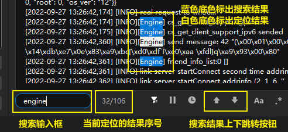 

### 2. Pause printing and continue printing 

Click the [Pause Log Brushing] button to pause log printing. The logs during the pause period will be cached, and the number of cached logs will be displayed on the right. When the developer clicks the [Redisplay Log] button, the logs during the pause period will be redisplayed in the log window without being lost. 

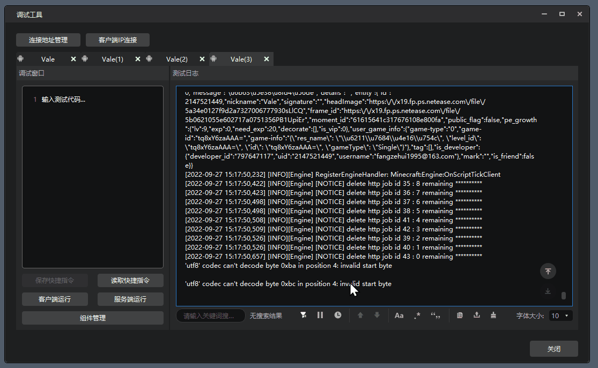 

### 3. Log quantity limit and past logs 

The debugger has an upper limit on the number of logs displayed. Developers can right-click in the log area to adjust the upper limit of log messages. 

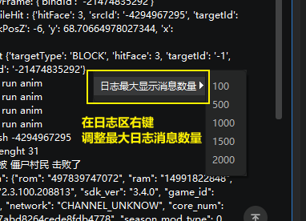 

For example, if we adjust the upper limit to 1000, then when the number of log messages exceeds 1000, the debugger will capture the first 1000 logs and store them in a separate txt file. If the developer needs to view past logs, he can click the [Show Past Logs] button, which will automatically open the folder where the past logs are stored for you. Find the corresponding txt file to browse the log messages previously captured by the debugger. 

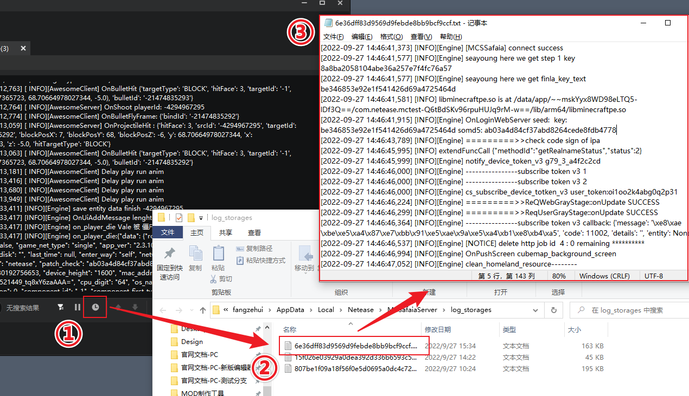 

### 4. Log search criteria options 

In the search criteria options section, we provide three options for developers: case matching, whole word matching, and regular matching. 

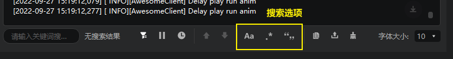 

### 5. Log filtering by tag 

Click the tag filter button to display the currently available tag filter items. The filter has four default tags: 
- MCSSafaia 
- Developer 
- Engine 
- INFO 

The filter does not check any tag by default, which means the filter is not enabled, and the button is grayed out. When the developer checks any of the options, **only logs containing the field** will be displayed. In addition, if two or more tags are checked at the same time, **logs containing at least one of the tags** will be displayed. 

In addition, developers can also add **custom tags** to the logs. Click the [Custom Log Tag Management] option, enter the field you want to define as a tag in the input box above, and click the [Add] button to add it to the log tag list and check it by default. Fields added as custom tags will be displayed in bright green in the log. 

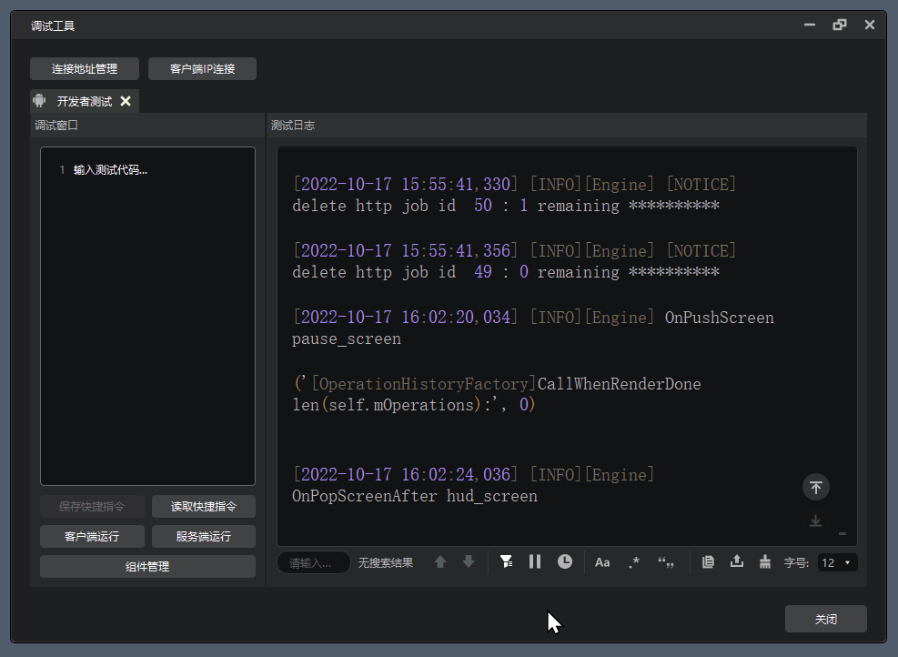 


### 6. Log copy, replication and clearing 

There are 3 options related to log operations: 
1. **Log copy**: Copy all logs in the current log window. Because the log display limit is exceeded, the truncated part will not be copied, and the developer can find it in the past log folder. 
2. **Log export**: Export all logs in the current log window. Because the log display limit is exceeded, the truncated part will not be exported, and the developer can find it in the past log folder. 
3. **Clear log**: Clear all logs in the current log window. 

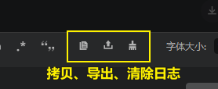 

### 7. Log browsing options 

In the lower right corner of the log window, you can select the font size to be displayed through the drop-down box. At the same time, developers can also directly hold down ctrl and scroll the mouse wheel up and down to adjust the font size. 

In addition, it also supports one-click jump to the first and last logs in the current log window, as shown in the figure below. 

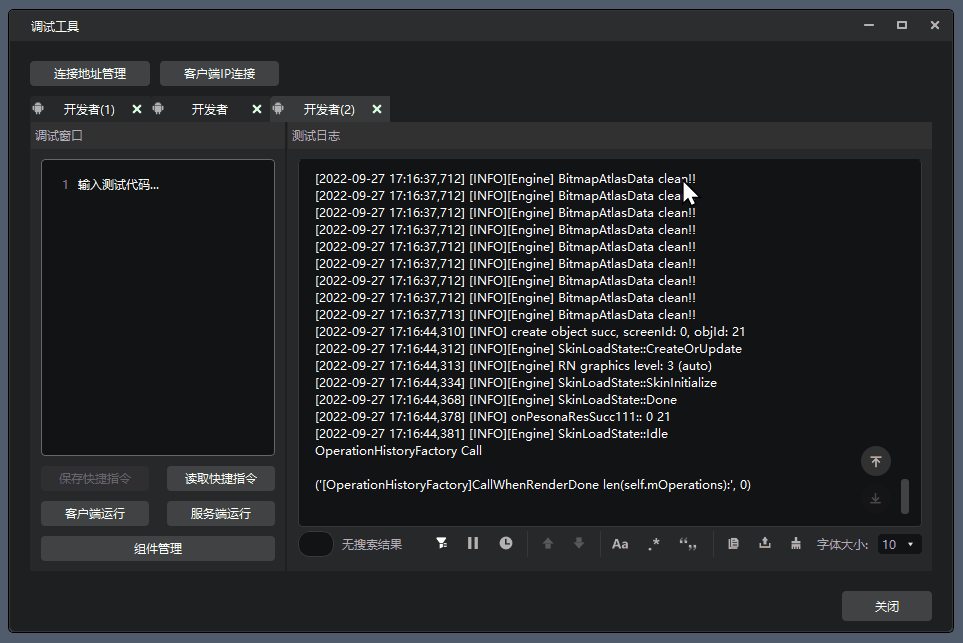 

> **Warm Tips:** 
> For logs, there are 4 color levels, namely debug, info, warning, and error. Use the [DEBUG], [INFO], [WARNING], and [ERROR] keywords in the print log to display different colors. For developers, these keywords can be used to easily distinguish between developer logs and original logs. 

### 8. Collapse and expand the log window and debug window 

If you don't need to view either the log window or the debug window, you can drag the center line between the two to the left or right side of the window to collapse one of the windows. 

When the window is collapsed, an expand button will be displayed on the edge. Click to expand the collapsed window. 

 

## Command debugging 

Command debugging is another important function of the debugging tool. It can be used to input Python test code in the game script layer, such as importing some modules for execution functions, or printing some global variables. In addition, developers can also use command history, read shortcut commands, etc. to quickly reuse previously used commands. 

> **Note: The command debugging function will only take effect after entering the game. ** 

### 1. Enter Python code for debugging 

Developers can enter Python code in the code input box, and then select [Client Run] or [Server Run] as needed. 

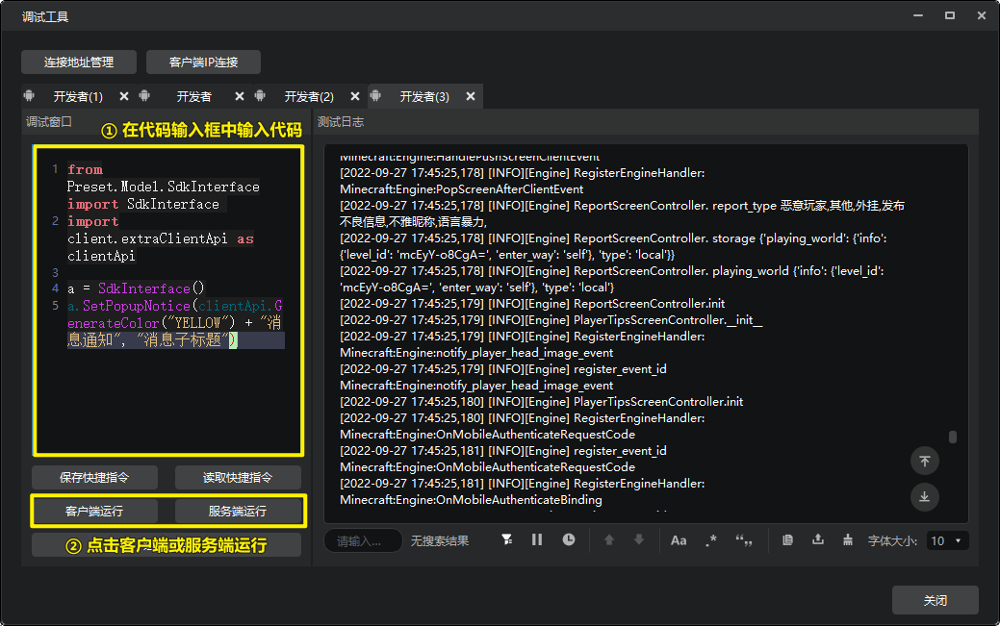 

In addition, the code input box of the debugging tool **supports completion library**. 

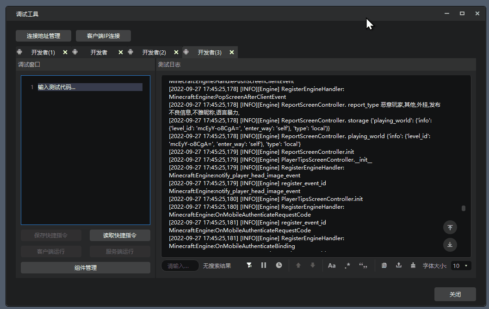 

For example, when our mobile test client enters the game, we can enter in the code input window of the debugging tool: 

``` 
from Preset.Model.SdkInterface import SdkInterface 
import client.extraClientApi as clientApi 


a = SdkInterface() 
a.SetPopupNotice(clientApi.GenerateColor("YELLOW") + "Message notification", "Message subtitle") 
``` 

Then click the [Client Run] button to execute the code, and you can see a pop-up message above the item bar on the phone. 

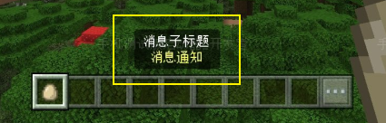 

### 2. View code debugging history 

The developer's previously entered and executed debugging code will be recorded. 

When you need to view and reuse historical debugging code, we need to click the [Read shortcut command] option in the debug window on the left to open the shortcut command window. In the [History] tab, we can see all the previously executed codes. 

Click the triangle button on the left of each record to expand the corresponding code. Developers can also edit the historical record code directly here if necessary. 

If you need to reuse a certain code, just click the [Copy] button on the right to copy the code completely to the clipboard. Then we return to the main interface and paste it in the code area of the debug window to execute it again 

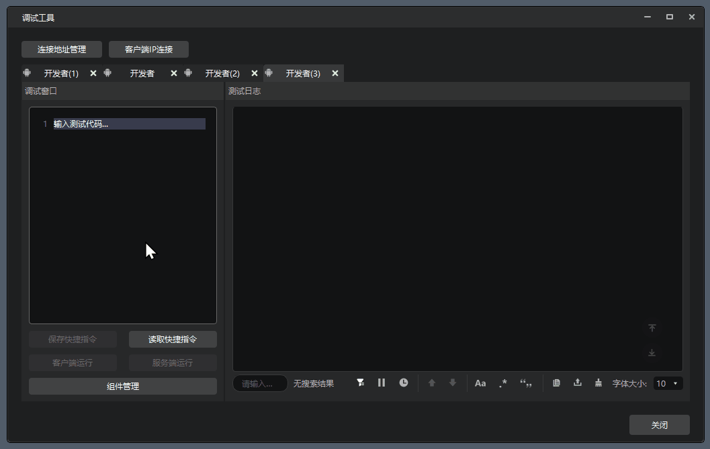 

### 3. Save and read shortcut commands 

Developers can save the python code in the code area of the debug window as shortcut commands for quick reuse when needed later. 

Click the [Read shortcut commands] button and click the [Personal commands] tab on the left to create a custom command category. Different categories allow developers to classify and manage commands according to their own usage habits. 

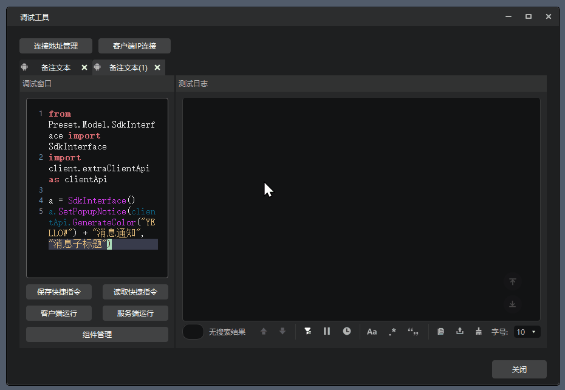 

After creating the category, we enter the code in the debug window input box and click the [Save shortcut commands] button, then enter a command name for the saved command (for example, we name it "Command 1" here), and select which category this command needs to be saved in (here we choose "Category 1"). After selecting and clicking Save, you can find that the command has been saved in Category 1 in the [Shortcut commands] window. 

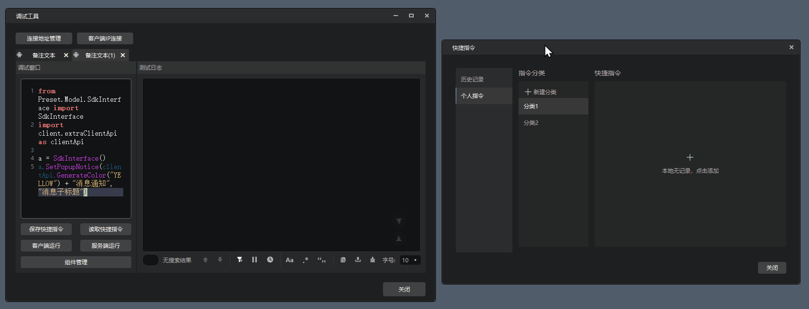 

When saving shortcuts, if necessary, you can also directly enter a new category name in the lower part of the command category selection box, and press Enter to create a new category with this name. Click [Confirm] to save the current command to this new category. 

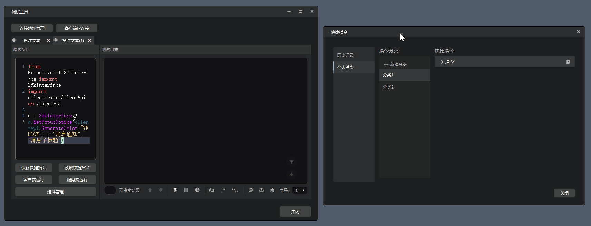 

As in the history, we only need to click the [Copy] button on the right side of each command in the [Shortcut Command] window to copy the command to the clipboard, and then paste it into the input box of the debug window to run it again. 

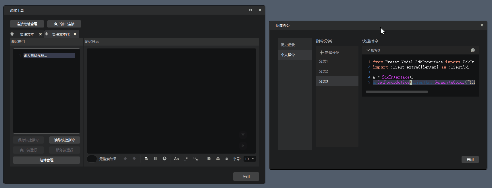 

## Component Management and Synchronization 

When we need to test on the mobile phone, we may encounter the situation where some code needs to be adjusted, but in order to modify a few lines of code, we have to go through the entire machine review process again, which will cause a lot of unnecessary time consumption. In this update, we have added component management and synchronization functions to the debugging tool to help developers reduce the time cost during debugging as much as possible.

> **Note!!! ** 
> The component synchronization function can only synchronize the files in the `behavior packs` and `resource packs` in the components for the time being, and cannot be used to synchronize changes made to the map. 

### 1. Component Management 

First, we can click the [Component Management] button in the debug window on the left to open the management window. All components loaded on our test client will be displayed here.

> "Load" means downloaded on the client, not loaded in the current test game process. 

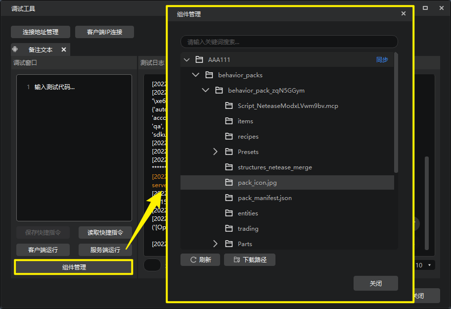 

We can select any component to expand their hierarchy and view the detailed internal file structure. Right-click the file/folder to perform the following operations: 
1. **Download**: Download the selected file/folder to the download path. The download path can be opened by clicking the [Download Path] button in the lower left corner of the window. 
2. **Upload File**: Only valid for subfolders of `behavior packs` or `resource packs`. Click to upload files to the folder in the test client. 
3. **Upload Folder**: Only valid for subfolders of `behavior packs` or `resource packs`. Click to upload another folder to the folder in the test client as its subfolder. 
4. **Delete**: Only valid for individual files or subfolders of `behavior packs` or `resource packs`. Click to delete the file/folder from the client.
5. **Rename**: Only valid for individual files or subfolders of `behavior packs` or `resource packs`. Click to rename the file/folder. 

### 2. Component synchronization 

If we want to synchronize the changes made on the computer to the test client as a whole, we can click the blue [Synchronize] button to the right of each component name. After clicking, we select the path of the component to be synchronized on the computer, and then select [Full Synchronization] or [Difference Synchronization] as needed. When the synchronization progress bar is finished, it means that the selected component has been synchronized to the client. 

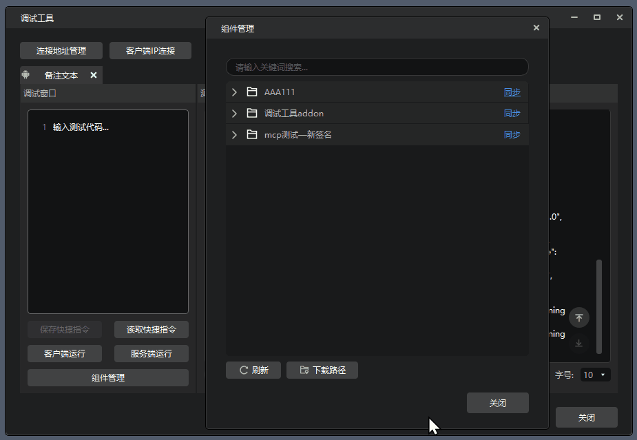 

> **The difference between full synchronization and differential synchronization:** 
> - The difference between full and differential synchronization is mainly in the way the files in the script directory (Script) are handled. 
> - **Full synchronization** Regardless of whether the script directory has changed, the script files will be repackaged and synchronized 
> - **Difference synchronization** will detect whether the script directory has changed and selectively package the script directory for synchronization.
> - The rest of the files in the non-script directory are synchronized only after they are changed. 

> **Notes on selecting the synchronization path:** 
> - It should be noted that you must click to select the path and then click OK, otherwise the folder may not be selected correctly, resulting in the problem of failure to synchronize. 
> 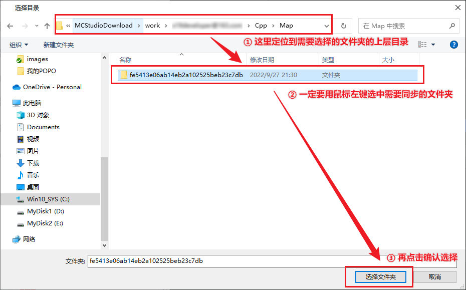 
> 
> - If the selected path is incorrect, for example: 
> ① The selected path is not a recognizable work path 
> ② The uuid of the manifest file in the component attempted to be synchronized on the computer and the component selected on the test client does not match 
> A pop-up window will pop up to prompt that the modification synchronization failed, and the developer needs to select the correct path before synchronization. 
> 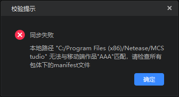 

### 3. Component synchronization example 

For example, our mobile test end originally has a pure blank map component. Now we open its PC project file, add a player preset to it, attach a blueprint part, and use the logic editor to edit its logic: send the message "AAA" every frame. 

We save the changes, and then directly use the component synchronization function to synchronize the changes on the PC side to the mobile test end. After the synchronization is completed, we can reopen the map component on the mobile test end and find that the message "AAA" is successfully sent every frame. 

 

## Client disconnection 

Client exit, network abnormality and other factors will cause the connection with the debugging tool to be disconnected. After disconnection: 
- The log window will retain the log records before the disconnection, and developers can still use search, filter and other functions, but the logs will not continue to print; 
- The debug window on the left will no longer be available, and the buttons below will all be grayed out; 
- There will be a [Connection failed] pop-up window prompt. 

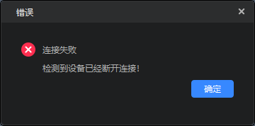


Restart the client, it will automatically connect to the debugging tool again, and record new logs in a separate page. 
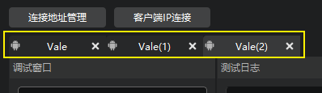 
