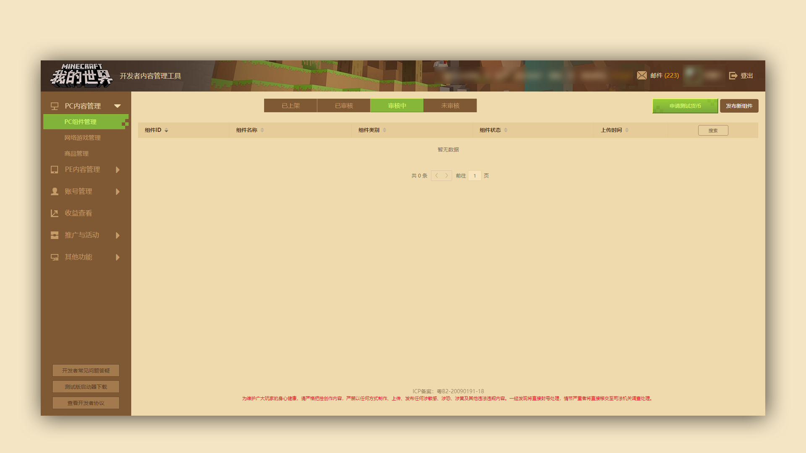
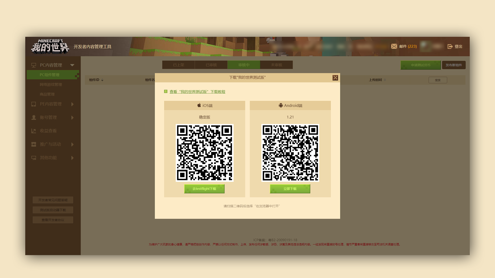

--- 
front: https://mc.res.netease.com/pc/zt/20201109161633/mc-dev/assets/img/jieshao_images002.88de5768.png 
hard: Getting Started 
time: 5 minutes 
selection: true 
--- 
# Brief introduction to PE test version launcher download 

*** 

### Stage goal: Understand and download PE test version launcher 

#### TAG: PE test version launcher 

#### Stage 1: Find the download location of [Test version launcher] 

#### Stage 2: Download and use the test version launcher 

In order to facilitate developers to test their own PE components, we have prepared a PE test version launcher for everyone to view the component performance in the test environment. 

At the bottom left of the developer platform, find the [Beta Launcher] download button. Click it and the download QR code and button of the PE beta launcher will pop up. Select different QR codes to download according to the situation of your phone. 

 

 

#### Specific test method (beta client needs to be successfully installed): 

1. Upload the component to be tested to the developer platform and submit it for review, so that the component is in the "under review" state 

2. Open the test client on your phone and log in to the game with the developer account 

3. Find the component to be reviewed, download and install it for testing 

Note: If the component is set to paid during the review, you can apply for diamonds to purchase it in the beta version. Currently, this function is limited to the Android PE version test launcher.