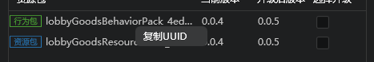
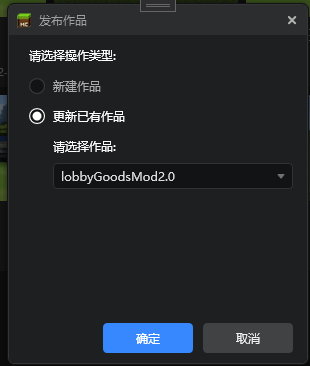
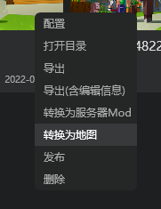

--- 
front: https://mc.res.netease.com/pc/zt/20201109161633/mc-dev/assets/img/jieshao_images002.88de5768.png 
hard: Getting Started 
time: 5 minutes 
--- 

# Component package release 

## Component configuration 

In the right-click menu of the component, select Configuration to modify the UUID and version number of the work 

 

Click Random UUID to automatically randomize the UUIDs of all resource packs and behavior packs 

Select the corresponding resource pack and right-click to copy its UUID 

 

During the development and testing phase, you don’t need to pay attention to the version number. When your component needs to be published to the platform, in order to allow the component to be updated smoothly after it goes online, you need to increase the component version number before each release. Here you can either upgrade individual resource packs individually or select all resource packs to upgrade. 

## Component Release 

When your component is ready, you can right-click the component and click to release it. 

When releasing, the platform will automatically select the component with the same name, and automatically check to update the existing work, so please try to keep the work consistent with the platform name. 

 

After clicking OK, we will self-check the work, then export the necessary files, compress them into the naming format of <name_time.zip>, upload them to the developer platform, and open the corresponding link in the browser. You can further edit the details of the editor component on this page, and finally click Save. 

## Component Conversion 

We also provide a conversion function between components. You can find it in the right-click menu to easily convert AddOn to a map or server Mod 

 

