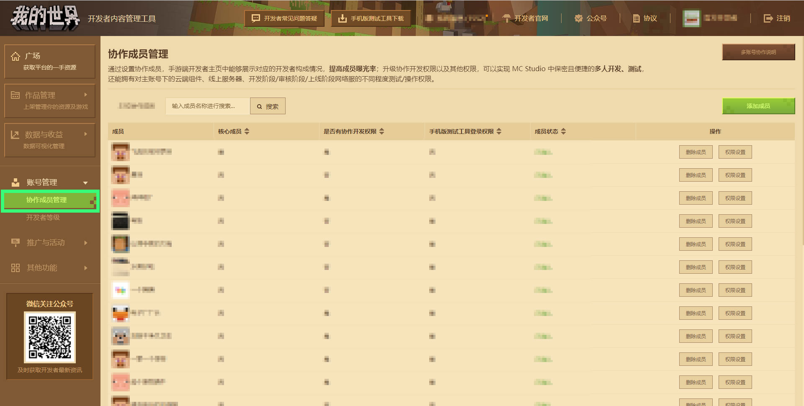
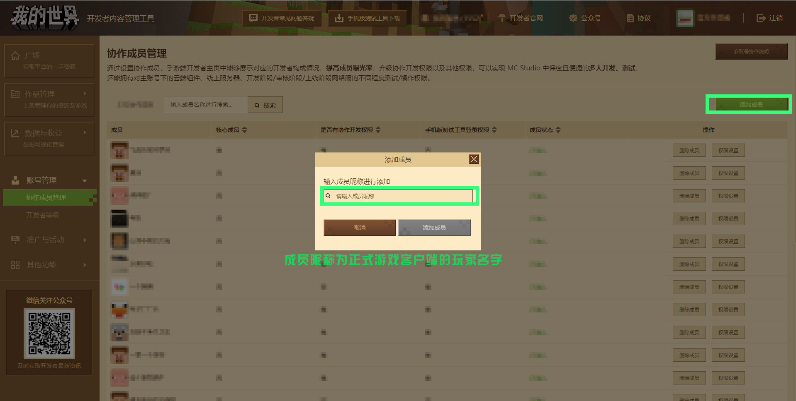
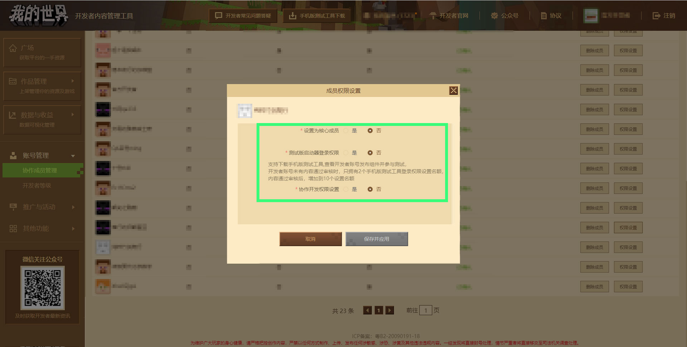
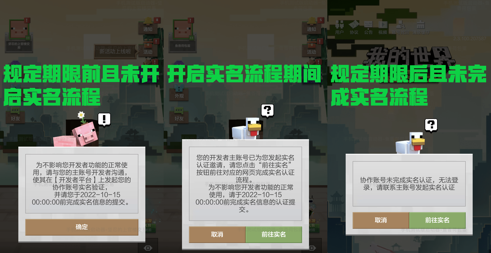
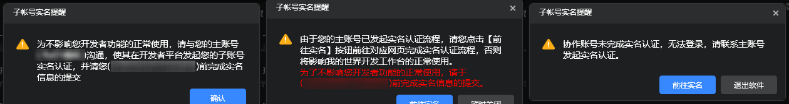
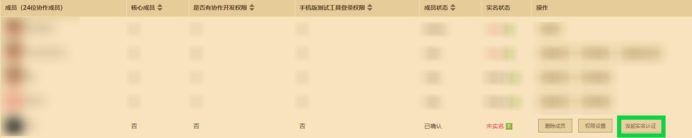

--- 
front: https://mc.163.com/dev/mcmanual/mc-dev/assets/img/15_1.12769c6b.jpg 
hard: Getting Started 
time: 5 minutes 
selection: true 
--- 
# Use the Collaboration Member Management Module to Implement Multi-Account Collaboration 

Click the **[Collaboration Member Management]** button under Account Management to jump to the Member Management page, where you can customize the developer's member information and bind your own game account. 

 

Click the **[Add Member]** button, enter the member nickname in the input box, and then click the button. This account will be added to the developer member. **Note: The developer member account cannot be a collaborative sub-account of other accounts. If there is a duplication, the platform will clean it up uniformly. Please understand. ** 

 

The developer account needs to initiate the real-name authentication process for the member account to ensure that the subsequent member account can use the collaboration function normally. For the real-name authentication process, please refer to [Developer Member Account Real-Name Authentication Process](#Developer Member Account Real-Name Authentication Process) and [Developer Member Account Real-Name Authentication FAQ](#Developer Member Account Real-Name Authentication FAQ). 

For members who have joined and registered their real names, you can delete them, set them as core members, and open the beta launcher login permission, collaborative development permission, or use the "Minecraft" development workbench for them: 

- Delete member: remove the member. 
- Set as core member: display as a core member on the developer homepage of the game. 
- Beta launcher login permission: set whether the member can use the mobile version test tool. After the developer has passed the review, up to 10 sub-accounts can be set to log in to the mobile version test launcher. For those who have never had approved content, only 2 places can be set. **Note: Developer master accounts that have not been authenticated cannot use the mobile version of the test launcher. ** 
- Collaborative development permission settings: You can log in to the Minecraft developer workbench to see the cloud components, network services, etc. of the master account, and you can also test online with the master account through the mobile test segment. If the developer has an online game work, you can also set additional functions for members, such as **[Allow configuration, deployment and hot update during the development phase]** and **[Allow console debugging during the launch phase]**. 
- Allow configuration, deployment and hot update during the development phase: Allow members to use the Minecraft Bedrock Edition online game launch tool to configure, deploy and hot update the master account's development server. For the configuration, deployment and hot update functions of the online game launch tool, [Detailed tutorials can be found here](../27-网络游戏/课2：Ａpollo基本知识/第4：执行.html#执行). 
- Allow console debugging during the launch phase: Allow members to use the Minecraft Bedrock Edition online game launch tool to perform console debugging on the master account's launch phase server. For the console debugging function of the online game service tool, [detailed tutorials can be found here](../27-Online Games/Course 5: Practical Knowledge/Section 12: Console Debugging.html). 

 

The member management module is not only used to manage the team, but also plays an important role in development: 

- Online testing: You can use the Minecraft Bedrock Edition mobile version development launcher to remotely connect your work in the external network domain, <a href="../../mconline/10-addon tutorial/Chapter 18: Package and export your work/Course 03. Test your work on mobile phones and computers.html#Use developer sub-accounts to connect on the mobile test terminal" rel="noopenner">Detailed tutorials can be viewed</a>; 
- Multi-account collaboration: Multi-account collaboration can be achieved in the online game service opening tool, [Detailed tutorials can be viewed here](../27-Online Games/Course 1: Becoming an Apollo server owner and related preparations/Section 7: McStudio multi-account collaboration.md); 

## Multi-account collaboration instructions 

### Developer members can be added, and the collaboration account meets the conditions for adding developer member accounts: 

- Only developers who have published content works on the "Minecraft" developer platform can add developer members. 
- Developer member accounts can only be NetEase 163 email accounts. Third-party accounts or mobile phone accounts logged in via SMS verification codes do not meet the requirements. 
- Developer member accounts cannot be developer accounts or UP master accounts, or apply to become developers or UP master accounts. 
- Developer member accounts cannot be collaborative sub-accounts of other accounts (unless the original collaborative account relationship is cancelled). 
- Developer member accounts have logged in at least once on the mobile version of Minecraft. 

### Developer member account real-name authentication process

Three new real-name statuses have been added to member accounts: **[Unverified]**, **[Waiting for real-name verification]**, and **[Verified]**. 

 

 

Please check the **Prescribed period reminder** next to the real-name status, and initiate real-name authentication for existing member accounts before the **prescribed time**, and notify the account owner to verify the real-name in the Minecraft development workbench or mobile version test tool as soon as possible to ensure the normal use of the collaboration function in the future. At this time, the collaboration function and tools can be used normally. 

**Existing** member accounts or **newly joined** member accounts that are still unverified after the **prescribed time** will be blocked every time they log in to the Minecraft development workbench and mobile version test tool. 

 

Click the **[Collaborative Member Management]** button under Account Management to jump to the Member Management page. Click **[Initiate Real-Name Authentication]** on the right side of a single member account to trigger the member account real-name authentication process. 

 

After **[Initiate Real-Name Authentication]**, the real-name status will change to **[Waiting for Real-Name Authentication]**. Please remind the member account to authenticate in the Minecraft development workbench or mobile version test tool as soon as possible. You can also guide the other party to go to the [Minecraft Developer Platform Online Authentication Website](https://mcdev.webapp.163.com/#/subAccountAuth) for real-name authentication. 

After successful authentication, the member account's real-name status will change to **[Already verified]** . 

## Developer member account real-name authentication FAQ 

### What situations will cause member account real-name authentication to fail? 

Answer: The personal real-name information used when verifying a member account cannot be consistent with the developer account real-name information. The personal real-name information registered for a member account must be unique and cannot be the same as the member account real-name information under its developer master account or other developer accounts, otherwise the authentication will not pass. 

### What is the member account real-name authentication period and what impact does it have on my members? 

Answer: After the member account real-name authentication process goes online, developer member accounts that have not been verified before the **prescribed time** can continue to use the collaboration function normally. However, **existing** member accounts or **newly joined** member accounts that have not been verified after the **prescribed time** will be blocked every time they log in to the Minecraft development workbench and mobile version testing tools. Developers need to initiate member account real-name authentication requests as soon as possible, and assist others to authenticate in the Minecraft development workbench or mobile version test tool as soon as possible. 

### Since my member account is a channel service, how can I authenticate the member account? 

Since the permissions of the channel service account are different from the sub-account permissions in the Android test package and the development workbench, the channel service account does not need to be authenticated for the time being, and it will not affect its function usage. Developers who have submitted member account authentication do not need to process it.