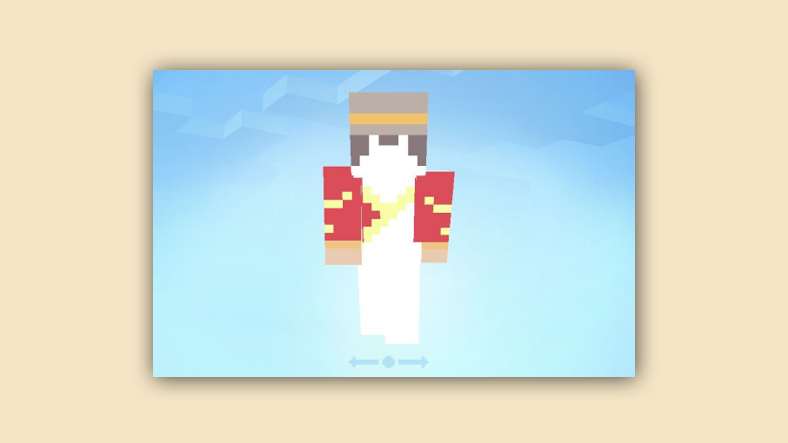
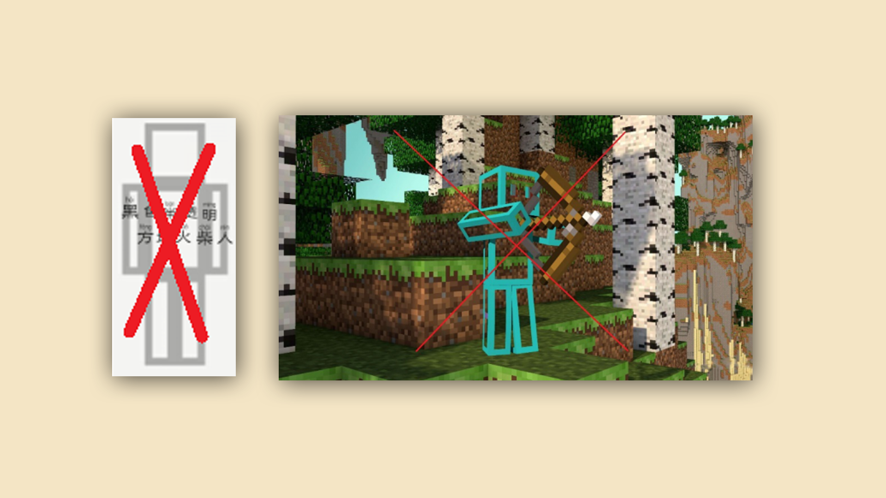
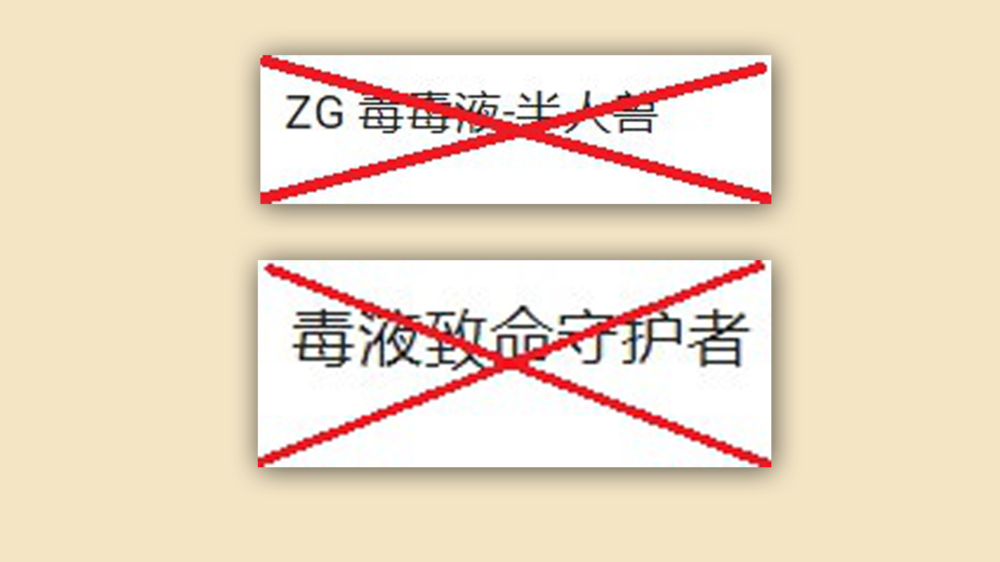
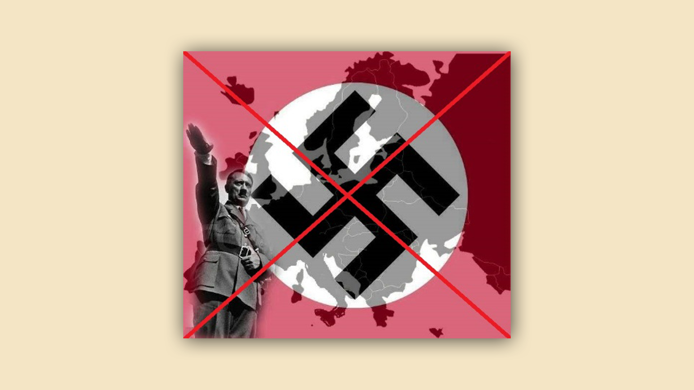
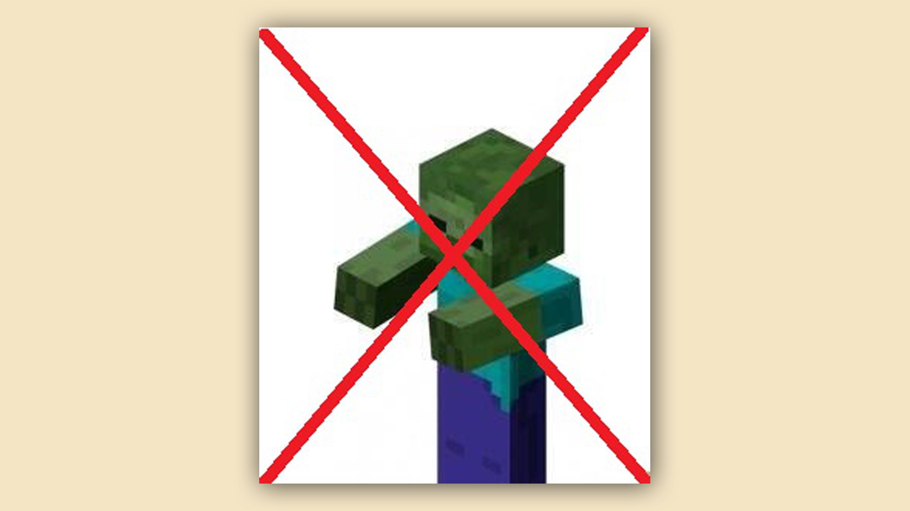
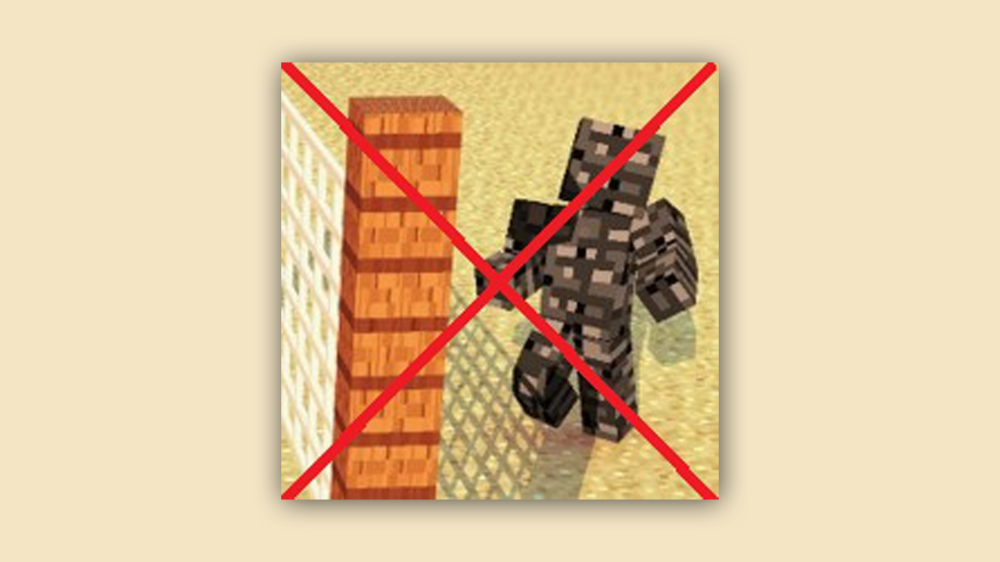
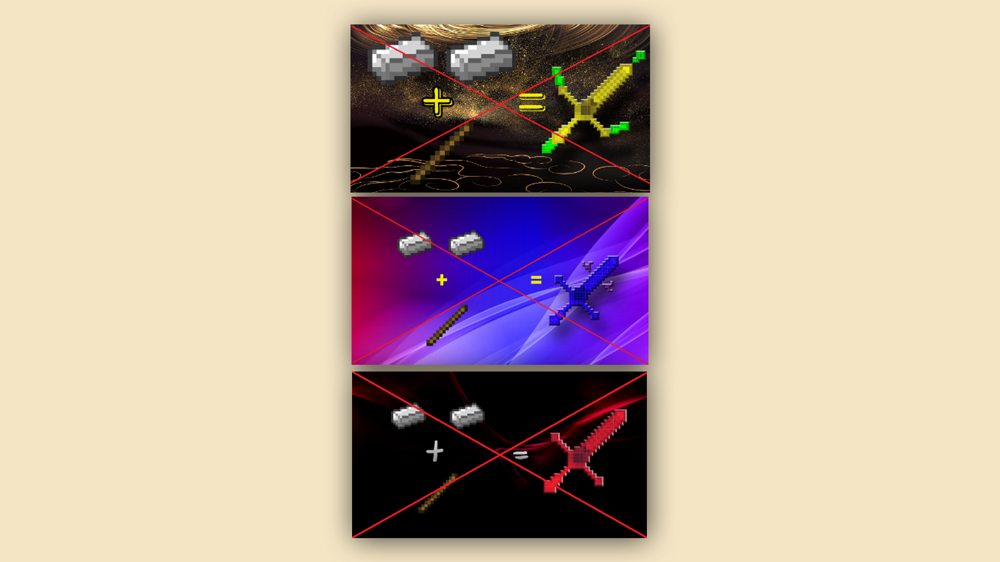

--- 
front: https://mc.res.netease.com/pc/zt/20201109161633/mc-dev/assets/img/0_5_2.497c0e90.png 
hard: Getting Started 
time: 10 minutes 
selection: true 
--- 

# Specifications for component listing and review strategy 

### Stage goal: Understand the red line behaviors that should be avoided when listing 

#### TAG: Review, Listing Specifications, Strategy 

#### Stage structure: 

#### Stage 1: Preliminary understanding of the review strategy 

#### Stage 2: Download and read the attached "My World" component review and modification suggestions

Attachment download link: [http://mc.netease.com/thread-417091-1-2.html](http://mc.netease.com/thread-417091-1-2.html) 

Hello, developers~ When you upload your daily components for review, do you often receive ruthless rejections from reviewers? We have contacted our auditors to recommend some quick modification strategies after the component is rejected, to help you install the component into the game as soon as possible~ 

When the component is rejected, there will generally be the following feedback, and the auditor will answer them one by one: 

#### Operation failed, unable to download (loading component has no effect): 

When the rejection prompt is operation failed and cannot be downloaded, it means that there is a problem with the component file package (for example: the file name uses Chinese, etc.) 

Check the component package, if there is a Chinese file name, change it to a non-Chinese file name, and check whether the file name has brackets, the file is not layered or there is an extra folder outside the resource package/behavior package, and there are redundant layers. These situations may cause the download to fail and the loading component to have no effect. 

#### Firearms: 

The cover and introduction of the component must not contain real firearm textures and names. If there are, please modify them. 

For details, please refer to: [http://mc.netease.com/thread-532700-1-1.html](http://mc.netease.com/thread-532700-1-1.html) 

#### Missing skin texture (no browse image for skin): 

The skin texture is missing. There is no browse image for the skin on the component introduction page. This may be caused by incorrect skin format. Please check the format of the uploaded skin. The missing texture is the situation of the following picture. It is also highly recommended to check whether the skin can be displayed and used normally through the test terminal when uploading the skin. 

 

#### Inducing consumption: 

The introduction contains 5 chicken legs for downloading this component. Lucky players will be randomly selected to give cash red envelopes. Diamond rewards are for inducing consumption. Delete the relevant text. 

#### No QR code information, no external links or third-party platform promotion: 

In the component introduction, in the game, the author information must not contain QR codes, external URL links, and third-party platform promotional text (such as xx live search room number: xxxxx or xx platform search xx to learn more about the game) 

#### Components affect game balance: 

After loading, you can get functions such as mine penetration and permanent night vision in the server, as well as too many transparent parts of the skin (as shown in the picture). All of them are components that affect the balance of the game. 

 

Please delete the corresponding functions that affect the balance of the game, and reduce the transparent part of the skin. 

#### Copyright issues: 

Copyright issues, in addition to the copyright issues involved in the copying of components, there are also quotations of other unauthorized creations (for example: Naruto, Pokemon, etc. cannot be used without authorization. For example, the names of the type shown in the figure below cannot be used directly without authorization.) 

 

When copying components, you need to show proof of authorization. If you quote other unauthorized creations without proof of authorization, you need to modify the name, introduction, and content involving copyright. 

#### Sensitive characters/sensitive content: 

Components contain content that is inconsistent with modern social values and involves politics, etc. The characters are all illegal content. (Examples are shown in the figure below) 

If the component does not conform to the values of modern society, or involves political content, or character design, just delete the offending content. 

#### The component uses too many original textures and is too simple: 

 

Directly uses the zombie texture 

 

Directly uses the bedrock texture 

Although these skins need to be cut and synthesized many times, they are rejected because they use too many original texture materials and lack originality. In this case, more original details can be added to the original, such as giving the zombie a nice outfit. 

#### There are already many components of the same type, but they are not functional enough: 

For example, if you just modify the material of a sword or a trident, you can get some attribute bonuses after equipping it. Because there are too many components of this type at present, they will be rejected because of insufficient functionality. (Example as shown below) 

 

Components similar to this situation are rejected and cannot pass the review. You can add more material items, more functional effects or better-looking appearance design. 

#### There are already multiple skins of the same type (just changed the color): 

This type of rejected skins are too many or there are skins of the same type but with different colors. You can add some distinctive accessories, decorations, and creative details on the skin on the original basis. 

#### For more information, please see the attached "Minecraft" component review modification suggestions