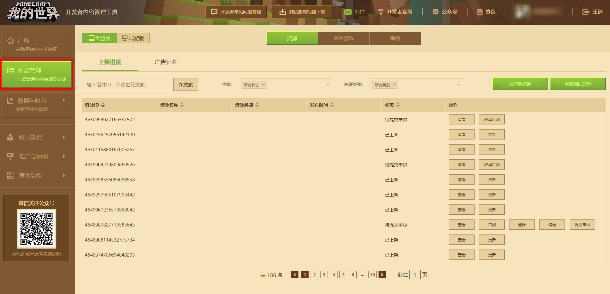
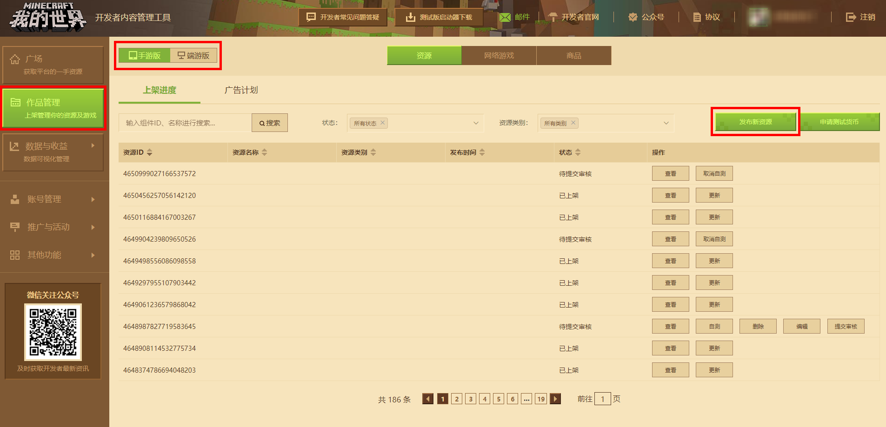
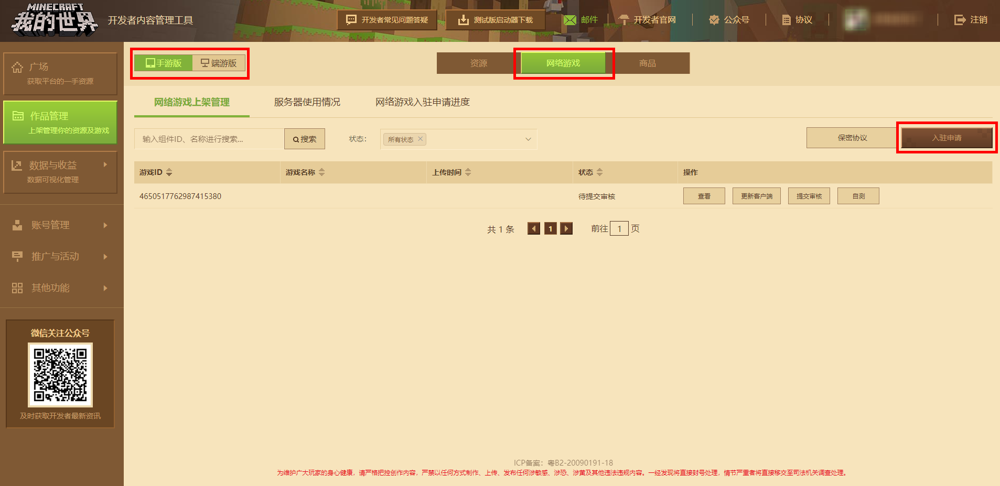
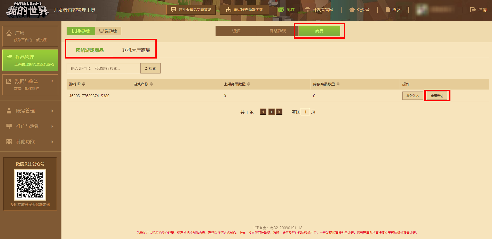
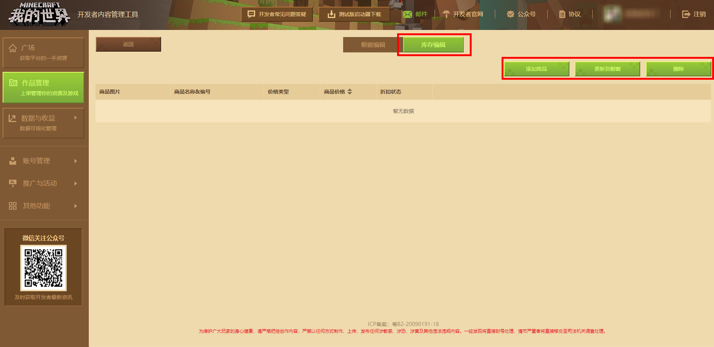
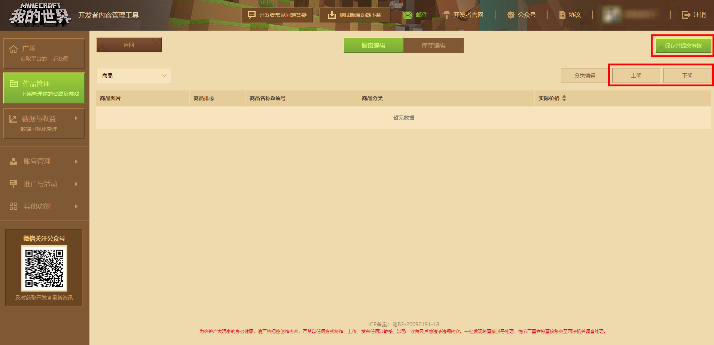
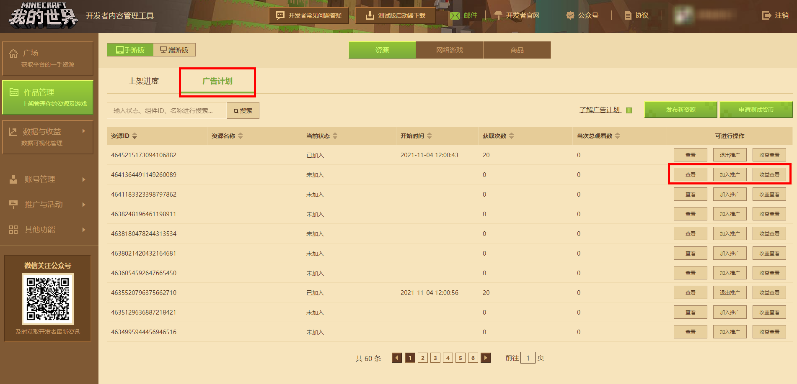
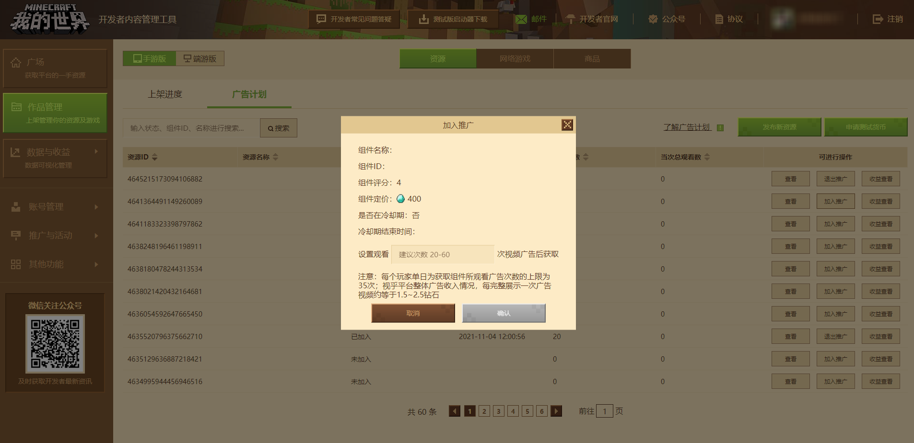

--- 
front: https://mc.163.com/dev/mcmanual/mc-dev/assets/img/4_1.770ded70.png 
hard: Getting Started 
time: 10 minutes 
--- 
# Works Management Module 
After developers log in to the [Developer Platform](https://mcdev.webapp.163.com/#/login), if they need to upload, they need to do so in [Works Management] on the left side of the platform. 

 

Currently, the submission platform is divided into mobile game version and PC game version platform; among them, the PC game version is further divided into C++ (Bedrock) version and JAVA version. There are also two types of works that can be published: resources and online games. 

- Resources: gameplay maps, add-on packs, modules, etc. that can be downloaded and played by players at will 
- Online games: servers, where all players can join and play together 

## Upload resource works 

Click the **[Publish new resources]** button on the work management page to jump to the resource publishing page. It should be noted that the location of publishing resources on different submission platforms is different. You can switch the platform to the mobile version or the PC version in the upper left corner of the page. 

 

- The types of resources that can be published on the mobile version include: gameplay maps, add-on packs, resource packs, skins, and online halls 
- The types of resources that can be published on the PC version include: functional components, map components, image components, gameplay components (only JAVA version), online halls, and visual components 

The types of names of the mobile and PC versions are slightly different, but their contents are similar. For example, the map components of the PC version are consistent with the maps of the mobile version, and the image components are consistent with the skins. 

## Upload online games 

Change to online games at the top of the work management page, and you can apply for and upload online games. Like resource works, online games are also divided into mobile game versions and PC game versions, which need to be distinguished. Click the [Apply for Settlement] button to apply for uploading online games. 

 

There is also **Product** behind resources and online games. Online lobby-type works in online games and resources can use this function to set up products in the game for players to purchase. 

 

Select a work and click the **[View Details]** button to open the product editing page of the work. In the inventory editing, you can add, delete products, or update them to the showcase. After adding new products and reviewing them successfully, they can be updated to the showcase and put on the shelves in the game for players to purchase. 

 

## Advertising Plan 

The advertising plan is aimed at collecting paid components. After developers participate in the plan and set the number of views, adventurers can download the participating components for free by watching the specified number of ads. At the same time, developers will obtain economic benefits through the number of ad views. This function is for a list of paid components that have been on the shelves for more than 180 days and have a score of 4 or above. On the "Advertising Plan" page, the list of eligible components under the developer account will be automatically obtained, and the participating components can be directly selected from the list. The settings can be completed in a few simple steps. 

 

Enter the Minecraft Developer Platform and enter the "Advertising Plan" page through [Work Management]-[Advertising Plan]. 

 

Next, just click [Join Promotion] on the right side of the resource displayed after the page is filtered, enter the number of ad views required to redeem the component through [Set View Limit] and click [Confirm], and the components participating in the plan will be displayed in the "Paid Content Watch Ads Free Redemption Zone". 

 

The official will summarize all advertising revenues on the entire platform based on a certain period, calculate the revenue value of a single advertisement, and calculate the corresponding share based on the total number of times players watch the developer's component ads and give it to the developer. In addition, developers can also click [View Revenue] on the right side of the resource displayed after the page is filtered on the "Ad Plan" page to understand the advertising revenue of the component. 

### Notes on the advertising plan: 

1. Developers can apply to add components that have been on the shelves for more than 180 days and have a rating of 4 points or more to the advertising plan; 
2. Developers can set the number of times the corresponding component needs to be watched to obtain the component; 
3. The official counts the total number of times players watched the developer's component ads last month every month, and counts and confirms the advertising display revenue last month, so developers can settle advertising revenue two months after the actual advertising display month; 
4. During the trial operation phase, each developer can only select 1 component to participate in the advertising plan at the same time; 
5. During the trial operation phase, the validity period for a single component to participate in the advertising plan is 1 month (30 days), and the component will automatically exit the advertising plan after the expiration; 
6. After a single component exits the advertising plan during the trial operation phase, there is a 30-day cooling-off period and it cannot be added to the advertising plan again; 
7. The number of component views does not support online modification; 

