--- 
front: https://mc.163.com/dev/mcmanual/mc-dev/assets/img/5_7.2ff8469c.png 
hard: Getting Started 
time: 10 minutes 
selection: true 
--- 
# Correct ways to upload resources 

The first way: upload your work through the [web version developer platform](https://mcdev.webapp.163.com/); 

The second way: upload your work through the developer tool **My World Development Workbench**; 

Click [Work Management] on the left side of the developer page, and then click [Publish New Resources] in the upper right corner to enter the work upload page. When publishing, please pay attention to distinguish the publishing platform. 

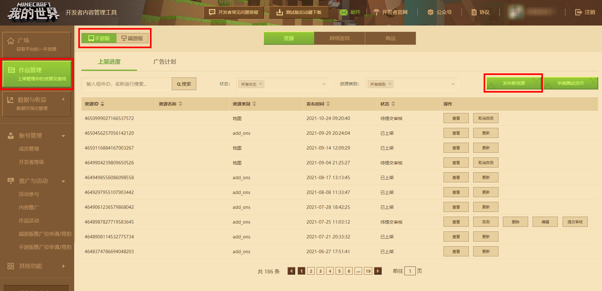 

When publishing works, you need to pay attention to some "rules": 

- **The resource name must be unique:** The name of the resource work cannot be repeated, so avoid names that are too popular; 

- **Ensure the source of the resource:** If it is a copy, you need to upload relevant evidence for judgment to avoid copyright disputes 

- **Resource prices are limited:** 

Game maps, skins, online halls: The limit is greater than or equal to 50 diamonds after normal discounts and member discounts 

Material packs, additional packs: The limit is greater than or equal to 100 diamonds after normal discounts and member discounts 

- **Special characters such as emoticons cannot appear:** The resource introduction page cannot contain "special characters/emoticons" etc. 

## Edit mobile game resources 

After entering the mobile game resource release page, fill in the component information according to the form requirements and your own settings. 

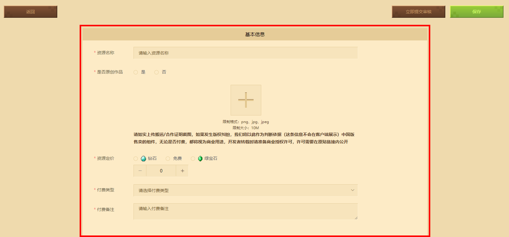 

Fill in the work name and price from top to bottom as required. Select the "Payment Type" according to the component resources actually uploaded. Fill in the "Payment Notes" according to your needs. If there is no payment, write "None". Select the "Resource Category" according to the "Payment Type". **If the payment type is diamond, the resource must upload a video. ** 

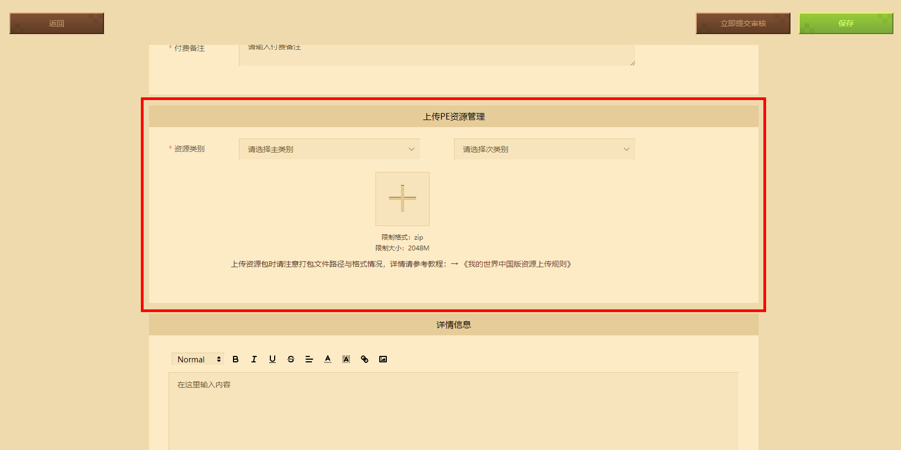 

After selecting the correct category, click the plus sign to upload the work file package. Note that the file name must be a zip compressed package that is "non-Chinese and cannot contain spaces and special characters", otherwise the upload will fail. If you still have questions about the work packaging format, please download the [Upload Rules] document to view the specific packaging file format. 

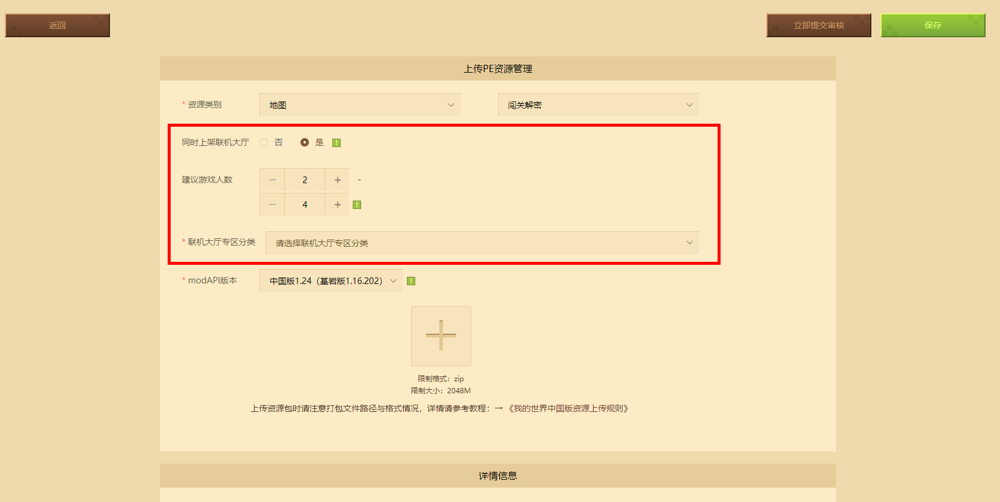 

If you want the map to be available in the online lobby, select "Yes" in "Also available in the online lobby", fill in the "Recommended number of players", and then select the corresponding category in the "Online lobby area category". If the gameplay does not support online, select No. 

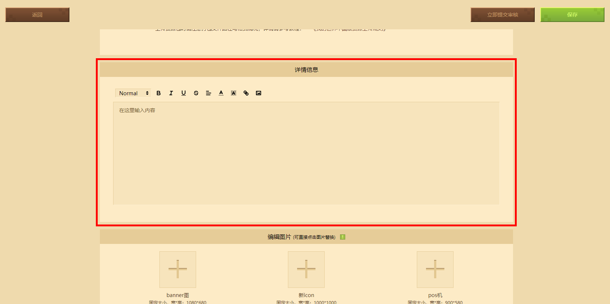 

In "Detailed information", fill in the relevant introduction of the component resources. Note that the introduction text should be within 1000 characters. If the introduction text is too long, it is recommended to upload it in the form of a picture introduction (no more than 10 pictures, and the recommended resolution does not exceed 1024 x 1024 pixels)

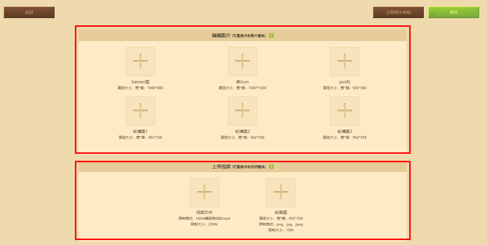 

Next, upload the images of the edited resource works in sequence according to the requirements. "New icon" refers to the cover of the work, "POS machine" refers to the image that pops up when purchasing "paid components", and "carousel image" refers to the promotional image displayed on the component resource details page, as shown in the figure below: 

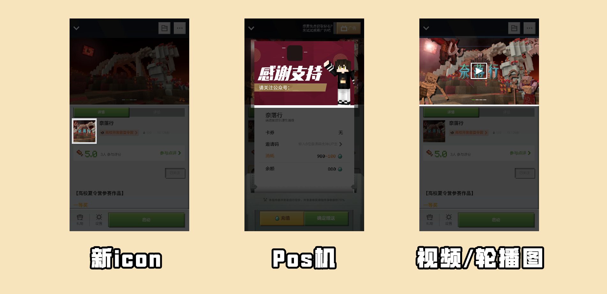 

Except for "skins", all paid content must upload a video introduction. The video content can include: component content introduction, gameplay introduction, special content, production process, etc. [The content of the video will affect the review process or results]. 

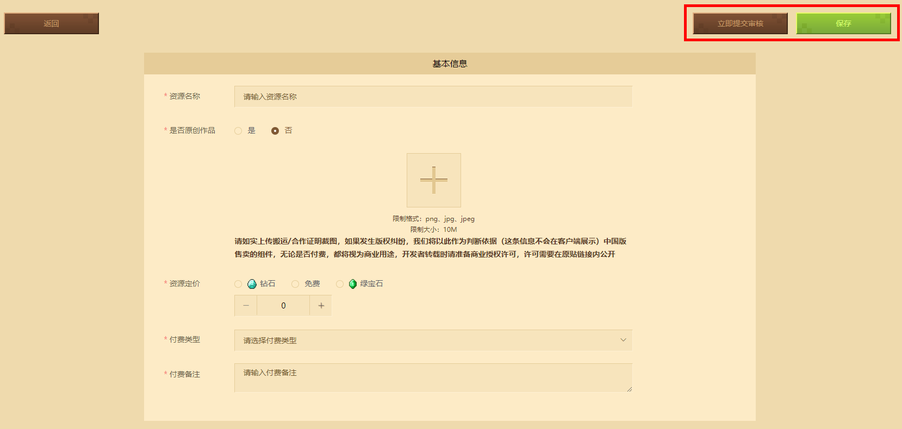 

After filling in all the information, find the "Save" button in the upper right corner and click it to save the component information, or directly click to submit for review immediately. 

## Edit the terminal game version resources 

After entering the terminal game resource release page, just fill in the component information according to the form requirements and your own settings, just like the mobile game. 

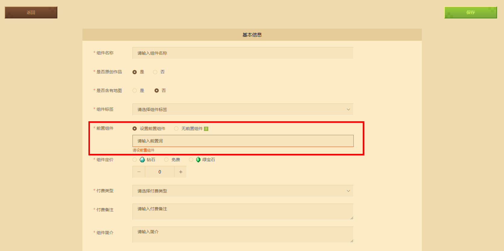 

The basic information is different from the mobile version. The PC version has a pre-component: if you need to set the "pre-component", the "pre-component" must be in the "listed" state to be set. Enter the name of the pre-component (case-sensitive) or the component ID to set it. 

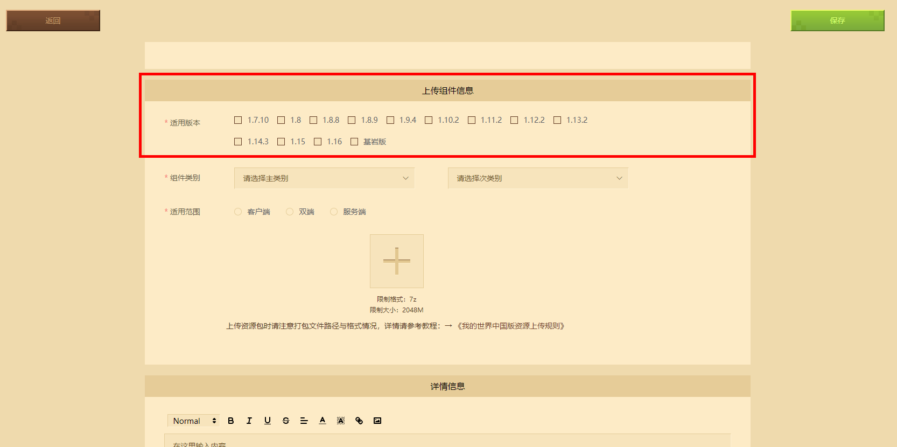 

The applicable versions in the uploaded component information of the PC version are divided into JAVA version and Bedrock version (C++). Select the corresponding version and check it. The "Online Lobby" category currently only supports Bedrock version maps. 

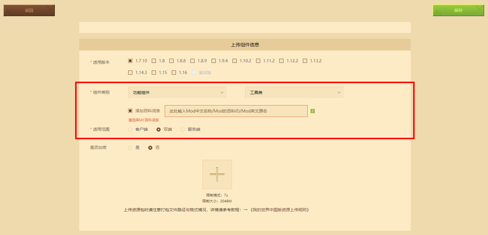 

The "Functional Component" currently supports adding MCMod Encyclopedia entries. The "Component Name" must be consistent with the Mod name included in the MCMod Encyclopedia website to be successfully added. The scope of application can be selected according to the terminals that the component can support. 

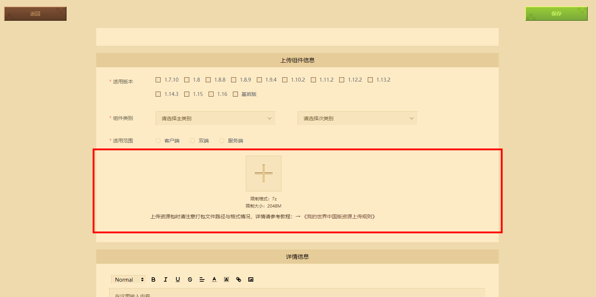 

Click the plus sign of the component work file package to upload. The file name must be "non-Chinese", otherwise the upload will fail. If you don't know the package format, please download the "Upload Rules" document to view it. Java version judgment: If the component version is >= 1.10.2, check Java8; if the component version is <1.10.2, check Java 7. 

"Detailed information" is the same as the mobile game version. 

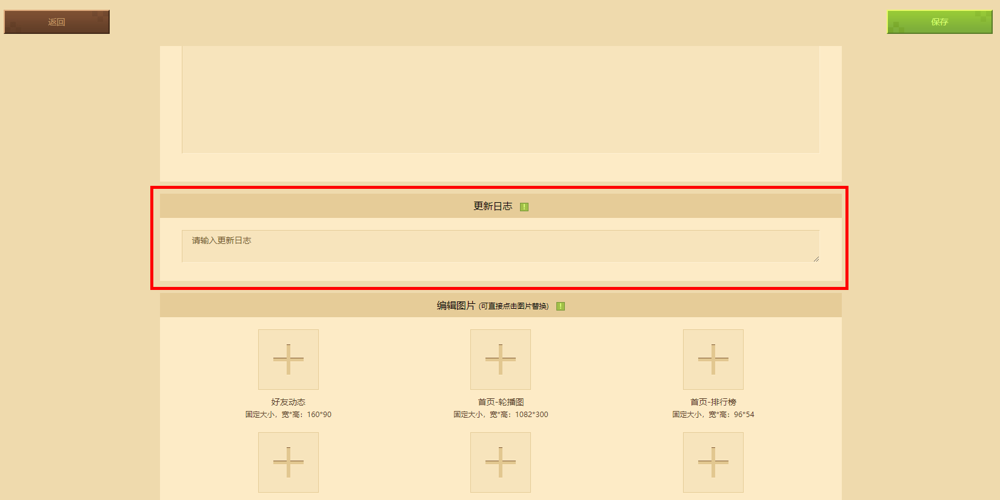 

If the component resource is updated, you can fill in the update content log. The length of the update log needs to be controlled within 1000 characters. The update log will not be displayed to the players. It is mainly used to record the update of the resource. 

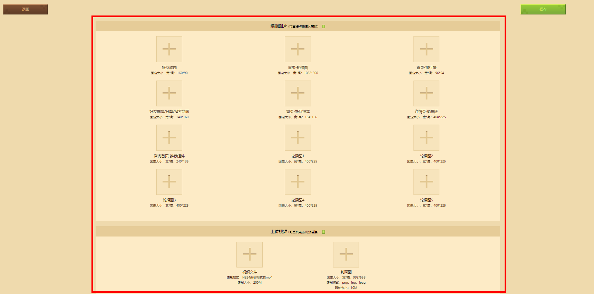 

The pictures and videos are the same as the mobile game version. Upload the pictures and videos of the edited resource works in sequence according to the requirements. 

## Resource review method 

After editing all the information of the resource work, save the resource. When it is ready to be reviewed, click the [Submit Review] button to start reviewing the work. There are two stages of review: 

- Machine review: mainly to ensure that the resources can be decompressed, run and played normally on the player client 

- Manual review: mainly to ensure that the resources will not damage the developer ecology, conform to positive energy, ideology and basic game quality 

The component review date is generally within 3 working days. If the listing or update time is urgent, you can **【Apply for expedited】**. 

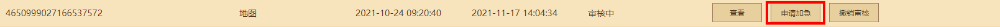 

After the review is successful, the player can list the work on the work management page. If the review fails, the developer can be notified through email and mobile phone text messages within the platform. 

