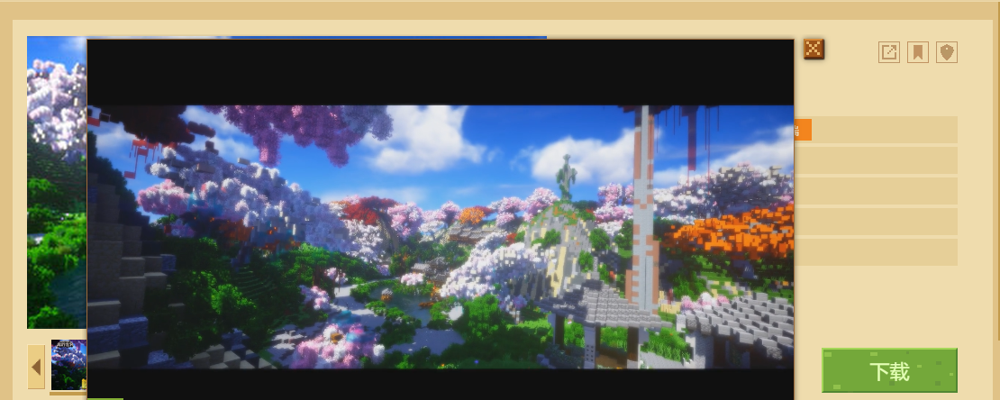

--- 
front: 
hard: Getting Started 
time: 20 minutes 
--- 
# Video format export and specification of works 

The Minecraft developer content management platform supports authors to upload video resources of their works. Just upload the correct resource format, and players can see it on the work resource page of **[Computer Version Component Center]** or **[Mobile Version Resource Center]**. 

**【Computer Version Component Center】** 

 

**【Mobile Version Resource Center】** 

 

Under normal circumstances, a small and sophisticated video can well summarize and highlight the characteristics of the work, making the gameplay content easy to understand. 

Due to the numerous video formats and complex specifications. Currently, the developer platform supports multimedia video formats, which need to be exported according to the following specifications: 

| Format type | Specification restrictions | 
| ------------ | ------------------ | 
| Video encoding format | H.264 encoded MP4 format | 
| Video display format | 1080P | 
| Audio encoding format | AAC encoding | 
| Video ratio limit | 16:9 aspect ratio | 
| Video duration limit | Within one and a half minutes | 
| Size limit | 50M | 

**Video duration usually affects the audience's expectations of the content. For longer videos, the audience may judge whether the content contains enough dry goods to decide whether to watch it in full; for shorter videos, the audience will generally watch it in full. ** 
**It is recommended that developers display the highlights in 10 seconds of a 20-second video. This can greatly improve the audience's viewing completeness of the video, and can also better deepen the audience's impression of the work, thereby increasing the sales of the work. ** 

At the same time, it is recommended to adopt the following video compression parameters to meet the video size requirements of the developer's content management platform: 

| Format type | Regulatory restrictions | 
| -------- | -------- | 
| Video bit rate | 3M | 
| Video frame number | 24 frames |

Developers can use third-party software to edit and export videos. 

## Still have unresolved issues? 

You can submit other feedback through the developer FAQ at the top of the [Developer Platform](https://mcdev.webapp.163.com/#/square), or click [this link](https://mcdev.webapp.163.com/#/feedbackModal). The official will contact you through the internal message of the developer platform. 

