--- 
front: https://mc.res.netease.com/pc/zt/20201109161633/mc-dev/assets/img/6_1.37231bf7.jpg 
hard: Getting Started 
time: 15 minutes 
--- 
# My World Chinese Edition Resource Upload Rules 
The Resource Upload Rules chapter contains two parts: [How to package resources] and [How to publish resources], which helps developers avoid the risk of platform machine review and rejection when uploading resources. 

### Package Packaging 

#### PE Resources 

#### Map: 

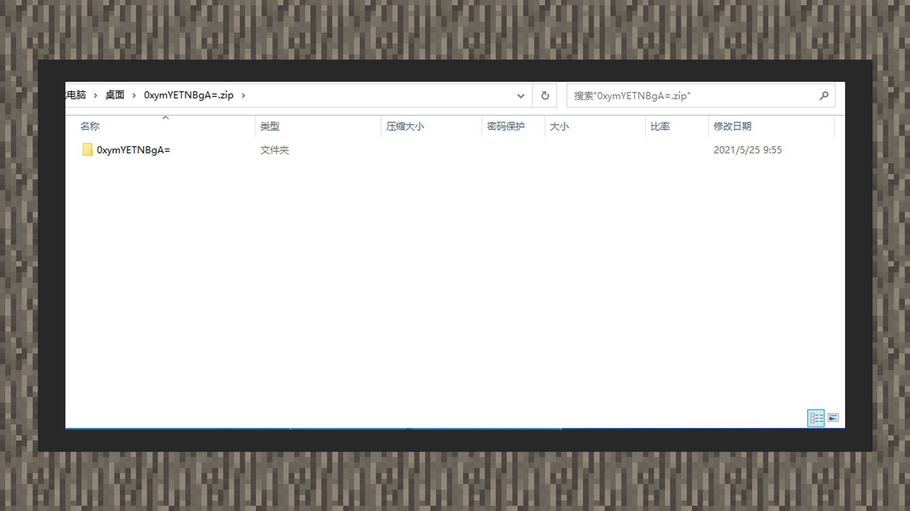 

[Manual Packaging]: When trying to package the map directly, please note that the package should have only one top-level folder directory. After right-clicking the map folder to compress it into a zip document, you can upload the package to the developer platform. 

#### Online map: 

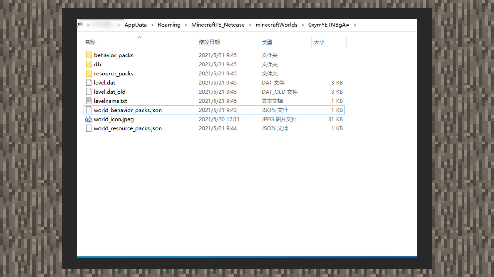 

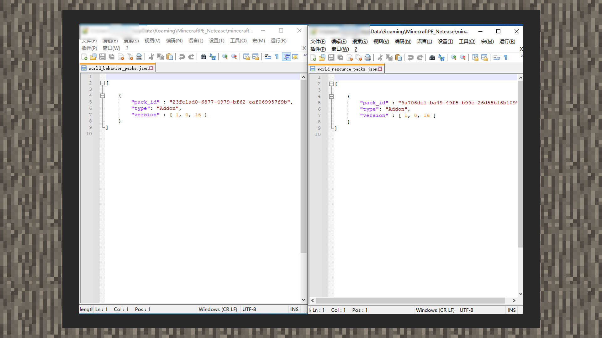 

[Manual Packaging]: When trying to manually pack online map components, if the online map carries Add-on, please make sure that the world_behavior_packs.json/world_resource_packs.json files exist. If the map is generated by MCSTUDIO, please delete the netease_ prefix from netease_world_behavior_packs.json and netease_world_resource_packs.json. At the same time, please fill in the corresponding uuid and version content in the header under manifest.json in the corresponding type, and add the "type":"Addon" field. Finally, after right-clicking the map folder to compress it into a zip document, you can upload the package to the developer platform. 

#### Add-on: 

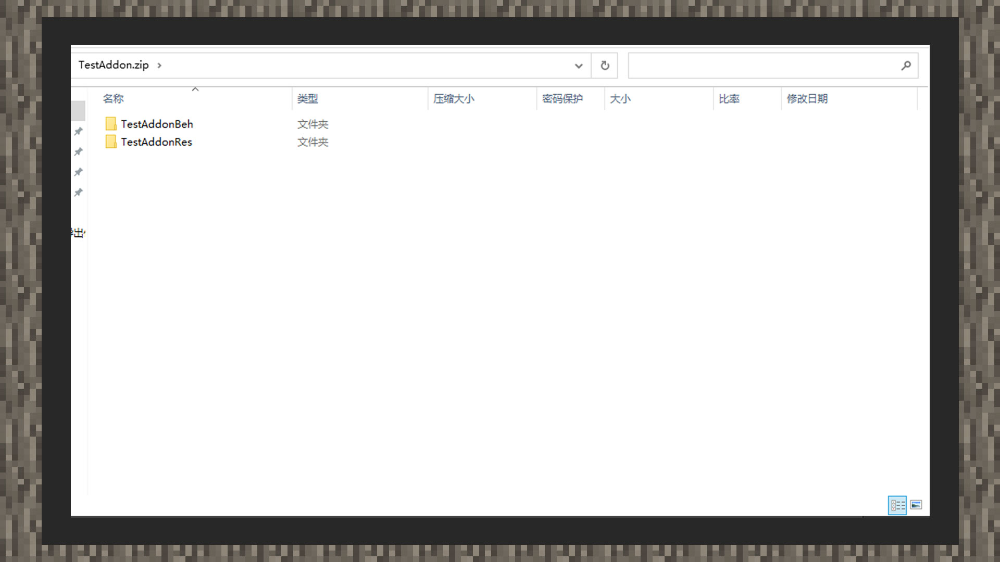 

[Manual packaging]: When trying to manually package the Add-on component, please directly select the material pack folder and behavior pack folder and right-click to compress them into a zip document, and then upload the package to the developer platform. 

#### Material lighting: 

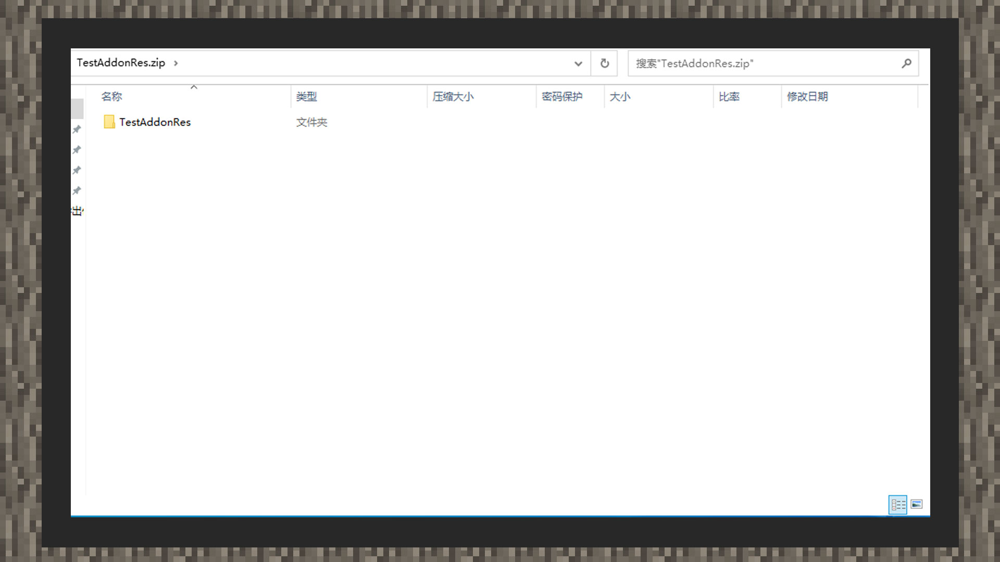 

[Manual packaging]: When trying to manually package the material lighting component directly, please nest the material folder into a new folder. Then right-click the new folder to compress it into a zip document, and then upload the package to the developer platform. 

#### [Note]: The Bedrock Edition material lighting component must ensure that the textures folder is included in the material package folder, otherwise the upload will fail. 

#### Skin: 

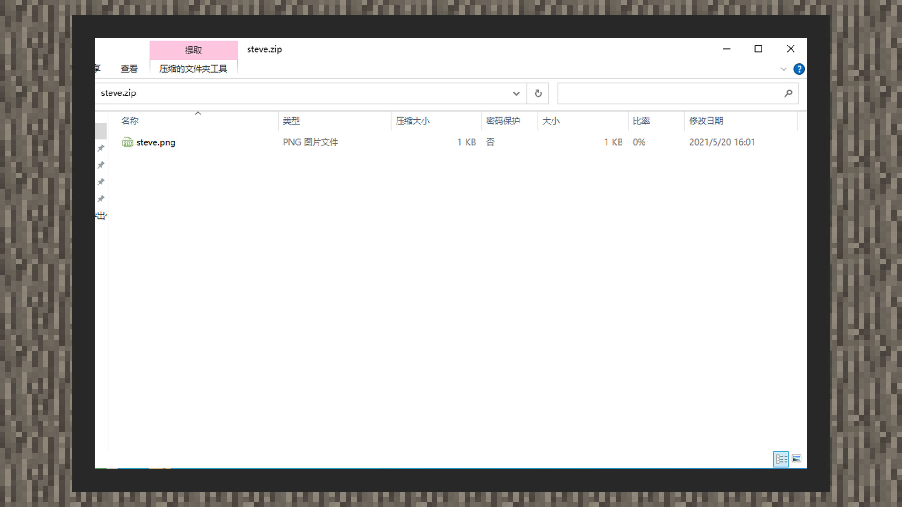 

[Manual packaging]: You can directly upload the png skin file with a transparent channel to the developer platform. 

#### PC resources 

#### [Note]: If there are version conditions for JAVA component resources, please remember to specify the game version on the developer platform. You can specify multiple versions at the same time, otherwise all versions are applied by default. 

#### Map/Gameplay: 

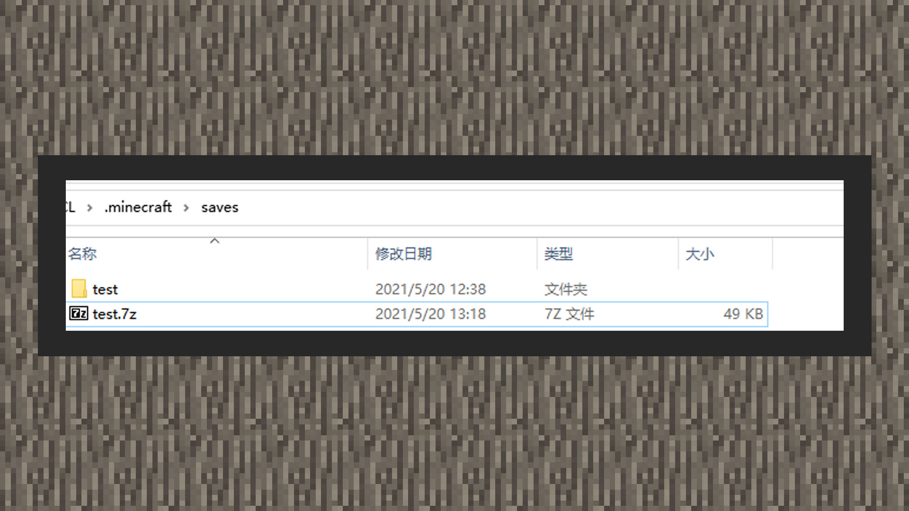 

[Manual Packaging]: When trying to pack the map directly, please right-click the map folder and compress it into a 7z document, then upload the package to the developer platform. 

#### MOD: 

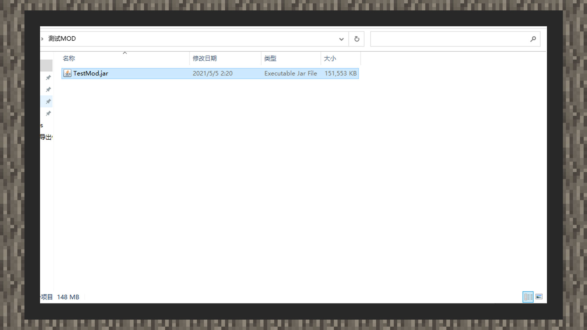 

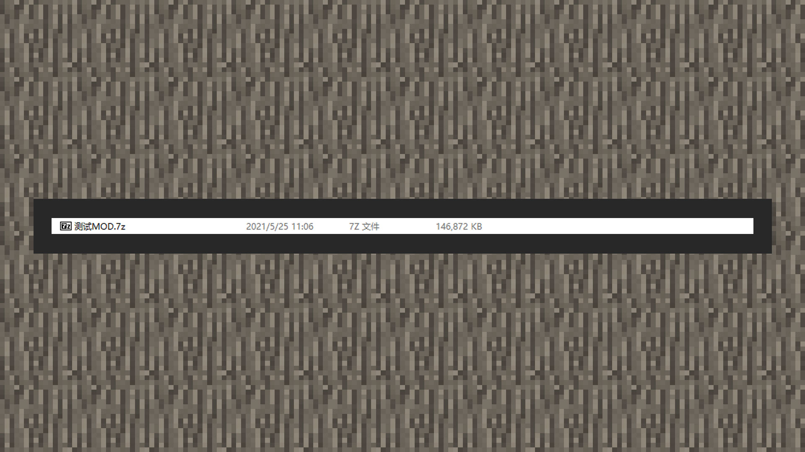 

[Manual Packaging]: When trying to manually pack MOD components, please nest the Mod Jar file into a new folder. Then right-click the new folder and compress it into a 7z document, then upload the package to the developer platform. 

#### Material: 

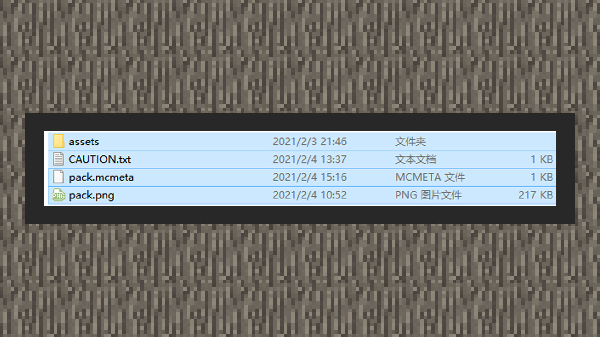 

[Manual Packaging]: Right-click and select all the contents to compress them into a zip document, then put the zip file into a folder, and finally package the folder in 7z format and upload it to the developer platform. 

#### Light and Shadow: 

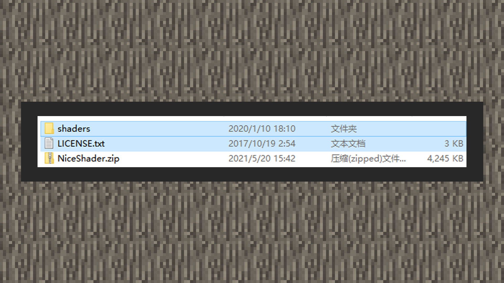 

[Manual Packaging]: Right-click and select all the contents to compress them into a zip document, then put the zip file into a folder, and finally package the folder in 7z format and upload it to the developer platform. 

#### Skin: 

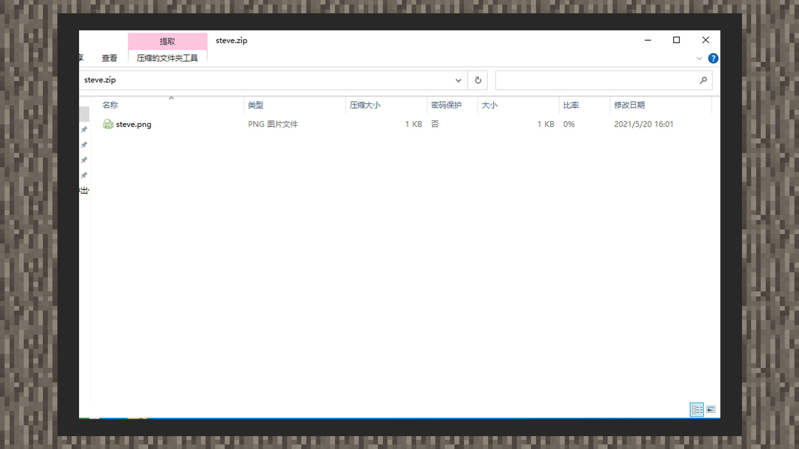 

[Manual Packaging]: You can directly upload the png skin file with a transparent channel to the developer platform. 

### Package Release 

#### Resource Distribution 

[Developer Platform]: You can click the + sign under the [Upload PE Resource Management] panel on the resource release page to upload the resource source document. The current platform will encrypt the PE resource source file by default, and the resource file downloaded from the MCSTUDIO cloud will also be encrypted. Therefore, please back up the resource source document properly. 

#### Upload Matters 

1) Please ensure the [Source of Works] of the component. If the component is not an original work, please upload a screenshot of the specific proof of transfer/cooperation. The official will use this as a basis for arbitration in the event of a copyright dispute. 

2) When using diamonds as the component pricing, you need to pay the same amount of [deposit] according to the unit price. When the deposit is accumulated to 1,000 yuan, you do not need to pay it again. 

3) When uploading PC resources, please pre-set the game version and JAVA version supported by the component resources. Generally, if no additional consideration is made, Java 8 can be selected as the JAVA version. The Bedrock Edition components are listed on the PC Resource Center and the 100.0 version and Java 8 are uniformly selected. 

4) When uploading PE resources, you need to confirm the MODAPI version of the component first. If the uploaded component does not use MODAPI, the latest version can be selected by default. MODAPI will be updated with each major game version update, and channel version users will have delayed updates. You can choose the previous version or choose the latest MODAPI while waiting for the official version to be released. 

5) After the component resources are uploaded, the Bedrock Edition can choose the mobile phone self-test component. You can enter the resource center by downloading the [Beta Version Launcher] to download and test. If you need to pay for the self-test product before testing, you can select the [Apply for Currency Test] button of the corresponding platform on the [Work Management] page to apply for diamond or emerald currency. 

### Error messages and solutions that may be encountered when uploading PE resources 

### UUID: 

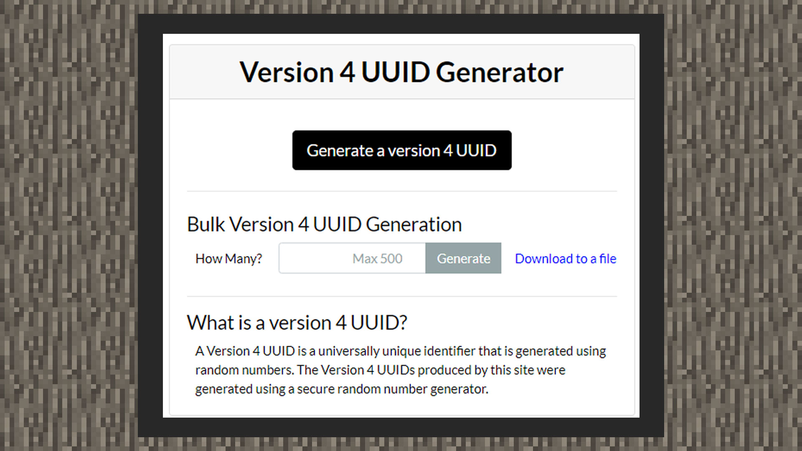 

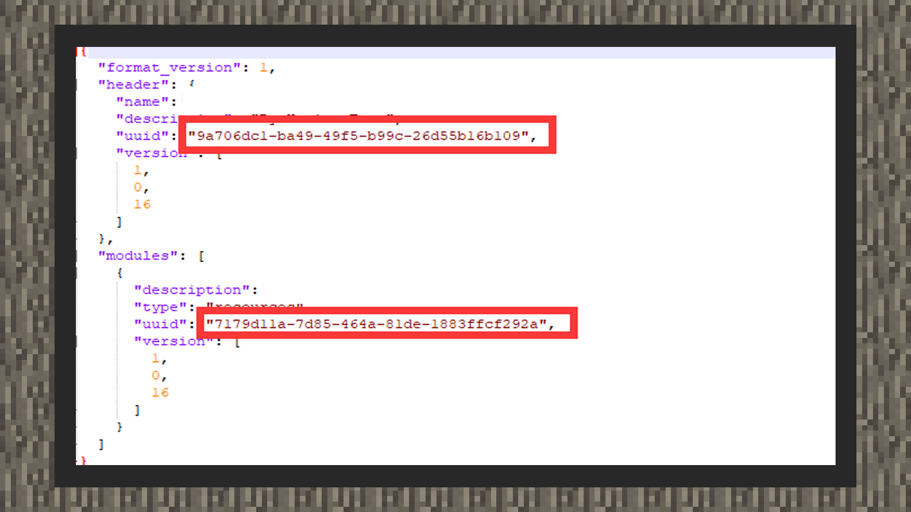 

1) If the error component is a PE component and is an Add-on, please open the manifest file in the behavior pack (behavior_packs) and resource pack (resource_packs) folders, use the online tool to regenerate the uuid and replace the uuid value in the json file; Generation tool: [https://www.uuidgenerator.net/](https://www.uuidgenerator.net/) 

2) If the error is a map, please directly clear the files in the behavior pack (behavior_packs) and resource pack (resource_packs) folders, and then clear all the codes in the netease_world_behavior_packs file and netease_world_resource_packs file, enter null and save.

