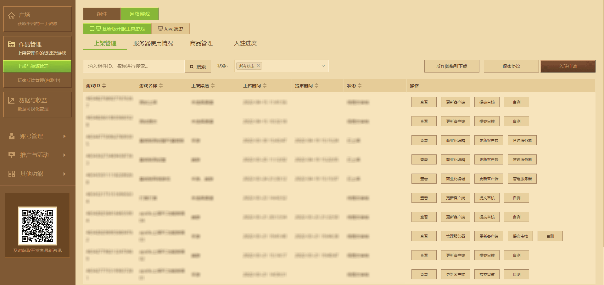
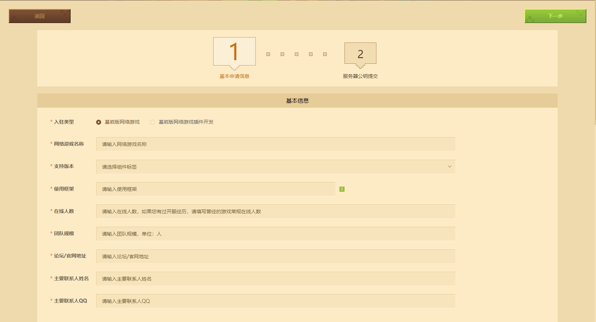
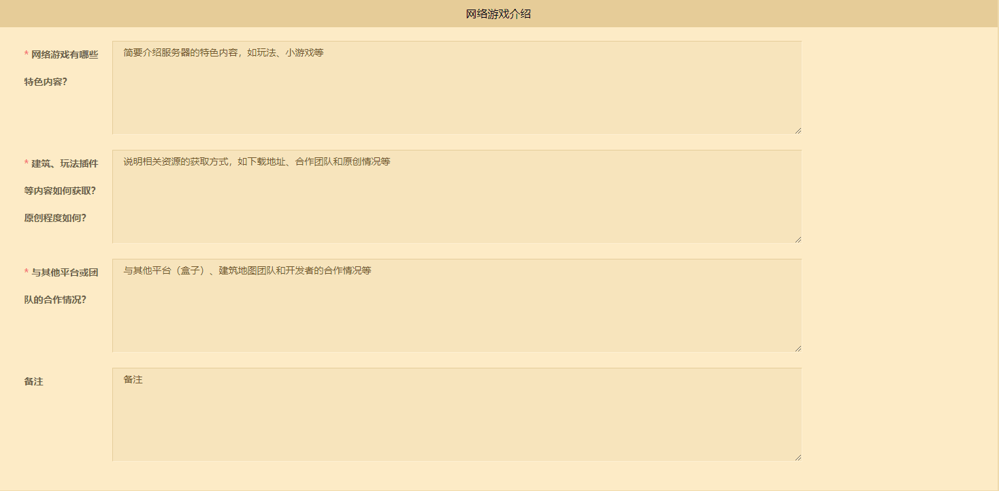
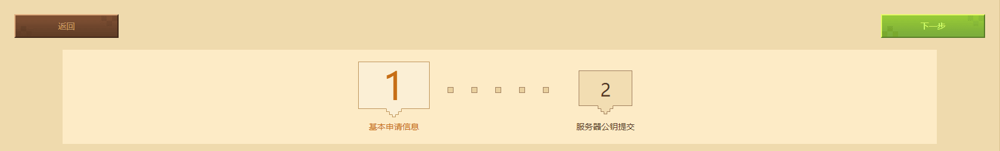
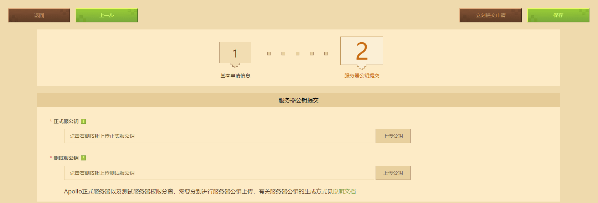
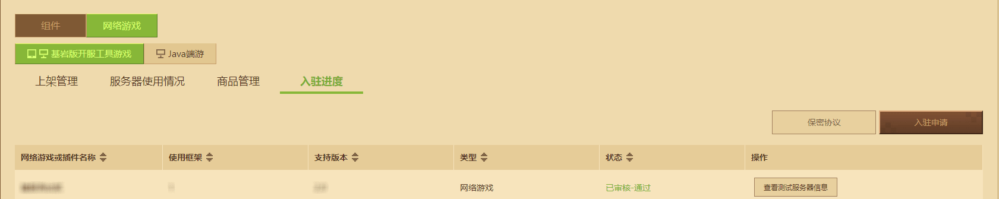

--- 
front: 
hard: Getting Started 
time: 15 minutes 
selection: true 
--- 

# Bedrock Edition Online Game Entry Guide 

The process of enrolling in Bedrock Edition Online Game depends on the developer platform. To enroll successfully, you first need to have a developer account. To know how to register a developer account, you can check [this link](../12-Getting Started Tutorial/10-Register as a Developer.html). 

In this guide, you will learn: 

- Find the entry application portal and submit valid application information. ✔ 
- Upload the machine login public key required for the development machine and the official machine. ✔ 

## Start Entry Application 

Log in to the [Developer Platform](https://mcdev.webapp.163.com/) with a developer account. Click **[Work Management]** - **[Listing and Resource Management]** on the left, and then select **[Online Games]** - **[Bedrock Edition Server Tool Game]**. Click **【Settlement Application】** again to open the application form. 

 

Before starting to fill in, please confirm that the settlement type is **【Bedrock Edition Online Game】** . 

 

Please fill in **Basic Information** truthfully and in detail: 

- **【Online Game Name】** The name will be displayed in the **Online Game Hall** , and it can still be changed multiple times after the settlement is passed. 
- **【Supported Versions】** All is selected by default. 
- **【Use Framework】** Currently, only **Online Game Service Tool** is supported by default, the underlying layer is C++, and the development language used is Python. 

- **[Online users]** You can fill in the actual number of regular online users in previous game launches. If you have no experience in launching a server, please fill in **[None]**. 
- **[Team size]** You can fill in the number of people who are currently willing to jointly develop online games, in **[People]**. 
- **[Forum/official website address]** You can fill in the self-built forum or official website address for the previous server launch experience, so that the reviewers can better understand the developer's past server launch capabilities. 
- **[Main contact name]** You need to enter the name of the main contact. 
- **[Main contact QQ]** You need to enter your personal contact information so that the official can get in touch with the developer after the successful entry in the future. 

 

After sorting out the **basic information** , please inform the official in detail about the planning and development plan for **【Bedrock Edition Online Game】** after entering the three server self-statement questions below **Online Game Introduction**. This type of entry statement will serve as an **important indicator** for the official to judge whether the entry application is approved. Please fill it out carefully: 

- **Feature Communication**: refers to explaining the main gameplay of the server and its unique selling points compared to similar servers in the description of the featured content. 

| Definition | Rating | 
| ------------------------------------------------------------ | ---- |

| Only a rough description of the gameplay categories is mentioned, and the impression of the specific gameplay is still vague. | 1 | 
| Common gameplay names are mentioned, and the gameplay rules and game content that can be associated are determined. | 2 | 
| Original gameplay is mentioned, but the impression is vague. | 3 | 
| The specific name of the original gameplay is mentioned, and the existence of micro-innovation can be perceived, or the uniqueness is mentioned. | 4 | 
| The existence of highly original gameplay can be perceived, and fully convincing selling point information is given. | 5 | 

- **Development ability**: The description of Python development ability is credible and related to server development, and there is strength to prove that you can realize building and gameplay plug-ins after obtaining the entry qualification and machine. 

| Definition | Rating | 
| ------------------------------------------------------------ | ---- | 
| Development ability is not mentioned, or the self-description is untenable. | 1 | 
| Mentioned credible development capabilities, but the connection with server development was weak, such as mentioning development capabilities at other application areas or unrelated to online game units. | 2 | 
| Mentioned relevant development capabilities for server construction, but lacked cases and was uncertain whether it was true. | 3 | 
| On the basis of 3 points, mentioned specific cases and could be related to the person, and verified the situation through external channels. | 4 | 
| On the basis of 4 points, mentioned more detailed information, such as system modules and implementation details, which can make people feel that they are familiar with development. | 5 | 

- **Server experience**: The developer has operated or developed other servers and has experience in cooperating with other creators on online game content. 

| Definition | Rating | 
| ------------------------------------------------------------ | ---- | 
| No experience, no mention, or the self-description is untenable. | 1 | 
| Has opened a multiplayer game service or large rental service for "Minecraft" with online nature. | 2 | 
| Mentioned that they had opened a public online game service for the Java version or the Bedrock version, or participated in the development of related content, but it was difficult to verify. | 3 | 
| On the basis of 3 points, there were verifiable details, such as the name of the online game and the online game release post. | 4 | 
| On the basis of 4 points, it was mentioned that the online game data was good, or that they were known to be the server owner of the "Minecraft" PC version game center, or had opened other online games settled in the "Minecraft" Bedrock version. | 5 | 

In addition to the above objective factors, if the developer has an **online work** produced and released using "Minecraft" under his name, which can reflect **higher quality** and has good player feedback, after verification, it has a **greater probability of success** when combined with the above three dimensions. 

## Upload public key 

After completing the information, click **[Next]** to enter the **[Server public key submission]** stage. 

 

**After entering the Bedrock Edition of Minecraft**, the official will issue a **small cloud server** for development and testing. 

**Official servers and test servers** use the Linux distribution Debian. Before connecting to the Debian system, developers need to generate an SSH key and provide the public key in the key pair. SSH keys use two keys in pairs. As long as the private key is properly stored and not leaked, it can effectively ensure the security of connection transmission data and operations. 

**Official servers and test servers** have separate permissions. To ensure the security of the developer's server, the official recommends generating two pairs of keys and keeping them properly. 

 

For tutorials on generating SSH keys and connecting to the Xiaoxiao Cloud server, you can refer to the <a href="../../mconline/30-网络服Plug-in Tutorial/1-Preparation Knowledge/4-小小云链接.html" rel="noopenner">网络服Plug-in Tutorial</a> on the developer's official website. 

Finally, click Submit Application Now to immediately review the application for settlement, or save it for future submission. 

 

After the review is passed, click on the right to view **【Test Server Message】** to view Xiaoxiaoyun's server IP, database and other information. 

 

If the review fails, you can re-edit **Basic Information** and **Online Game Introduction** and submit again. The official will also feedback the review reason through the developer platform email. 

## FAQ 

### Do you need to submit a deposit when submitting an application for Bedrock Edition online game settlement? 

Answer: Developers do not charge a deposit fee for settling in Bedrock Edition online games. 

### Do you need to bring your own machine when settling in Bedrock Edition online games? 

Answer: Developers do not need to bring their own test development servers. The official will provide **Xiaoxiaoyun development test machine** for online game developers who have passed settlement. 

### Do you need to bring your own machine when listing Bedrock Edition online games? 

Answer: No. After meeting the requirements of [First-instance Gameplay Test](./Course 12.2-Bedrock Edition Online Game Review and Listing Specifications.html#First-instance Test Operation), developers can apply for the official online game server for the official game launch. 

### How long will it take to get a response to the application for entry qualification? 

Answer: After the application for Bedrock Edition online server is submitted, the general review period is 15 working days. Regardless of whether the review is passed or not, the review result will be notified by email and SMS from the developer platform. 

### Is there an upper limit on the number of server quotas applied for? 

Answer: In principle, there is no upper limit on the number of games that can be applied for entry, but the entry review will decide whether to approve subsequent game applications based on the number and situation of your entry applications and the operating conditions of the online games that have passed the entry application. 

### How long will it take for the application that has passed the review to wait for the test server to be sent? 

Answer: The test server Xiaoxiaoyun has now been automatically issued. After the entry application is passed, the resource pool will automatically allocate the test server and send it to the developer's online game entry progress.
