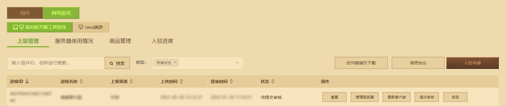
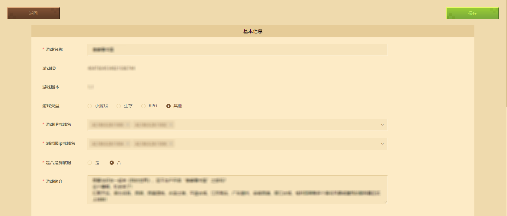
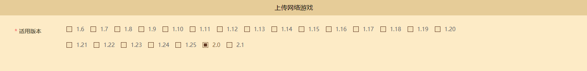
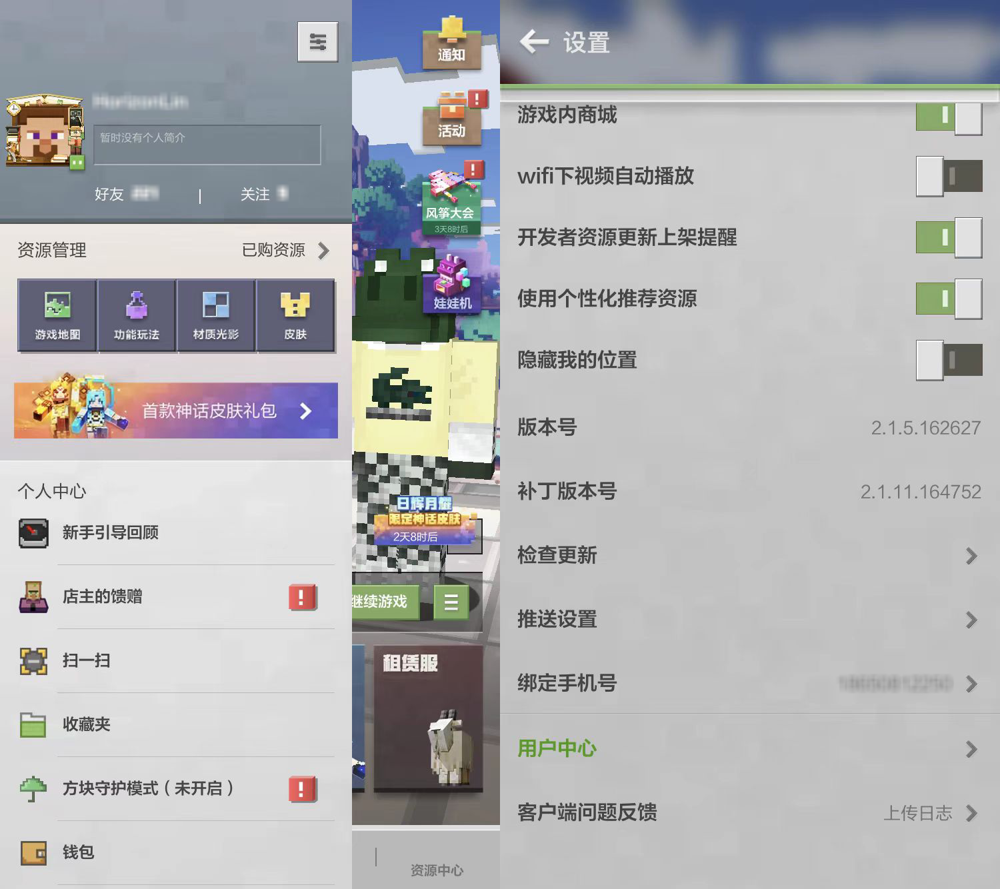
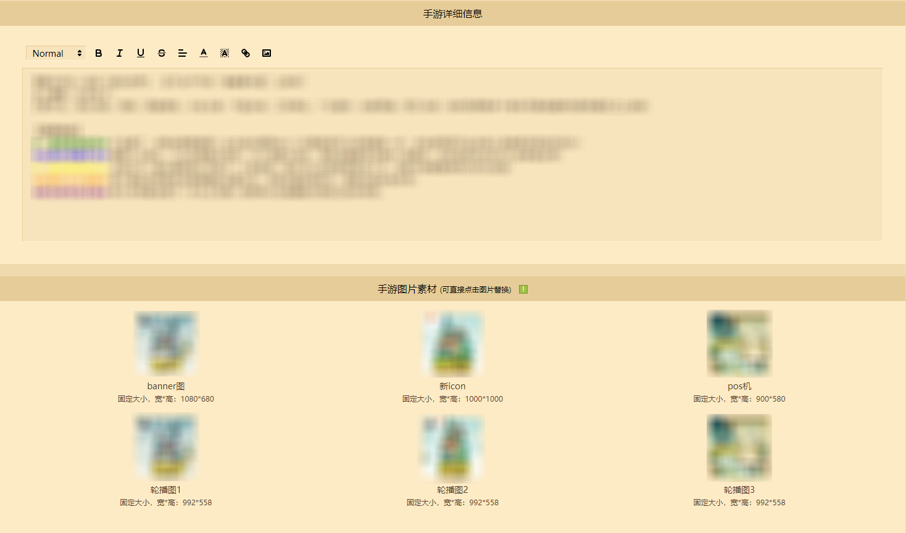
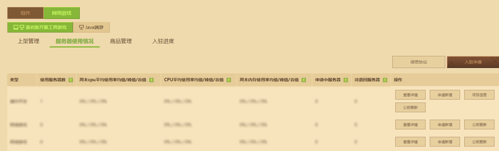
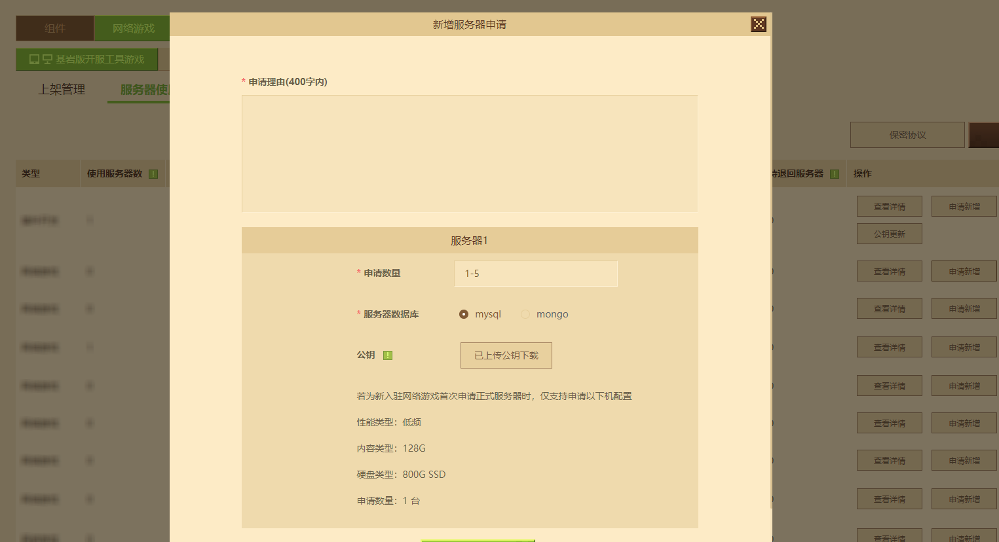
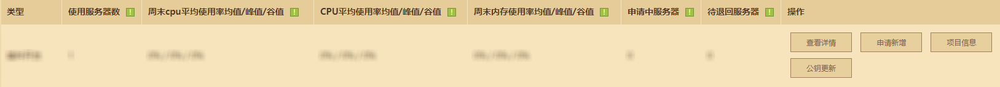

--- 
front: 
hard: Getting Started 
time: 10 minutes 
--- 
# Bedrock Edition Online Game Review and Listing Specifications 

After building the online game content on **Little Cloud Server**, you can conduct the "first review" review operation of the online game on the developer platform by yourself. When the review is passed, the developer can apply for a formal machine for the official online game content construction on the developer platform. After everything is ready, perform the review operation again to conduct the "second review" test, and the "listing" operation can be performed after the review is passed. 

During the operation of online games, it is inevitable that there will be a need to update game content, fix game bugs, and implement game operation activities. Therefore, it is recommended to make reasonable use of the review and review-free listing functions to reduce the waiting time of players. 

In this guide, you will learn: 

- Conduct the first review and obtain the formal machine. ✔ 
- Pass the second review and finally list the online game. ✔ 
- Learn daily review and review-free listing operations. ✔ 

## First-instance test run operation 

After preparing the complete game content waiting for the test run in the test environment, you can perform the **first-instance test run operation** for the gameplay test in **Shelf Management**. 

 

Click **[View]** and fill in the basic information as needed: 

- **Game Name**: The actual name of the online game displayed in the online game lobby. 
- **Game ID**: The unique ID of the online game resource. 
- **Game Version**: The edited version of the online game resource. 
- **Game Type**: The game type of the online game. 
- **Game IP or Domain Name**: The bound official server IP or the domain name bound to the official server IP. **If there is no official server IP during the first trial, it can be left blank**. 
- **Is it a test server**: Check "Yes" when running tests, and check "No" when officially launching or routine review. 
- **Game Introduction**: Provide game information for reviewers to refer to. 

 

**Upload online games** You can specify the player client version that connects to the online game. Developers can click the avatar in the upper left corner of the mobile version of "Minecraft" homepage, click the **[Settings]** button in the upper right corner of the pop-up bar, and pull down to see the client version number. 

 

 

**Detailed information** and **Image materials** can be used to display the online game introduction in the online game lobby **(In addition to supporting text, you can also insert long pictures and other rich text)**, and display the online game's Banner, Icon, POS machine and carousel for players. 

 

After the editing is successful, you can directly click **【Submit for review】**, and the official reviewer will conduct the first review of the content before it is officially launched.

## Formal server application operation 

After passing the first trial, developers can apply for a formal server in **Server Usage**. 

 

In the **Add Server Application** form, please fill in the actual reason for the server resource application, and provide the resource application quantity and database type. If the official server public key has been uploaded when entering the game, the public key upload step will be skipped. 

**Note: If it is a newly entered online game, when applying for a formal server for the first time, only the following machine configurations are supported. ** 

 

After the physical machine is issued, developers can check the **official project code**, **database information** and **data monitoring platform** login information of the online game in the project information. For information about database connection, data monitoring platform usage, or project code usage, you can find relevant tutorials under <a href="../../mcguide/27-网络游戏/课5：实用知识/第1：平台发布.html">Developer Official Website-Development Guide-网络游戏分类</a>. 

 

## Second review and launch operation 

After obtaining the official machine, developers can transfer the gameplay of the test server to the official server and follow the previous **Edit** process to check **[Is it a test server]** as "No". 

 

Operate the server for review in **Ship Management**. Currently, the Bedrock Edition Online Game Center will have official reviewers conduct a second content review of the server before the first launch. After the review is passed, you can click the **【List】** button to list the online game. 

 

Click **【Manage Server】** and set **Operation Status** to "Normal Operation". The player comment switch can be determined according to the needs of the developer. 

 

**At this point, a complete Bedrock Edition online game listing process is completed. ** 

## Daily review and review-free listing operations 

Online games require long-term operation. When new content needs to be added or problems need to be fixed during daily maintenance, they also need to be reviewed and listed on the developer platform. 

In order to reduce the time and cost burden of review caused by developers updating content, you can check <a href="../../mcguide/27-网络游戏/课5：实用知识/第17：现场期热改.html">Bedrock Online Game Development Guide - Online Phase Hot Update</a> to learn how to update the code to the server without stopping the service. When the hot update conditions are met, the developer platform will automatically assist the online game under review to trigger the review exemption mechanism, and then click to put it on the shelf to complete the content update. 

If a maintenance inevitably requires modifying the implementation outside the function, adding a new plug-in or updating the engine version, it is still necessary to wait for the reviewer to review and pass it before it can be put on the shelf. 

## FAQ

### The server is preparing to apply for the official server. How long will it take to get the first review result? 

Answer: It is expected to take 10 working days. Please wait patiently. 

### The server is preparing to apply for the official listing. How long will it take to get the second review result? 

Answer: It is expected to take 10 working days. Please wait patiently.