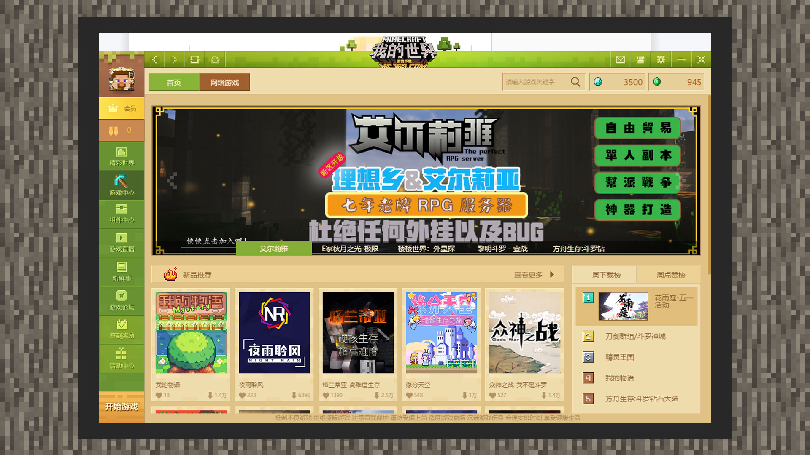
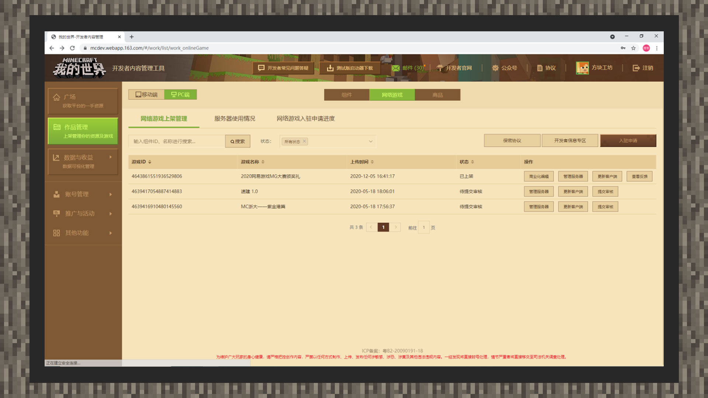
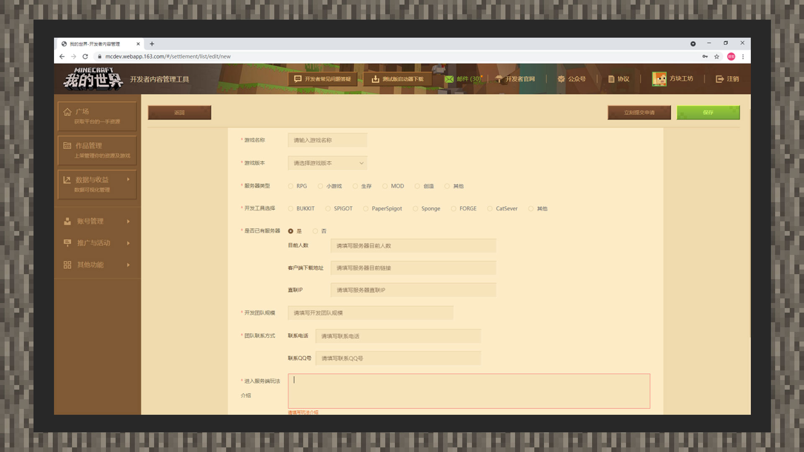
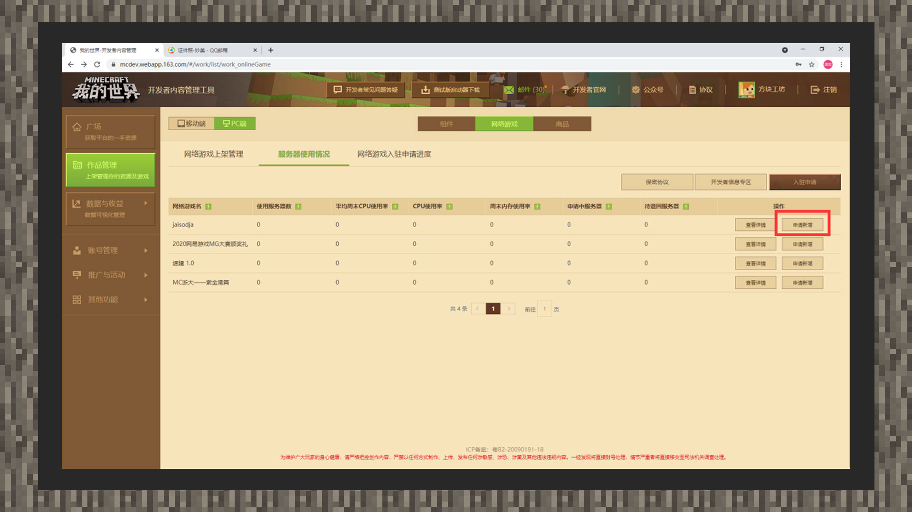
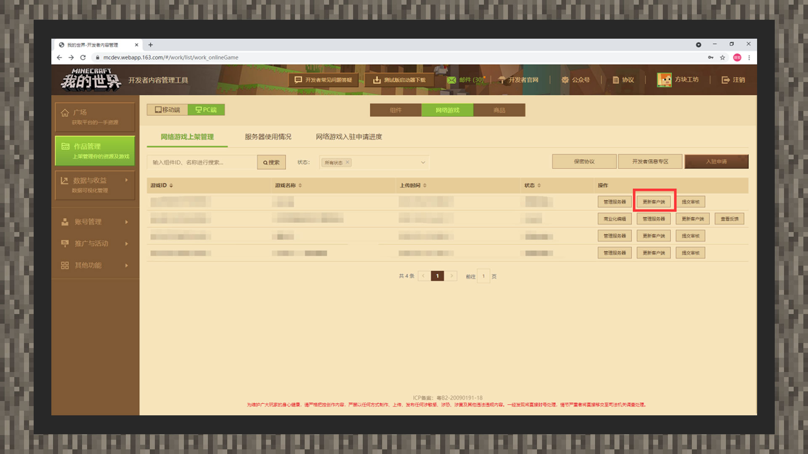
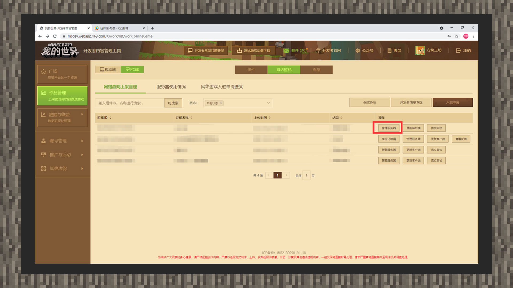

--- 
front: https://mc.res.netease.com/pc/zt/20201109161633/mc-dev/assets/img/8_1.b13ebca4.jpg 
hard: Getting Started 
time: 10 minutes 
--- 
# "My World" Chinese Version JAVA Online Game Entry Guide 
#### Overview of PC Online Games 
#### What is a PC Online Game? 

 

PC online games refer to multiplayer game services that developers use official server resources to build gameplay. You can click [Game Center] in the left menu of the client to find the multiplayer server in the online stage. 

Online games remove many restrictions on local connections, allowing players to meet more like-minded players without being disturbed by time and region. 

#### Tools used in online games 

The Chinese version does not provide technical support and technical guidance for the JAVA version of the server development tools. Development enthusiasts can choose third-party stable tools for server development, such as Bukkit, Forge, etc. 

#### How to initiate an application for settlement 

#### PC online game settlement page: 

 

Log in to the developer platform with a developer account: [https://mcdev.webapp.163.com/](https://mcdev.webapp.163.com/). Then click [Work Management] on the homepage, and the version will select [PC]. Then click the [Online Game] option to see the [Settlement Application] entrance next to it, and click it to enter the settlement application page. 

#### PC online game settlement application page: 

 

1) After entering the PC online game settlement application page, please fill in the information truthfully and in detail. The reviewer will understand whether the developer's development capabilities are sufficient to support the development and continuous maintenance of online games based on the filled information, and issue the qualification settlement. Note: The current server settlement version only supports 1.12.2 and below. At the same time, if you can provide a complete DEMO client and a directly connected experience server, this will allow the reviewer to quickly and directly experience the game status, and the subsequent process will be more efficient. 

2) After filling in the information, return to the upper right corner of the page and click [Save] to save the application information. You can also click [Submit for review immediately] for review. The application can be reviewed, withdrawn, etc. in [Online game settlement application progress]. 

#### PC online game review/listing operation: 

 

1) After the settlement review is passed, you can apply for the physical machine needed for online in the [Server Usage] column. At the same time, the platform will collect the machine resource utilization rate and update the relevant information in the list, so that the server owner can allocate machine resources according to the server's carrying capacity. 

 

2) After receiving the result of the physical machine review, you can enter the [Online Game Listing Management] column to distribute and update the client of the corresponding online game. 

 

3) After all the above steps are completed, you can manage the server in the [Online Game Listing Management] column, set the server operation status, update announcements, and enable the whitelist function. Each player ID entered under the whitelist is separated by an English comma. If there are no other situations, you can click [Submit Review] for listing review. 

#### FAQ 

#### Do I need to submit a deposit when submitting an application for online game settlement? 

Answer: You do not need to submit any deposit when applying for settlement. 

#### Do I need to bring my own machine when I settle in an online game? 

A: No. The official will provide formal physical machines to developers who have passed the admission review to carry out online game services. 

#### Is there an upper limit on the number of server quotas I apply for? 

A: In principle, there is no upper limit on the number of games that can be applied for admission, but the admission review will decide whether to approve subsequent applications for admission games based on the number and situation of admission applications, as well as the operating conditions of the online games that have passed the admission application. 

