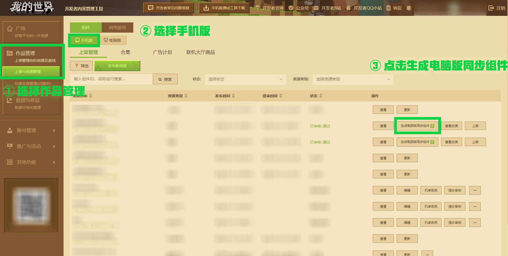
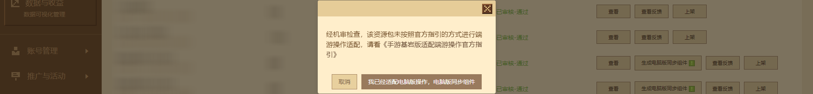

# Introduction to the function of synchronizing mobile version components to the PC version component center with one click 

**Mobile version components** are works resources uploaded by developers to the mobile Bedrock version resource center, which include **skin components**, **material texture components**, **functional gameplay components**, **map components**, **light and shadow components** and other types. 

With the cross-platform characteristics of the Bedrock version of Minecraft, developers only need to upload mobile version components to the PC version platform, and PC Bedrock version players can also enjoy the same fun and get more benefits and praise. 

The new version **[One-click synchronization of mobile version components to PC version component center]** function optimizes the synchronization process experience of Bedrock version works between different platforms, which mainly includes: 

- **More eye-catching synchronization entrance**. **Mobile version components** The **[Generate PC version synchronization components]** button in the viewing page is moved to the **Mobile version component list page**, and all component works **that have not been synchronized to the PC version component center and have passed the review** will appear with the **[Generate PC version synchronization components]** button. 
- **Friendly floating bubble guidance**. Components that are synchronized to the PC version of Bedrock Edition may have problems with user terminal input adaptation, such as: the button logic that can be triggered by gestures on the mobile phone needs to be matched to the button or mouse on the PC version. Now the **floating bubble** prompt next to the **[Generate PC version synchronization component]** button will guide you to the **[Official Guide for Mobile Game Bedrock Edition Adaptation to PC Game Operation]** document. 
- **Close the synchronization source**. The same component of the PC version of Bedrock Edition after synchronization will display the **mobile version component** ID of the synchronization source. After that, each time the mobile version component is launched, the resource package, resource pricing and other related settings of the mobile version component will be automatically synchronized to the PC version component. 

## Learn to use the function of generating PC version synchronization components 

Enter the "Minecraft" developer platform, click [Work Management], select [Resources] as the paging label, and select the [Mobile Version] work platform. 

 

In the mobile version component list page, you can select **[Generate PC version synchronization component]** next to the component work operation column of **[Reviewed-Passed]**. 

Click the button and a confirmation window will pop up. After confirming again that the component has been adapted to the PC operation mode, click **[I have adapted to the PC version operation, PC version synchronization component]**, and the current page will jump to the PC version platform resource editing page. If you are not sure about the dual-end adaptation, please refer to [PC Bedrock Edition Adaptation PC Operation Guide](../20-Gameplay Development/19-Mobile Computer Adaptation/1-PE Module Adaptation PC.html). 

 

**[Synchronization Source Mobile Version Component ID]** indicates the source of the mobile version component after the component is synchronized, and does not support modification. It is currently only used to determine the source of component synchronization. **[Component Name]** will keep the same name as the original mobile version component. Therefore, if there is a component with the same name listed in the PC version component center, the synchronized PC version component resources will not be saved. Please modify the original mobile version component name before synchronizing. 

 

At the same time, **[Is it original content and authorization certificate], [Resource pricing], [Component first-level category], [Work resource package] and [Applicable version]** fields or options do not support modification. These basic information will be consistent with the synchronized mobile version component information. 

The PC version of the platform resources also allows you to set the component works' **[Component Label], [Whether to contain a map], [Component Secondary Category], [Add Encyclopedia Entries] and [Pre-component]**. For developers who have not used the PC version of the component center, you can refer to the table below to understand the corresponding uses: 

| Edit Name | Edit Description | 
| ------------ | ------------------------------------------------------------ | 
| Pre-component | Indicates that players must have this component before adding component resources based on it to the world. Therefore, if there is such a need, please be sure to complete this information first. **Note: The pre-component must be a component that has been listed on the PC version of the component center, otherwise its component information cannot be obtained in the configuration column. ** | 
| Component Secondary Category | Under the **[All Components]** column of the PC version of the component center, use the component secondary classification to reclassify components of different resource types. **For example: the functional gameplay marked as [Tools] is likely to be a gameplay component of the auxiliary survival type. ** | 
| Does it contain a map? | If the component work contains a map, please remember to check this option. | 
| Add an encyclopedia entry | If the component has a corresponding entry in [MC Encyclopedia](http://www.mcmod.cn/), enter and select the component name to load the entry details into the component details-encyclopedia information location. Please ensure that the component name is consistent. | 

For more information about editing components on the PC platform, please refer to [Teaching Center-Developer Platform-Correct Ways and Paths to Upload Works](./Course 05-Correct Ways and Paths to Upload Works.html). After checking, click the [Save] button to save the synchronized PC Bedrock Edition components. After **Submit Components for Review** on the PC Component List Page, they can be put on the shelves after review. After that, players can purchase synchronized components on one end and play associated components on the other end according to the purchase record. 

## FAQs about Synchronization Function 

### Why does the created mobile version component not display the [Generate PC Synchronization Component] button? 

Answer: The mobile version component must be reviewed before the corresponding **[Generate PC Synchronization Component]** button will be displayed on the mobile component list page. 

### Can the synchronized PC Bedrock Edition components be put on the shelves directly? 

Answer: It needs to be submitted for review and approved before it can be put on the shelves. 

### After deleting the PC Bedrock Edition sync component, can I sync the original mobile version component to the PC platform again? 

Answer: Yes. After deleting the PC Bedrock Edition sync component, the original mobile version component will display the **[Generate PC Sync Component]** button again in the **[Reviewed-Passed]** state.