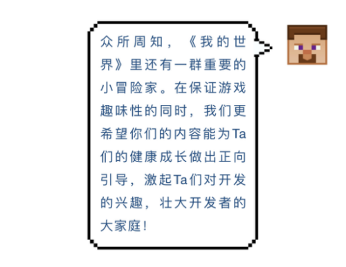
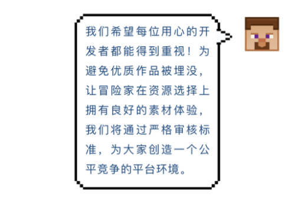
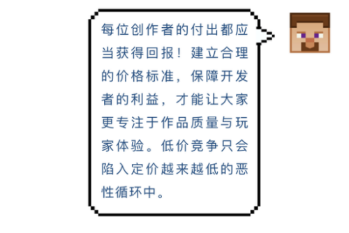
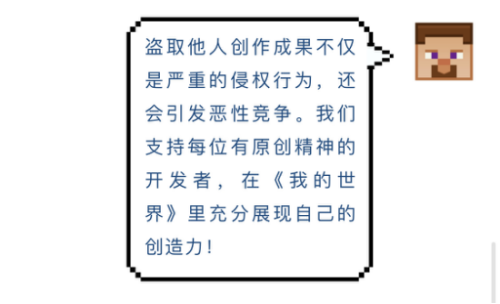
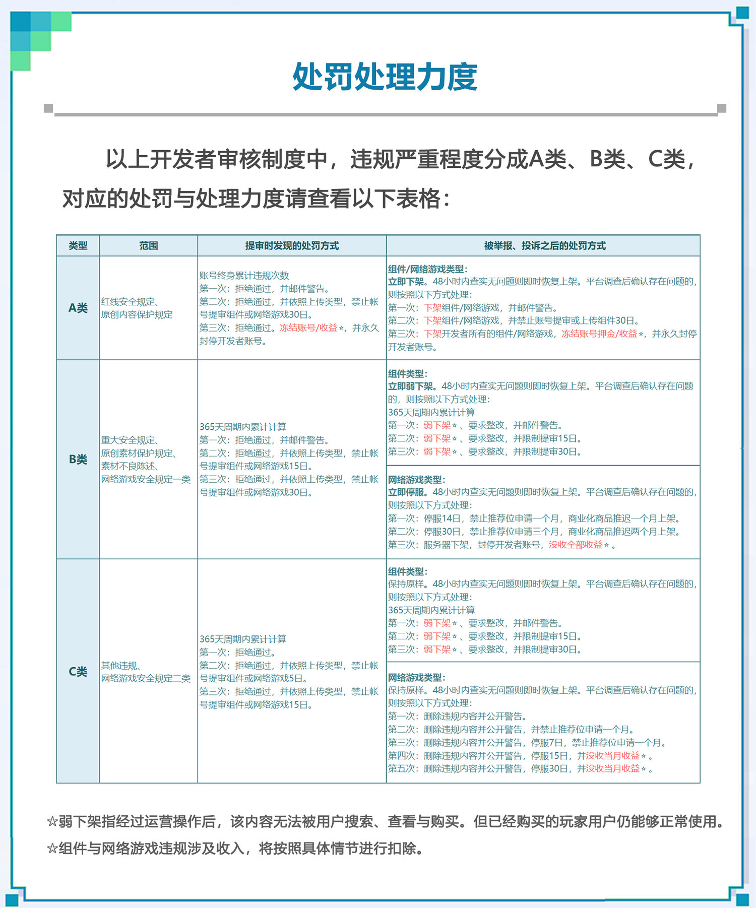
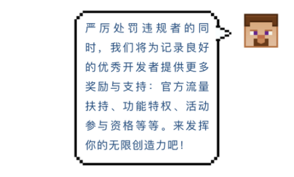

--- 
front: https://mc.res.netease.com/pc/zt/20201109161633/mc-dev/assets/img/0_25_5.cb909f47.png 
hard: Getting Started 
time: 5 minutes 
selection: true 
--- 

# Introduction to the Developer Content Review System 

### Stage Goal: Understand the Developer Content Review System 

#### TAG: Content Review System 

#### Stage Structure: 

#### Stage 1: Understand the Developer Content Review System 

**Dear Developers:** 

We have officially established a new version of the "Developer Content Review System" to protect the rights and interests of each developer and provide players with a better gaming experience. The system was officially launched on January 18, 2021. The following is the complete content of the new version of the "Developer Content Review System": 

The developer system established by NetEase's "Minecraft" Chinese version is designed to protect the experience and information security of game players, especially "minor" players, while creating a healthy market environment for developers to help them show their creativity and gain profits. 

#### Content Security System 

NetEase's "Minecraft" Chinese version provides developers with a broad creative space, but political, pornographic, infringing or other illegal content seriously affects the game experience and physical and mental health of players, and threatens the creative freedom of other developers; before developing and submitting resources, please be sure to avoid violating the following content: 

#### Red Line Safety Regulations 

**Political Sensitive Category**: 

There shall be no politically sensitive content such as anti-government, anti-social, reactionary, insulting national leaders, disrupting national unity and stability, and no politically sensitive signs and symbols such as the national flag, party flag, and national emblem. 

**Pornographic Category:** 

There shall be no pornographic or pornographic content such as exposure, pornography, teasing, pornographic transactions, etc.

**Hate speech:** 

There shall be no content related to attacks, defamation, hatred, ridicule, etc. against specific groups (such as ethnic groups, vulnerable groups), war history, and no sensitive content such as war/history.

#### Major safety regulations 

**Terrorism and violence:** 

Restrict the use of terrorist and violent plots and content, especially the use of thriller, horror, guns and other themes. 

**Bad guidance:** 

Suicide, school violence, high-fear falling, uncivilized language, sexually suggestive language and other plots and content that are not conducive to the growth of minors and have bad suggestions or guidance are not allowed. 

**Gambling:** 

Do not use any real or virtual currency for gambling, betting, guessing, treasure hunting or other forms of random draw activities. 

**Copyright and IP infringement, unfair competition:** 

Do not move copyrighted components, quote or use other unauthorized works of others, or adapt other people's works without authorization, etc., or there is any content suspected of unfair competition. 

**Violation of laws and regulations:** 

Do not use any content that violates national laws, regulations, and administrative orders. 

**Violation of public order and good customs:** 

Do not use any content that affects the national social public order and public morality. 

#### Online Game Service Security Regulations 

Based on the characteristics of online games, there are two types of unique online game review regulations 

##### Category 1: 

**Illegal payment behavior:** 

Illegal payment behaviors such as platform/card password recharge, private sponsorship or offline transactions are prohibited. 

**Illegal tampering of server data:** 

It is prohibited to tamper with server data through abnormal means, such as: the number of online users. 

##### Category 2:

**Illegal external diversion**: 

No non-Chinese version server game promotional ads/illegal external links are allowed. 

**Illegal sensitive content:** 

No illegal content such as pornography, politics or other illegal behaviors are allowed. 

**Illegal plagiarism content:** 

No plagiarism, theft and other infringement behaviors are allowed. 

**Illegal false content:** 

No game content that is inconsistent with the review content is allowed, and game content containing firearms is also not allowed to be uploaded and put on the shelves. 

**Illegal delay behavior:** 

Online game developers who have been punished for rectification shall not delay the rectification time privately, and overtime is also considered as illegal behavior. 

**Illegal commercialization behavior:** 

No commercialization behavior that does not follow the commercialization guidelines is allowed. 

For punishment and reporting methods, please see [【Punishment and Reporting】](#Punishment and Reporting). 

 

#### Content listing requirements 

In order to ensure the quality of platform content and promote the healthy development of the developer ecosystem, the content listed on the Chinese version of NetEase's "Minecraft" must meet the following content itself, content materials, and pricing requirements: 

#### Basic content requirements 

**Strictly check content that affects balance** 
The review of content that will seriously affect the functional balance, such as mine penetration, permanent night vision, and too many transparent parts of the skin, will be more stringent. 
**Confirm basic functional guarantees** 
Please use the developer tool for self-testing, and upload only after confirmation to ensure the normal operation of components/map content/add and other resources, and at the same time ensure that textures, skins, etc. are displayed normally and completely, and there are no language barriers. 

#### Bad material representation 

Content materials are an important way for players to understand the content itself. The following situations are considered as bad material representation: 
**False advertising:** 

The relevant materials are not described truthfully, the important real situation of the current content is concealed, or there is a situation where the promotion is inconsistent with the current actual content status, or the promotion is updated and iterated content later. 

**Traffic outflow:** 

Without permission, the use of external inducement content including but not limited to QQ, WeChat, Weibo, QR code, external links, live broadcast platforms, rental service promotion, offline transaction content, etc. 

**Malicious inducement:** 

Suspected malicious inducement behaviors including but not limited to purchase gifts, red envelopes for good reviews, and sharing fission appear. 

**Low originality:** 

The material uses too many original textures, or is similar to existing components of the same type, and lacks originality and functionality. 

 

#### Pricing system 

In order to avoid vicious competition, the following rules must be followed for content pricing: 

Except for "free content", the minimum price and discounted price of content within 90 days before launch shall not be lower than the following standards: 

| Content type | Diamond pricing | 
| ---------- | -------- | 
| Map, appearance | 50 diamonds | 
| Light and shadow, gameplay | 100 diamonds | 

For punishment and reporting methods, please see [【Punishment and Reporting】](#Punishment and Reporting). 

 

#### Original protection system 

In order to maintain the healthy development of the developer ecosystem, NetEase's "Minecraft" Chinese version will spare no effort to protect original content and resolutely crack down on all kinds of infringements on the rights and interests of others. There are two major system regulations for original protection: 

#### Original content protection regulations 

The developer component code and the developer's first original content in the content (including character image design, scene design, art style design, etc.) are the developer's original content, and other developers are not allowed to plagiarize in any form. 

#### Original material protection regulations 

The developer's first original content in the content material, including introduction videos, introduction pictures, content names, content descriptions, content keywords, etc., are the developer's original materials. If they are identical or overly similar to the original materials, it is a violation of the original material protection regulations. 
For punishment and reporting methods, please see [【Punishment and Reporting】](#Punishment and Reporting) below. 

 

#### Punishment and Reporting 

Developers who violate the developer content review system will be punished according to [【Punishment Processing Strength】](#Punishment Processing Strength); if it is found that the developer has violated the content review system or infringed, it can be reported through the reporting function of NetEase Minecraft mobile game or PC game client. 

#### Punishment and handling strength 

 

#### Report: 

**How to report plagiarism, piracy, and infringement components? ** 
Answer: The Chinese version of "Minecraft" has obtained the official authorization of Microsoft, and it also attaches great importance to the protection of developer copyrights and severely cracks down on piracy and infringement. For acts that violate copyright protection, once confirmed, the relevant income and deposit will be frozen, and in serious cases, the developer account will be permanently banned. 

If you need to report, please provide the corresponding evidence of the stolen work (link address, screenshots, etc.) to the forum and report according to the format: 
[http://mc.netease.com/thread-194566-1-1.html](http://mc.netease.com/thread-194566-1-1.html), the staff will contact you within 15 working days. 

 

The above is the full content of the new version of the "Developer Content Review System". Thank you developers for your valuable suggestions on the system. We will strictly implement it and work with you to create a high-quality, fair, healthy and efficient content creation platform. If you have any questions, you are welcome to contact us via email address: minecraftstarter@163.com or Minecraft Developer Public Account or Official Forum.