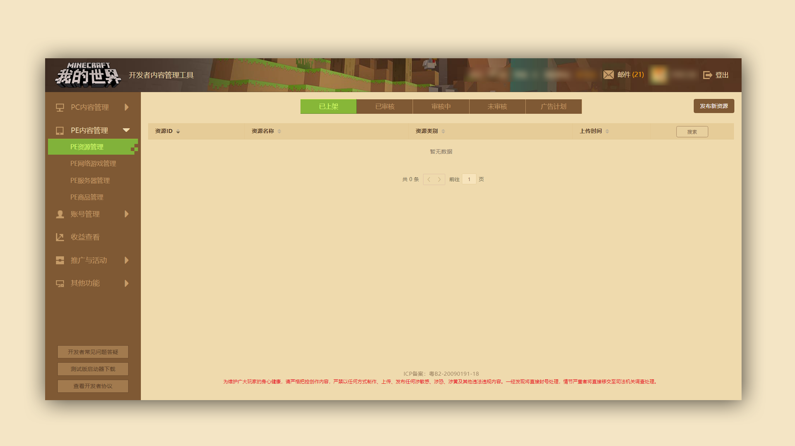
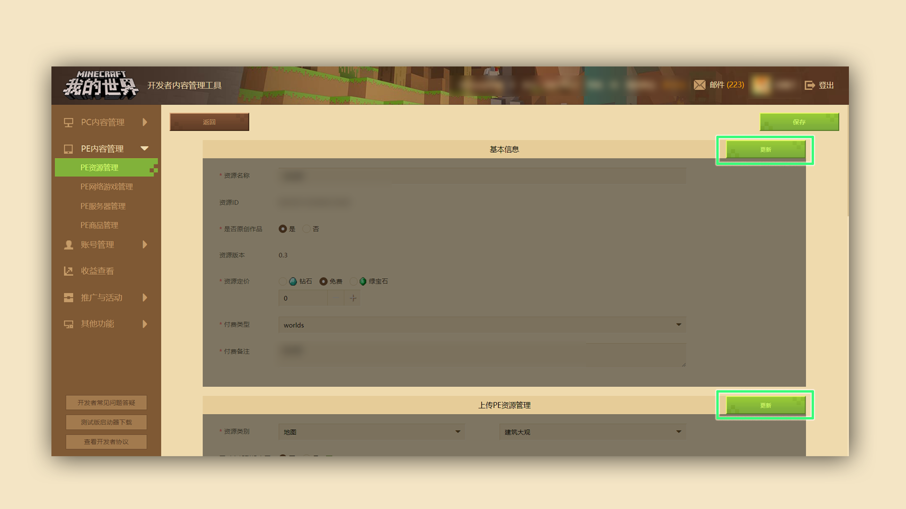
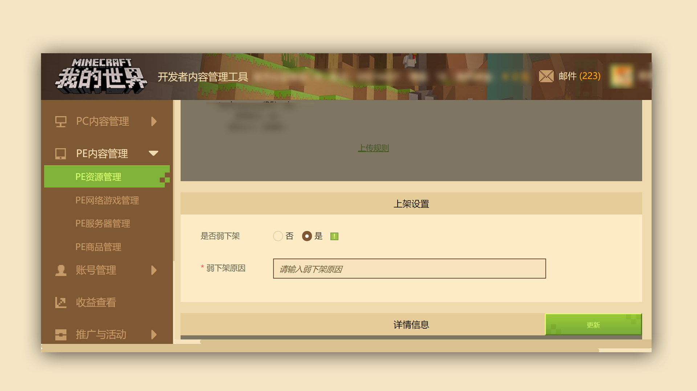
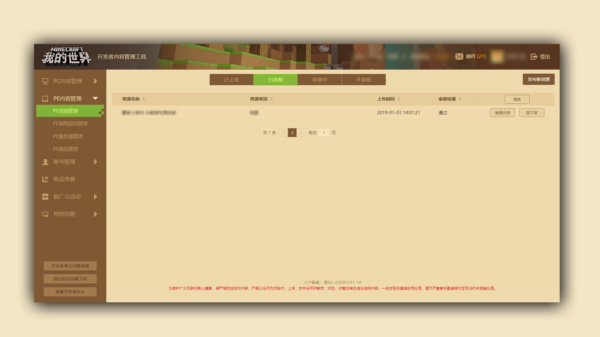

--- 
front: https://mc.res.netease.com/pc/zt/20201109161633/mc-dev/assets/img/3_3.e66b801f.png 
hard: Getting Started 
time: 5 minutes 
selection: true 
--- 
# Methods for removing works (excluding servers) 

### Stage goal: Successfully remove works weakly 

#### TAG: Remove 

#### Stage structure: 

#### Stage 1: Understand and find the location of the removed works 

#### Stage 2: Understand the meaning of "weak removal" 

*** 

This tutorial takes PE content as an example, and the operation method of PE content is the same as PE content. 

Go to the [PE Resource Management] module of the developer platform, click the "Listed" button, find the component resource that needs to be removed from the list, and click the "Update" button: 

 

Pull down the edit page, find the "Listing Settings" module, and click "Update": 

 

Select "Yes" in whether to weakly remove the product and write down the reason for the removal, as shown below: 

 

The component will then return to the "Unreviewed" page, and the resource needs to be reviewed again. 

After waiting for the review to pass, click "Weakly Removed" on the "Reviewed" page, and the component will be officially weakly removed successfully.

 

Note: Weak removal means that after the operation, the content cannot be searched, viewed or purchased by users 

But the players who have already constructed the content can still use it normally