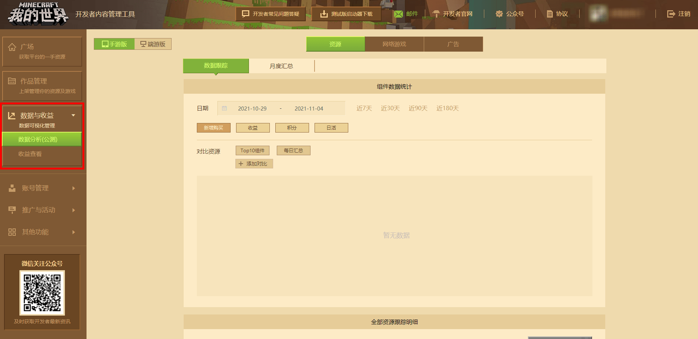
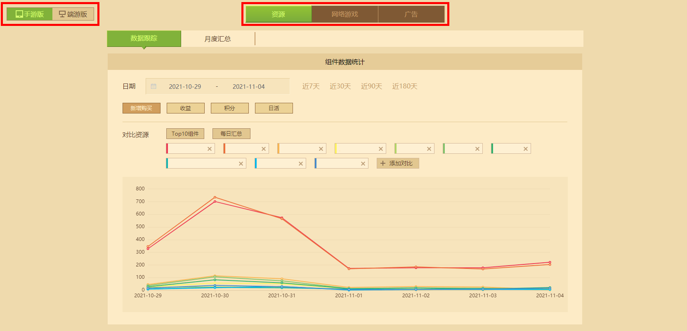
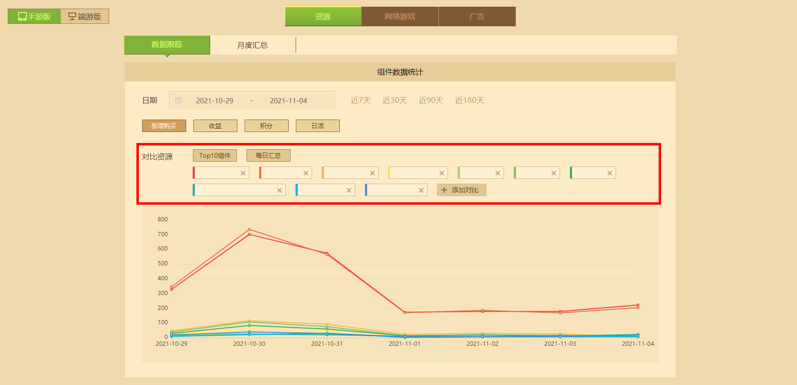
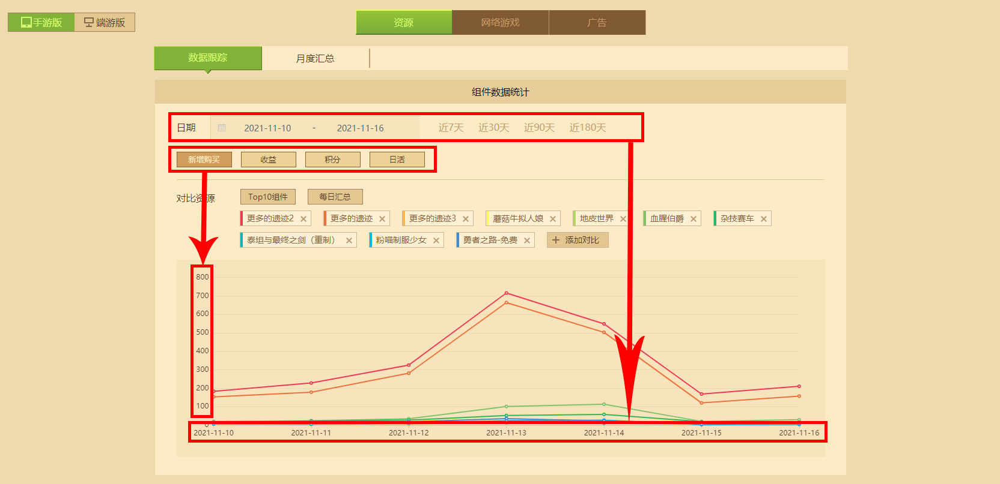
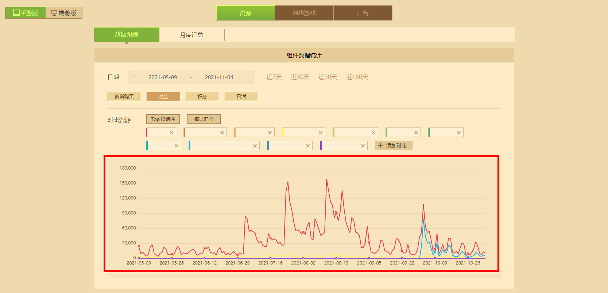
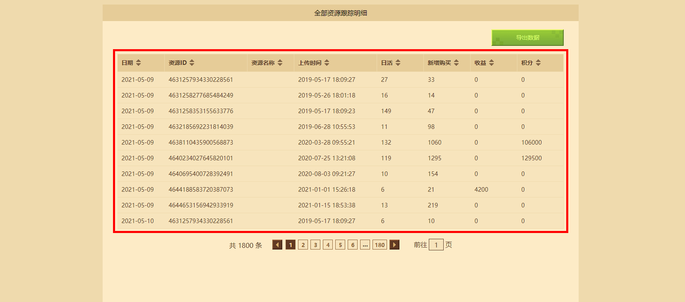
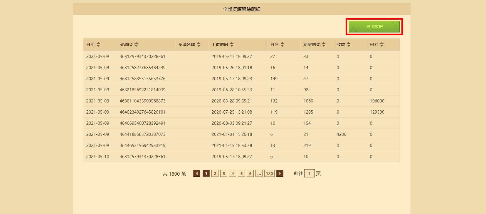
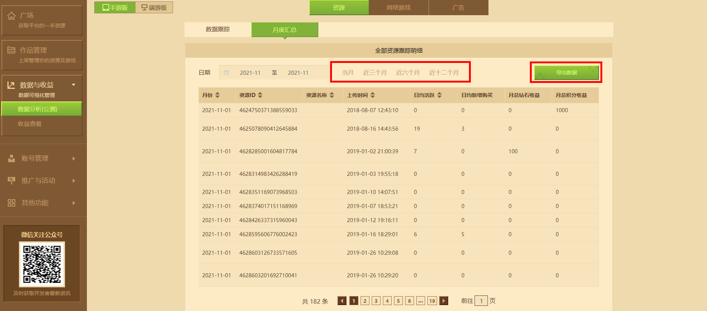

--- 
front: https://mc.163.com/dev/mcmanual/mc-dev/assets/img/6_1.01f4f17e.png 
hard: Getting Started 
time: 10 minutes 
--- 
# Tracking Resources with Data Analysis 

You can jump to the data analysis page in **[Data and Revenue]** on the left side of the developer platform. The ultimate goal of the data analysis function is to help developers better understand the purchasing behavior of players so as to better promote their works and services. Data analysis is very important for developers! 

 

Developers can use charts and filtering functions to understand which works are the most popular, understand what resources are used to convert new users into loyal users, and make better resource development directions and sales decisions based on relevant data. Determine whether users will purchase products in stages, such as holidays, current events, and other external environments. 

## Learn to use the data tracking function 

Data tracking can be divided into two main functional sections: **Line chart** and **Tracking details table** . It should be noted that the functions of these two sections can be used for resource works, online games and advertisements, and are also divided into mobile game version and PC game version. 

 

### Line chart 

Enter the data analysis page, you can see the line chart by default, and the **TOP10 component** will be displayed on the line chart by default. Of course, you can also add any work or daily summary for comparison. 

 

After adding the work to be analyzed, you can select the corresponding dimension for comparison: **Time dimension** , **New purchase dimension** , **Revenue dimension** , **Daily activity dimension** , **Points dimension** . The time dimension is the main dimension. In data analysis, there must be a date length and at least one comparison resource to crawl the data source from the platform backend. Then you can select any secondary dimension to analyze consumer purchasing behavior with time. 

 

In addition, the line chart allows dragging and zooming, so that you can see the overall situation and details in a longer time span. 

 

### Tracking Details 

Pull down on the data analysis page to see **【All Resource Tracking Details】**, where various data information of the selected work in the line chart will appear, such as daily activity, revenue, points, etc. The table will accumulate statistical data of all reference resources, and view from front to back according to the ascending & descending order of a certain dimension. 

 

The default sorting is by time dimension. Click the sorting button of different dimensions in the table header to switch to other dimensions. 

 

The export data function in the upper right corner will package the table data into **CSV format** , which can be opened by most form software. 

## Learn to use the monthly summary function 

Click the **[Monthly Summary]** button to switch from the data tracking page to the monthly summary. Compared with the full resource tracking details table of the data tracking function, it only changes the time unit **from day to month** in terms of time span. Therefore, the new purchase of a resource becomes the average daily new purchase of the month, and the income becomes the total monthly resource income. 

 

The export data function in the upper right corner will package the table data into **CSV format**, which can be opened by most form software. 

