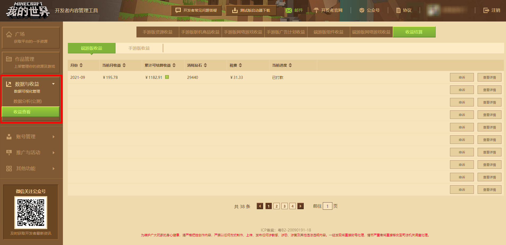
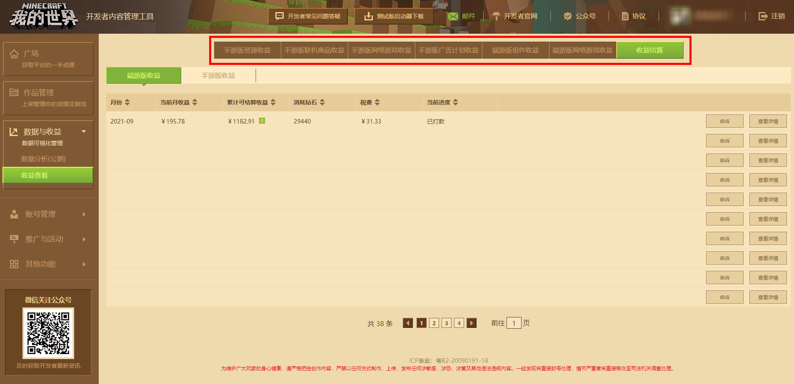
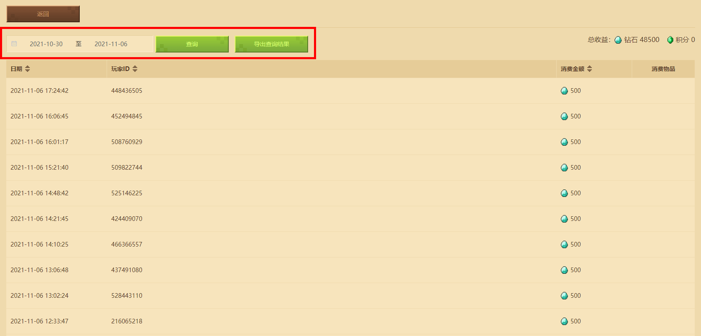
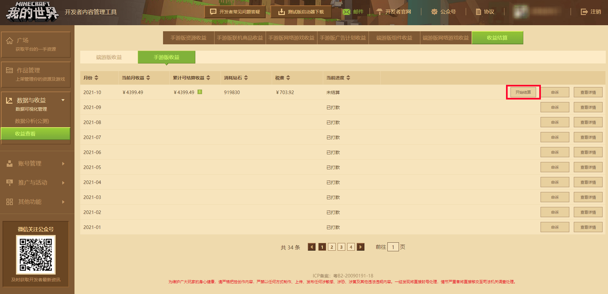

--- 
front: https://mc.163.com/dev/mcmanual/mc-dev/assets/img/7_1.0fa38b71.png 
hard: Getting Started 
time: 10 minutes 
selection: true 
--- 
# View and settle income 

Click **[Data and Income]** on the left side of the developer platform, then click **[Income Settlement]**, and then select the final income settlement to see the monthly settlement income flow of the developer platform. Details are shown in the figure below: 

 

You can switch between different types of works at the top and view the income separately. 

 

Use the search function to quickly locate a single product under one of the work types, and click the View Income button to view the income. 

 

In the revenue viewing interface, set the time range you want to query to calculate revenue by date, and you can also export the query results. 

## How to settle revenue correctly 

When the monthly cumulative revenue of a single platform of a PC game or mobile game reaches 1,000 yuan, it can be settled and withdrawn in the next month. If the cumulative revenue is less than 1,000 yuan, it cannot be settled. You can also settle uniformly after the accumulated revenue of multiple months reaches 1,000 yuan; if it cannot reach 1k, you can choose annual settlement, that is, at the beginning of the next year after each natural year, the platform will settle the revenue of the previous year that is less than 1k for the developer. 

In the month that meets the settlement conditions, you will find the **[Start Settlement]** button under the revenue settlement page after the settlement information of that month is generated. 

 

Before starting settlement, developers should check the settlement information of the account. If the bank information is incorrect, please contact the official staff through the developer email: minecraftstarter@163.com to modify the bank information. **The bank information that can be modified includes: bank card number, bank account, branch account, bank account address, and cardholder name. ** 

If the information is changed to use a new bank card, the developer needs to provide photos of the front and back of the new bank card and the old bank card, and the front and back of the new bank card and the old bank card. Otherwise, the developer needs to provide photos of the front and back of the bank card and the front and back of the bank card. 

For settlement-related questions, you can check the developer FAQ. If you cannot solve it, you can contact the official by reporting other questions in the developer FAQ. 

