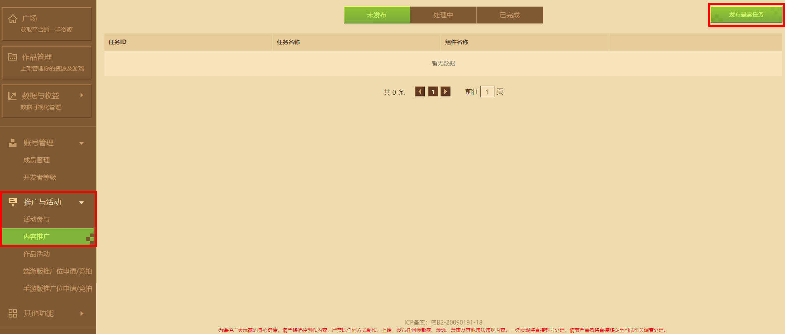
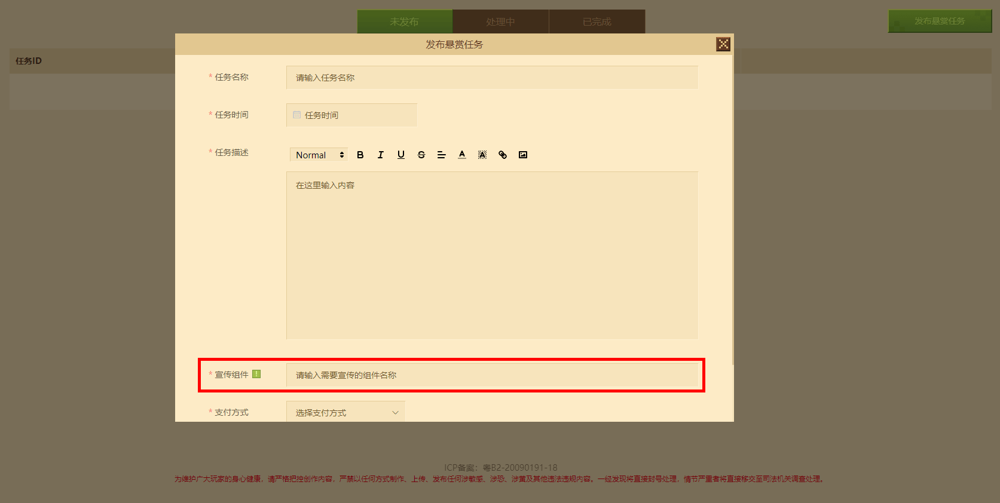
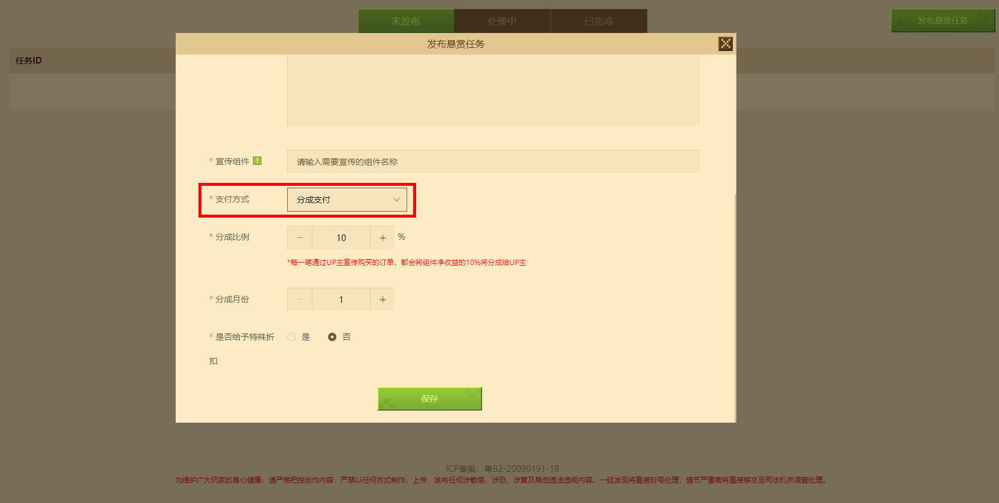
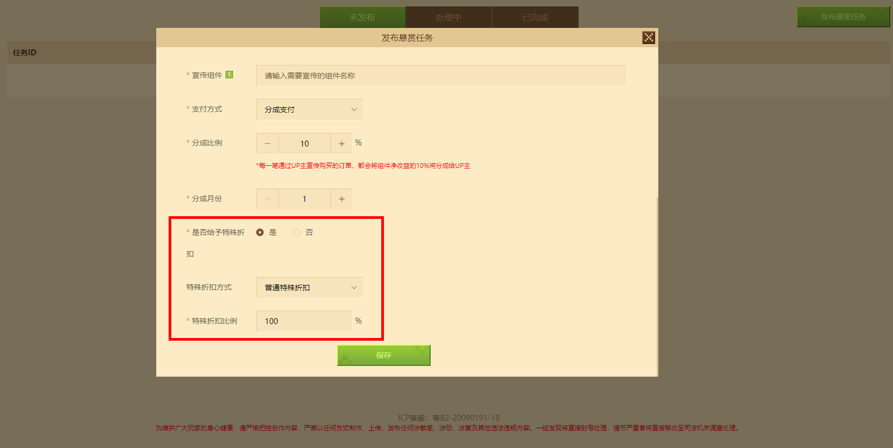
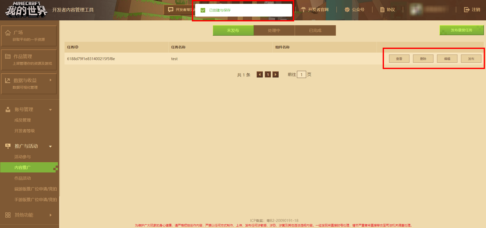
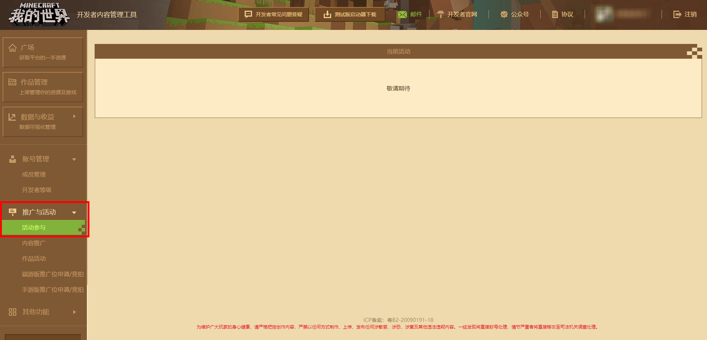
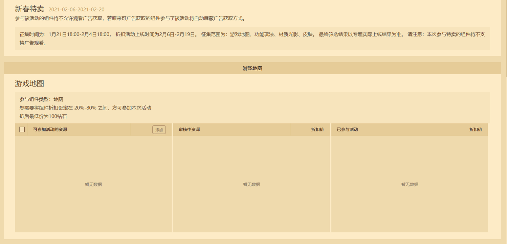

--- 
front: https://mc.163.com/dev/mcmanual/mc-dev/assets/img/8_1.df036a12.png 
hard: Getting Started 
time: 10 minutes 
selection: true 
--- 

# Promotion and Activities 

In order to help developers promote and develop their works, My World has launched a variety of activities and promotions to increase exposure and sales of works. 

## Content Promotion 

**【Content Promotion】** is a function developed to assist developers in promoting component works. Developers can use the "Content Promotion" function to **publish reward tasks** and publish promotion tasks in the form of revenue sharing. They can obtain exposure opportunities for components through **content creators bringing goods**; both parties can cooperate in promotion after reaching an agreement on the needs of promotion and sharing. 

 

Enter the Minecraft developer platform, click **[Promotion and Activities]** to open the drop-down list → click the **“Content Promotion”** button in the drop-down list to enter the “Content Promotion” management interface; click the [Publish Bounty Task] button in the upper right corner to set up the bounty task. 

### Publish Bounty Task 

After clicking the **“Publish Bounty Task”** button, you can enter the settings page. Developers can complete the task name, task time, task description and other information according to their personal needs. 

 

Click the promotion component option to open the drop-down list. Enter a keyword to automatically associate the diamond pricing component that matches the keyword in the developer account. 

 

Click the **Payment method** option to open the drop-down list, select the method to pay the content creator, and fill in the remuneration ratio (currently only split payment is supported). For components sold through content creators, the system will automatically pay the content creators a split payment based on the split ratio filled in by the developer; if players download through non-content creators (including but not limited to resource centers, special pages, etc.), they do not need to pay the content creators a split payment. 

 

In addition, developers can also promote the effect of content creators selling goods by **Give special discount**. Check the "Give special discount" option, and developers can set the special discount ratio by themselves. Players will get an additional discount for components downloaded through content creators. **If the same component has already been discounted in the resource center, the special discount will be given based on the discounted price of the resource center. ** 

 

After setting, click the **[Save]** button to publish the task. 

## Event Participation 

Enter the "Minecraft" developer platform, click **[Promotion and Events]** to open the drop-down list → click the **"Event Participation"** button in the drop-down list to enter the "Event Participation" management interface; 

 

The event participation module is mainly: a special sale discount event for works collected from all developers. 

 

When an event is being held, if you want to participate in the event, you can check your own works that meet the event and click the Add button to successfully submit the event component for review. The official will review it within a certain number of working days, and the qualified components can successfully participate in the special sale event.

**Note: In some events, the components participating in the sale will not support advertising. Please choose carefully according to the event instructions. ** 

