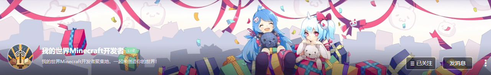

--- 
front: https://nie.res.netease.com/r/pic/20220408/fb625b53-97d9-4580-82e4-7ce01e88bda8.png 
hard: Getting Started 
time: 10 minutes 
selection: true 
--- 
# Official community and feedback channel 

## Feedback Q&A 

In the **[Developer FAQ]** of the developer platform, in addition to some common questions and answers, you can also click the **[Feedback other questions]** button to provide feedback on your own problems. 

 

 

After opening the page, fill in all the information according to the prompts and click the **[Submit]** button. 

 

## Other feedback channels 

#### Developer QQ Station: 

[Click this link](https://qun.qq.com/qqweb/qunpro/share?_wv=3&_wwv=128&inviteCode=1VX5Hn&from=181074&biz=ka&shareSource=5#/pc) to join the Minecraft Developer QQ Station channel. The channel is mainly used for communication between developers and official event releases. When applying for a channel, you need to note the developer's nickname and developer's email address. 

#### Minecraft Developer B Station Account 

Follow the Minecraft Developer B Station Account to obtain developer-related information and technical guidance. 

 

#### Minecraft Developer Official Account 

Follow the Minecraft Developer Official Account to provide feedback and obtain developer-related information and technical guidance. 

 

#### Official Developer Forum: 

[http://mc.netease.com/forum-111-1.html (opens new window)](http://mc.netease.com/forum-111-1.html), generally used to report illegal components, or to appeal when there is doubt about the results of illegal handling.