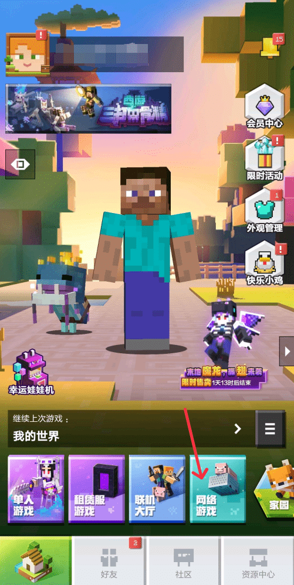
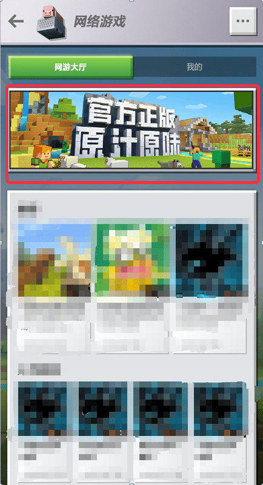

--- 
front: 
hard: Getting Started 
time: 10 minutes 
--- 

# Application for the Chinese version of "Minecraft" PE online game carousel 

### What is a PE online game? 

 

PE online games refer to multiplayer game services that developers build through official server resources. Players can click [Online Games] on the mobile terminal to enter. 

Online games remove many restrictions on local connections, allowing players to meet more players with similar interests without being disturbed by time and region factors. 

### Online game carousel 

The carousel is located at the top of the online game page and is used to display games that are **new** or **holding events (including major updates)**. 

 

### Carousel application rules 

#### Recommendation cycle 

The carousel will be displayed from **every Tuesday at 18:00 to next Tuesday at 17:59**, for a total of 7 days. There are a maximum of **3** carousel quotas in each recommendation cycle. 

#### Application deadline 

Server owners can apply at least **3 days** before the start of the recommendation cycle. *For example, for recommendations from 2021.10.19 to 2021.10.26, the application must be submitted before 2021.10.16 18:00 at the latest. * 

#### Application type 

There are two types of carousels for application: new or active. 

In the same recommendation cycle, you can only apply for one type at most. 

1) For each online game, **you can get 1 **new carousel opportunity in your lifetime, and this opportunity must be used within **six months of launch**. If there are other non-new carousel applications during the same period, new games can get the carousel first. 

2) For updates to operational activities, gameplay, game systems, etc., you can apply for activity carousels. After this type of application is successful, there is a **3-week cooling-off period**, and you cannot apply for activity carousels again during the cooling-off period. 

*For example: If the server owner successfully applies for recommendation during 2021.10.19~2021.10.26, he cannot apply for recommendation during 2021.10.26~2021.11.2 and 2021.11.2~2021.11.9. * 

#### Application method 

Send an application email to the customer service email mckefu@service.netease.com 

The application email format is as follows: 

**Email title:** 

XXX game promotion application-yyyymmdd. "yyyymmdd" represents the start date of the recommendation cycle, such as 20211019. 

**Email body:** 

Expected promotion time: 2021.10.19~2021.10.26 (7 days in total, must be continuous dates and cannot be disconnected) 

Application type: New product/activity. 

Overview: Overview of the content of this application.

Form: 

| Application content | Detailed description | 
| ------------ | ------------------------------------------------------------ | 
| Is there a new server? | No | 
| Is there an event? | Summer event included. You can get xxxxx by logging in. You can get xxxxxxxxx by logging in for xxx days. | 
| Is there a new gameplay? | The Bed Wars gameplay has been added. | 
| Other content updates | None | 

##### Email attachments: 

Carousel image, size: 990*300. The image content should show the game features as much as possible. The text in the image should be clear and eye-catching, reflecting the game features. In addition, the game name should also be shown in the image in the form of logo or text. 

#### Judging criteria 

If more than 3 games apply for carousel images in the same recommendation cycle, the selection will be based on the following criteria: 

1) Priority: New carousel image > Activity carousel image. 

2) Under the same priority, the best selection will be made based on the game's innovation level, art quality, coverage of operational activities, and fun of gameplay. 

#### Reply to application 

Customer service will reply to the server with the application result **1 day** before the start of each application cycle. 

### FAQ 

#### Is there any fee for applying for a carousel?

Answer: At this stage, the auction application method is not open yet, and only free applications are supported. Official reviewers will issue carousel resources based on the quality of the application. 
