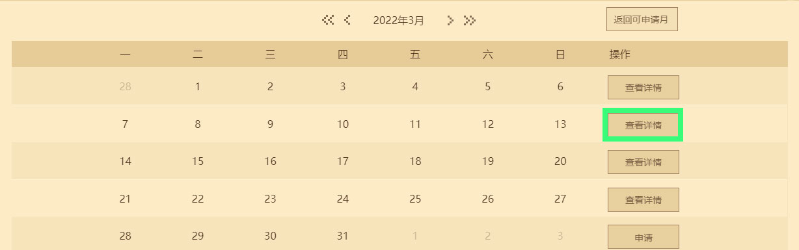

# Promotion Position Application and Bidding Trial Operation Guide 

***Last updated on: 2022/9/28, added mobile version online game carousel application content. *** 

In order to give more developers a platform and opportunity to showcase their works, the developer platform can now directly apply for and bid for mobile and computer version promotion positions. 

By providing an entry on the **【Promotion and Activities】** module on the developer platform, combined with a self-service process, developers can receive the results of promotion position application and bidding more clearly, conveniently and promptly. After this iteration, the top carousel on the mobile version resource center homepage will provide 4 application positions, and the top carousel on the mobile version online game homepage will provide 3 application positions. The **Wonderful World** and **Game Center** of the computer version will provide 5 application positions and 1 bidding position respectively, and the **First Screen Pop-up** of the computer version will provide 4 application positions and 1 bidding position. The promotion types of different platform channels are slightly different. If you want to understand the adjustments in more detail and intuitively, please check the table below: 

| Game platform | Whether the promotion position supports bidding | Whether the promotion position supports application | Number of promotion positions that can be applied for | Promotion positions that can be bid for | Promotion position | Promotion type | 
| -------- | ------------------ | ------------------ | ---------------- | ------------ | -------------- | ------------------- | 
| Mobile version | ➖ | ✔️ | 4 | 0 | Resource Center Carousel | Online Games & Resource Components | 
| Mobile version | ➖ | ✔️ | 3 | 0 | Online Game Carousel | Online Games | 
| PC version | ✔️ | ✔️ | 5 | 1 | Wonderful World Carousel | Online Games & Resource Components | 
| PC version | ✔️ | ✔️ | 5 | 1 | Game Center Carousel | Online Games | 
| PC version | ✔️ | ✔️ | 4 | 1 | Launcher first screen pop-up | Online game | 

The following display position is the promotion position resource location for the computer version: 

-  
-  
-  

The following display position is the promotion position resource location for the mobile version: 

-  

-  

**Note: The promotion position application and bidding function is in trial operation, and the specific usage guide does not represent the final presentation effect of the function. We will continue to collect suggestions and trial feedback from developers. You can contact us through [Developer FAQ] - [Feedback Other Issues] in the upper left corner of the developer platform. ** 

## Apply for mobile version carousel promotion position 

Enter the "Minecraft" developer platform, click the **[Promotion and Activities]** module, and select **[Mobile version promotion position application/auction]**. The currently available tags are **[Mobile version resource center]** and **[Mobile version online game]**. **[Mobile version online game]** can apply for promotion positions for online game works, while **[Mobile version resource center]** can apply for promotion positions for online game works and resource center works. 

 

Then click **[Return to the applicable month]**, and the date list will automatically switch to the first application month for applying for promotion positions. 

 

Then click **【Apply】**, and the application form for the carousel promotion position will appear. Determine the promotion type, and you can select the name of the **already listed** work in the application content. **(Note: The developer account credit score must be maintained at 9 points to apply for a promotion position.)** 

 

Filling in **[Linkage or activities during the exhibition week]**, **[Component/network features]** and **[Whether there are updated content during the exhibition week]** in detail will help increase the probability of successful application for promotion positions. The three will serve as **important reference indicators** for the official decentralization of promotion resources. 

<table style="border-collapse: collapse; width: 100%;" border="0" width="1091" cellspacing="0" cellpadding="0">
<tbody>
<tr style="height: 16.50pt;">
<td class="et2" style="height: 16.50pt; width: 123.75pt;" width="165" height="22">Type</td>
<td class="et2" style="width: 288.00pt;" width="384">Grading</td>
<td class="et2" style="width: 54.00pt;" width="72">Rating</td>
</tr>
<tr style="height: 16.50pt;">
<td class="et3" style="height: 49.50pt; width: 123.75pt;" rowspan="3" width="165" height="66">Show linkage or activities within and outside the week</td> 
<td class="et2">Cross-component, cross-developer or cross-platform linkage and activities</td> 
<td class="et2">3</td> 
</tr> 
<tr style="height: 16.50pt;"> 
<td class="et2">Sign in/play small activities</td> 
<td class="et2">2</td> 
</tr> 
<tr style="height: 16.50pt;"> 
<td class="et2">No obvious linkage or activities</td> 
<td class="et2">1</td> 
</tr> 
<tr style="height: 16.50pt;"> 
<td class="et3" style="height: 49.50pt; width: 123.75pt;" rowspan="3" width="165" height="66">Components/online game features</td> 
<td class="et2">Obvious innovative features, or feature gameplay achieved through new SDK functions</td> 
<td class="et2">3</td> 
</tr> 
<tr style="height: 16.50pt;"> 
<td class="et2">Small innovation</td> 
<td class="et2">2</td> 
</tr> 
<tr style="height: 16.50pt;"> 
<td class="et2">Features are not obvious, or there are no obvious features</td> 
<td class="et2">1</td> 
</tr> 
<tr style="height: 16.50pt;"> 
<td class="et3" style="height: 49.50pt; width: 123.75pt;" rowspan="3" width="165" height="66">Are there any updated contents in the display week? 
<td class="et2">Basic gameplay or framework expansion</td> 
<td class="et2">3</td> 
</tr> 
<tr style="height: 16.50pt;"> 
<td class="et2">Original gameplay</td> 
<td class="et2">2</td> 
</tr> 
<tr style="height: 16.50pt;"> 
<td class="et2">Minor maintenance and debugging, or no update</td> 
<td class="et2">1</td> 
</tr>

</tbody> 
</table> 
Indicate that the work you applied for is a new component or new server. The official will give you extra points for **[Whether there is any updated content during the display week]**. At the same time, if you can explain the characteristics well, you will have a higher chance of success when the application is submitted. 

If you have other demands, you can add additional explanations under the **[Other application description]** column. 

Finally, prepare a 940 width * 280 height carousel material, and click **[Upload carousel material]** before submitting the application. Hover the mouse over the carousel material upload entrance to view the actual preview effect of the material in the client. 

## Apply for PC version carousel promotion position 

Enter the "Minecraft" developer platform, click the **[Promotion and Activities]** module, and select **[Application/Auction for PC version promotion position]**. Then select **[PC version of Wonderful World Carousel]** or **[PC version of Game Center Carousel]**. In the tag category below, select the **[Apply]** tag. 

 

Then click **[Return to available application month]** , the date list will automatically switch to the first application month for applying for promotional positions. 

 

Then click **[Apply]** , the carousel promotion position application form will appear. Determine the promotion type, and you can select the name of the **already listed** work in the application content. **(Note: The developer account credit score must be maintained at 9 points before applying for promotional positions.)** 

 

Filling in **[Linkage or activities within and outside the display week]** , **[Component/network characteristics]** and **[Whether there is updated content during the display week]** in detail will help increase the probability of successful application for promotional positions. The three will serve as **important reference indicators** for the official to delegate promotional resources. 

<table style="border-collapse: collapse; width: 100%;" border="0" width="1091" cellspacing="0" cellpadding="0">
<tbody>
<tr style="height: 16.50pt;">
<td class="et2" style="height: 16.50pt; width: 123.75pt;" width="165" height="22">Type</td>
<td class="et2" style="width: 288.00pt;" width="384">Grading</td>
<td class="et2" style="width: 54.00pt;" width="72">Rating</td>
</tr>
<tr style="height: 16.50pt;">
<td class="et3" style="height: 49.50pt; width: 123.75pt;" rowspan="3" width="165" height="66">Show linkage or activities within and outside the week</td> 
<td class="et2">Cross-component, cross-developer or cross-platform linkage and activities</td> 
<td class="et2">3</td> 
</tr> 
<tr style="height: 16.50pt;"> 
<td class="et2">Sign in/play small activities</td> 
<td class="et2">2</td> 
</tr> 
<tr style="height: 16.50pt;"> 
<td class="et2">No obvious linkage or activities</td> 
<td class="et2">1</td> 
</tr> 
<tr style="height: 16.50pt;"> 
<td class="et3" style="height: 49.50pt; width: 123.75pt;" rowspan="3" width="165" height="66">Components/online game features</td> 
<td class="et2">Obvious innovative features, or special gameplay achieved through new SDK functions</td> 
<td class="et2">3</td>

</tr> 
<tr style="height: 16.50pt;"> 
<td class="et2">Small innovation</td> 
<td class="et2">2</td> 
</tr> 
<tr style="height: 16.50pt;"> 
<td class="et2">Features are not obvious, or there are no obvious features</td> 
<td class="et2">1</td> 
</tr> 
<tr style="height: 16.50pt;"> 
<td class="et3" style="height: 49.50pt; width: 123.75pt;" rowspan="3" width="165" height="66">Is there any updated content during the display week</td> 
<td class="et2">Basic gameplay or framework expansion</td> 
<td class="et2">3</td> 
</tr> 
<tr style="height: 16.50pt;"> 
<td class="et2">Original gameplay</td> 
<td class="et2">2</td> 
</tr> 
<tr style="height: 16.50pt;"> 
<td class="et2">Minor maintenance and debugging, or no update</td> 
<td class="et2">1</td> 
</tr> 
</tbody> 
</table> 
Indicate that the work you applied for is a new component or new server. The official will give you extra points on **[Whether there is any updated content during the display week]**. At the same time, if you can explain the characteristics well, you will have a higher chance of success when the application is submitted. 

If you have other demands, you can add a description in the **[Other application description]** column. 

Finally, prepare a 1082 width*300 height carousel material. Click **[Upload carousel material]** before submitting the application. Hover the mouse over the upload entrance of the carousel image material to view the actual preview effect of the material in the client. 

## Apply for the promotion position of the pop-up window on the first screen of the PC version 

Enter the "Minecraft" developer platform, click the **[Promotion and Activities]** module, and select **[Application/Auction for PC version promotion position]** . Then select **[PC version pop-up window on the first screen]** . In the label category below, select the **[Apply]** label. 

 

Then click **[Return to the applicable month]** , and the date list will automatically switch to the first application month for applying for the promotion position. 

 

Then click **[Apply]**, and the application form for the promotion position of the carousel image will appear. Determine the promotion type, and you can select the name of the **listed** work in the application content. **(Note: The developer account credit score must be maintained at 9 points before applying for promotional slots.)** 

 

Filling in **[Linkage or activities during the display week]**, **[Component/network features]** and **[Whether there are updated content during the display week]** in detail will help increase the probability of successful application for promotional slots. The three will serve as **important reference indicators** for the official decentralization of promotional resources. 

<table style="border-collapse: collapse; width: 100%;" border="0" width="1091" cellspacing="0" cellpadding="0"> 
<tbody>

<tr style="height: 16.50pt;"> 
<td class="et2" style="height: 16.50pt; width: 123.75pt;" width="165" height="22">Type</td> 
<td class="et2" style="width: 288.00pt;" width="384">Grading</td> 
<td class="et2" style="width: 54.00pt;" width="72">Rating</td> 
</tr> 
<tr style="height: 16.50pt;"> 
<td class="et3" style="height: 49.50pt; width: 123.75pt;" rowspan="3" width="165" height="66">Show linkage or activities within and outside the week</td> 
<td class="et2">Cross-component, cross-developer or cross-platform linkage and activities</td> 
<td class="et2">3</td> 
</tr> 
<tr style="height: 16.50pt;"> 
<td class="et2">Sign-in/play activities</td> 
<td class="et2">2</td> 
</tr> 
<tr style="height: 16.50pt;"> 
<td class="et2">No obvious linkage or activities</td> 
<td class="et2">1</td> 
</tr> 
<tr style="height: 16.50pt;"> 
<td class="et3" style="height: 49.50pt; width: 123.75pt;" rowspan="3" width="165" height="66">Component/online game features</td> 
<td class="et2">Obvious innovative features, or unique gameplay achieved through new SDK functions</td> 
<td class="et2">3</td> 
</tr> 
<tr style="height: 16.50pt;"> 
<td class="et2">Small innovation</td> 
<td class="et2">2</td> 
</tr> 
<tr style="height: 16.50pt;"> 
<td class="et2">Features are not obvious, or there are no obvious features</td> 
<td class="et2">1</td> 
</tr> 
<tr style="height: 16.50pt;"> 
<td class="et3" style="height: 49.50pt; width: 123.75pt;" rowspan="3" width="165" height="66">Is there any updated content during the display week</td> 
<td class="et2">Basic gameplay or framework expansion</td> 
<td class="et2">3</td> 
</tr> 
<tr style="height: 16.50pt;"> 
<td class="et2">Original gameplay</td> 
<td class="et2">2</td> 
</tr> 
<tr style="height: 16.50pt;"> 
<td class="et2">Minor maintenance and debugging, or no update</td> 
<td class="et2">1</td> 
</tr> 
</tbody> 
</table> 
**Note: The application threshold for the pop-up promotion position on the first screen of the computer version is slightly higher than that of the carousel promotion position on the computer version. Currently, it does not support the inclination of newly launched online games. ** 

If there are other demands, you can make additional explanations under the **【Other application situation description】** column. 

Finally, prepare a 800 wide * 451 high carousel material. Click **[Upload carousel material]** to submit the application. Hover the mouse over the carousel material upload entrance to view the actual preview effect of the material in the client. 

## Bid for PC version carousel promotion position 

Enter the "Minecraft" developer platform, click the **[Promotion and Activities]** module, and select **[PC version promotion position application/bidding]**. Select **[PC version wonderful world carousel]** or **[PC version game center carousel]**. In the label category below, select the **[Bidding]** label. 

 

Then **before bidding, you need to pay a bidding deposit of 500 yuan**. This regulation is to ensure that the bidding participants can pay the bidding price in full according to the spirit of the contract. **(Note: During the auction [trial run] period, the developer account credit score must be maintained at 6 points, and the ability contribution level must be above [Struggling Old Iron] to pay the auction deposit and obtain the auction qualification.)** 

Then click **[Return to the applicable month]**, and the date list will automatically switch to the first application month for applying for the promotion position. 

 

Then click **[Apply]**, and the carousel application form will appear. Select to apply for the promotion position of **[Component]** or **[Online Game]**. Only the name of the work that has been listed** can be selected in the application content. 

If there are other demands, you can make additional explanations under the **[Other application situation description]** column. 

Finally, prepare a carousel material with a width of 1082*height of 300. After clicking **[Upload carousel material]**, jump to the bidding auction page to bid for the promotion position, enter the price and submit the auction result. 

 

## Bid for the promotional position of the pop-up window on the first screen of the PC version 

Enter the "Minecraft" developer platform, click the **[Promotion and Activities]** module, and select **[Application/Bidding for PC version promotion position]**. Then select **[PC version pop-up window on the first screen]**. In the label category below, select the **[Bidding]** label. 

 

Then **before bidding, you need to pay a bidding deposit of 500 yuan**. This regulation is to ensure that the bidding participants can pay the bidding price in full according to the spirit of the contract. **(Note: During the auction [trial run] period, the developer account credit score must be maintained at 6 points, and the ability contribution level must be above [Struggling Old Iron] to pay the auction deposit and obtain the auction qualification.)** 

Then click **[Return to the applicable month]**, and the date list will automatically switch to the first application month for applying for the promotion position. 

 

Then click **[Apply]**, and the carousel application form will appear. Select to apply for the promotion position of **[Online Game]**. Only the name of the work that has been listed** can be selected in the application content. 

If there are other demands, you can make additional explanations under the **[Other application situation description]** column. 

Finally, prepare a carousel material of 800 width * 451 height. After clicking **[Upload carousel material]**, jump to the bidding auction page to bid for the promotion position, enter the price and submit the auction result. 

 

## Self-service modification of application information 

If the promotional position you applied for needs to change the carousel image or application description during the application period, you can find the **[Modify Application]** entry in the **[My Application]** tab to resubmit the updated information. 

 

If the current status of the application information changes to **"Pending Correction and Modification"**, you can click **[Correct and Modify]** before the review period according to the specific reasons in **[View Details]** to resubmit the application information. 

 

## Application & Bidding Times Rules 

During each promotional week, depending on the type of promotional position obtained by the developer, the number of applications and biddings is slightly different: 

- **Application:** In a promotion cycle, a developer can submit applications for up to 5 promotional positions, regardless of the type of work and submission location. 
- In order to allow more developers to have the opportunity to display their works, the application success rate will be reduced starting from the second application submission. 
- **Bidding:** In a promotion cycle, a developer can bid for promotion slots in any number of ways, and there is no limit on the type of work or submission location. 

- **Other notes:** A developer can apply for and bid for promotion slots at the same time in a single promotion cycle. If the same component is selected for both application and bidding on the same promotion slot, it will be prioritized in the application process. 

## View application & bidding results 

In the **[My Application]** tab, you can see the **[Application Record]** and **[Bidding Record]** of the promotion slot. 

The table below will show the **[Initiation Time]**, **[Resource Time Period] (Promotion slot display time period)**, **[Resource Location] (promotion slot location in the client)**, **[Current Status]** and **[Operation]** of the application & bidding. 

Click **[Operation]** to review the materials submitted for the previous application and bidding for the promotion slot. And after the promotion slot review is completed, view the **Application Results**. If the result is out, you can see the specific result under the **[Operation]** page. 

If you want to see all the results of this application and auction, and understand the competitiveness of your work in applying for promotional positions, you can click **[View Details]** under the **[Application]** or **[Auction]** tab to view other participating works and the final shortlisted works. 

 

 

After submitting the promotional position application & auction application, the subsequent complete process can refer to the figure below: 

 

## Apply for auction invoice 

After the promotion position display of the developer auction is completed, click the view details pop-up window, and the **[Apply for Invoice]** button will appear. 

 

Click the **[Apply for invoice]** button. According to your developer type, individual developers should select **[Individual]**, and corporate developers should select **[Unit]**. 

 

Personal taxpayer identification number can be checked in the personal income tax APP. Corporate taxpayer identification number can be found on the business license of the enterprise. You can also enter the [National Enterprise Credit Information Publicity](http://fj.gsxt.gov.cn/index.html) platform, select the company's location in [Navigation] and enter the company name to find it. 

 

After confirming that all the filled-in information is correct, click the **[Submit]** button to send the invoice application. 

## FAQs about promotion position application and auction 

### Why can't I find the name of the work I want to promote in [Application Content]? 

Answer: At present, the platform has a scoring threshold for the promotion works applied for. Works that do not meet the threshold will not be able to apply for promotion. Please check the table below for the rating threshold: 

| Platform | Work Type | Rating Criteria | 
| ------ | --------------- | --------------------------------------- | 
| Mobile Version | Online Games & Components | Average rating of 4 points or more, at least 50 ratings | 
| Desktop Version | Online Games & Components | More than 100 likes | 

### Why can't I find the corresponding name in [Application Content] even though the work meets the rating threshold? 

Answer: Developers must ensure that the work status is **[Live]** in order to display the corresponding work name in **[Application Content]**. 

### For newly launched online games and components, how can I participate in the promotion position application and bidding function? 

Answer: Newly launched components and online game works will not be restricted by **[Rating Threshold]** within 30 days. Developers can apply for or bid for promotion position resources for new works at any time. When the work has been online for more than 30 days, it will be included in the **[Score Threshold]** standard assessment. If the work indicated that the application is a new component or new server, and can well explain the characteristics, the official will give priority to it when receiving the application submission. 

### Can I apply for and bid for promotion positions at the same time in a single promotion cycle? 

Answer: Yes, developers can participate in both the application and bidding processes of promotion positions in a single promotion cycle. If the same component is selected for application and bidding at the same promotion position, it will be given priority to enter the application process. 

### How many times can I apply for or bid for promotion positions in a single promotion cycle? 

Answer: In a promotion cycle, a developer can apply for up to 5 promotion positions for components and online games in total, and there is no limit on the number of times to bid for promotion positions. 

### How many components and online games can be submitted in a single promotion cycle? 

A: The promotion position bidding and application function does not impose a secondary restriction on the type of works submitted. Therefore, as long as the works meet the **[Rating Threshold]** or **have been online for less than 30 days**, they can be freely combined and submitted. 

### After the application results of the promotion position are announced, can I apply for the next promotion position immediately? 

A: According to the new promotion position application process, developers can apply for promotion resources for multiple display weeks in a row. However, in order to make the promotion position accessible to more developers, the probability of developers who have obtained promotion resources in the past two weeks will be greatly reduced. Please make your own decisions. 

### Why do you need to collect a bidding deposit before participating in the auction? 

A: In order to ensure that developers participating in the auction can pay the auction transaction price as agreed after the auction is successful, you need to pay a bidding deposit of 500 yuan in advance to participate in the auction. You can apply for a refund 30 days after submission. If you have not performed any auction-related actions within 30 days, the refund application will be automatically triggered. **After the refund application is submitted, the bidding deposit will be refunded within 14 working days. ** If the bidding developer fails to pay the transaction price as agreed after the bidding is successful, the deposit will be deducted and the bidding result will be invalidated. In serious cases, the official will permanently cancel the traffic location bidding and application qualifications, and deduct the developer's credit points according to the situation. 

### Why can't I pay the bidding deposit?

Answer: The developer account credit score must be maintained at **6** points, and the ability contribution level must be **【Struggle Old Iron】** or above to pay the auction deposit and obtain the auction qualification. 

