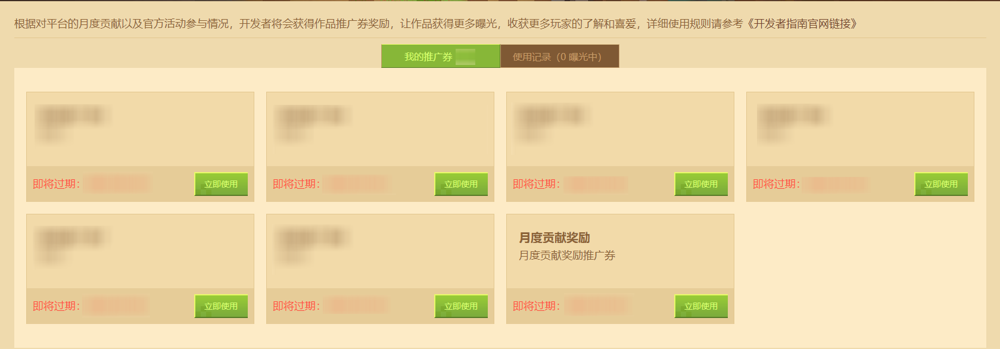
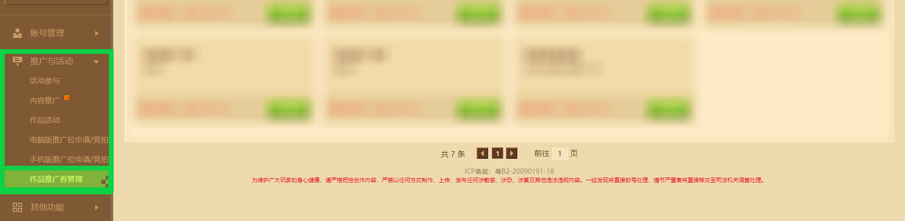
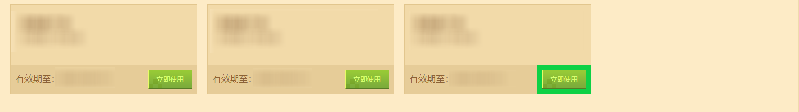
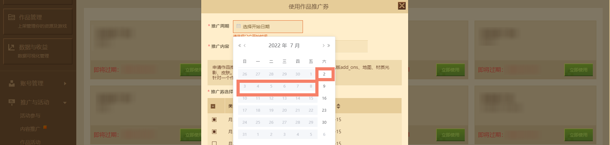
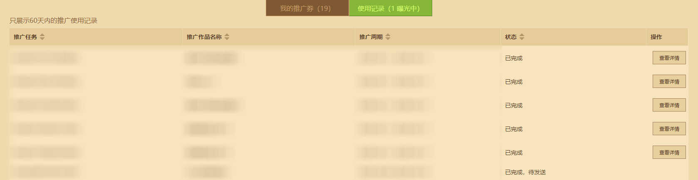
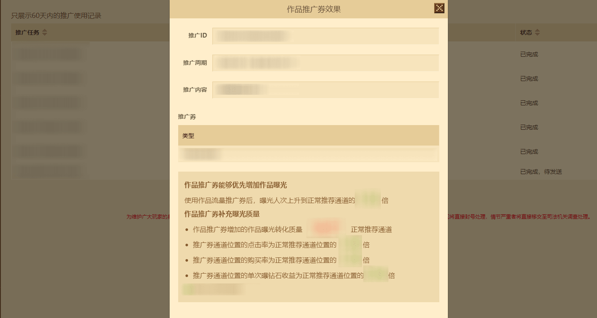

# Developer Work Promotion Coupon Usage Guide 

In order to make **developers**' excellent works gain more favor from players, the "Minecraft" developer platform has launched the **[Work Promotion Coupon Management]** function. You can find this module by finding the **[Promotion and Activities]** module in the developer platform. Here, developers can **use developer work promotion coupons** to promote their works anytime and anywhere. 

 

## Description 

**Developer Work Promotion Coupons** is a new **support form**. The official will issue **Developer Work Promotion Coupons** as rewards to developers who have made outstanding contributions to the content ecology, so as to better help **excellent works** get **traffic recommendations** in the "Minecraft" client and gain more love from players. 

The currently launched **Promotion Position Application and Auction** mode has helped many developers' works to be exclusively exposed, helping to increase the download of works and the number of players playing. **Developer Works Promotion Coupons** are more dynamic/targeted **advertisements** that can achieve **precise delivery** during popular periods and strive to achieve the best exposure effect. 

The **Developer Works Promotion Coupons** currently obtained have an expiration date of 3 months. Please use them as soon as possible before the expiration date. 

## How to use developer works promotion coupons 

Enter the "Minecraft" developer platform, click the **[Promotion and Activities]** module in the lower left corner, and select the **[Works Promotion Coupon Management]** function. 

 

Select any promotion coupon within the validity period and click **[Use Now]** . **Note: The expiration date of promotion coupons approaching the expiration date will be highlighted in red. ** 

 

To use the pop-up window, fill in the **[Promotion Period]**, **[Promotion Content]**, and **[Promotion Coupon Selection]** three required items in sequence. If the expected result is not selected, the form data cannot be submitted. The following is an introduction to the three filling areas: 

**Promotion period:** Covers the week from Saturday of the optional week to Friday of the next week. Therefore, the promotion period calendar column can only select the Saturday of each optional week. 

**Promotion content:** The price of the work needs to be **higher than 300 diamonds**, and the type range is **Add-on, map, material lighting, and skin components** in the mobile platform. 

**Number of promotion coupons:** For each work, a maximum of two **Developer Work Promotion Coupons** can be used per cycle. It is recommended to use promotion coupons with a validity period closer to the expiration date. 

 

After confirming the information, click the Submit button to submit the promotion schedule. **Note: The developer work promotion coupons used after application will be deducted immediately, and withdrawal or modification is not supported for the time being. ** 

So far, a complete developer promotion coupon usage process has been completed. 

## Check the exposure effect of developer work promotion coupons 

Under the **[Usage Record]** label of the **[Work Promotion Coupon Management]** function, the corresponding **Developer Work Promotion Coupon** in use may have four states: **Waiting**, **Exposing**, **Completed, waiting to be sent** and **Completed**. 

| Promotion Task Status | Status Description | 
| -------------- | ------------------------------------------------------------ |

| Waiting | The promotion task is waiting to enter the promotion cycle. | 
| Exposing | The promotion task is being exposed. Please wait for about a week. | 
| Completed, waiting to be sent | The promotion task has ended. The exposure results will be available for viewing on the next Wednesday. | 
| Completed | The promotion task has ended. You can click **[View Details]** to view the use effect of **Developer Promotion Coupon**. **The record only displays the promotion use record within 60 days. If you need the record, please check it in time. ** | 

When the **[View Details]** button appears, you can click the button to view the use effect of **Developer Promotion Coupon**. 

 

 

