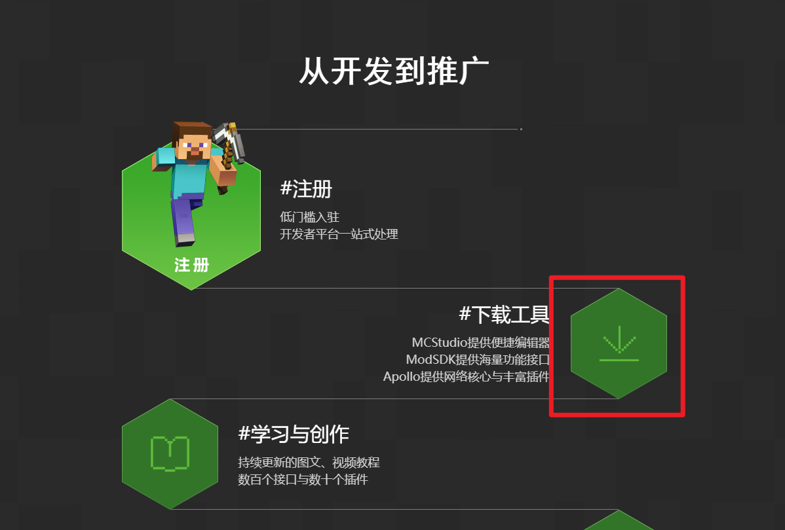
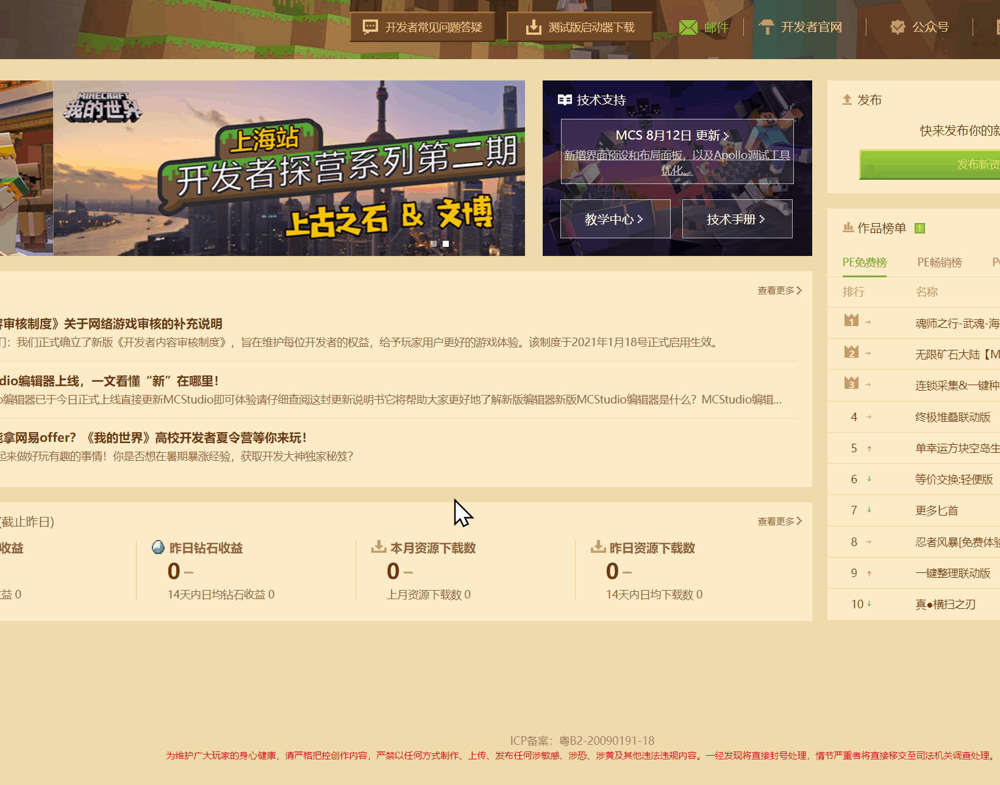

--- 
front: https://nie.res.netease.com/r/pic/20220408/e24733db-2cc1-49ee-bacb-c1913b2e6c82.png 
hard: Getting Started 
time: 5 minutes 
selection: true 
--- 
# FAQs about Minecraft Development Workbench 

### What is the Development Workbench? 

The Development Workbench is a collection of Minecraft mod production tools, including editor, work management, work upload, Bedrock Edition PC Development Edition, mod SDK, and built-in developer platform and developer forum. 

### Where can I download the Development Workbench? 

Search for the Minecraft Developer Official Website on Baidu, click to jump to the Developer Official Website, pull down and find the download tool. Or click [here](https://mc.163.com/dev/process.html#xz) to download. 

 

### Do I need a developer account to use the development workbench? 

Yes, you must have a developer account to use the development workbench. 

If you don't have an account yet, [you can click this link](https://mcdev.webapp.163.com/#/login) to register. 

### What versions of Minecraft mods/online games can the development workbench be used for? 

You can use the development workbench to directly create and make mods for the Chinese version of Minecraft Bedrock Edition. If you have a Java version mod, you can also use the development workbench to upload it. 

In addition to mods, you can also use the development workbench to develop online games for the mobile version of Minecraft Bedrock Edition. 

### How do I develop various mods or online games? 

For information about the use of the development workbench, please refer to the developer [document](../12-Getting Started Tutorial/20-MC%20Studio Instructions.md). 

If you are developing a gameplay module and using the module SDK, you can refer to the <a href="../../mcdocs/0-Overview/0-Overview.html" rel="noopenner"> technical documentation </a> 

In addition, we also have some <a href="../../mconline/15-Gameplay Component Tutorial [New Version]/0-Use Minecraft Development Workbench to Make the First Gameplay/0-Summary.html" rel="noopenner"> sample courses </a> about Add On, gameplay maps, and art production. 

If you want to develop an online game, you can refer to [Online Game Service Tool Documentation](../27-Online Games/Course 1: Becoming an Apollo Server Owner and Related Preparations/Section 1: Introduction to Apollo.md).

### How do I know the latest updates of the development workbench? 

The development workbench is updated on average every two weeks to one month. Please go to [here](https://mc.163.com/dev/mcmanual/mc-dev/mcguide/10-%E6%96%B0%E5%86%85%E5%AE%B9/1-%E5%BC%80%E5%8F%91%E5%B7%A5%E4%BD%9C%E5%8F%B0/) to check it out. Welcome everyone to try out new features. 

### If I have comments and suggestions about the development workbench, how do I give feedback to the official? 

You can give feedback on other issues through the developer FAQ at the top of the [Developer Platform](https://mcdev.webapp.163.com/#/square). 

 

Or click [this link](https://mcdev.webapp.163.com/#/feedbackModal) directly. 

You can also log in to the [Developer Forum](https://mc.netease.com/forum-111-1.html) for help and feedback. 

