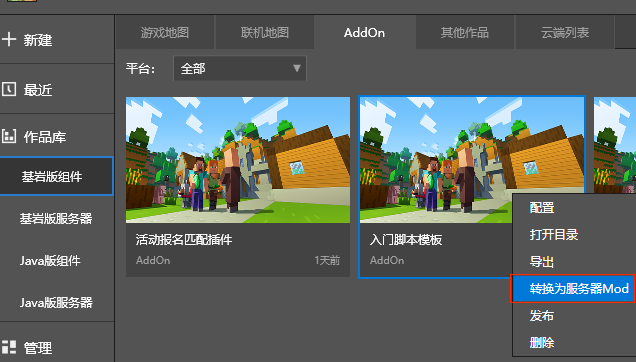

--- 
front: https://nie.res.netease.com/r/pic/20210728/2dc2a94f-71f6-4cc5-8700-3c3696f79a0c.jpg 
hard: Advanced 
time: 50 minutes 
--- 
# FAQs about online game server opening tools 
## Introduction 
### **What is the online game server opening tool? ** 

The online game server opening tool is a PE version of the online game server cluster tool maintained by the Chinese version of Minecraft. It is built into the Minecraft development workbench and integrates load balancing, cluster management, operation instructions, and multi-account collaboration functions. It also supports **complete original content** and **add-on package customization**. In order to enable server developers to better learn online game service tools from the shallow to the deep, we also provide [one-stop graphic tutorial](../27-online games/course 1: Becoming an Apollo server owner and related preparations/section 1: Apollo introduction.md) and official plug-in library for server owners. [Click here](http://mc.163.com/mcstudio/) to download the Minecraft development workbench to start your journey as a mobile game server owner! 

### **How to enter the mobile version of the online game? ** 

[Click the link to learn more about entry information](../35-listing and entry/course 12.1-bedrock version online game entry guide.md) 

### **I have never known about online game service tools before, and I want to know how difficult it is to develop? ** 

The Flower Group provides an open source official plug-in library for developers who want to learn about online game service tools. Based on the official plug-in, developers can conduct secondary development according to their own needs and quickly accumulate experience. 

The current framework used by the plug-in is the module SDK. The Kaihua Group has also added control servers, lobby servers, game servers, and function server interfaces and events based on the server architecture. Since the plug-in may need to read and write player data, in order to cope with a large number of data requests and accesses from server players, the module SDK under the online game service opening tool also packages an interface for operating the database. Based on this information, we match the technical points that need to be mastered with the expected developer's own conditions, and list the following table for developers to evaluate the difficulty according to their own conditions: 

| Technical/developer ability level | Developers who are using module SDK to make components | JAVA version plug-in developers | Developers using custom add-on package functions | 
| ----------------------- | ------------------------------- | ---------------- | ---------------------------- | 
| Add-on package structure | ✔️ | ➖ | ✔️ | 
| A small amount of command line knowledge | ➖ | ➖ | ➖ | 
| Module SDK based on Python language | ✔️ | ➖ | ➖ | 
| Database Sql syntax | ➖ | ✔️ | ➖ | 

**Note: ✔️ means that the developer has relevant development experience, which is also very important for making mobile online games. ➖ means that the developer needs to master this ability in advance. ** 

### **I want to learn how to develop mobile online games but I have no experience. Can I get any help from the official? ** 

In order to further reduce the physical and learning costs of developers learning mobile online games, we provide free development test machines for qualified developers. You can also report the technical problems and optimization suggestions you encounter in your daily life through **[Developer Platform]-[Developer FAQ]-[Feedback Other Issues]**. The official will maintain the problem through the email in the developer platform to help your server and our online game service opening tool become better! 

## Plug-in 

### **I am a server owner who has just started using the online game service opening tool. I want to know where I can get its plug-in? ** 

 

Open the Minecraft development workbench and switch to the Bedrock Edition server. Click the public MOD button in the upper right corner. The online game service opening tool plug-in that is **integrated with common needs and maintained for a long time** by the official will pop up. Server owners don't have to worry about the problem of plug-ins becoming invalid due to version upgrades. At the same time, the official website will continue to expand the **number** and **functions** of the plug-in library, allowing server owners to easily develop network servers. 

### I want to make secondary modifications to the official plug-in to meet my maximum needs. Is this allowed? 

The official plug-in basically covers all aspects of the server. If you have your own ideas for several plug-ins, **the Kaihua Group will not limit everyone's creativity**. Just download the public MOD to your local computer, and you can get all the source code and art materials of the plug-in MOD for **secondary development and adjustment**.


### I want to get more plug-ins. How will the official public plug-in pool be expanded in the future? 

The Flower Group will investigate the list of plug-in gaps that server developers need most at different time points. Here we also **sincerely invite willing plug-in developers to build the plug-in ecosystem of mobile online games with us**. The official will provide **financial support**, **free test development machines** and **development guidance from a professional team** to developers who assist in making plug-ins for online game service launch tools, so that server owners have a more flexible and convenient service launch condition! 

### I want to use third-party libraries in development with the help of Python's ecosystem. How should I do it? 

From a security perspective, developers cannot directly upload or import third-party libraries. Server owners or plug-in developers who are already using online game service launch tools for development can submit a list of libraries through **[Developer Platform]** - **[Developer FAQ]** - **[Feedback on other issues]**. The official will conduct practicality, security and other evaluations, and finally reply to the developer platform email to determine whether it is adopted. 

## Deployment 

### What is the deployment of the online game service tool? 

Deployment means that developers deploy the server development content saved locally to the remote host through the Minecraft development workbench, and push updates to the server to varying degrees according to different stages of business needs. 

### How many deployment methods are there? 

The current server supports three deployment methods: 

- Intelligent deployment: According to the configuration conditions, new players are rolled into the new server, and the old server continues to shut down gracefully after the old players leave. However, if other configurations such as control servers, functional servers, and databases are changed, redeployment will be triggered directly. 
- Redeployment: All online players will be forced to be kicked out, network server files and logs will be cleared, and then the local MOD content will be re-uploaded to the remote host. 
- Hot update: refers to updating part of the server code without stopping the server. Its execution has the following prerequisites: 
- The modified Mod content **only contains the code running on the server side**, that is, the code modification in **developer_mods**.
- **Only the implementation in the function is modified. **Adding new functions or calling new functions in **\__init__** will not take effect under hot update and need to be redeployed. 

### In addition, what other deployment details should I pay attention to? 

During the server production period, there will be three stages: **development**, **review**, and **online**. There will be additional deployment details that need to be checked separately in the three stages. 

 

| | Enable authentication | Print debug code | Package code | Automatically pull up on crash | Operation data | 
| ------------ | -------- | ------------ | ----------- | ------------ | -------- | 
| **Development stage** | | ✔ | ✔ (optional) | | | 
| **Audit stage** | | ✔ | ✔ | | | 
| **Online stage** | ✔ | | ✔ | ✔ | ✔ | 

- **Enable authentication**: Only needs to be enabled during the online stage. 
- **Print debug code**: Only needs to be enabled during the development stage and the audit stage. 
- **Package code**: Only the audit and online stages must be checked, and the development stage can be selected, but after checking, the **hot update** function will not be available. 
- **Automatically pull up on crash**: Only needs to be enabled during the online stage. 
- **Operation data**: Only needs to be enabled during the online stage. 

## Development 

### During the development phase, how should I choose the deployment method to achieve the result of code modification? 

In a stand-alone development environment, we recommend that you can choose to use hot update or redeployment to update the code. If the plug-in MOD only modifies the logic within the function, using the hot update function will allow you to test the modified content in a short time. If the code changes are large, redeployment is required, and this process will take longer than hot update. 


### I have a resource center MOD and want to convert it into a server MOD. What should I do? 

The network server MOD is also divided into the client part and the server part. But unlike in online games, the local online room host player plays both the server host and the client. In online games, the remote server host runs the server code, and the client code will be transmitted to the player's mobile phone in the form of an additional package for loading. Therefore, the script files on both ends need to be saved in different folders. **We recommend using MCSTUDIO to convert the Mod into an online game Mod**. Here we take the official introductory script template as an example: 

 

- Click on the introductory script template in the add-on package directory to convert the Mod to a server Mod 

 

- Enter the Mod name as tutorialApolloMod, click Convert, and we will get a network game Mod 

 

- Open the network game Mod and you can see the directory of the converted Mod. This is because MCStudio has performed the above "Mod conversion to network game Mod" process for us, but the client and server logic of the converted Mod has not been separated and needs to be adjusted according to "server and client". 

A sound ApolloMod directory standard is as follows: 

``` 
tutorialApolloMod 
behavior_packs 
tutorialBehavior 
developer_mods 
tutorialDev 
tutorialScripts 
resource_packs 
tutorialResource 
worlds 
level 
world_behavior_packs.json 
world_resource_packs.json 
``` 

| **File/Folder** | **Explanation** | 
| ------------------------- | ------------------------------------------------------------ | 
| tutorialApolloMod | Game server Mod root directory | 
| behavior_packs | Store client behavior packs, can contain multiple behavior packs | 
| tutorialBehavior | Behavior Pack | 
| developer_mods | Store server Mods, these Mods will only run on the server and will not be transmitted to the client | 
| tutorialDev | Server Mod | 
| tutorialScripts | The root directory of Python scripts. The scripts in this directory will be added to the Python running environment. You can import script files from this path, for example, from tutorilaScripts import modMain | 
| resource_packs | Store client resources, which can contain multiple resource packs | 
| tutorialResource | Resource pack | 
| worlds | Store maps, and also contain world_behavior_packs.json and world_resource_packs.json | 
| world_resource_packs.json | Configure resource packs that clients need to download | 
| world_behavior_packs.json | Configure behavior packs that clients need to download | 

In the past, when developing gameplay MODs, custom systems on both the client and server were generally registered in the entry file. In plugin mods, it should be emphasized that the scripts under develop_mods register the server system and call the server interface. The registration of the client system and the interface call should be placed in the behavior pack folder. The folders and files that package the corresponding systems should also be split according to this classification. On the one hand, this can **facilitate code management**, and on the other hand, it can **prevent the client script from being cracked and causing the server code contained in it to be leaked**. 

Finally, remember to configure the manifest information from the resource pack and behavior pack in world_behavior_packs.json and world_resource_packs.json, and match the corresponding values of the uuid and version fields under the header level with pack_id and version.


 

**[For more details, please click on the official tutorial link](../27-Network Games/Course 1: Becoming an Apollo Server Owner and Related Preparations/Section 1: Introduction to Apollo.md)** 

### How do I perform single-player/multiplayer testing in the development server? 

If you want to enter the server for single-player testing, click the development stage of the network service project, and then click development testing. Multiplayer testing is divided into multiple PC terminals and multiple accounts on one PC terminal. If multiple terminals are connected to the server, [you can use the sub-account collaboration function](../27-Network Games/Course 5: Practical Knowledge/Section 8: Multi-account Collaborative Deployment.md). If you only have single-machine development but want multiplayer testing, you can get the server IP and port in the main account, and use the toolbox in the upper right corner of MCSTUDIO—ModPC client to open multiple clients to connect to the server. 

 

You can also right-click the multi-client test button on the server project to call out multiple clients to connect and verify the integrity of the gameplay. 

 

## Usage 

### I want to execute instructions on the server console, how can I do it? 

 

According to the official plug-in specification, the server owner can select the configuration entry of the corresponding plug-in to enter the plug-in folder, double-click the readme.txt text to obtain the operation instructions, **login to the development machine** and send a curl request to the master to obtain the results. Take the cloud player information plug-in as an example: 

- The cloud information plug-in supports querying player cloud information using operation commands 

``` 
post url: http:masterip:masterport/cloud/query-user-cloud-items 
post body:{ 
"uid" :1357471387 #player uid 
"apply_tag" :tag0 #data applicable tag, effective when the cloud plug-in is used for different server types. Cloud plug-ins with the same tag share data 
} 
``` 

- Among them, http:masterip:masterport can find the master ip and port of your current network server in the network service development area of MCSTUDIO. cloud is the plug-in identifier to avoid conflicts caused by multiple MODs registering the same command. 

- Assuming that the masterip is the local 127.0.0.1 and the port is 8001, the command usage rules are: 

```shell 
curl -X POST http://127.0.0.1:8001/cloud/query-user-cloud-items ‘{"uid" :1357471387, "apply_tag" : "tag0"}’ 
``` 


- If the transmitted http message is correct, the following data information will be returned: 

```json 
{ 
"entity": { 
...

}, 
"code": 0, 
"message": "" 
} 
``` 

If you still have questions about command input, you can refer to the following tutorial: **[Announcement plugin usage](../27-Online Games/Course 3: Simple Network Service Template Deployment and Common Operations/Section 7: Official Plugin.md)** 

## Still have some other questions? 

Please log in to the [Developer Platform](https://mcdev.webapp.163.com/#/login) and submit your questions in the [Developer Question Answering Form Link](https://mcdev.webapp.163.com/#/feedbackModal)! 

