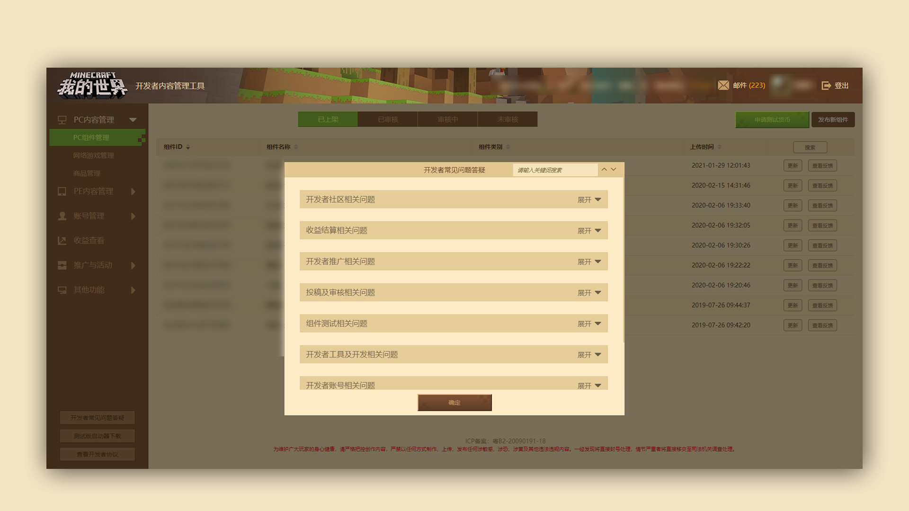

--- 
front: https://mc.res.netease.com/pc/zt/20201109161633/mc-dev/assets/img/wenti_images001.3315565c.png 
hard: Getting Started 
time: 5 minutes 
--- 
# Make Use of Developer FAQ 

### Make Use of Developer FAQ 

#### TAG: Developer FAQ 

#### Stage 1: Find the [Developer FAQ] button 

#### Stage 2: Learn to use [Keyword Search] 

Click the [Developer FAQ] button at the bottom left of the developer platform to view the developer FAQ. 

In the [Developer FAQ], there are a series of common questions such as component copyright, account, developer tool, component testing, promotion, revenue settlement, community, etc. You can search for keywords related to the problem through the [Keyword Search] in the pop-up window. 

If the FAQ does not contain the corresponding question you are looking for, you can send an email to the developer's mailbox: [minecraftstarter@163.com](mailto:minecraftstarter@163.com) and indicate the developer's nickname in the email. 

[You can also click this link](https://qun.qq.com/qqweb/qunpro/share?_wv=3&_wwv=128&inviteCode=1VX5Hn&from=181074&biz=ka&shareSource=5#/pc) to join the Minecraft Developer QQ Station to consult the administrator. 

 

