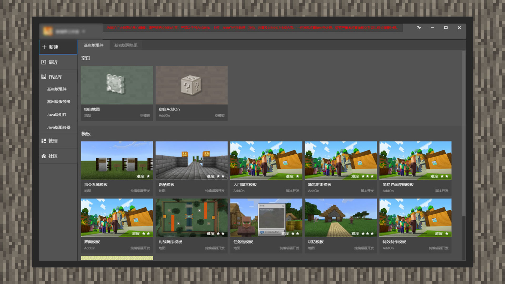

--- 
front: https://mc.res.netease.com/pc/zt/20201109161633/mc-dev/assets/img/1_1.dc061f16.jpg 
hard: Getting Started 
time: 5 minutes 
--- 
# Get to know the main interface 
#### Author: Realm 

Expected goal: Familiarize yourself with some interfaces of MCSTUDIO and develop a custom recipe 

 

Download the MCSTUDIO application from the developer's official website: [https://mc.163.com/dev/index.html](https://mc.163.com/dev/index.html), install it, then double-click the MCSTUDIO icon, enter the developer account and password in the login interface to log in, and the developer can see the main interface of MCSTUDIO. 

The main interface of MCSTUDIO is divided into the information area at the top, the navigation area on the side, and the content area in the middle. You can select the button you need to jump to other function pages in the navigation area. 

As a novice developer, this chapter will guide you how to use MCSTUDIO to create your first gameplay.