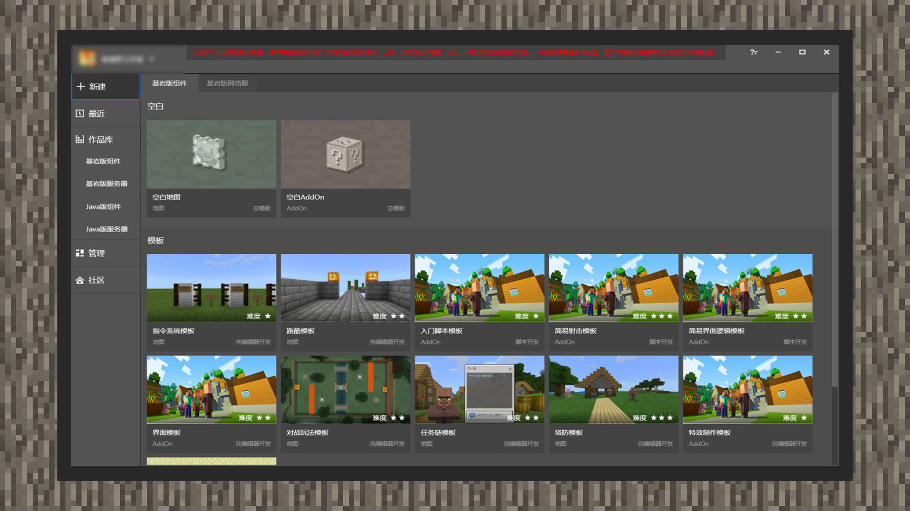

--- 
front: https://mc.res.netease.com/pc/zt/20201109161633/mc-dev/assets/img/2_1.4e93e673.jpg 
hard: Getting Started 
time: 5 minutes 
--- 
# Create a new gameplay project 
#### Author: Boundary 
 

After entering MCSTUDIO, the system defaults to the new content area. The current tool only supports the creation of Bedrock Edition maps and Bedrock Edition Add-ons. In the Bedrock Edition component-blank area, developers can choose to create a map template or an Add-on template. 

The difference between them is that after creating a map template, the gameplay you create in the editor will become a complete gameplay map with the map export. When creating an Add-on template, only the Add-on gameplay will be exported in the end. 

If it is a new Add-on gameplay, the developer should choose to create a blank Add-on template, click Start Editing, and you can start to show your skills.