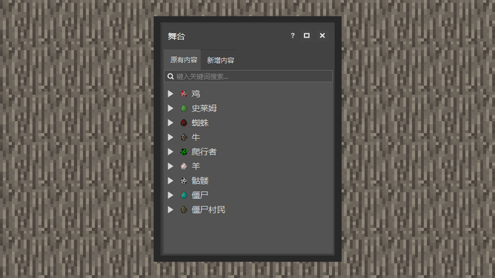

--- 
front: https://mc.res.netease.com/pc/zt/20201109161633/mc-dev/assets/img/3_1.32c9600e.jpg 
hard: Getting Started 
time: 10 minutes 
--- 
# Explore the Level Editor 

#### Author: Boundary 

 

#### What is the stage? 

The stage is the entrance to the original content and new content currently appearing in the map. When the player is born near the birth point, the world will naturally generate new creatures and blocks around the player according to the biome. Developers can see the current types of creatures through the stage, click the folding option of the creature type, and can also accurately select a certain creature. The perspective camera will automatically position on the selected creature. 

The original content is the creatures in the map that are naturally generated by the game world. The new content is the creatures placed by the developer using the editor tools after entering the editor. 
In the center of the editor is a set of game interfaces embedded in the MCSTUDIO window. Developers can click the left mouse button to select creatures within the viewing range, which has the same effect as selecting a single creature in the right area. Therefore, the game world itself is also a stage. 

#### Moving and shifting perspective 

The way to control the movement of characters in the game interface in MCSTUDIO is roughly the same as the method on the game client. Developers press the WASD walking keys on the keyboard to control the forward, backward, left and right movement of the character. 

The left mouse button can select creatures, the right mouse button can rotate the perspective, and the middle mouse button wheel can stretch the viewing distance. 

If you double-click the spacebar, the perspective will rise like a player in creative mode, and holding down the shift key will lower it. 

If the perspective does not move, move the cursor to the game interface area. 

#### Debugging, saving and backup 

When the game interface is in edit mode, developers cannot interact with the world as a player. 

If you want to debug at this time, you need to click the Run button. It will lead you into the game mode and get timely test feedback on the gameplay. 

The Save button provides the Save function, and you can also press CRTL+S at the same time to quickly save the progress. 

The Backup button provides the Clone function, which will clone the content being made. Developers can find it later in the Bedrock Edition component on the main page.