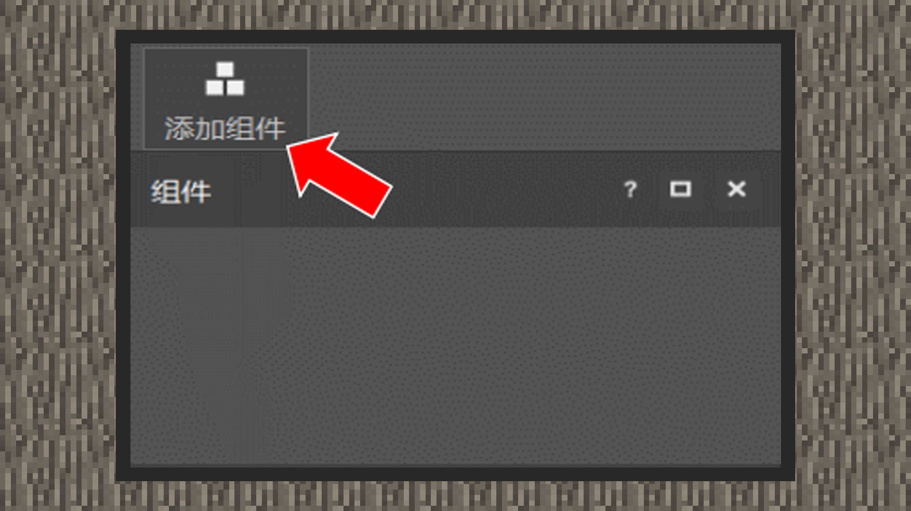
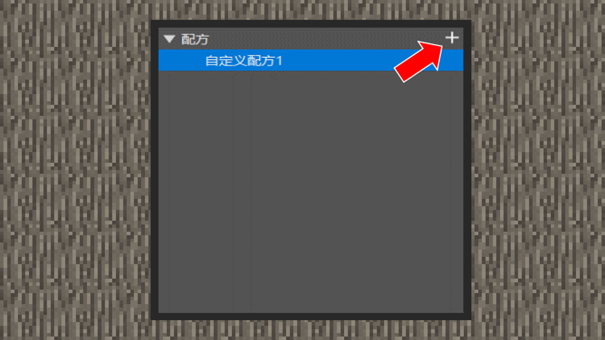
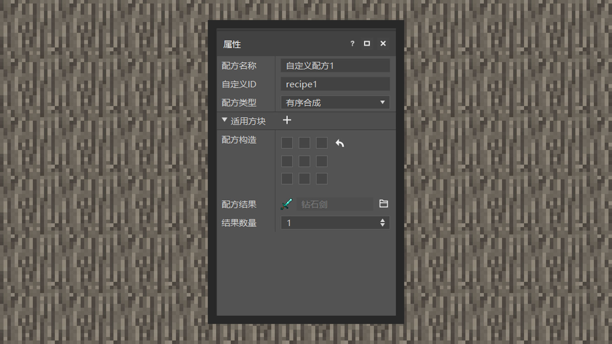
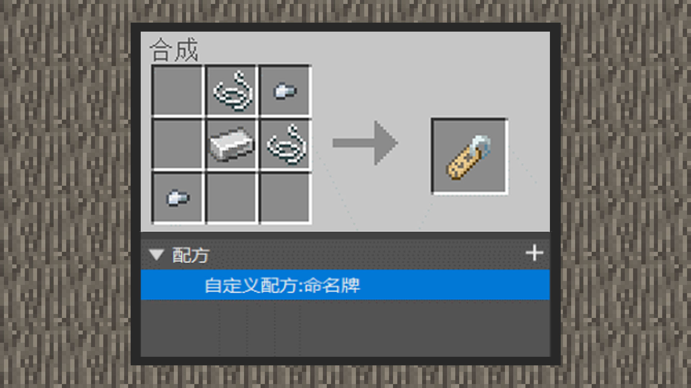
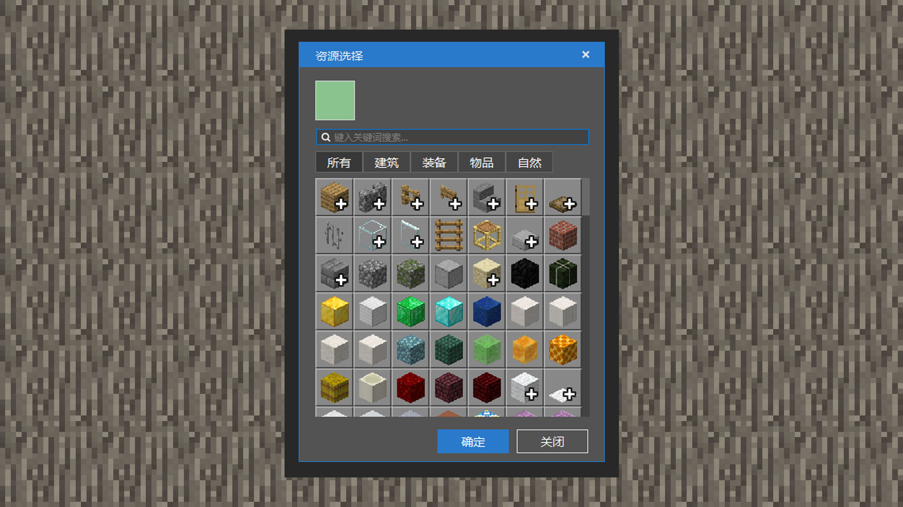
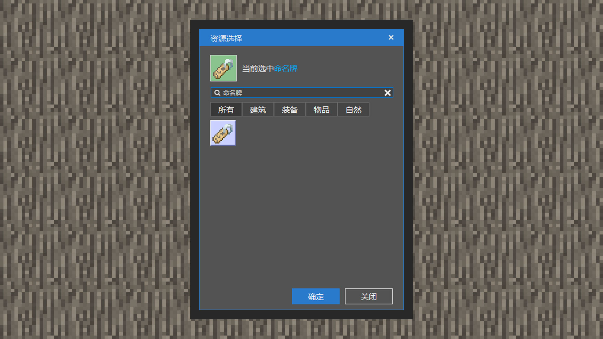
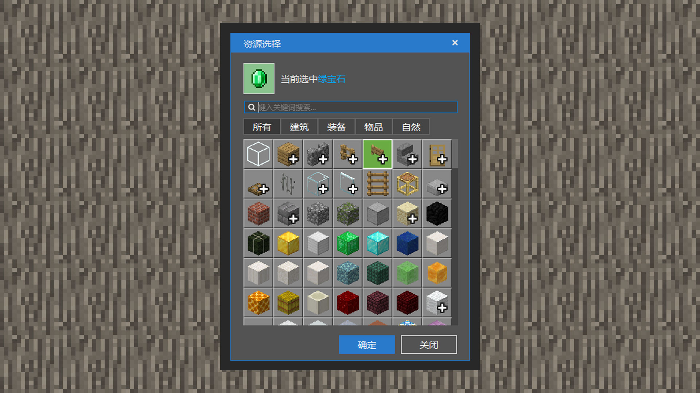
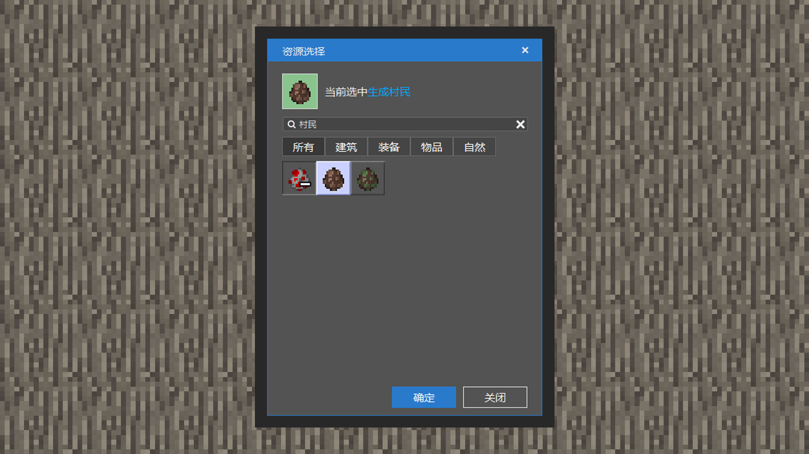

--- 
front: https://mc.res.netease.com/pc/zt/20201109161633/mc-dev/assets/img/4_4.347fdf50.jpg 
hard: Getting Started 
time: 10 minutes 
--- 
# Customize a new recipe 
#### Author: Realm 
#### Create a new recipe through the editor 

 

Move the mouse and click Add Component, select the recipe component. 

 

The recipe component will come with a new recipe by default. If the developer needs to add more recipes, click the "+" button on the right side of the recipe component to add a new recipe. 

#### Understand the various properties of the recipe 

The recipe name will only be displayed in the component area of the editor. Therefore, mastering good naming habits can help developers quickly recall the function of the recipe the next time they enter the editor.

 

Custom ID is the unique identifier of the world registered recipe. If there are more than two recipe identifiers that are the same, the associated recipe will fail to load. Therefore, naming IDs with strong readability can avoid this situation. Note: IDs should be mainly underscores/numbers/English, and are case-insensitive. Therefore, Aa and aa are the same. Developers should use the format of lowercase plus underscores as the standard, for example: a_A. The recipe type currently supports editing ordered synthesis, disordered synthesis, and furnace recipes. Among them, ordered synthesis and disordered synthesis are applicable to workbenches, and furnace recipes are applicable to furnaces, blast furnaces, campfires, etc. 

Ordered recipes mean that players need to place materials in the order of grids before the workbench can synthesize recipe props. 

Disordered recipes mean that players only need to place materials on the grids, and the workbench will synthesize recipe props. 

The recipe result is the type of props synthesized after the recipe is successfully synthesized. 

The number of results determines the number of props synthesized. 

#### New recipe: Craftable name tag 

Name tags are difficult to obtain in the early stages of the game. They can only be found in fishing, villager trading, and treasure chests in the world. They can be used to name creatures and prevent them from being refreshed by the world. Now, through the recipe component of MCSTUDIO, developers can add new recipes to obtain them. 

 

Add a recipe component and change the default recipe name to custom recipe: nametag. 

Change the custom ID here to crafting_custom_nametag. Developers can also enter an ID name that they think is more readable. 

Select Ordered Recipe for Recipe Type and Workbench for Applicable Blocks. 

 

The above example is a recipe construction demonstration. Click the corresponding grid to open the resource selection window. The fastest way is to search by entering the material name as a keyword. After selecting the material, click Confirm. 

 

Click the folder button on the right side of the recipe result to open the resource selection window and select the nametag. 

#### New recipe: Craftable Creature Egg 

Creature Eggs are items that can only be obtained in Creative Mode. Holding a Creature Egg and clicking a block will generate a corresponding creature. Now, through MCSTUDIO's recipe component, developers can add new recipes to obtain it. 

Add a recipe component and change the default recipe name to custom recipe: villager egg. 

Change the custom ID to crafting_custom_villager here. Developers can also enter an ID name that they think is more readable. 

Select the unordered recipe for the recipe type and the workbench for the applicable block. 

 

Take the legend as an example of the recipe ingredients. Click the corresponding "+" button and select the folder button on the right side of the ingredient to open the resource selection window. The fastest way is to search by entering the material name as a keyword. After selecting the material, click Confirm. 

 

Click the folder button on the right side of the recipe result to open the resource selection window and select Generate Villager.