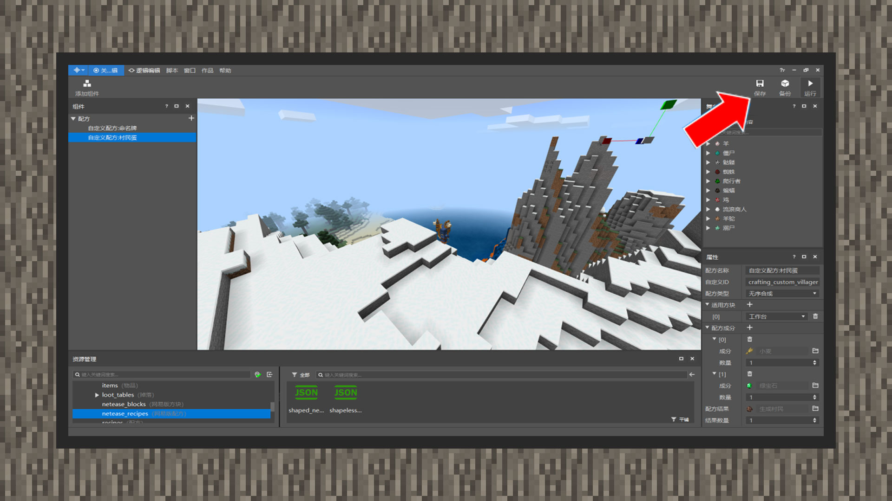
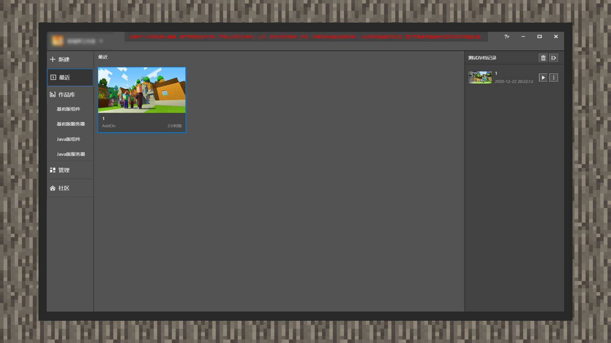
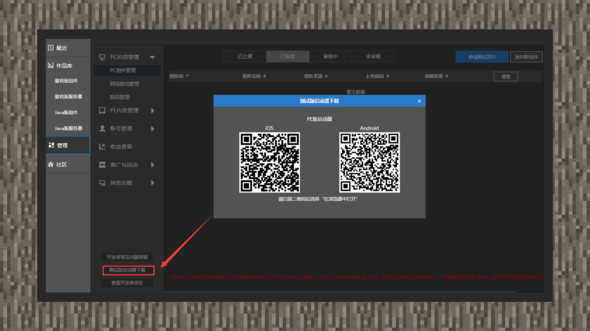

--- 
front: https://mc.res.netease.com/pc/zt/20201109161633/mc-dev/assets/img/5_3.8964e499.jpg 
hard: Getting Started 
time: 10 minutes 
--- 
# Test the gameplay and run it on your phone 
#### Author: Boundary 
#### Test the gameplay 

 

Click Run, the editor will pop up the client window, and the developer can test the local gameplay. 

Before testing the gameplay, please remember to save the current production progress at any time to avoid the problem of progress loss. 

#### Run Add-on on your phone 

 

Click the Recent option, and you will see the component you just made. Move the mouse to the component and click More, then click Publish, and select New Project. Then fill in the relevant content according to the resource release process, click Save, and then click Self-Test or Submit for Review. 

 

Then download the mobile test package in MCSTUDIO-Management-Beta Version Launcher, and developers can experience their first gameplay on the mobile beta version.