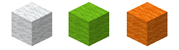
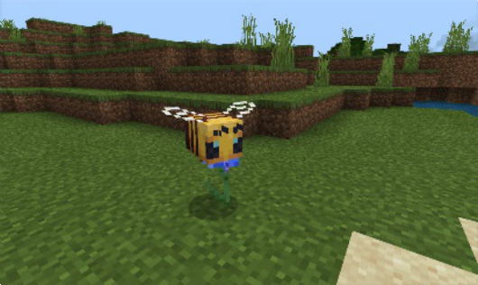
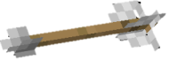
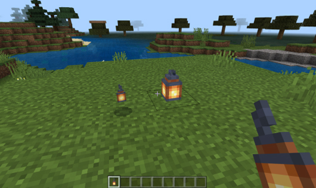
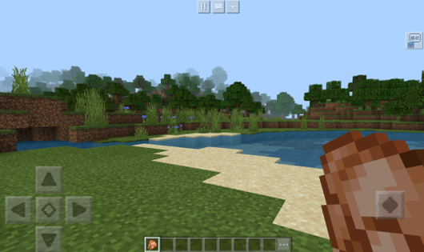

--- 
front: https://nie.res.netease.com/r/pic/20220408/3dcdbaa9-9583-4921-a28d-33df67afe608.png 
hard: Getting Started 
time: 20 minutes 
selection: true 
--- 

# Understanding the Minecraft World 

#### Author: Realm 

In the Minecraft world, the basic unit for building the world is the block. Buildings are made up of blocks, biomes are made up of blocks, and creatures in the natural world are also made up of blocks in the model. 

Learning to recognize blocks means that you are beginning to slowly accept the influence of the MC style on your own creations, and it will also be of great help to your subsequent learning process. In addition, there are many extended contents in the world, which serve the world with their own functional characteristics. 

#### World 

The world is a game archive. It may be a single-player save file for your local game, a cloud save file for multiplayer games, or a server save file for large-scale server games. The save file is not limited to a certain terminal, so you can put the server save file in a single-player game, or put the single-player survival save file on the server. 

 

In theory, in the Minecraft world, players cannot travel to all corners of the world. Because this world has no boundaries, each world will grow uniquely because of the "world seed". The world seed consists of a string of digital characters containing positive and negative integers, and the game will create different worlds based on this value. Players can share seeds through the save setting interface and share world save files with the same landform. 

 

When players continue to adventure, the game will generate the next area for players to explore based on the world seed and algorithm. Since the world is infinite, the Minecraft world uses the concept of blocks to achieve this function. 

#### Blocks 

 

Blocks are areas composed of world blocks with a length and width of 16 blocks and a height of 255 blocks. When a player enters the game, the location where he appears must be located in a certain block of the world. 
By setting the simulation distance of the world archive, such as the 6 blocks in the figure below, the area that the player can see is only the size of these 6 blocks. Other blocks will not be loaded. Only when the player moves to other blocks will the game start loading those blocks and unload the previous blocks to achieve a smooth gaming experience. 

 

#### Biome 

 

Biomes span multiple blocks. Different biomes have different natural environments. The picture above shows the intersection of swamps, forests, and plains. The water in the swamp is dark green, while the water in the forest and plains is light blue. There will be a color transition between the two at the confluence. Not only that, the type of biome also determines its altitude, flora, geographical features, temperature, humidity, sky, vegetation color, biological distribution, etc. This climate zone that is similar to the real earth will never be repeated because of the "world seed": players will see different blocks and different creatures in the same location, and everyone's story in the Minecraft world is different because of this. 

#### Blocks 

Blocks are the basic components of Minecraft. Most blocks are 1 unit long, wide, and high. Different blocks have different materials. A block may have multiple block states, such as wool of different colors. At the same time, a block may be able to store data, such as a box that saves the prop information in the box. 

 

Example: Wool of different colors 

 

Example: A large box has 54 storage spaces, each of which can hold one item. Each item contains complex item information, which is stored in the box block in the form of data. 

#### Creatures 

Creatures are a general term for entities that are visible, active, and have autonomous consciousness in the game. Creatures have their own unique AI behaviors, are controlled by the game, and affect the world. 

 

Example: A fox pouncing on a chicken! 

 

Example: A bee collecting nectar. 

The player is a special creature. His behavior comes from the player's own will and needs to be controlled by the person in front of the screen. Compared with other creatures, players have other gameplay mechanisms that are the core of Minecraft. Such as gaining experience, synthesizing props, eating, etc. 

 

Example: By default, players have two basic skins, Steve and Alex. In skin creation, they correspond to thick arm skin and thin arm skin respectively. 

#### Entity 

An entity is a moving object with typical behavior in the game. It is the base class of creatures. In the Minecraft world, not all entities have autonomous AI. Some need to be controlled by external forces, and some behave like blocks. 

 

Example: A boat has typical behaviors such as speed and collision volume, but it will not slide autonomously when placed on water. It needs to be controlled by the player to help it move and migrate. 

 

Example: A painting is a decorative entity hanging on the wall. It has no autonomous behavior except for its ornamental value. 

#### Projectiles 

Projectiles are entities that are thrown into the air by external forces. They are affected by gravity and friction during flight. Different projectiles may have different abilities. 

 

Example: In Bedrock Edition, in addition to ordinary arrows, there are 16 types of potion arrows with status effects. The degree to which the player holds the bow and charges will directly affect the subsequent acceleration of the arrow flying in the air. 

#### Items 

Items are a general term for item entities and item props. Items usually only appear in storage cells, including player backpacks and shortcut bars, various boxes, creature backpacks, etc. Items usually include three behaviors. One is a block item, that is, it is an item in the inventory and a block when placed. One is that it will become an entity after being placed, such as a boat item. The last one can be used, such as weapons, tools, food, equipment, synthetic materials, etc. 

When a creature or player discards an item, the item will exist on the ground in an entity. If it is thrown into the water, it will float to the surface of the water due to the buoyancy of the water. When a creature with the ability to pick up an item approaches the item entity, the entity will be cleared, and the item will appear in the creature's inventory. 

 

Example: When the Hell Alloy Sword in its entity form is picked up by the player, a sword item can be obtained. It can increase the player's attack damage by 8 points, and it takes effect every time the player holds it and swings it at the target. 

 

Example: When a player approaches a creature egg in physical form and picks it up, he can get a creature egg item. The player can summon a corresponding creature by right-clicking the ground. 

 

Example: When a player approaches a lamp in physical form and picks it up, he can get a lamp item. The player can summon a lamp block by right-clicking the ground. 

#### Resource Effects 

Resource effects refer to various resource files used in the Minecraft game. In the following chapters, the required file contents will be listed separately for each piece of content. 

Resources can be divided into sound effect resources, texture resources, model resources, etc. Among them, in the Chinese version of Bedrock Edition, for model resources, the Flower Group allows developers to use skeletal models to replace the models of most creatures in the game, thereby achieving different performance effects. 

Special effects are game content that simulates various natural effects in the Minecraft world. For example, the block particles scattered when players dig blocks, and the splashes when passing through the water surface. In the "Original Particles and Special Effect Particles" chapter, we will also learn more about how to make this series of content. 

#### UI interface 

The interface is a channel for interaction between the world and the user throughout the game process. Players can control the corresponding game logic by triggering the UI. In the "Advanced: Creating Interfaces" chapter, the tutorial will lead developers to learn how to make new interfaces. 

 

Example: In the Bedrock Edition, click on the item with the mouse and drag it to the box in the interface. 

 

Example: In the mobile version, click on the grid of the quick inventory to switch items.