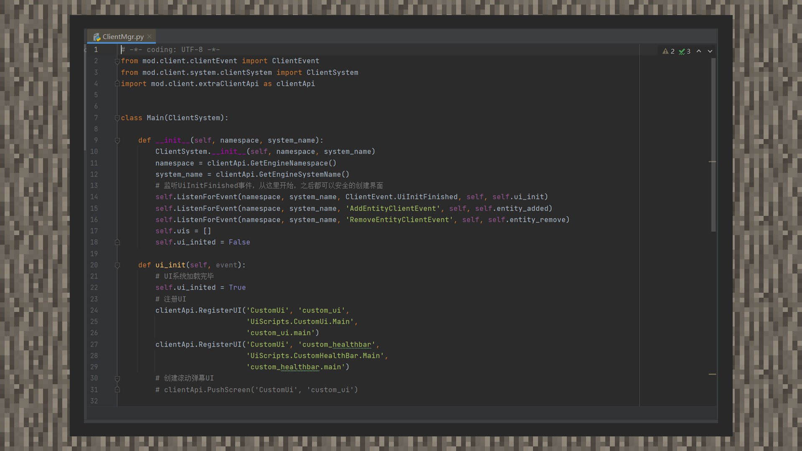

--- 
front: https://mc.res.netease.com/pc/zt/20201109161633/mc-dev/assets/img/1_2.1dfacb37.jpg 
hard: Getting Started 
time: 5 minutes 
selection: true 
--- 
# Introduction to basic development tools 
#### Author: Realm 

#### Development tools 

When developing and designing gameplay, developers may write more complex codes without MCSTUDIO. A handy tool can make development efficiency higher. Here are two options for developers: 

Use an external text editor with more comprehensive functions. For example: Visual Studio Code, NotePad++, and related software on mobile phones can edit the native add-on package (Add-on) of Bedrock Edition. For an explanation of the add-on package, please refer to the tutorial "Addon-The Cornerstone of Everything". 

 

In addition, if you want to use more interfaces to achieve more complex module gameplay, you can choose the Chinese version of the MODSDK framework, based on which you can use the Python language for module development. During the development process, it is recommended that developers use a standard IDE (Integrated Development Environment), such as Pycharm. Such tools can help developers improve efficiency when using the Python language for development. For more introductions to the MODSDK framework, you can check the tutorial "First Sight at MOD". 

 

#### Art Tools 

In Minecraft, models, animations, textures of organisms, as well as items and block textures, are all considered art resources. 

Developers need various art resources when developing gameplay functions. When drawing simple blocks and item textures, developers can choose their favorite drawing software. BlockBench is needed to make resources such as biological models and block models. It is a software for Minecraft art production developed and maintained by Jennis, a foreign individual developer. 

It can meet the production and drawing of biological models, block models, skins and other resources of the Bedrock Edition of Minecraft. At the same time, the prepared biological models can be animated, particle previewed, sound effects demonstrated, etc. in the same software. 

Download the local version: [https://blockbench.net/downloads/](https://blockbench.net/downloads/) 

Web version entrance: [https://web.blockbench.net/](https://web.blockbench.net/) 

 

#### Map tools 

The map includes terrain and buildings. Developers can choose the production tools, the building auxiliary components of the resource center, or use the map editor function of MCSTUDIO. 

Here is a way to facilitate developers to convert the JAVA version and the Bedrock Edition map format. MCCTOOLCHESTPE is a free closed-source MC world archive conversion software developed and maintained by cynodontA. It supports converting Java version maps to Bedrock version and Bedrock version maps to Java. 

Download entrance: [http://mcctoolchest.com/download](http://mcctoolchest.com/download)

