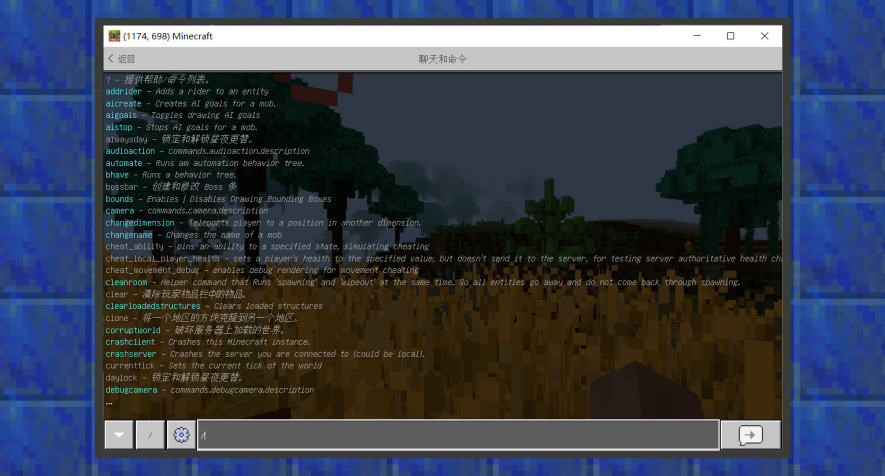

--- 
front: https://mc.res.netease.com/pc/zt/20201109161633/mc-dev/assets/img/1_1.1a7c5b55.png 
hard: Getting Started 
time: 5 minutes 
--- 
# Command system, your creative manager 
#### Author: Realm 
#### What is a command 

Commands are advanced functions activated by users by entering specific text. In the game, adventurers can use commands to achieve some cheating methods, and developers can use commands to achieve some more advanced practices and make interesting and fun maps. 

