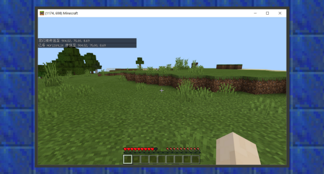
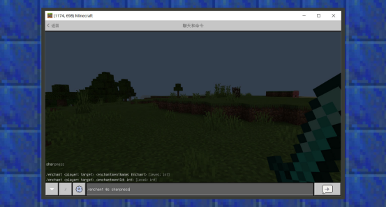
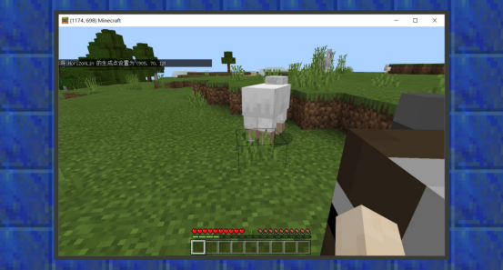
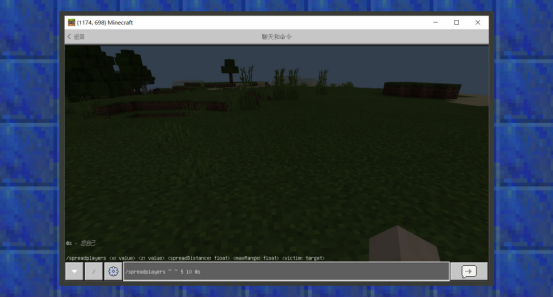
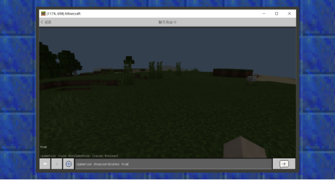

--- 
front: https://mc.res.netease.com/pc/zt/20201109161633/mc-dev/assets/img/5_3.0efa798f.png 
hard: Advanced 
time: 60 minutes 
--- 
# Common commands and usage 
#### Author: Realm 

#### Creature commands 

Creature commands mainly summarize the usage of commands related to entities. 

#### Usage of summon command 

``` 
/summon command, used to generate an entity in the world. In Bedrock Edition, it has two syntax formats. 

1./summon <entityType: EntityType> [spawnPos: x y z] [spawnEvent: string] [nameTag: string] 

2./summon <entityType: EntityType> <nameTag: string> [spawnPos: x y z] 

``` 

EntityType is filled with the name field of the creature. The name field is the unique identity tag of the creature in the world. For example, the name field of a cow is minecraft:cow, and the name field of a chicken is minecraft:chicken. If it is an original creature, minecraft: can be omitted, while custom creatures need to type the full name. 

In the Minecraft command system, the parameters wrapped by "[ ]" are omitable parameters. For example, in the first way of writing, if the user gives the creature type but does not fill in the following three parameters, the command will execute normally and return the result. spawnPos is a coordinate parameter, which will default to spawning at the user's coordinates, while spawnEvent is a creature event, which will execute the minecraft:entity_spawned event by default. If nameTag is the name of the creature, it will default to no name. 

In the second way of writing, the user is required to fill in the creature name field and the creature name by default. Similarly, if the spawn coordinates are not given, it will default to spawning at the user's world location. 

 

 

 

#### kill command usage 

``` 
/kill command is used to clean up entities in the world, including players, creatures, projectiles, drops, etc. In Bedrock Edition, it has a syntax format: 

/kill [target: Target] 

The first parameter of /kill is an optional parameter, which means that when the user does not give a target selector, the user himself is cleaned up by default. Given a target selector, the filtered target entities will be cleaned up.

``` 

 

#### Usage of the give command 

``` 
The /give command is used to give items to players. In Bedrock Edition, it has a syntax format: 

/give <player: target> <itemName: Item> [amount: int] [data: int] [components: json] 

/give can only give players, so the range of the target selector variable is narrowed to @p, @r, and @a. In <itemName>, an item name domain needs to be given. The item name domain has the same attributes as the biological name domain, and is the unique identifier of a certain item in the world. For example, an apple is minecraft:apple. If the item given is an original item, minecraft: can be omitted. If a custom item is given, the full name needs to be typed. 
``` 

[amount: int] is an optional parameter. If it is not filled in, a prop will be given by default. Int can be simply understood as an integer. In my world, the number of props stacked must be an integer. For example, there is no such thing as 1/2 or 0.5 apples. 

[data:int] is an optional parameter. If it is not filled in, it is given by default as 0. data is the additional value of the item. In the original props, many items have additional values to distinguish different characteristics of the same item. For example, in the game, players can collect 16 colors of wool. Therefore, the additional value determines the color of the wool. Generally, there is only one type of prop, so the additional value defaults to 0. 

[components: json] is an optional parameter. If it is not filled in, it defaults to none. It must be a json object, which is used to specify that the item has special functions. It currently only supports minecraft:can_place_on[determines what blocks a block item can be placed on], minecraft:can_destroy[determines what blocks an item can destroy], minecraft:item_lock[added in 1.16.100, can lock items so that they cannot be dropped or moved, etc.], and minecraft:keep_on_death[even if the player dies and respawns, the item will be retained]. 

 

 

#### Usage of the xp command 

``` 
/xp command is used to increase or decrease the player's experience value. It has two syntax formats: 

1. xp <amount: int> [player: target] 

2. xp <amount: int>L [player: target] 

``` 

Since only the player entity has the concept of experience value, this command only works on the player. 

In the first format, <amount:int> is a required parameter. Users can enter positive values to increase experience points and negative values to decrease experience points. Experience points must be integers between 0 and 2147483647, which is a very large range. Generally, you can enter an acceptable value. [player: Target] is an optional parameter. If it is not filled in, the command will take effect on the user himself. 

In the second format, the only difference from the first format is that a capital L is added after the first parameter is filled in. This directly grants the increased experience level instead of experience points. In Minecraft, within a level, the level will be increased after the experience points reach the upper limit of the level requirement. This is the relationship between level and experience points. Similarly, users can enter positive values to increase experience levels and negative values to decrease experience levels. Levels must be integers between -2147483647 and 2147483647. 

 

 


#### Usage of Tp command 

``` 
The /tp command, which can also be written as /teleport command, is a command used to transmit entities. In Bedrock Edition, it has 9 syntax formats: 

1. /tp <destination: x y z> [checkForBlocks: Boolean] 

2. /tp <destination: target> [checkForBlocks: Boolean] 

3. /tp <victim: target> <destination: target> [checkForBlocks: Boolean] 

4. /tp <destination: x y z> [yRot: value] [xRot: value] [checkForBlocks: Boolean] 

5. /tp <destination: x y z> facing <lookAtPosition: x y z> [checkForBlocks: Boolean] 

6. /tp <destination: x y z> facing <lookAtEntity: target> [checkForBlocks: Boolean] 

7. /tp <victim: target> <destination: x y z> [yRot: value] [xRot: value] [checkForBlocks: Boolean] 

8. /tp <victim: target> <destination: x y z> facing <lookAtPosition: x y z> [checkForBlocks: Boolean] 

9. /tp <victim: target> <destination: x y z> facing <lookAtEntity: target> [checkForBlocks: Boolean] 
``` 

<destination: x y z> means a coordinate parameter is required. <victim: target> and <destination: target> require a target selector. 

[checkForBlocks: Boolean] is an optional parameter that accepts true and false values. When it is true, the entity will be teleported only when there is no overlapping block with the entity in the teleport coordinate area, otherwise the execution will fail. This is to ensure that when teleporting a player, you do not want him to be teleported into a block and suffer suffocation damage. If you fill in false, this situation will be ignored and the entity will be teleported to the specified target by default. 

[yRot: value] is an optional parameter. It accepts a value. This integer must be between -180.0 and 180.0. It can be a decimal or an integer. Its function is to rotate the horizontal angle of the entity when teleporting it to the target location. 

[xRot: value] is an optional parameter. It accepts a value. This integer must be between -180.0 and 180.0. It can be a decimal or an integer. Its function is to rotate the vertical angle of the entity when teleporting it to the target location. 

<lookAtPosition: x y z> is a parameter that requires a given value. It accepts a coordinate parameter. Its function is to make the target face a certain coordinate when teleporting it to the target location. 

<lookAtEntity: target> is a parameter that needs a given value. It accepts a target selector variable. Its function is to make the target look at a certain entity when teleporting the entity to the target location. 

 

 

#### Usage of tag command 

``` 
/tag command is used to give entity tags. In Bedrock Edition, it has 3 syntax formats. 

1. /tag <entity: Target> add <name:string> 

2. /tag <entity: Target> list


3. /tag <entity: Target> remove <name:string> 
``` 

In the first format, it mainly introduces how to use the tag command to add tags to entity targets. Among them, <entity: Target> gives a target selector parameter. < name> gives a name, both of which are required parameters. 

In the second format, it mainly introduces how to use the tag command to query the tag of the entity target. Among them, <entity: Target> gives a target selector parameter, which is a required parameter. 

In the third format, it mainly introduces how to use the tag command to remove tags from entity targets. Among them, <entity: Target> gives a target selector parameter. < name> gives a name, both of which are required parameters. 

 

 

 

 

 

 

#### Usage of the testfor command 

``` 
The /testfor command is used to detect and count entities (players, creatures, items, etc.) that meet the specified conditions. It has a syntax format: 

1. /testfor <victim: target> 
``` 

Where <victim: Target> accepts a target selector parameter, which is a required parameter. 

Example: 

``` 
1. Detect falling objects with a center of (128,64,128) and a radius of 5 meters 

/testfor @e[type=item,x=128,y=64,z=128,r=5] 

2. Detect whether Steve is online 

/testfor Steve 
``` 

 

 


#### Usage of scoreboard command 

``` 
/scoreboard command is used to manage the scoreboard system. In Bedrock Edition, it has twelve syntax formats:

1. /scoreboard objectives add <objective:string> dummy [displayName:string]

2. /scoreboard objectives list

3. /scoreboard objectives remove <objective:string>

4. /scoreboard objectives setdisplay <list:sidebar> [objective: string] [ascending:descending]

5. /scoreboard objectives belowname [objective:string]

6. /scoreboard players list [player: Target]

7. /scoreboard players reset <player:Target> [objective:string]

8. /scoreboard set|add|remove players <player:Target> <objective:string> <count:int>

9. /scoreboard players random <player:Target> <objective:string> <min:int> <max:int>

10. /scoreboard operation <targetName:Target> <targetObjective:string> <operator:operator> <.selector:Target> <objective:string> 
``` 


The scoreboard system is a mechanism that tracks player scores by operating complex commands. Based on the player's current score as a condition, the target selector can be used to filter out this type of player and execute the corresponding command. 
In the first format, it mainly introduces how to use the scoreboard command to add a score type to the entity target. Among them, <objective:string> gives a score name. < displayName> gives a display name. The former is a required parameter and the latter is an optional parameter. 

In the second format, it mainly introduces how to use the scoreboard command to display the score type. 

In the third format, it mainly introduces how to use the scoreboard command to remove the score type. 

In the fourth format, we mainly introduce how to use the scoreboard command to display the scoreboard. <list:sidebar> is a required parameter. When displayed in the list, the scoreboard content will appear in the player list on the right side of the pause interface. When displayed in the sidebar, the content will be displayed in the interface on the right side of the player's screen. [objective: string] is an optional parameter. When this item is not filled in, the content of the displayed list or sidebar will be cleared, but the original score value will not be affected. When this item is filled in, the value of this numeric type will be displayed on the list or sidebar. [ascending:descending] is an optional parameter. Since the value must be an integer type, it can be sorted in ascending or descending order. 

In the fifth format, we mainly introduce how to use the scoreboard command to display the score under the player's name. [objective:string] is an optional parameter. When it is not filled in, the score previously displayed under the player's name will be cleared; when filled in, the specified score will be displayed under the player's name. 

In the sixth format, we mainly introduce how to use the scoreboard command to print the player's score value in the chat bar. [player: Target] is an optional parameter. When it is not filled in, all the score types currently mounted on the player will be printed. If filled in, you can fill in @a, @s and the specified player name to display the player scores of a specific group. 

In the seventh format, we mainly introduce how to use the scoreboard command to reset the player's score. <player:Target> is a required parameter, which needs to let the command know which type of player's score to reset, and [objective:string] is an optional parameter, which refers to the score type. Resetting means clearing the score value, that is, no longer carrying a value of a certain score type. 

In the eighth format, we mainly introduce how to use the scoreboard command to set, add, and remove the player's score. <player:Target> is a required parameter, <objective:string> is the score type, and <count:int> is the value. Set means setting, that is, setting the player's score to a certain integer without any mathematical calculation. Add means adding. When the player has no score, the effect is equivalent to "setting", and when the player has a score, the effect is equivalent to adding. Remove means removing. When the player has no score, the score becomes 0 - the given value, so it is equivalent to the negative value of the set value. When the player has a score, the effect is equivalent to subtracting. 

In the ninth format, it mainly introduces how to use the scoreboard instruction to randomly select the player's score. Among them, <player:Target> is the player selector, which is a required parameter, <objective:string> is the score type, which is a required parameter, and <min:int> <max:int> respectively represent the minimum and maximum values. 

In the tenth format, it mainly introduces how to use the scoreboard instruction to calculate a player's score and finally set the target player's score to the calculation result. <targetName:Target> is the target player selector, and the player whose score is finally changed is the type of player specified by this parameter. <targetObjective:string> is the score type of the target player. <operator:operator> is an operator, including %=[modulus], *=[multiplication], +=[addition], -=[subtraction], /=[division], <[if the target score is less than others' score, set the target score to be equal to others' score], =[set the target score to be equal to others' score], >[if the target score is greater than others' score, set the target score to be equal to others' score], ><[replace the target score with others' score]. <selector:Target> can refer to other player selectors. Similarly, this other can point to oneself, that is, one's own score is calculated with one's own. <objective:string> is the score type.


 

 

 

 

 

 

#### How to use the execute command 

``` 
/execute allows the user to use this command to make a specific type of entity execute another command. Since under normal circumstances, other creatures will not execute commands except players, this command is very useful. In Bedrock Edition, it has two syntax formats: 

1. /execute <origin: target> <position: x y z> <command: command> 

2. /execute <origin: target> <position: x y z> detect <detectPos: x y z> <block: Block> <data: int> <command: command> 

``` 

In the first format, it mainly introduces how to use the execute command to make an entity execute a command. Among them, <origin: target> is the target selector, the selected entity will be the object of the execution command, <position: x y z> is the coordinate parameter, and <command: command> is the command to be executed. 

In the second format, it mainly introduces how to use the execute command to make an entity execute a command, and it also needs to pass a block detection. <detectPos: x y z> is the block coordinate to be detected, <block: Block> is the block name, and <data: int> is the block additional value. 

 

 

#### Usage of the enchant command 

``` 
/enchant allows the user to enchant the enchantable item in hand. It should be noted that different enchantable items may not have the same enchantability. If some red prompts are returned, it is likely that the developer has enchanted the wrong enchantment attribute to the item in hand. For example, enchanting the special enchantment attribute of the trident on the sword. In Bedrock Edition, it has two syntax formats: 
1./enchant <player: target> <enchantmentId: int> [level: int] 

2./enchant <player: target> <enchantmentName: Enchant> [level: int] 
``` 

The first format differs from the second format only in enchantmentId and enchantmentName. There are 36 enchantments in Bedrock Edition, each of which corresponds to an enchantment numeric ID and also has an enchantment name. For other parameters, <player: target> is the target selector, which is a required parameter, and [level: int] is the enchantment level, which is an optional parameter. When it is not filled in, as long as the correct item is held, the enchantment attribute of the enchantment level is assumed to be 1. At the same time, due to the enchantment level limit of the original version, different enchantments above a certain level cannot be enchanted with commands. 

 

 


 

#### Usage of effect command 

``` 
/effect allows the user to use this command to give a potion effect to a specific type of entity. In Bedrock Edition, it has two syntax formats: 
1./effect <player: target> clear 

2./effect <player: target> <effect:Effect> [seconds:int] [amplifier:int] [hideParticles:Boolean] 
``` 

In the first format, <player: target> is a required parameter, but please don't be confused by its command prompt, it can be used on all creatures. Clear means that all status effects on the target of this type will be removed. 

In the second format, <effect:Effect> is the status effect, which is a required parameter, [seconds:int] is an optional parameter, that is, the duration of the status effect, [amplifier:int] is the strength of the status effect, which is also an optional parameter, and [hideParticles:Boolean] is a Boolean parameter, that is, whether to hide the status effect particles, true is hidden, false is not hidden, and the default is false. 

 

 

#### Usage of the clear command 

``` 
/clear allows the user to use this command to clear items in a player's backpack. In Bedrock Edition, it has a total syntax format: 

1./clear [player: target] [itemName: Item] [data: int] [maxCount: int] 
``` 

In the first format, [player: target] is an optional parameter, which refers to the player type selector, so you can only fill in @a, @s, player name, etc. If it is not filled in, the default object is the executing player himself. At the same time, if the other parameters are not filled in, all items in the backpack of the player will be cleared, including the equipment bar, quick bar, and backpack bar. [itemName: Item] is the item name, [data: int] is the item value, and [maxCount: int] is the maximum number of items. When the maximum number of items is not specified, the same type of items matched by the command will be cleared regardless of how many are stacked. 

 

 

### World Commands 

World commands mainly summarize the usage of commands related to the game world. 


#### Usage of time command 

``` 
/time allows users to use this command to change the time of the game world. In my world, 24000 represents the game time that will pass in one day. In Bedrock Edition, it has a total syntax format: 


1./time add <amount: int> 

2./time query <daytime|gametime|day> 

3./time set <amount: int> 

4./time set <time: TimeSpec> 

``` 

In the first format, <amount:int> refers to the length of time, that is, how much time is added to the current time. 

In the second format, <daytime|gametime|day> represents the game time of the day, gametime represents the total game time, and day represents how many days have passed in this world. query means that the data obtained after querying these times will be displayed in the chat box. 

In the third format, <amount: int> refers to a certain time, that is, set the current time to a certain time. 

In the fourth format, <time: TimeSpec> refers to a certain period of time, the types are day [daytime], night [night], noon [noon], midnight [midnight], sunrise [sunrise], sunset [sunset]. That is, set the current time to one of these 6 periods of time.

 

 

 

#### Usage of the tickingarea command 

``` 
/tickingarea allows the user to use this command to add a constantly loading area. A constantly loading area means that the area you added will continue to load. No matter how far away the player is, the block state and biological activities of that area will continue to run normally. Such as plant growth, furnace burning, biological reproduction, etc. In Bedrock Edition, the command can only add ten constantly loading areas in this world archive at a time. It has 6 syntax formats: 

1. /tickingarea add <from: x y z> <to: x y z> [name: string] 

2. /tickingarea add circle <center: x y z> <radius: int> [name: string] 

3. /tickingarea remove <name: string> 

4. /tickingarea remove <position: x y z> 

5. /tickingarea remove_all 

6. /tickingarea list [all-dimensions: AllDimensions] 
``` 

In the first format, <from: x y z> is a coordinate parameter, that is, the range from a certain coordinate to a certain coordinate <to: x y z> is a constant loading area, and [name: string] is an optional parameter, that is, a name is set for the constant loading area. 

In the second format, <center: x y z> is a coordinate parameter, that is, a circular area starting from a certain coordinate and ending outside a certain radius range of <radius: int> is used as the constant loading area, and [name: string] is an optional parameter, that is, a name is set for the constant loading area. 

In the third format, <name: string> is a required parameter, that is, the name of the constant loading area. Use this format to remove the constant loading area with this name. 

In the fourth format, <position: x y z> is a coordinate parameter, which is a required parameter. Use this format to remove the constant loading area with this coordinate as the starting point.


In the fifth format, use this format to delete all the loading areas at once. 

In the sixth format, [all-dimensions: AllDimensions] is an optional parameter, that is, the loading areas in all dimensions. If it is not filled in, only the loading areas in the current dimension will be displayed. 

 

 

 

 

#### Usage of the setworldspawn command 

``` 
/setworldspawn allows users to use this command to set the spawn point of the main world. In Bedrock Edition, it has a total syntax format: 

1. /setworldspawn [spawnPoint: x y z] 
``` 

In this unique format, [spawnPoint: x y z] is the spawn point coordinate parameter. When it is not filled in, the coordinates of the current user are set as the spawn point coordinates by default. 

 

 

#### Usage of spawnpoint command 

``` 
/spawnpoint allows users to use this command to set the spawn point coordinates of a certain player. In Bedrock Edition, it has a total syntax format: 

1. /spawnpoint [player: target] [spawnPos: x y z] 
``` 

In this unique format, [player: target] is the player target selector parameter, so it only supports @a, @s, player name, etc. When it is not filled in, the default target is the executing player himself. [spawnPos: x y z] is the birth point coordinate parameter. When not filled in, the current user's coordinates are set as the birth point coordinates by default. 

 

 

#### Usage of spreadplayers command 

```

/spreadplayers allows the user to use this command to spread entities in a certain area. In Bedrock Edition, it has a total syntax format: 

1./spreadplayers <x: value> <z: value> <spreadDistance: float> <maxRange: float> <victim: target> 
``` 

In this unique format, <x> <z> are the x-axis and z-axis of the coordinate parameters, <spreadDistance: float> is the distance between each dispersed target. <maxRange: float> is the range of the dispersed targets from the midpoint, and <victim: target> is the entity target selector, so don't be confused by the command name, it also supports targets such as @a, @e, @s, and player names. 

 

 

#### Usage of locate command 

``` 
/locate allows the user to use this command to display the nearest vanilla feature building in the chat box. In Bedrock Edition, it has a total format: 

1. /locate <feature: Feature> 
``` 

In this unique format, <feature: Feature> is a required parameter, and the command prompt will guide the player to select the feature they are looking for. However, it should be noted that some features only appear in specific biomes, and users cannot locate these features in other biomes. For example, players are looking for features in the netherworld in the main world. 

 

 

#### Usage of the gamemode command 

``` 
/gamemode allows the user to use this command to set the game mode of a certain player. In Bedrock Edition, it has two syntax formats: 

1./gamemode [gamemode: GameMode] [player:target] 

2./gamemode [gamemode:int] [player:target] 
``` 

In the first format, [gamemode: GameMode] is a string of the mode type, which can be set to survival mode, creative mode, and adventure mode. [player:target] is the player target selector parameter. Since only players have the concept of game mode, only @a, @s, player name, etc. can be filled in here. 

In the second format, [gamemode:int] is the numerical ID corresponding to the mode type, 0 is survival mode, 1 is creative mode, and 2 is adventure mode. 

 

 

 


#### Usage of gamerule command 

``` 
/gamerule allows users to use this command to set the game rules of the world. In Bedrock Edition, it has two syntax formats: 

1. /gamerule [rule: BoolGameRule] [value:Boolean] 

2. /gamerule [rule: IntGameRule] [value:int] 
``` 

The difference between the first format and the second format is that some game rules in Minecraft only have yes and no options, while some game rules can set value rules. For example, whether to spawn monsters must only have yes and no options, and the birth range must be a rule that can set values. For more rules, please refer to the minecraft wiki: 

[https://minecraft.gamepedia.com/Game_rule](https://minecraft.gamepedia.com/Game_rule) 

 

 

#### Usage of the difficulty command 

``` 
/difficulty allows users to use this command to set the game difficulty of the world. In Bedrock Edition, it has two syntax formats: 

1. /difficulty <difficulty: Difficulty> 

2. /difficulty <difficulty: int> 
``` 

The difference between the first format and the second format is that there are 4 game difficulties in Minecraft, namely Peaceful, Easy, Normal, and Hard. Therefore, in addition to parameters with full names and abbreviated names, they also allow values 0~3 to be used as parameters for setting game difficulty. 

 

 

#### Usage of the alwaysday command 

``` 
/alwaysday allows users to use this command to set whether the world is always in daytime. In Bedrock Edition, it has a total syntax format: 

1. /alwaysday <lock:Boolean> 
``` 

In this unique format, it accepts a Boolean value, that is, true (true) or false (false). When set to true, the world is always in daytime. When set to false, the world will cycle normally from day to night. 


#### Usage of weather command 

``` 
/weather allows users to use this command to set the world's weather. In Bedrock Edition, it has two syntax formats: 

1. /weather clear|rain|thunder <duration:int> 

2. /weather query 
``` 

In the first format, clear means clearing the current weather effect. If there is no weather effect such as rain or thunder, there will be no change. Rain means setting the weather to rainy day. Thuner means setting the weather to thunderstorm day. Duration:int means the duration of the weather, which accepts an integer value. 

In the second format, query means querying the current weather. 

 

 

### Chat Commands 

Chat commands mainly summarize the usage of commands related to chat. 


#### Usage of tellraw command 

``` 
The /tellraw command allows the user to send a message in json format to the player. In Bedrock Edition, it has a total syntax format: 

1. /tellraw <target: target> <raw json message: json> 

In the first format, <target: target> is the target selector, but in general, the target selector with the player type is filled in here, because only players can see chat messages. <raw json message: json> is a message sent to the player in the format of a raw json message. 
``` 

Take the message "Hello" as an example. Usually, when other chat commands are used to send it to others, or when using the chat window to chat, the player name is prefixed. If the user wants to customize a broadcast format, tellraw is a very useful command helper. 
/tellraw @a {"rawtext":[{"text":"[Broadcast Station]Hello"}]} will send a message prefixed with the broadcast station and the content is hello to all players. 

 

 

#### Usage of title command 


``` 
The /title command allows the user to send a message in plain text or json format to the player. In Bedrock Edition, it has three syntax formats: 

1. /title <player: target> <clear|reset> 

2. /title <player: target> <title|subtitle|actionbar> <titleText: message|raw json titleText: json> 

3. /title <player: target> times <fadeIn: int> <stay: int> <fadeOut: int> 
``` 

In the first format, <player:target> is the player target selector, which is a required parameter, and clear is to clear the title text currently being played by the player. reset is to reset the time configuration of the title. 

In the second format, <player:target> is the player target selector, which is a required parameter, <title|subtitle|actionbar> is the three types of screen title, screen subtitle, and title above the shortcut bar, which are required parameters, and titleText receives plain text or json messages, which is a required parameter. 

In the third format, <fadeIn: int> is the fade-in time, <stay: int> is the stay time, and <fadeOut: int> is the fade-out time. This format can be used to set the time configuration of the title. 

 

 

 

 

#### Usage of tell | msg | w command 

``` 
The /tell | /msg | /w command allows the user to whisper to a player. In Bedrock Edition, the formats of these three commands are almost the same: 

1. /tell | /msg | /w <target: Target> <mssage: message> 
``` 

In this format, <target: Target> must be a player target selector, which is a required parameter, and <mssage: message> is a piece of plain text. When the command is used successfully, it is generally based on "you whisper to someone: a certain content". 

 

 

#### Usage of me command 

``` 
The /me command allows the user to send a message to himself. In Bedrock Edition, there is only one format for this command: 

1. /me <mssage: message> 
``` 


In this format, <mssage: message> is a plain text and is a required parameter. When the command is used successfully, it is generally displayed in the chat window in the format of "* name a paragraph of content". 

 

 

### Block Commands 

Block commands mainly summarize the usage of commands related to blocks. 


#### Usage of setblock command 

``` 
/setblock command allows users to set a block at a certain coordinate point. In Bedrock Edition, this command has only one format: 

1. /setblock <position: x y z> <tileName: Block> [tileData: int] [destroy|keep|replace] 
``` 

In this format, <position: x y z> is a coordinate parameter, <tileName: Block> is the block name, [tileData: int] is the block additional value, [destroy|keep|replace] is the block replacement mode, destroy is to destroy the previous block and set the command block, which will generate block destruction particles and sounds. Keep is a value that will replace non-air blocks. Replace is to directly replace the previous block with a block without generating destruction particles and sounds. By default, if the block replacement mode is not filled in, it is replace. 

 

 

#### Usage of the clone command 

``` 
The /clone command allows the user to copy blocks from one area to another. In Bedrock Edition, this command has two formats: 

1. /clone <begin: x y z> <end: x y z> <destination: x y z> [maskMode: MaskMode] [cloneMode: CloneMode] 

2. /clone <begin: x y z> <end: x y z> <destination: x y z> filtered <cloneMode: CloneMode> <tileName: Block> <tileData: int> 
``` 

In the first format, <begin: x y z> is the starting coordinate parameter, <end: x y z> is the ending coordinate parameter, and <destination: x y z> is the position coordinate parameter to be pasted. [maskMode: MaskMode] is the mask mode, there are two mask modes: masked and replace. The former only copies the non-air blocks in the selected area, and the area that will be replaced by air blocks will remain unchanged when pasting. replace is to copy all blocks in the selected area. Their main function is to filter the copied blocks. If not specified, replace is used by default. [cloneMode: CloneMode] is the copy mode. There are three modes: force, normal, and move. Force is forced copying, which means copying an area and pasting it to another area. Move can be understood as cutting, which means moving an area to another area. The blocks taken away from the source area will become air blocks. Normal does not execute the other two modes. 

In the second format, the mask mode is changed to the filter mode, and the block parameters and block additional value parameters are added, which means that the clone command will only copy a certain type of block that meets the block additional value and block name, and paste it to the destination area according to the copy mode. 

 

 


#### Usage of fill command 

``` 
The /fill command allows the user to fill an area with a certain block. In Bedrock Edition, this command has two formats: 

1. /fill <from: x y z> <to: x y z> <tileName: Block> [tileData: int] [oldBlockHandling: FillMode] 

2. /fill <from: x y z> <to: x y z> <tileName: Block> <tileData: int> replace [replaceTileName: Block] [replaceDataValue: int] 
``` 

In the first format, <from: x y z> is the starting coordinate of the area to be filled, <to: x y z> is the ending coordinate, <tileName: Block> is the block name, [tileData: int] is the block additional value, and [oldBlockHandling: FillMode] is the filling mode of the old block. It has five modes: destroy, hollow, keep, outline, and replace. Destroy will destroy all blocks in the area and drop some of the blocks' drops if the conditions are met. hollow only fills the outermost blocks of the area with the specified blocks, and the interior will be replaced with air blocks. If the filling area has no interior (such as a volume less than 3x3x3), the effect is equal to replace. keep will only replace the air blocks in the area with the specified blocks. outline is similar to hollow, but it will not replace the air blocks in the interior. replace will replace all blocks in the area, but will not drop any drops or produce block destruction sounds, particle effects, etc. 

In the second format, the default mode is replace mode, but there are two more parameters [replaceTileName: Block] [replaceDataValue: int], that is, the blocks in a certain area that match the replaced block name and block additional value are changed to the blocks required for filling. 

 

 

#### Usage of the testforblock command 

``` 
The /testforblock command allows the user to test whether a block at a certain coordinate matches the given command block parameters, and print the result information in the chat bar. This command has one format: 

1. /testforblock <position: x y z> <tileName: Block> [dataValue: int] 
``` 

In this format, <position: x y z> is the coordinate parameter of the block, which is a required parameter, <tileName: Block> is the block name, which is a required parameter, and [dataValue: int] is the block additional value parameter, which is an optional parameter. If not filled in, when a certain block has multiple additional values, they will all be matched. 

 

 

### Sound effect commands 

Sound effect commands mainly summarize the usage of commands related to sound effects. 


#### Usage of playsound command 

``` 
The /playsound command allows the user to play sound effects at a certain coordinate for a certain type of player. This command has one format: 

1. /playsound <sound: string> [player: target] [position: x y z] [volume: float] [pitch: float] [minimumVolume: float] 
``` 


In this format, <sound: string> is a required parameter. You can find the required sound resource key under sound_definitions.json. It supports playing custom sound effects. [player: target] is an optional parameter, which is the player target selector. Therefore, you can only fill in @a, @s, player name, etc. [position: x y z] is an optional parameter, which is the coordinates of the sound effect. Since most of the original sound effects are 3D sound effects, the farther away from the player receiving the sound effect, the lower the volume heard by the player. [volume: float] is the sound volume, [pitch: float] is the sound pitch, and [minimumVolume: float] is the minimum volume. 

 

 

#### Usage of the stopsound command 

``` 
The /stopsound command allows the user to stop playing a sound effect for a certain type of player. This command has the following format: 

1. /stopsound <player: target> [sound: string] 
``` 

In this format, <player: target> is a required parameter, which is the player target selector, so only @a, @s, player name, etc. can be filled in. [sound: string] is the sound effect resource key. If this parameter is not filled in, all playing sound effects, including background sound effects, will be stopped by default. 

 

### Special Effect Commands 

Special Effect Commands mainly summarize the usage of commands related to special effects. 


#### Usage of particle commands 

``` 
The /particle command allows users to play a particle effect at a certain coordinate in the world. This command supports playing custom particle effects, and the particles are visible to all players when playing. This command has the following format: 

1. /particle <effect: string> <position: x y z> 
``` 

In this format, <effect: string> is the particle name field and is a required parameter. If you need to know more about the original particles, you can find them in the particles folder under the original resource package directory. Since some particles may need to be given particle parameters, and the current particle command does not support the input of particle parameters, some particles may not play correctly or cannot play normally. <position: x y z> is a coordinate parameter used to specify the position where the particle is generated. Players far away from this position may not be able to see the particle effect. 

 

