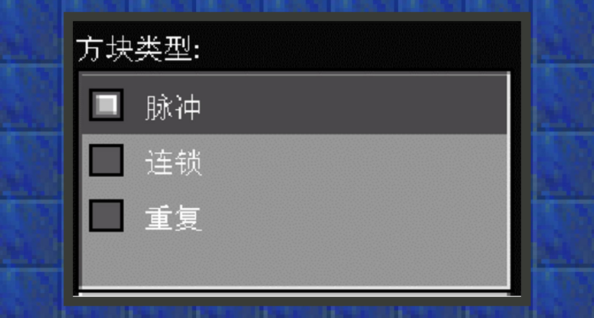
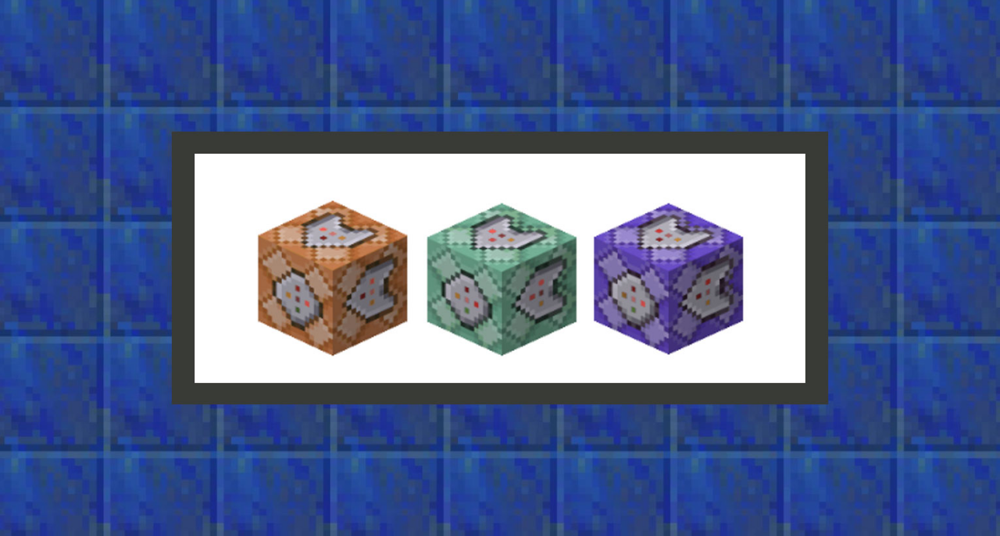
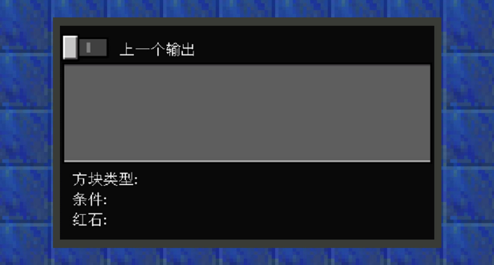
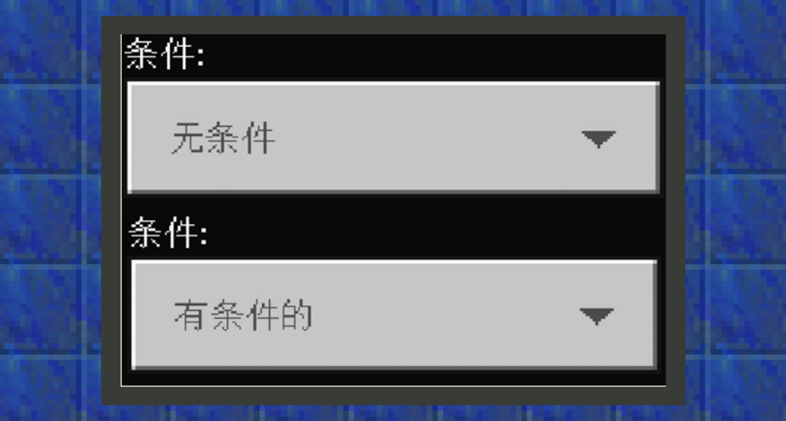
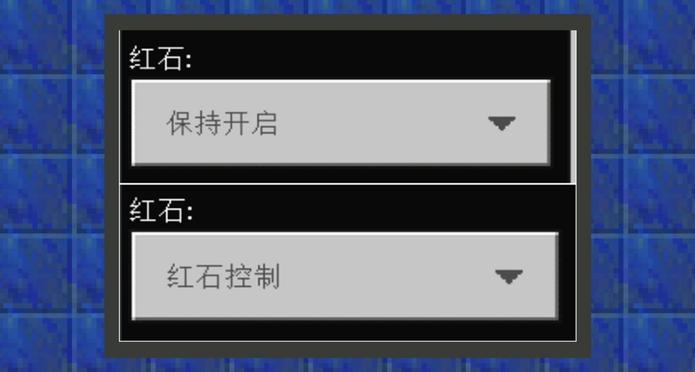
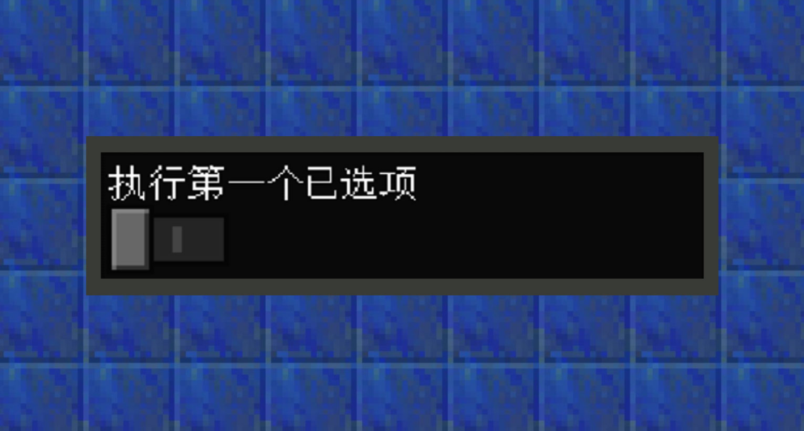
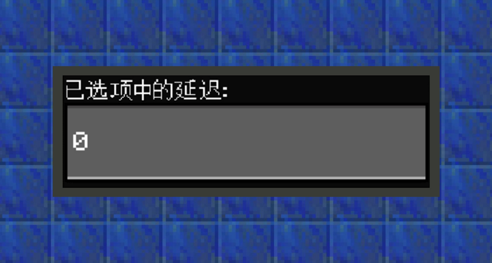
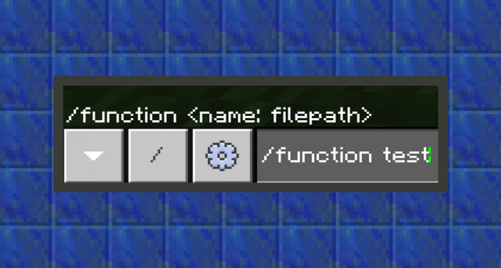
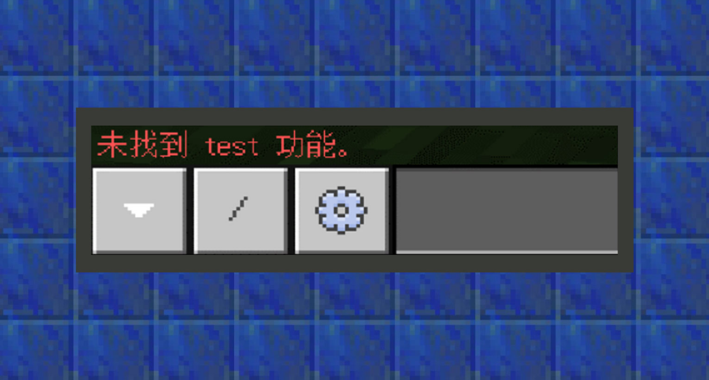

--- 
front: https://mc.res.netease.com/pc/zt/20201109161633/mc-dev/assets/img/2_1.d438c68d.png 
hard: Getting Started 
time: 20 minutes 
--- 
# How to use commands 
#### Author: Boundary 
#### Use the chat box to enter commands 

In the PC client, press the shortcut key "T" or "/" to open the chat window. When you press "/", the command prefix format "/" will be automatically added to the input bar, so "/" is a very practical shortcut key. 

In the mobile version, you need to click the chat button at the top of the screen to call out the chat window. 

When opening the chat window, the PC client also supports TAB completion of commands. This means that you don't need to type the complete command format, and using tab to complete the command can save a lot of production time. 

The mobile version does not currently support command completion.

#### Executing commands through command blocks 

Command blocks are special blocks used to execute commands. They cannot be obtained by creating a backpack, but can only be obtained by typing /give @s command_block in the game. Note: You need to turn on the Enable Command Block option in Settings-Game. 

 

Commands can be entered into the command input box. When multiple commands are required, press the enter key to wrap. Press the + sign to enlarge the input box to see the commands outside the box. 

 

Click the "Pulse/Chain/Loop" option to change the command block type. The default is "Pulse", and the color of the command block will also change when the type changes. 

 

Pulse command blocks are orange. This block is a "standard" command block, and it executes a command once when activated. 

Chain command blocks are green. They will only execute a command if the block they are pointing at executes the command. 

Loop command blocks are purple. They will execute a command once every game tick while they are activated. 

 

Open the "Last Output" button to get the return information of some commands with return information running under the command block. For example: use the testblock command to check whether the block at a certain coordinate is of a certain type and return the test result. 

 

Click the "Unconditional/Conditional" option to change the conditional behavior of the command block: 

Conditional": Only when the previous command block pointing to itself executes the command successfully, the next command block will continue to execute the command. 

Unconstrained: The command block will ignore the conditional behavior. 

 

There are two ways to activate the command block, namely, select Keep On or Redstone On in the Redstone option in the block interface. 

Keep On: The command block will always remain in working state. 

Redstone On: It must be activated like a redstone mechanism to execute the command. 

The following redstone objects can activate command blocks: 

A redstone torch, redstone block, daylight detector, button, etc. placed next to a command block. 

Adjacent powered blocks. 

A redstone comparator or redstone repeater that outputs a signal pointing toward the command block. 

Active redstone dust around the command block. 

 

Specifies whether a looping command block should execute its instructions immediately after activation, or the first time after a delay from activation if disabled. 

 

For impulse command blocks and chain command blocks, specify the game time delay before executing the command after being activated or triggered. For looping command blocks, specify the game time delay before it re-executes the command. For impulse command blocks and looping command blocks, setting the delay to "0" and "1" has the same effect, and the game will treat "0" as "1". However, for chain command blocks, "0" and "1" are different. When the command block with a delay is destroyed, the unexecuted commands will not be executed. 

#### Execute commands through function 

Function is a file type that can be recognized by Add-on and executed as a set of commands in the game by command /function <file name>. The file suffix is .mcfunction. Take the following figure as an example, here the test.mcfunction file in the function folder under the behavior pack will be executed. 

 

If the file is not found in the correct path, an exception is returned. 

 

