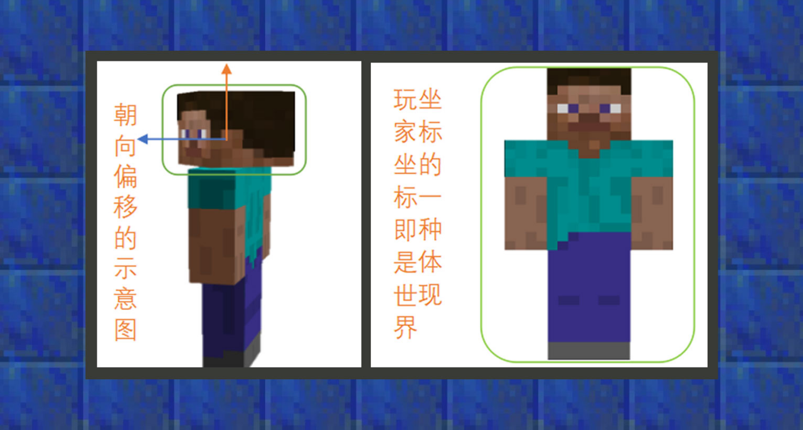

--- 
front: https://mc.res.netease.com/pc/zt/20201109161633/mc-dev/assets/img/3_1.21fa97ec.png 
hard: Advanced 
time: 40 minutes 
--- 
# Understanding command parameters 
#### Author: Realm 
#### What are coordinate parameters 
 
The example in the above picture prompts you to fill in the coordinate parameters for the next type of command parameters. 


Absolute coordinates: World coordinates are considered absolute coordinates. For example, when the adventurer uses the command "/tp 128 64 128", the character will be teleported to the position with world coordinates of "x:128 y:64 z:128". 

Relative coordinates: Relative coordinates are considered as offsets from absolute coordinates. Usually, adventurers can use the tilde symbol ~ to indicate that the coordinates are the world coordinates of the current station. Therefore, you can add a calculation formula next to the ~ symbol to achieve the result of coordinate offset. For example, when the adventurer uses the command "/tp ~+1 ~-1 ~", he will be teleported to a position one grid positive on the X axis and one grid negative on the Y axis from the current world coordinates. 

Local coordinates: Local coordinates are the offset in the direction of sight. Usually, adventurers can use the insertion symbol "^" to indicate that the coordinates are the direction coordinates of the current head. 

 

Unlike relative coordinates, local coordinates use the head direction as the reference point. For example, if the adventurer wants to teleport the teleported object in the direction it is facing, the insertion of local coordinates will be used. Taking the "tp" command as an example, when the adventurer uses the command "/tp ^ ^ ^+5", the adventurer will be teleported 5 grids from the current position to the position in the direction it is facing. 


#### What is a target selector 

 

The example in the above picture prompts you to fill in the target selector for the next type of command parameter. 


Under normal circumstances, commands are entered by the user and then executed by the user. For example, executing the "/tp" command can transfer the executor to a coordinate. 

However, in map gameplay, the individual who executes the command is often not only a player with a specific name, but also other creatures in the map. In order to obtain these creatures, you need to learn how to use the target selector. 


The target selector can use the conditional parameters to filter out one or more individuals that finally meet the conditions for executing the command based on the variables selected by the user. 

The target selector variable is used to specify the general classification of the target to be selected. There are 5 variables in total: 

``` 
@p: Select the nearest player 

@r: Select a random player 

@a: Select all players 

@e: Select all entities including all players 

@s: Select yourself 
``` 

 

If you only enter the selector variable, it is not enough to meet the various customization needs of developers. Therefore, the Minecraft command system also provides users with the function of conditional parameters to filter out target individuals. This is called the target selector parameter. In the current Chinese version, there are 12 types: 

``` 
x, y, z: coordinates 

r, rm: distance 

dx, dy, dz: volume size 

scores: score item score 

tag: scoreboard tag 

c: quantity 

l, lm: experience level 

m: game mode 

name: entity name 

rx, rxm: vertical rotation angle 

ry, rym: horizontal rotation angle 

type: entity type 
``` 


The selected group is limited by the specific format @variable[<parameter>=<value>,<parameter>=<value>,<parameter>=<value>,.....], where the parameters and values are not case-sensitive. 


#### Coordinate parameter 

The coordinate parameter is used to define a starting point, and it is often used together with the distance parameter. For example, the command user wants to start from a certain coordinate point and let the entities within a radius of 5 grids around teleport to his side. The target selector can be done like this: 

 

The three parameters "x, y, z" determine a coordinate in the world, and "r" represents the distance range. "rm" is the opposite, representing the distance range. The combination of the two can obtain entity targets starting from one range and ending at another range. 

Therefore, the role of the starting point is often used in conjunction with the distance parameter to select entity targets within an area. 


#### Volume size 

 

The volume size parameter is used to define a certain rectangular area. It is often used together with the coordinate parameter. The world coordinates passed in by the coordinate parameter are used as the reference point, and the specific number of grids are extended in the "X" direction (dx), the specific number of grids are extended in the "Y" direction (dy), and the specific number of grids are extended in the "Z" direction (dz). In the final rectangular area, the entities that overlap with the coordinates are the selected entity targets. In the example, the instruction user tries to start from a certain coordinate point, let it extend a 5x5x5 cube area and teleport the entities that overlap with it to his side. 


#### Scoring Item Score Parameters 

The scoring item score parameter allows developers to select targets by score. The mob's score comes from the "scoreboard" directive. There are many ways to filter by the score of a specified target, but the basic format is based on @variable[scores={score item=score value}]: 

``` 
@e[scores={myscore=10}] - Select all targets with a score of 10 in the score item myscore. 

@e[scores={myscore=10..12}] — Select all targets with a score of 10 to 12 in the score item myscore. 

@e[scores={myscore=5..}] — Select all targets with a score of 5 or more in the score item myscore. 

@e[scores={myscore=..15}] — Select all targets with a score of 15 or less in the score item myscore. 

@e[scores={foo=10,bar=1..5}] — Selects all targets whose score of score item foo is 10 and whose score of score item bar is between 1 and 5. 
``` 


#### Scoreboard 

The scoreboard tag parameter allows developers to select targets by tag. The scores of creatures come from the tag directive. The basic format is based on @variable[tag=tag name]: 

``` 
@e[tag=tag name]——Select all entities with "tag name". 

@e[tag=!tag name]——Select all entities without "tag name".


@e[tag=]——Select all entities without tags. 

@e[tag=!]——Select all entities with tags. 
``` 

Allows the target selector parameter to filter multiple tags at the same time. The filtered target individuals must meet the conditions of all tag parameters: 

``` 
@e[tag=abc,tag=def]——Select all entities with both "abc" and "def" tags 

@e[tag=abc,tag=!def]——Select all entities with both "abc" and "def" tags 

``` 


#### Quantity parameter 

The quantity parameter is used to select the number of targets not exceeding the given value. In Bedrock Edition, by default, the use of the target selector variables "@p" and "@r" will limit the number of targets to "1", so adventurers can use the quantity parameter to increase the number of targets. In "@e" and "@a", if a positive value is passed as the quantity parameter, the target entity closest to the adventurer that meets the screening requirements will be obtained. If a negative value is passed as the opposite, the target entity that meets the screening conditions and is farthest from the user will be obtained. 

``` 
@p[c=3]——Get the 3 players closest to the user 

@a[c=-4]——Select the 4 players farthest from the user 

@r[c=2]——Randomly select 2 players in the world 
``` 


#### Level parameter 

The level parameter is used to filter target entities that meet the given level range. In Bedrock Edition, there are two related parameters: 
lm - level exceeds the given value 
l - level is less than the given value 


For example: 

``` 
@e[lm=1] - Get entities with a level greater than 1. Since only players have the concept of level, it is equivalent to getting players with a level greater than 1 

@p[l=16] - Get the player closest to the user with a level within 16 

@a[lm=8,l=16] - Get players with a level between 8 and 16 
``` 


#### Game mode parameters 

The game mode parameters are used to filter target entities that meet the given game mode. In Bedrock Edition, "m" is used to identify them: 

The value of "m" can be 0, s for survival, 1, c for creative, and 2, a for adventure mode. 


For example: 

``` 
@e[m=0]——Get player entities in survival mode 

@a[m=c]——Get player entities in creative mode 

@a[m=!2]——Get player entities that are not in adventure mode 
``` 


#### Name parameters 

The name parameter is used to filter target entities that meet the given name. In Bedrock Edition, name is used to identify them: 

``` 
@a[name=Steve]——Get player entities named Steve in the world 

@a[name=!Steve]——Get player groups in the world whose names are not Steve 
``` 


#### Angle parameter 

Through the vertical rotation angle parameter, developers can filter out target entities within a given angle range. In Bedrock Edition, two parameters are used to represent it: 

rxm - angle exceeds a given value 

rx - angle is less than a given value 

 

For example: 

``` 
@e[rxm=30,rx=60] - Get all entity targets whose sight angle is within 30~60 vertical angles 

@e[rx=0] - Get all entity targets whose sight angle is level with the horizontal line 


@e[rxm=45]——Get all entity targets with a sight angle greater than 45 degrees 
``` 


Through the horizontal rotation angle parameter, developers can filter out target entities within a given angle range. In Bedrock Edition, two parameters are used to represent it: 

rym——angle exceeds a given value 

ry——angle is less than a given value 

 

For example: 

``` 
@e[rym=30,ry=60]——Get all entity targets with a sight angle within 30~60 horizontal angles 

@e[ry=0]——Get all entity targets with a sight angle within 0 horizontal angles 

@e[rym=45]——Get all entity targets with a horizontal angle greater than 45 degrees 
``` 


#### Type parameter 

Type parameter can help developers filter target entities that meet the given biological type. In Bedrock Edition, type is used to represent it: 

For example: 

``` 
@e[type=cow]——Get all cow entities in the world 

@e[type=!cow]——Get entities that are not cow type in the world 

@e[type=cow,type=chicken]——Get target entities of cow type and chicken type in the world 
``` 


#### What is raw JSON text 

 

In Bedrock Edition, the /tellraw command uses raw json text to display text information results. 


```

The format of <raw json message: json> is {"rawtext":[{"text":""}]}, where the double quotes after <"text":> can contain text information containing any characters. 
``` 

