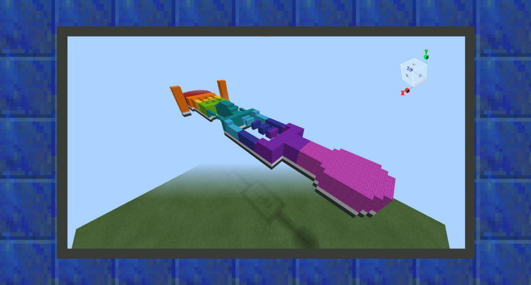
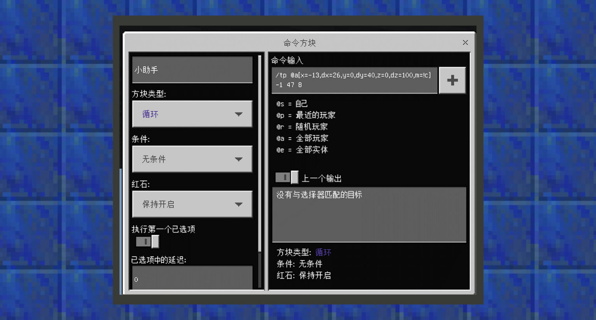

--- 
front: https://mc.res.netease.com/pc/zt/20201109161633/mc-dev/assets/img/7_1.6371e1df.png 
hard: Advanced 
time: 30 minutes 
--- 
# Simple tutorial ②: Make a parkour track 
#### Author: Boundary 

Download the parkour track sample package: Download [sample package](https://g79.gdl.netease.com/guidedemo-case5.zip). 

 

A parkour track requires at least one starting point and end point. Depending on the length of the track, you may also need to add a progress mark to avoid dampening the player's enthusiasm for the map gameplay due to the low tolerance rate of parkour. When the player falls from the parkour map, the player should be teleported back to the previous progress point before a certain falling height. Therefore, the simple tutorial in this section will use wool of various colors as building materials and attackers as trap elements to teach developers how to make an unusual parkour track. 

 

① Use pink wool to build a birth point for the player, use purple, dark blue, blue, cyan, green, yellow, and orange wool to lay the track, and use red wool as the end point. 

 

② Starting from the building height, the height after ten blocks below is the height that will pull the player back to the resurrection point. This function requires the use of command blocks. Place a loop command block below the pink area. The condition is set to unconditional, and the redstone option remains always on. Set the command content to /tp @a[x=-13,dx=26,y=0,dy=40,z=0,dz=100,m=!c] 0 47 8. This will filter out all players whose x coordinates are from -13 to 13, y coordinates are from 40 to 0, and z coordinates are from 0 to 100 and are not in creative mode, and teleport them to the starting point. Therefore, if a player in this range falls from a parkour position, he will be teleported to a safe position immediately. The command result information will appear in the chat message during the teleportation. If you want the prompt information to disappear, you can use the commandblockoutput and sendcommandfeedback options of the gamerule command to set to false. 

③ Place a loop command block under the wool at the end position. Set the condition to unconditional, and the redstone option to keep it always on. Set the command content to /title @a[x=5,dx=-12,y=47,dy=10,z=74,dz=14,m=!c,tag=!success] title Congratulations on completing the game. This will filter out the players who have entered the red wool area and send them a message that the game is completed. Then, place a chain command block close to the command block in the direction pointed by the command block. Set the condition to unconditional, and the redstone option to keep it always on. Set the command content to /tag @a[x=5,dx=-12,y=47,dy=10,z=74,dz=14,m=!c] add "success". According to the previous tutorial, when the loop command block executes the title command of the game completion, it will immediately execute the command in the chain command block and add the success tag, so that the command content of the loop command block will only be executed once for the player who has completed the game. 

④In the direction pointed by the loop command block that pulls back the player, place a chain command block close to the command block. Set the condition to unconditional, and the redstone option remains always on. Set the command content to /tag @a[x=-13,dx=26,y=0,dy=40,z=0,dz=100,m=!c] remove "success". Therefore, when the player falls off the track and is pulled back, he will try to clear the success tag to achieve the purpose of repeated play. 

⑤Set up two orange wool towers near the end point, which will be the location of the attacker and will harass and attack players near this area. 

⑥Import the map into MCSTUDIO, use the component function-player-basic properties, and set the player's resurrection point at the center of the pink wool. 

⑦Add a new biological component, let the biological inherit the wanderer, set the resource to the wanderer, and enlarge the size of the wanderer, and set both speeds to 0, because we hope it is a long-range shooter with standing output. Add a new attack type called player tag, so that the wanderer will attack the player, and other attributes are determined by the developer. 

 

⑧ Click the position symbol button on the right side of component-creature-attack hand to unlock the function of placing a new attacker creature. Place the attacker creature on the two orange pillars to harass the player near the end. 

⑨ Before running, you must save the current production progress. After clicking the "Save" button in the shortcut button in the upper right corner, you can click Run to enter the game test!