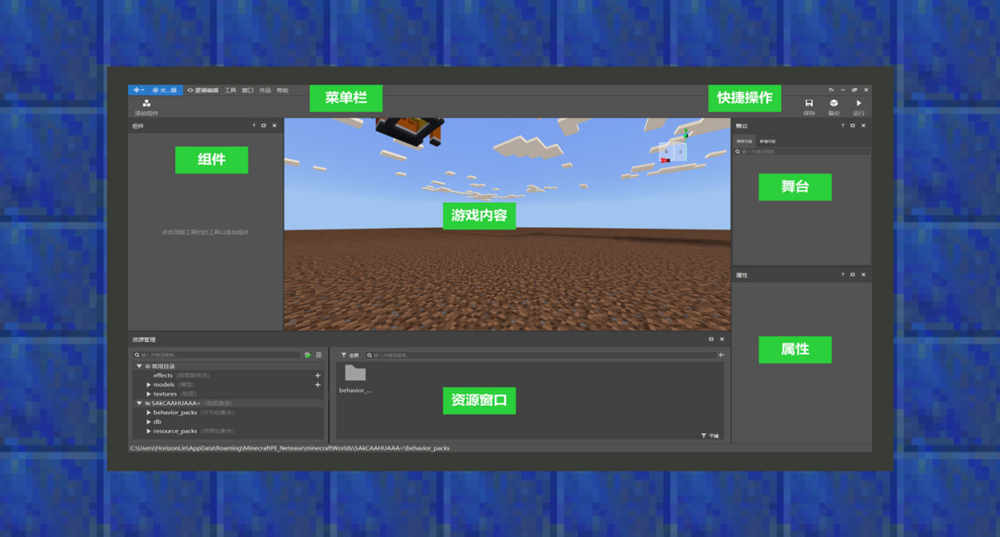

--- 
front: https://mc.res.netease.com/pc/zt/20201109161633/mc-dev/assets/img/2_1.f5da27b0.png 
hard: Getting Started 
time: 10 minutes 
--- 
# Level Editor 

#### Author: Realm 

The level editor is the center for configuring and managing add-ons. It can customize dimensions, creatures, items, blocks, recipes, and other content. By combining these game elements, you can form your own unique gameplay. 

For developers at different stages, the recommended way to use the level editor is also different. 

Novice stage: Build gameplay through components and become familiar with various custom game elements. 

Experienced stage: Understand the file structure of Addon through the resource management of the level editor, study the functional implementation principle of components, and try to make some file-level modifications based on components. 

Expert stage: Use the level editor to quickly build a gameplay prototype, and then make in-depth file modifications. 

#### A brief introduction to each module 

 

Menu bar: In "Works", you can set the namespace of Add-on, in "Scripts", you can install the script prompt library of Mod SDK, and in "Window", you can set the visibility of different sub-windows. The blue area in the upper left corner can switch back and forth between MCStudio's level editor, map editor, special effect editor, and interface editor. 

Components: Configure custom game elements, such as items, creatures, blocks, etc.; different components are combined to form gameplay, and the "Add Component" above can be regarded as a shortcut button. 

Properties: When selecting the content in "Components", the corresponding component property parameters will be displayed in the property panel. 

Game content: The game content runs "Minecraft" to simulate the player's game environment. You can edit creatures, coordinates, etc., and the results will be fed back to the game in real time. 

Stage: Displays the biological entities in the current game area, and can also quickly locate the biological entities that exist in the game. 

Resource window: Manage files in the work, open files by double-clicking the file icon, and the entry for file format conversion is also here. 

Quick operation: Contains buttons such as "Save", "Backup", and "Run", which can quickly save, backup, and test gameplay.