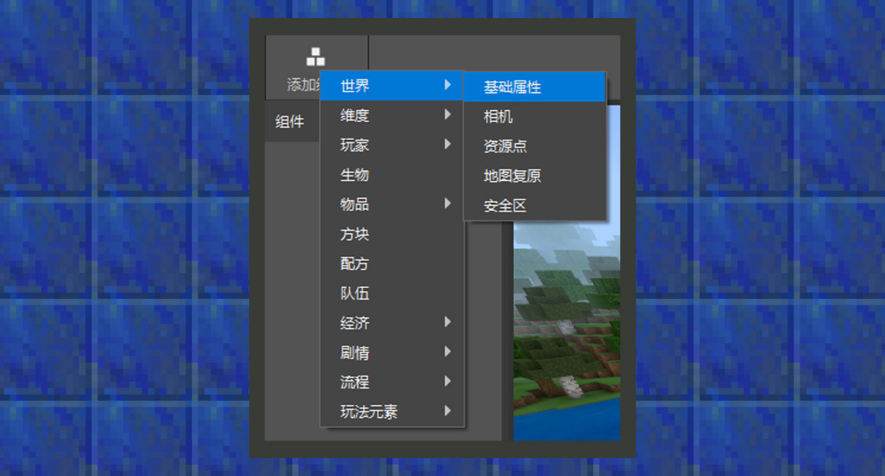
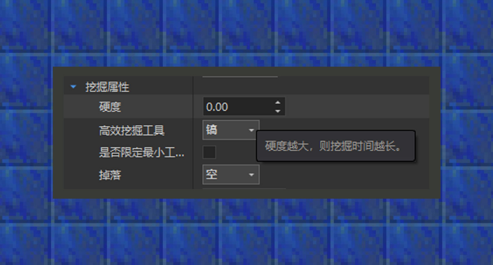

--- 
front: https://mc.res.netease.com/pc/zt/20201109161633/mc-dev/assets/img/3_1.3aa1459a.png 
hard: Advanced 
time: 40 minutes 
--- 
# Use components 
#### Author: Realm 
 

① By clicking the "Add component" button or right-clicking the mouse in the component area, the component option will pop up to add a component. 

 

② Right-click a single component to see the component's introduction. 

 

③ After adding the component, the property parameters of the added component will appear in the property panel in the lower right corner.

### Introduction to various components 

#### World category: 

World category: includes components related to camera and terrain changes. Detailed component descriptions are as follows: 

① Basic component: This component can set world options, cheat options, etc., which are no different from the content in the settings-options in the game client. In many map gameplays, you may need a map that is always daytime, or a map that does not spawn monsters. At this time, you can set it here. 

② Camera component: This component can set the player's perspective. There are three perspectives in the game, first-person perspective, third-person rear perspective, and third-person front perspective, which is the original perspective in the component options. When changing to a top-down perspective, the player's perspective will be changed to a third-person perspective, and the perspective angle can be freely defined, such as the top-down perspective in MOBA games and the side perspective of 2D plane parkour. By default, when switching to a custom perspective, players should not be allowed to switch perspectives. 

③ Resource point: This component can be set to continuously generate resource props at a certain location in the world. The globally popular MC game Bed Wars uses the concept of resource points. 

④ Map recovery: This component can be set to save blocks in an area when creating a game or starting a game, and restore the scene when the game ends. This component can be used when the scene is destroyed by player factors. 

⑤ Safe zone: This component can set blocks outside a square area that gathers inward over time to other blocks, which is suitable for inducement gameplay that needs to guide players to move inward. For example, 100 blocks around the birth point, magma continues to flow inward until the game is decided. 

#### Dimension category: 

Dimension category: includes dimension-related functions such as biomes, custom features, and biological generation rules. The detailed component description is as follows: 

① Custom dimension: This component can create a new dimension other than the main world, the netherworld, and the end. Because the biomes of the new dimension correspond to the biomes of the main world under the biome setting, the terrain of the main world and the new dimension is almost the same without a custom new dimension biome. 

② Custom biome: This component can create a biome in a new dimension. In the NetEase version of the custom biome, the biome must inherit the original biome, and a custom new biome cannot be added, and it can only be used in the new dimension. Under the terrain height column, you can set the height of the biome. In general, the original preset type can be used. If you are a developer who has studied the terrain generation algorithm, you can also try to use random parameters to customize the biome height. Under the surface column, you can set the block type from the bottom to the top of a biome. The generation rules control the probability of biomes being generated at different temperatures. In Minecraft, each map seed is divided into oceans and land, and the temperature of different regions is determined, just like the temperate zones on Earth. Biomes in different temperate zones will present different terrain and climate characteristics. Not only that, when a biome encounters a change in altitude, the biome to be converted can be set. For example, when a plain encounters a mountainous change, forests and forest hills will be generated. When an ocean encounters a shore change, beaches and plains will be generated. Finally, the biome tag can add a specified custom name tag to a custom biome to be used as a biome condition for the appearance of new organisms. This will be explained in the generation rule component. 

③ Customized organism generation rules: This component can create a new organism generation rule. As the name implies, the new rules are used to divide the conditions under which organisms can appear. Among them, organisms must come from custom organisms created by the organism component. If the developer wants to use this component to set the generation rules for manually written custom organisms, he can simply generate a template organism, reference the custom organism, and change the organism ID pointed to by the identifier field to the manually written organism ID in the additional package file. 

④Custom feature: This component can create a new custom feature. Features can be used to customize underground mineral clusters, surface plants and trees, etc. The rare fossil piles and moss stone piles in the original world all use feature functions. The current editor only supports converting the block structure exported by the map editor into features. For more custom feature functions, please refer to the minecraft wiki or the game client directory/data/definitions/features folder. 

⑤Custom feature rules: This component can create a new feature rule to divide the generation rules of custom features created by the editor. The generation time is used to determine the time when the feature appears. In the original world, flowers, plants and trees generally appear on the surface, and minerals appear underground. Specifying a biome tag allows the feature to appear in a biome with the corresponding biome tag. This tag applies to tags in custom biomes. The distribution states are uniform distribution and all block distribution. Under all block distribution, the feature will try to generate once in each block if the biome conditions are met. Under uniform distribution, the feature will try to generate at multiple block intervals if the biome conditions are met. 

⑥ Custom Portal: This component can set a portal to another dimension. The current editor only allows vertical portals, similar to nether portals. Generally, the height of the portal that can accommodate players is 4 grids wide and 5 grids high. The portal block needs to be additionally defined using a custom block before the option pops up from the drop-down options. 

#### Player Category: 

Player Category: Including skills, rankings and other player-related functions. The detailed component description is as follows: 

① Basic attributes: This component can quickly set the basic attributes of the player and make the final result effective for all players entering the world. 

② Initial Items: This component can give the player a designated birth item when entering the game. 

③ Initial Equipment: This component can automatically wear designated equipment when the player enters the game. 

④ Limited Resurrection: This component can set the number of times the player can be resurrected. When the number of resurrections is exceeded, the player will be teleported outside the game area. It is very suitable for making map gameplay with limited resurrection conditions. 

⑤Skills: This component can simply customize some basic skills. Currently, it can define skills that give status effects and skills that launch projectiles. 

⑥Personal rankings: This component can track some player data and rank them, and display them in the game map. 

⑦Old version initial items: This component can fill in the corresponding original item ID so that players can get the specified birth props when entering the game. If you want to give custom items, please use the initial item function. 

⑧Old version initial equipment: This component can fill in the corresponding original item ID so that players can get the specified original equipment when entering the game. If you want to give custom equipment, please use the initial equipment function. 

#### Biological category: 

Biological category: used to add custom creatures. The detailed component description is as follows: 

①Biological: This component can add custom creatures. When creating custom creatures, several files will be generated on the resource pack and behavior pack, and the biological behavior will eventually be placed in the behavior pack/entites folder. Currently, the biological function does not support adding custom biological models, animations, and more complex biological behavior combinations, but this function can quickly generate biological templates, which is convenient for skilled developers to perform deep customization at the text level later. In addition, when developers need to place custom creatures in the map, they need to first click the coordinate symbol in the component on the left to unlock the placement function before placing the creature to the specified location. 

#### Item Category: 

Item Category: Used to add custom items such as food, tools, equipment, weapons, etc. The detailed component description is as follows: 

① Ordinary items: This component can add custom ordinary props, creature egg props, consumable props, etc. 

② Weapons and tools: This component can add custom sword weapons and new tools based on four original tools. 

③ Armor: This component can add custom equipment corresponding to the player's four equipment slots. At the same time, if the developer becomes more and more proficient, the equipment can be replaced with a custom 3D model version of the equipment using text-level editing. 

#### Block category: 

Block category: used to add custom blocks, detailed component description is as follows: 

① Custom blocks: This component can add custom basic blocks, monster spawner blocks and portal blocks. In addition, when the developer needs to place a custom block in the map, he needs to first click the coordinate symbol in the component on the left to unlock the placement function before placing the block to the specified location. 

#### Recipe Category: 

Recipe Category: Used to add custom recipes, detailed component descriptions are as follows: 

①Custom Recipe: This component can add custom furnace recipes and workbench recipes. Supports setting the synthesis materials or result output of the recipe to custom items or blocks added by the item component and block component. 

#### Team Category: 

Team Category: Used to add team configuration, detailed component descriptions are as follows: 

①Team: This component can add teams and track the scores of members in the team. 

#### Economic Category: 

Economic Category: You can configure functions related to item circulation such as drops, transactions, and stores. Detailed component descriptions are as follows: 

①Currency: This component can add a new currency unit for players on the map. 

②Drops: This component can add custom drops for custom creatures. Drops can contain a random combination of multiple items, supporting custom items, equipment, blocks, etc. 

③Trade: This component can add a trade list similar to villagers for custom creatures. 

④Selling shop: This component can add the selling shop function for the entity being loaded on the map. 

⑤Buying shop: This component can add the buying shop function for the entity being loaded on the map. 

#### Plot category: 

Plot category: configurable dialogues and tasks, detailed component descriptions are as follows: 

① Dialogue: This component can add dialogue options for entities on the map. Based on multiple conditions, the timing of dialogue can also be different. 

② Task: This component can add tasks that can be claimed by players for entities on the map. When claiming tasks, developers will be provided with a variety of custom attributes for claiming conditions and prop rewards when the tasks are completed. 

#### Process category: 

Process category: includes components that control the game process, such as starting the game and ending the game. Detailed component descriptions are as follows: 

① Start the game: This component can add conditions for starting the game for map gameplay. The game will start only after multiple conditions customized in the component properties are met. 

② End the game: This component can add conditions for ending the game for map gameplay. The game will end only after multiple conditions customized in the component properties are met. 

#### Gameplay element categories: 

Gameplay element categories: including components required for specific gameplays such as tower defense and bed wars. Detailed component descriptions are as follows: 

①Bed: This component can set the coordinates of a common birth point for members in a team. When the bed is destroyed, you can customize the location of the member after being eliminated, which mainly corresponds to the content of bed wars. 

②Tower defense base camp: This component can set the base camp that players need to protect, mainly corresponding to tower defense gameplay. 

③Attacker: This component can set a customized tower defense unit to protect the base camp for the player, mainly corresponding to tower defense gameplay. 

④Creature point: This component can set a customized creature point coordinate. Using the design of the terrain and the patrol path component, you can set a moving path for hostile creatures in tower defense gameplay. 

⑤Patrol path: This component can set a path for the creatures at the creature point, mainly corresponding to tower defense gameplay.