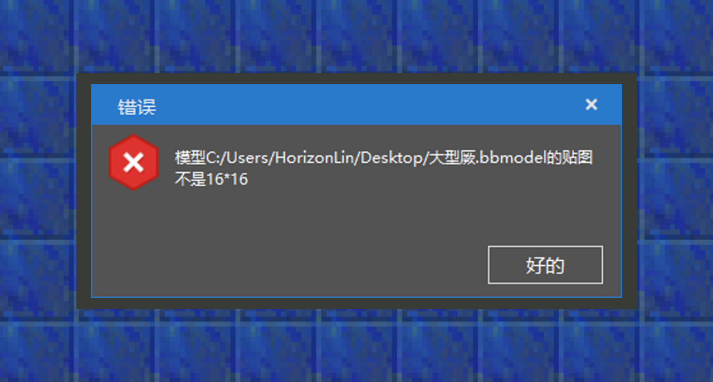

--- 
front: https://mc.res.netease.com/pc/zt/20201109161633/mc-dev/assets/img/4_1.f0b4b002.png 
hard: Advanced 
time: 10 minutes 
--- 
# Resource Management: Convert Block Model 
#### Author: Realm 

In the resource management list below, there will be a folding option for common directories. Right-click the models option and you will see an option to convert Blockbench Java block models. Click in and select the bbmodel project file saved in advance. 
In order to help developers avoid pitfalls, some common error messages that cannot be imported are collected here to facilitate developers to check by themselves. 

 

①This model is not a valid free model project: Although the option says Blockbench Java block model, developers need to select the project file as a free model project when creating the model to meet the import requirements. In addition, the rotation angle of the Java version block model is limited, while there is no rotation angle limit when using the free model. 

 

②The texture of this model is not 16x16 in size. Since 16*16 block textures occupy the least game resources, the official recommends that developers optimize the texture size of the block model to limit the texture to 16x16. However, there are some tips to successfully convert models with a resolution of more than 16x16, that is, open the blockbench project file, click File->Project, and set the texture height and width to 16x16. However, in order to avoid bringing a bad gaming experience to low-end terminal players, it is still recommended that developers modify the size of the block textures.