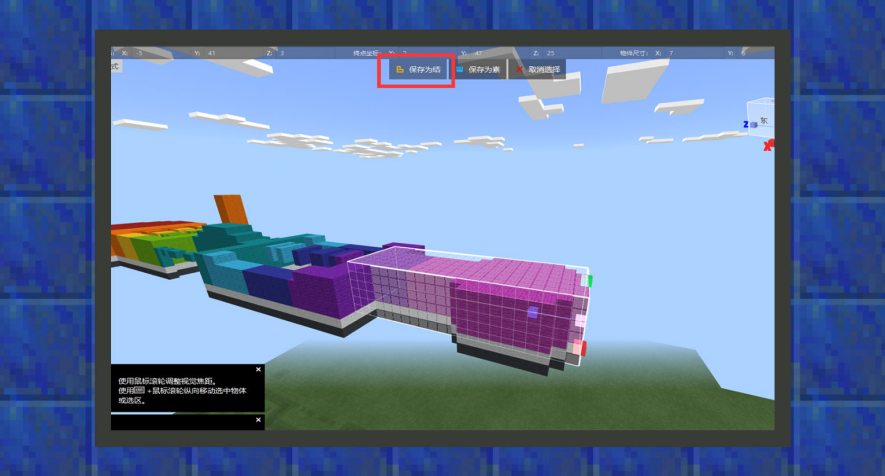

--- 
front: https://mc.res.netease.com/pc/zt/20201109161633/mc-dev/assets/img/5_1.1b182f91.png 
hard: Getting Started 
time: 15 minutes 
--- 
# Map Editor 

#### Author: Realm 

The map editor is a map editing tool for Bedrock Edition (C++ version). The interface is divided into three parts: a menu bar that provides basic functions, a toolbar that integrates various tools and properties, and an operation area for map drawing and modification. 

Currently, the map editor provides commonly used convenient tools such as brush tools, terrain tools, eraser tools, and selection tools. Developers can use these tools to modify and draw map archives in the operation area like using drawing software. This chapter will simply provide component developers with a method on how to export feature structures so that they can be applied to custom features. 

 

When entering the map editor, the default tool will be the selection tool. If the current tool is not the selection tool, you can click the quick toolbar to change the tool type. After selecting the area range, click Save as Structure and give it a name. 

